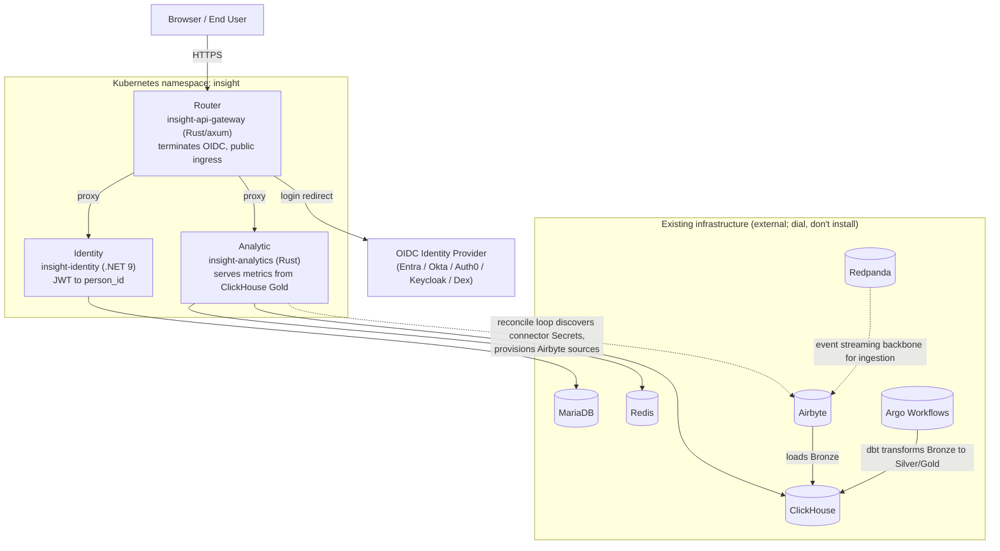

# Deploying Insight manually with Helm (single umbrella chart)

This runbook shows a platform or DevOps engineer how to install the Insight business app onto an existing Kubernetes cluster using only `helm` and `kubectl`. There is no GitOps controller and no CI pipeline involved. You edit a small set of values, secret, and connector files by hand, then apply them directly with the tools already on your workstation. "Manual Helm" here means the opposite of GitOps: instead of a reconciler (like Argo CD) syncing this repository's manifests continuously, you run each command yourself, once, in order, and re-run `helm upgrade` whenever you change something.

## Contents

- [Overview](#overview)
- [Architecture](#architecture)
- [Prerequisites](#prerequisites)
- [Step 1 — Configure values/umbrella.yaml](#step-1--configure-valuesumbrellayaml)
- [Step 2 — Fill the two secret files](#step-2--fill-the-two-secret-files)
- [Step 3 — Create namespace, apply secrets, mirror Airbyte auth](#step-3--create-namespace-apply-secrets-mirror-airbyte-auth)
- [Step 4 — Install with Helm](#step-4--install-with-helm)
- [Step 5 — Verify the installation](#step-5--verify-the-install)
- [Step 6 — Configure connectors (optional)](#step-6--configure-connectors-optional)
- [Troubleshooting](#troubleshooting)
- [Appendix — Reference](#appendix--reference)

## Overview

Insight is a business app that reads engineering and collaboration data from your tools (Jira, Slack, GitHub, and so on), pipelines it through ClickHouse, and serves metrics to a dashboard behind an OIDC login. The whole app installs as three services packaged in one Helm "umbrella" chart — a chart that bundles several sub-charts together so one `helm install` deploys everything at once. The chart is published at `oci://ghcr.io/constructorfabric/charts/insight`.

This install path assumes your data infrastructure (ClickHouse, MariaDB, Redis, Redpanda, Airbyte, Argo Workflows) is already running somewhere reachable from the cluster — on the same cluster in another namespace, or external. The chart does not stand up that infrastructure; it only configures the three Insight services to dial into it. You supply one values file, two secret files, and (optionally) one Secret per data connector you want to enable. No GitOps repository, no CI job, and no automatic reconciliation of the Kubernetes manifests are required — you run the commands yourself.

## Architecture

Three services ship inside the umbrella chart:

| Service | Deployment / image | Language | Role |
|---------|---------------------|----------|------|
| Analytic | `insight-analytics` | Rust | Reads the ClickHouse Gold layer (the final, query-ready tier of the data pipeline) and serves metrics; also runs the reconcile loop that discovers connector Secrets and provisions Airbyte sources |
| Router | `insight-api-gateway` | Rust/axum | Public ingress; terminates OIDC login; proxies requests to Analytic and Identity |
| Identity | `insight-identity` | .NET 9 | Resolves a JWT (JSON Web Token, the login credential issued by your identity provider) to a `person_id`; owns the MariaDB `identity` database |

Six pieces of external infrastructure must already be running and reachable from the cluster: ClickHouse, MariaDB, Redis, Redpanda, Airbyte, and Argo Workflows. The chart wires the three services to these systems but does not install or manage them.



## Prerequisites

### Cluster and CLI tools

- A Kubernetes cluster you can already reach with `kubectl`, with permission to create namespaces, Secrets, and workloads.
- `helm` ≥ 3.8 (OCI registry support is stable from 3.8 onward, since the chart is pulled as an OCI artifact).
- `kubectl`.
- `jq`, used to mirror the Airbyte auth Secret in Step 3.
- `base64`, used when copying existing datastore passwords in Step 2 (most systems ship this by default).

### Running external infrastructure

All six systems below must already be deployed and reachable from the cluster before you start. For the four datastores — ClickHouse, MariaDB, Redis, and Redpanda — the chart's `deploy: false` settings (see Step 1) tell it to dial these systems, not install them. Airbyte and Argo Workflows have no `deploy` key; the chart instead points at them via `airbyte.apiUrl` and `ingestion.reconcile.argoInstanceId`.

| System | Used for |
|--------|----------|
| ClickHouse | Stores the Bronze (raw ingested data), Silver (cleaned/conformed), and Gold (query-ready) data layers; Analytic reads the Gold layer to serve metrics |
| MariaDB | Owns the `identity` database that Identity uses to resolve people and org data |
| Redis | Caching layer used by Analytic |
| Redpanda | Event-streaming backbone (Kafka-compatible) used by the ingestion pipeline |
| Airbyte | Runs the data connectors (Jira, Slack, GitHub, and so on) that load raw data into ClickHouse Bronze |
| Argo Workflows | Runs the dbt transform workflows that turn Bronze into Silver and Gold, and runs the sync workflows Airbyte connections trigger |

Run all commands in this guide from the directory containing your `values/`, `secrets/`, and `connectors/` files. This document is self-contained: it shows the complete `values/umbrella.yaml` skeleton, both secret files, and an example Secret for every connector, so you can assemble all three directories directly from what follows.

## Step 1 — Configure values/umbrella.yaml

Create `values/umbrella.yaml` with the skeleton below, then replace every `<...>` placeholder with your infrastructure's real addresses. Passwords never go in this file — they live in the secret files from Step 2.

```yaml
## values/umbrella.yaml — the only values file you need.
## Fill every <...> placeholder. Passwords are NEVER here — see the secret files.
credentials:
  deploymentMode: helm               # helm | gitops (gitops forbids autoGenerate:true)
  autoGenerate: true                 # BYO compose; won't overwrite a labelless insight-db-creds

global:
  tenantDefaultId: "<TENANT_ID>"     # default tenant UUID; must equal ingestion.reconcile.tenantId
  # storageClass: ""                 # "" = cluster default; e.g. "local-path" locally
  # imagePullSecrets: []             # [{name: my-regcred}] for a private registry

# Datastore wiring — deploy:false = dial existing infra, don't install it.
clickhouse:
  deploy: false
  host: <CLICKHOUSE_HOST>            # e.g. clickhouse.<infra-ns>.svc.cluster.local
  port: 8123
  database: insight
  username: insight
mariadb:
  deploy: false
  host: <MARIADB_HOST>
  port: 3306
  database: insight
  username: insight
redis:
  deploy: false
  host: <REDIS_HOST>
  port: 6379
redpanda:
  deploy: false
  brokers: "<REDPANDA_BROKERS>"      # e.g. redpanda.<infra-ns>.svc.cluster.local:9093

# Ingestion — point at existing Airbyte + Argo; install the dbt WorkflowTemplates.
ingestion:
  templates:
    enabled: true
  reconcile:
    tenantId: "<TENANT_ID>"
    destinationName: clickhouse-bronze
    argoInstanceId: "<ARGO_INSTANCE_ID>"     # e.g. argo-workflows-<infra-ns>
airbyte:
  apiUrl: "<AIRBYTE_API_URL>"        # e.g. http://airbyte-airbyte-server-svc.<infra-ns>.svc.cluster.local:8001

analytics:
  replicaCount: 1                    # chart default 2; bump for HA
  resources:
    requests: { cpu: 100m, memory: 128Mi }
    limits:   { cpu: 500m, memory: 512Mi }

apiGateway:
  replicaCount: 1
  authDisabled: false                # true = NO auth — LOCAL DEV ONLY
  oidc:
    existingSecret: "insight-oidc"
  ingress:
    enabled: true
    className: nginx
    host: <HOST>
    tls:
      enabled: true
      secretName: <TLS_SECRET>
  resources:
    requests: { cpu: 100m, memory: 128Mi }
    limits:   { cpu: 500m, memory: 256Mi }

identity:
  deploy: true                       # MUST be true (chart default false)
  replicaCount: 1
  databaseName: "identity"
  tenantDefaultId: "<TENANT_ID>"
  resources:
    requests: { cpu: 50m,  memory: 96Mi }
    limits:   { cpu: 250m, memory: 384Mi }
```

If you do not already have this file, you can generate the chart's default values as a starting point instead of typing the skeleton by hand:

```sh
helm show values oci://ghcr.io/constructorfabric/charts/insight > values/umbrella.yaml
```

The placeholder table below explains every `<...>` value in the skeleton:

| Placeholder | What it should be |
|-------------|--------------------|
| `<TENANT_ID>` | Your Insight tenant UUID. Must be the same value in all three of `global.tenantDefaultId`, `ingestion.reconcile.tenantId`, and `identity.tenantDefaultId` |
| `<CLICKHOUSE_HOST>` | ClickHouse HTTP host, in `host:8123` form |
| `<MARIADB_HOST>` | MariaDB host, in `host:3306` form |
| `<REDIS_HOST>` | Redis host, in `host:6379` form |
| `<REDPANDA_BROKERS>` | Redpanda broker(s), in `host:9093` form |
| `<AIRBYTE_API_URL>` | Airbyte server API URL, for example `http://host:8001` |
| `<ARGO_INSTANCE_ID>` | Your Argo controller's instance ID, for example `argo-workflows-insight-infra` |
| `<HOST>` | Public FQDN for the Router's ingress, for example `insight.example.com` |
| `<TLS_SECRET>` | Name of the Kubernetes TLS Secret that covers that domain |

For infrastructure running in the same cluster, use the in-cluster DNS form `<service>.<namespace>.svc.cluster.local`. Any resolvable host or IP address also works.

Three settings deserve a closer look before you install:

- **`clickhouse.deploy`, `mariadb.deploy`, `redis.deploy`, `redpanda.deploy` are all `false`.** This tells the chart to connect to your existing datastores rather than install its own. Do not flip these to `true` unless you actually want the chart to provision new infrastructure — that is a different install path and is out of scope for this guide.
- **`identity.deploy` must be `true`.** The chart's own default is `false`, so this block requires an explicit override. Without it, the Identity service (and person resolution for the whole app) will not deploy.
- **`apiGateway.authDisabled` must stay `false` in any real environment.** Setting it to `true` disables authentication on the Router entirely — this is a local-dev-only escape hatch, never appropriate for a shared or production cluster.

A local/OrbStack variant of this file, `values/umbrella.orbstack.yaml`, is available as a starting point for local development against a k3s cluster with in-cluster infra under `insight-infra`. Treat it as a reference for local testing, not as a template for a real install — see the Appendix for a summary of how it differs.

## Step 2 — Fill the two secret files

### secrets/insight-db-creds.yaml

This Secret carries the four datastore passwords consumed by Analytic and Identity. All four keys are required — the chart fails fast if any is missing. Values must match the passwords your infrastructure's datastores were actually deployed with.

```yaml
apiVersion: v1
kind: Secret
metadata: { name: insight-db-creds, namespace: insight }
type: Opaque
stringData:
  clickhouse-password:   "CHANGE_ME"   # ClickHouse admin password    -> Analytic
  mariadb-password:      "CHANGE_ME"   # MariaDB app-user password    -> Analytic + Identity
  mariadb-root-password: "CHANGE_ME"   # MariaDB root password (identity-DB init hook) -> Identity
  redis-password:        "CHANGE_ME"   # Redis password               -> Analytic
```

If your existing datastores already have these passwords stored in Secrets in your infrastructure namespace, copy them across instead of retyping them:

```sh
NS_INFRA=<your-infra-namespace>                     # where your L2 services run
kubectl -n $NS_INFRA get secret <ch-secret>         -o jsonpath='{.data.<ch-key>}'        | base64 -d; echo   # clickhouse-password
kubectl -n $NS_INFRA get secret <maria-secret>      -o jsonpath='{.data.<app-key>}'       | base64 -d; echo   # mariadb-password (app user)
kubectl -n $NS_INFRA get secret <maria-root-secret> -o jsonpath='{.data.<root-key>}'      | base64 -d; echo   # mariadb-root-password
kubectl -n $NS_INFRA get secret <redis-secret>      -o jsonpath='{.data.<redis-key>}'     | base64 -d; echo   # redis-password
```

Paste the decoded output into the matching `clickhouse-password` / `mariadb-password` / `mariadb-root-password` / `redis-password` field.

> **Do not add an `app.kubernetes.io/managed-by: Helm` label to this Secret.** The chart uses the *absence* of that label to detect a "bring your own" credentials Secret. If the label is present, the chart assumes it owns the Secret and may overwrite your passwords with autogenerated ones. If the label is absent, the chart keeps your values and composes the `insight-analytics-config` and `insight-identity-config` Secrets from them.

### secrets/insight-oidc.yaml

This Secret carries the OIDC (OpenID Connect, the login protocol) configuration consumed by the Router. It works with any standards-compliant OIDC identity provider — Entra, Okta, Auth0, Keycloak, or Dex.

```yaml
apiVersion: v1
kind: Secret
metadata: { name: insight-oidc, namespace: insight }
type: Opaque
stringData:
  APP__gears__oidc-authn-plugin__config__issuer_url: "<OIDC_ISSUER>"
  APP__gears__oidc-authn-plugin__config__audience:   "<OIDC_CLIENT_ID>"
  APP__gears__oidc-authn-plugin__config__jwks_url:   "<OIDC_JWKS_URL>"
  APP__gears__auth-info__config__issuer_url:         "<OIDC_ISSUER>"
  APP__gears__auth-info__config__client_id:          "<OIDC_CLIENT_ID>"
  APP__gears__auth-info__config__redirect_uri:       "<APP_BASE_URL>/callback"
  APP__gears__auth-info__config__scopes:             "openid profile email"
```

The `APP__gears__...` key names follow the app's environment-variable-style config convention (double underscores separate config sections); leave them exactly as shown and only fill the values.

| Placeholder | What it should be |
|-------------|--------------------|
| `<OIDC_ISSUER>` | Your IdP's issuer URL. Its `/.well-known/openid-configuration` document must resolve |
| `<OIDC_JWKS_URL>` | The `jwks_uri` value from that same well-known discovery document |
| `<OIDC_CLIENT_ID>` | Your OIDC client / application registration ID |
| `<APP_BASE_URL>` | The Router's public URL, the same value as `https://<HOST>` from Step 1 |

Example issuer URLs by provider:

| IdP | Example `<OIDC_ISSUER>` |
|-----|---------------------------|
| Entra | `https://login.microsoftonline.com/<tenant>/v2.0` |
| Okta | `https://<org>.okta.com/oauth2/default` |
| Auth0 | `https://<tenant>.auth0.com/` |
| Keycloak | `https://<host>/realms/<realm>` |
| Dex | `https://<APP_BASE_URL>/dex` |

## Step 3 — Create namespace, apply secrets, mirror Airbyte auth

Create the `insight` namespace and apply both secret files:

```sh
# create the namespace and apply all secrets
kubectl create namespace insight
kubectl -n insight apply -f secrets/

# verify
kubectl -n insight get secret insight-db-creds insight-oidc     # expect 4 keys / 7 keys
```

The Analytic service also needs Airbyte's own auth credentials to talk to the Airbyte API. Mirror that Secret from your infrastructure namespace into `insight`:

```sh
# mirror the Airbyte auth secret from your infra namespace
NS_INFRA=<your-infra-namespace>
kubectl -n $NS_INFRA get secret airbyte-auth-secrets -o json \
  | jq 'del(.metadata.uid,.metadata.resourceVersion,.metadata.creationTimestamp,.metadata.ownerReferences,.metadata.annotations,.metadata.labels) | .metadata.namespace="insight"' \
  | kubectl -n insight apply -f -
```

The `jq` step strips fields that are specific to the original Secret's identity (UID, resource version, owner references) and points the copy at the `insight` namespace, so Kubernetes accepts it as a new, independent object rather than rejecting it as a duplicate.

## Step 4 — Install with Helm

Run the umbrella chart install, pointing it at your filled-in values file:

```sh
helm upgrade --install insight oci://ghcr.io/constructorfabric/charts/insight \
  -n insight -f values/umbrella.yaml --wait --timeout 15m
```

Omit `--version` to install the latest published chart, or add `--version <x.y.z>` to pin a specific release. `--wait --timeout 15m` blocks the command until all resources report ready, or until 15 minutes pass, whichever comes first — this gives you a clear pass/fail signal instead of a detached background rollout.

## Step 5 — Verify the install

Confirm all three service pods are running:

```sh
kubectl -n insight get pods
  # expect: insight-api-gateway, insight-analytics, insight-identity  (all Running)
```

Confirm the chart composed the two config Secrets from `insight-db-creds`:

```sh
kubectl -n insight get secret insight-analytics-config insight-identity-config
  # chart composed these from insight-db-creds
```

Confirm the reconcile loop's scheduled workflow exists — this is the job that discovers connector Secrets and provisions Airbyte sources and connections automatically:

```sh
kubectl -n insight get cronworkflow
  # expect: insight-reconcile-loop (provisions Airbyte sources/connections)
```

Finally, open `https://<HOST>` in a browser (the host you set in Step 1) and confirm the login redirect to your OIDC provider works.

## Step 6 — Configure connectors (optional)

Connectors are how Insight pulls data from your actual tools — Jira issues, Slack messages, GitHub pull requests, and so on. Each connector is one Kubernetes Secret that both configures and enables a single Airbyte data source. Fill in the connector Secrets you need before applying them.

### Anatomy of a connector Secret

Every connector Secret needs three things for the reconcile loop to discover and wire it up:

- **A label**, `app.kubernetes.io/part-of: insight` — the selector the reconcile loop uses to find connector Secrets.
- **Two annotations**: `insight.cyberfabric.com/connector: <name>` identifies which connector definition to use, and `insight.cyberfabric.com/source-id: <id>` names this specific source instance (the convention is `<name>-main`).
- **`stringData`** holding the connector's required fields — credentials, base URLs, and similar settings specific to that tool.

For example, the Jira connector Secret (`connectors/jira.yaml`) looks like this:

```yaml
apiVersion: v1
kind: Secret
metadata:
  name: insight-jira-main
  namespace: insight
  labels: { app.kubernetes.io/part-of: insight }
  annotations: { insight.cyberfabric.com/connector: jira, insight.cyberfabric.com/source-id: jira-main }
type: Opaque
stringData:
  jira_instance_url: "https://your-org.atlassian.net"
  jira_email:        "svc@your-org.com"
  jira_api_token:    "ATATT-CHANGE_ME"
```

### The 26 available connectors

Replace `CHANGE_ME` (and any other placeholder) values in whichever connector files you need, under `connectors/`:

`jira`, `slack`, `github-v2`, `gitlab`, `m365`, `salesforce`, `zoom`, `confluence`, `youtrack`, `zendesk`, `workday`, `bamboohr`, `ms-entra`, `figma`, `outline`, `hubspot`, `cursor`, `openai`, `chatgpt-team`, `claude-team`, `claude-admin`, `claude-enterprise`, `github-copilot`, `bitbucket-cloud`, `bitbucket-server`, `zulip-proxy`.

Apply all of them at once, or one at a time:

```sh
kubectl -n insight apply -f connectors/      # all 26 connectors at once
# or one at a time:
kubectl -n insight apply -f connectors/jira.yaml
```

You only need to create Secrets for the tools you actually use — an unused connector file can be left unfilled and simply not applied.

The reconcile loop scans the `insight` namespace roughly every 15 minutes. When it finds a new or changed connector Secret, it provisions the matching Airbyte source and connection and starts syncing data into Bronze automatically — no further manual steps are needed once the Secret is applied and correctly filled in.

### Example Secret for every connector

Each block below is a complete, copy-paste-ready Secret for one connector. Fill in the `CHANGE_ME` (and any other placeholder) values, save it under `connectors/<name>.yaml`, and apply it as shown above.

Two things to know before you copy these:

- Connectors marked ⚠ are CDK connectors (built on Airbyte's Connector Development Kit). They bake their own `url_base` into the connector image, so they cannot be repointed at a mock or self-hosted endpoint.
- `bitbucket-server` intentionally has an empty `stringData: {}` — its URL and credentials come from the connector manifest, not from this Secret.

#### AI & coding assistants

```yaml
apiVersion: v1
kind: Secret
metadata:
  name: insight-chatgpt-team-main
  namespace: insight
  labels: { app.kubernetes.io/part-of: insight }
  annotations: { insight.cyberfabric.com/connector: chatgpt-team, insight.cyberfabric.com/source-id: chatgpt-team-main }
type: Opaque
stringData:
  chatgpt_account_id: "CHANGE_ME"
  proxy_url:          "CHANGE_ME"        # your ChatGPT admin-proxy base URL
  proxy_auth_token:   "CHANGE_ME"
  # chatgpt_org_id:   "CHANGE_ME"        # optional (subscription streams)
  # start_date:       "2026-01-01"       # optional
```

```yaml
apiVersion: v1
kind: Secret
metadata:
  name: insight-claude-team-main
  namespace: insight
  labels: { app.kubernetes.io/part-of: insight }
  annotations: { insight.cyberfabric.com/connector: claude-team, insight.cyberfabric.com/source-id: claude-team-main }
type: Opaque
stringData:
  claude_org_id:    "CHANGE_ME"
  proxy_url:        "CHANGE_ME"
  proxy_auth_token: "CHANGE_ME"
```

```yaml
apiVersion: v1
kind: Secret
metadata:
  name: insight-claude-admin-main
  namespace: insight
  labels: { app.kubernetes.io/part-of: insight }
  annotations: { insight.cyberfabric.com/connector: claude-admin, insight.cyberfabric.com/source-id: claude-admin-main }
type: Opaque
stringData:
  admin_api_key: "CHANGE_ME"
```

```yaml
apiVersion: v1
kind: Secret
metadata:
  name: insight-claude-enterprise-main
  namespace: insight
  labels: { app.kubernetes.io/part-of: insight }
  annotations: { insight.cyberfabric.com/connector: claude-enterprise, insight.cyberfabric.com/source-id: claude-enterprise-main }
type: Opaque
stringData:
  analytics_api_key: "CHANGE_ME"
```

```yaml
# ⚠ CDK connector; org-scoped GitHub PAT
apiVersion: v1
kind: Secret
metadata:
  name: insight-github-copilot-main
  namespace: insight
  labels: { app.kubernetes.io/part-of: insight }
  annotations: { insight.cyberfabric.com/connector: github-copilot, insight.cyberfabric.com/source-id: github-copilot-main }
type: Opaque
stringData:
  github_token:      "CHANGE_ME"       # PAT with Copilot org metrics scope
  github_org:        "CHANGE_ME"
  github_start_date: "2026-01-01"
```

```yaml
apiVersion: v1
kind: Secret
metadata:
  name: insight-cursor-main
  namespace: insight
  labels: { app.kubernetes.io/part-of: insight }
  annotations: { insight.cyberfabric.com/connector: cursor, insight.cyberfabric.com/source-id: cursor-main }
type: Opaque
stringData:
  cursor_api_key: "CHANGE_ME"
```

```yaml
apiVersion: v1
kind: Secret
metadata:
  name: insight-openai-main
  namespace: insight
  labels: { app.kubernetes.io/part-of: insight }
  annotations: { insight.cyberfabric.com/connector: openai, insight.cyberfabric.com/source-id: openai-main }
type: Opaque
stringData:
  openai_admin_api_key: "CHANGE_ME"
  openai_start_date:    "2026-01-01"
```

#### Source control & CI

```yaml
# ⚠ CDK connector; supersedes `github`
apiVersion: v1
kind: Secret
metadata:
  name: insight-github-v2-main
  namespace: insight
  labels: { app.kubernetes.io/part-of: insight }
  annotations: { insight.cyberfabric.com/connector: github-v2, insight.cyberfabric.com/source-id: github-v2-main }
type: Opaque
stringData:
  github_token:         "CHANGE_ME"
  github_organizations: "org-a,org-b"
  github_start_date:    "2026-01-01"
  github_skip_archived: "true"
  github_skip_forks:    "true"
```

```yaml
apiVersion: v1
kind: Secret
metadata:
  name: insight-gitlab-main
  namespace: insight
  labels: { app.kubernetes.io/part-of: insight }
  annotations: { insight.cyberfabric.com/connector: gitlab, insight.cyberfabric.com/source-id: gitlab-main }
type: Opaque
stringData:
  gitlab_url:   "https://gitlab.com"
  gitlab_token: "CHANGE_ME"
```

```yaml
# ⚠ CDK connector; baked url_base
apiVersion: v1
kind: Secret
metadata:
  name: insight-bitbucket-cloud-main
  namespace: insight
  labels: { app.kubernetes.io/part-of: insight }
  annotations: { insight.cyberfabric.com/connector: bitbucket-cloud, insight.cyberfabric.com/source-id: bitbucket-cloud-main }
type: Opaque
stringData:
  bitbucket_token:      "CHANGE_ME"    # Atlassian ATCTT access token (NOT an ATATT API token)
  bitbucket_workspaces: "workspace-a,workspace-b"
```

```yaml
# required_fields: [] — URL/creds come from the connector manifest, not this Secret
apiVersion: v1
kind: Secret
metadata:
  name: insight-bitbucket-server-main
  namespace: insight
  labels: { app.kubernetes.io/part-of: insight }
  annotations: { insight.cyberfabric.com/connector: bitbucket-server, insight.cyberfabric.com/source-id: bitbucket-server-main }
type: Opaque
stringData: {}
```

#### Issue tracking & docs

```yaml
apiVersion: v1
kind: Secret
metadata:
  name: insight-jira-main
  namespace: insight
  labels: { app.kubernetes.io/part-of: insight }
  annotations: { insight.cyberfabric.com/connector: jira, insight.cyberfabric.com/source-id: jira-main }
type: Opaque
stringData:
  jira_instance_url: "https://your-org.atlassian.net"
  jira_email:        "svc@your-org.com"
  jira_api_token:    "ATATT-CHANGE_ME"
```

```yaml
apiVersion: v1
kind: Secret
metadata:
  name: insight-youtrack-main
  namespace: insight
  labels: { app.kubernetes.io/part-of: insight }
  annotations: { insight.cyberfabric.com/connector: youtrack, insight.cyberfabric.com/source-id: youtrack-main }
type: Opaque
stringData:
  youtrack_base_url: "https://your-org.youtrack.cloud/api"
  youtrack_token:    "perm-CHANGE_ME"
  # youtrack_page_size: "100"                # optional
```

```yaml
apiVersion: v1
kind: Secret
metadata:
  name: insight-confluence-main
  namespace: insight
  labels: { app.kubernetes.io/part-of: insight }
  annotations: { insight.cyberfabric.com/connector: confluence, insight.cyberfabric.com/source-id: confluence-main }
type: Opaque
stringData:
  confluence_instance_url: "https://your-org.atlassian.net/wiki"
  confluence_email:        "svc@your-org.com"
  confluence_api_token:    "ATATT-CHANGE_ME"
  confluence_start_date:   "2026-01-01"
```

```yaml
apiVersion: v1
kind: Secret
metadata:
  name: insight-outline-main
  namespace: insight
  labels: { app.kubernetes.io/part-of: insight }
  annotations: { insight.cyberfabric.com/connector: outline, insight.cyberfabric.com/source-id: outline-main }
type: Opaque
stringData:
  outline_instance_url: "https://your-outline-host"
  outline_api_token:    "CHANGE_ME"
  outline_start_date:   "2026-01-01"
```

```yaml
apiVersion: v1
kind: Secret
metadata:
  name: insight-figma-main
  namespace: insight
  labels: { app.kubernetes.io/part-of: insight }
  annotations: { insight.cyberfabric.com/connector: figma, insight.cyberfabric.com/source-id: figma-main }
type: Opaque
stringData:
  figma_token:      "figd_CHANGE_ME"
  figma_team_ids:   "1234567890,0987654321"
  figma_start_date: "2026-01-01"
```

#### Communication & meetings

```yaml
apiVersion: v1
kind: Secret
metadata:
  name: insight-slack-main
  namespace: insight
  labels: { app.kubernetes.io/part-of: insight }
  annotations: { insight.cyberfabric.com/connector: slack, insight.cyberfabric.com/source-id: slack-main }
type: Opaque
stringData:
  slack_bot_token:  "xoxb-CHANGE_ME"
  slack_start_date: "2026-01-01"
```

```yaml
apiVersion: v1
kind: Secret
metadata:
  name: insight-zoom-main
  namespace: insight
  labels: { app.kubernetes.io/part-of: insight }
  annotations: { insight.cyberfabric.com/connector: zoom, insight.cyberfabric.com/source-id: zoom-main }
type: Opaque
stringData:
  zoom_account_id:   "CHANGE_ME"
  zoom_client_id:    "CHANGE_ME"
  zoom_client_secret: "CHANGE_ME"
```

```yaml
apiVersion: v1
kind: Secret
metadata:
  name: insight-m365-main
  namespace: insight
  labels: { app.kubernetes.io/part-of: insight }
  annotations: { insight.cyberfabric.com/connector: m365, insight.cyberfabric.com/source-id: m365-main }
type: Opaque
stringData:
  azure_tenant_id:     "CHANGE_ME"
  azure_client_id:     "CHANGE_ME"
  azure_client_secret: "CHANGE_ME"
```

```yaml
apiVersion: v1
kind: Secret
metadata:
  name: insight-zulip-proxy-main
  namespace: insight
  labels: { app.kubernetes.io/part-of: insight }
  annotations: { insight.cyberfabric.com/connector: zulip-proxy, insight.cyberfabric.com/source-id: zulip-proxy-main }
type: Opaque
stringData:
  zulip_proxy_base_url:   "CHANGE_ME"
  zulip_proxy_api_key:    "CHANGE_ME"
  zulip_proxy_start_date: "2026-01-01"
```

#### HR & identity

```yaml
apiVersion: v1
kind: Secret
metadata:
  name: insight-bamboohr-main
  namespace: insight
  labels: { app.kubernetes.io/part-of: insight }
  annotations: { insight.cyberfabric.com/connector: bamboohr, insight.cyberfabric.com/source-id: bamboohr-main }
type: Opaque
stringData:
  bamboohr_api_key: "CHANGE_ME"
  bamboohr_domain:  "your-company"           # the <domain> in <domain>.bamboohr.com
```

```yaml
apiVersion: v1
kind: Secret
metadata:
  name: insight-workday-main
  namespace: insight
  labels: { app.kubernetes.io/part-of: insight }
  annotations: { insight.cyberfabric.com/connector: workday, insight.cyberfabric.com/source-id: workday-main }
type: Opaque
stringData:
  workday_base_url:            "https://wd2-impl-services1.workday.com"
  workday_isu_username:        "CHANGE_ME"
  workday_isu_password:        "CHANGE_ME"
  workday_workers_report_path: "/ccx/service/customreport2/.../Workers"
  workday_leave_report_path:   "/ccx/service/customreport2/.../Leave"
```

```yaml
apiVersion: v1
kind: Secret
metadata:
  name: insight-ms-entra-main
  namespace: insight
  labels: { app.kubernetes.io/part-of: insight }
  annotations: { insight.cyberfabric.com/connector: ms-entra, insight.cyberfabric.com/source-id: ms-entra-main }
type: Opaque
stringData:
  azure_tenant_id:     "CHANGE_ME"
  azure_client_id:     "CHANGE_ME"
  azure_client_secret: "CHANGE_ME"
```

#### CRM & support

```yaml
apiVersion: v1
kind: Secret
metadata:
  name: insight-salesforce-main
  namespace: insight
  labels: { app.kubernetes.io/part-of: insight }
  annotations: { insight.cyberfabric.com/connector: salesforce, insight.cyberfabric.com/source-id: salesforce-main }
type: Opaque
stringData:
  salesforce_instance_url:  "https://your-org.my.salesforce.com"
  salesforce_client_id:     "CHANGE_ME"
  salesforce_client_secret: "CHANGE_ME"
  salesforce_start_date:    "2026-01-01"
```

```yaml
apiVersion: v1
kind: Secret
metadata:
  name: insight-hubspot-main
  namespace: insight
  labels: { app.kubernetes.io/part-of: insight }
  annotations: { insight.cyberfabric.com/connector: hubspot, insight.cyberfabric.com/source-id: hubspot-main }
type: Opaque
stringData:
  hubspot_access_token: "CHANGE_ME"
```

```yaml
apiVersion: v1
kind: Secret
metadata:
  name: insight-zendesk-main
  namespace: insight
  labels: { app.kubernetes.io/part-of: insight }
  annotations: { insight.cyberfabric.com/connector: zendesk, insight.cyberfabric.com/source-id: zendesk-main }
type: Opaque
stringData:
  zendesk_subdomain: "your-subdomain"        # <subdomain>.zendesk.com
  zendesk_email:     "agent@your-org.com"
  zendesk_api_token: "CHANGE_ME"
  # start_date:      "2026-01-01"            # optional
```

## Troubleshooting

| Problem | What to check |
|---------|-----------------|
| `insight-analytics` / `insight-identity` stuck in `CreateContainerConfigError` | The chart could not compose the `*-config` Secrets. Confirm `insight-db-creds` has all four keys and carries **no** `app.kubernetes.io/managed-by: Helm` label: `kubectl -n insight get secret insight-db-creds -o yaml \| grep managed-by` should return nothing |
| Dashboards show "no peer data" (the benchmark/comparison panel is empty) | After Gold-layer data has loaded, restart Analytic: `kubectl -n insight rollout restart deploy/insight-analytics` |
| Login breaks after changing the host | Update `insight-oidc` (issuer and redirect URI), then restart the Router: `kubectl -n insight rollout restart deploy/insight-api-gateway` |
| Connectors are not syncing | Check reconcile logs: `kubectl -n insight logs deploy/insight-analytics \| grep -i reconcile`. Confirm `airbyte-auth-secrets` was mirrored into the `insight` namespace (Step 3) |

## Appendix — Reference

### values/umbrella.yaml placeholders

| Placeholder | Field(s) | Notes |
|-------------|----------|-------|
| `<TENANT_ID>` | `global.tenantDefaultId`, `ingestion.reconcile.tenantId`, `identity.tenantDefaultId` | Must be identical across all three |
| `<CLICKHOUSE_HOST>` | `clickhouse.host` | `deploy: false`; port fixed at `8123` in the file |
| `<MARIADB_HOST>` | `mariadb.host` | `deploy: false`; port fixed at `3306` |
| `<REDIS_HOST>` | `redis.host` | `deploy: false`; port fixed at `6379` |
| `<REDPANDA_BROKERS>` | `redpanda.brokers` | `deploy: false`; include port, e.g. `:9093` |
| `<AIRBYTE_API_URL>` | `airbyte.apiUrl` | e.g. `http://host:8001` |
| `<ARGO_INSTANCE_ID>` | `ingestion.reconcile.argoInstanceId` | Your Argo controller's instance ID |
| `<HOST>` | `apiGateway.ingress.host` | Public FQDN for the Router |
| `<TLS_SECRET>` | `apiGateway.ingress.tls.secretName` | Kubernetes TLS Secret name |

Other notable (non-placeholder) settings in this file:

- `credentials.deploymentMode: helm` and `credentials.autoGenerate: true` — this enables the "bring your own" credentials path, where the chart keeps a labelless `insight-db-creds` Secret instead of generating random passwords.
- `identity.deploy: true` — required override; the chart's own default is `false`.
- `apiGateway.authDisabled: false` — keep `false`; `true` disables all auth and is local-dev only.

### secrets/insight-db-creds.yaml keys

| Key | Meaning | Consumed by |
|-----|---------|--------------|
| `clickhouse-password` | ClickHouse admin password | Analytic |
| `mariadb-password` | MariaDB app-user password | Analytic + Identity |
| `mariadb-root-password` | MariaDB root password, used by the identity-DB init hook | Identity |
| `redis-password` | Redis password | Analytic |

Recall: this Secret must never carry an `app.kubernetes.io/managed-by: Helm` label.

### secrets/insight-oidc.yaml keys

| Key | Meaning |
|-----|---------|
| `APP__gears__oidc-authn-plugin__config__issuer_url` | IdP issuer URL |
| `APP__gears__oidc-authn-plugin__config__audience` | OIDC client/application ID |
| `APP__gears__oidc-authn-plugin__config__jwks_url` | `jwks_uri` from the IdP discovery document |
| `APP__gears__auth-info__config__issuer_url` | IdP issuer URL (same value as above) |
| `APP__gears__auth-info__config__client_id` | OIDC client/application ID (same value as above) |
| `APP__gears__auth-info__config__redirect_uri` | `<APP_BASE_URL>/callback` |
| `APP__gears__auth-info__config__scopes` | `openid profile email` |

### values/umbrella.orbstack.yaml (local variant)

This file is a pre-filled variant of the values file for local development on OrbStack's bundled k3s cluster, with all infrastructure running in an `insight-infra` namespace. It sets a fixed tenant UUID, in-cluster DNS hosts, an empty (host-less) ingress that matches any `Host` header, and disabled TLS. Use it only as a reference for local testing — do not reuse its host-less ingress or disabled TLS settings on a shared or production cluster.
