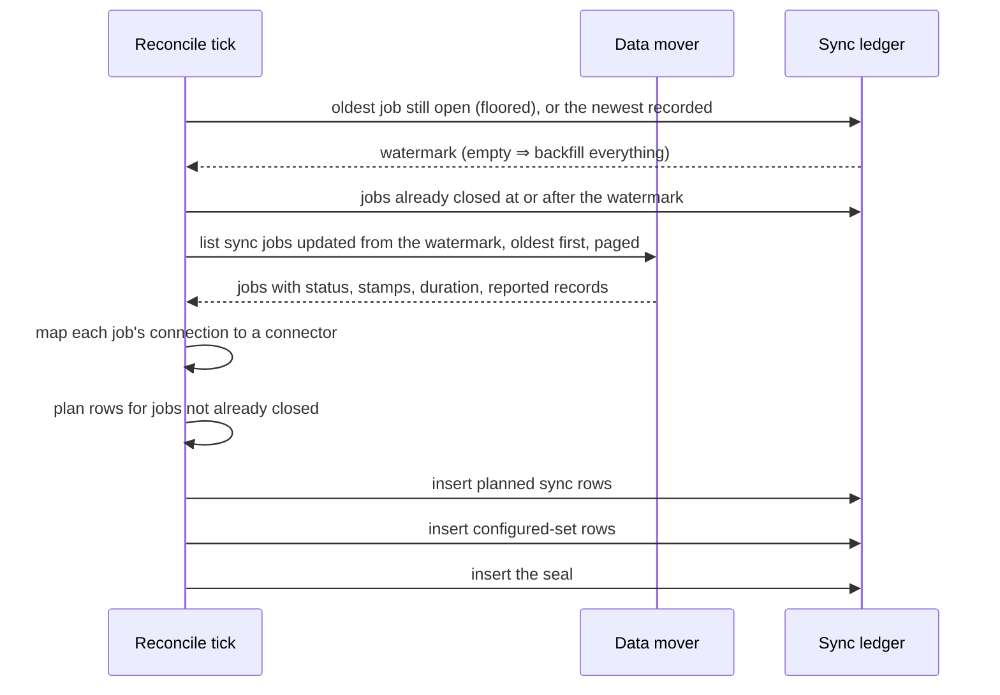
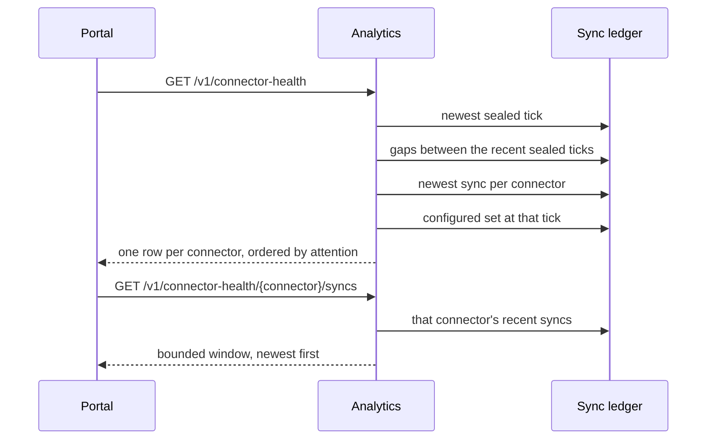

# DESIGN — Connector Health


<!-- toc -->

- [1. Architecture Overview](#1-architecture-overview)
  - [1.1 Architectural Vision](#11-architectural-vision)
  - [1.2 Architecture Drivers](#12-architecture-drivers)
  - [1.3 Architecture Layers](#13-architecture-layers)
- [2. Principles & Constraints](#2-principles--constraints)
  - [2.1 Design Principles](#21-design-principles)
  - [2.2 Constraints](#22-constraints)
- [3. Technical Architecture](#3-technical-architecture)
  - [3.1 Domain Model](#31-domain-model)
  - [3.2 Component Model](#32-component-model)
  - [3.3 API Contracts](#33-api-contracts)
  - [3.4 Internal Dependencies](#34-internal-dependencies)
  - [3.5 External Dependencies](#35-external-dependencies)
  - [3.6 Interactions & Sequences](#36-interactions--sequences)
  - [3.7 Database schemas & tables](#37-database-schemas--tables)
  - [3.8 Deployment Topology](#38-deployment-topology)
- [4. Additional context](#4-additional-context)
  - [4.1 What was deliberately not built](#41-what-was-deliberately-not-built)

<!-- /toc -->

Realises [PRD.md](PRD.md). Scoped addition to the
[Analytics service design](../../DESIGN.md) on the read side and to the reconcile loop on the
write side. Everything the parent design already specifies — the admin gate, error taxonomy,
OpenAPI registration — applies unchanged; this document adds one table, one writer, two
endpoints, and one portal pane.

## 1. Architecture Overview

### 1.1 Architectural Vision

The page must answer from facts that were recorded when they were true, not gathered when the
operator asks. Two routes were rejected for that reason.

**Reading the mover on the request path** couples the page's availability to the mover's, and
its listing is orders of magnitude slower than a warehouse read. An operator opening the page
during an incident is exactly when the mover is least likely to answer.

**Reading storage metadata on the request path** cannot be done by a reader that holds no
data access: row visibility in the warehouse's parts metadata follows real access, so a
metadata-only grant is not a reachable permission state. Widening the read-only query-path
role to see bronze is not acceptable for a page that reports on it.

What remains is a ledger: the reconcile loop reads the mover's job history on its own cadence
and records what it found. The request path then touches one relation and nothing else, and
the page stays up when everything above it is down.

The ledger buys a second thing the mover cannot: **history that outlives its source.** Delete
a connection in the mover and its job history goes with it; the ledger keeps six months.

### 1.2 Architecture Drivers

#### Functional Drivers

- Every sync in the mover's history is recorded, whatever started it (FR-1) — drives the
  sweep and its job coverage.
- History is bounded and survives the mover (FR-2) — drives retention and the decision to
  copy rather than proxy.
- First sweep backfills retained history (FR-3) — drives the watermark, whose empty state is
  what makes the first sweep read the mover's whole retained window.
- The configured set is recorded (FR-4) — drives the sealed per-tick snapshot.
- Facts, not verdicts (FR-7) — drives a wire shape that ships observations and no state enum.
- The read path depends on nothing external (FR-11) — drives the single-relation read.
- A stopped recorder is visible (FR-12) — drives serving the age of the last read beside the
  facts it produced.

#### NFR Allocation

- **NFR-1 interactive read** — one relation, a sort key whose leading column every read
  filters on, aggregates rather than sorts, and no measurement taken while the operator waits.
  Measured at 42 ms and 5 MiB over two million recorded syncs.
- **NFR-2 recording never breaks reconciliation** — the sweep's own entry point reports a
  failed or partial tick, and the shell that calls it swallows that deliberately, so the tick
  around it cannot abort because observability broke.
- **NFR-3 idempotent sweep** — coverage is keyed on the mover's own job identity, so
  re-reading the same history adds nothing.
- **NFR-4 bounded storage** — its own database, outside anything customer-facing, with a TTL.

### 1.3 Architecture Layers

| Layer | This change adds |
|---|---|
| Ingestion control | the sweep inside the reconcile tick |
| Warehouse | `ingestion_history.sync_events` and one grant |
| Analytics service | a domain read module and two admin routes |
| Portal | the Connector health pane, replacing Data health |

## 2. Principles & Constraints

### 2.1 Design Principles

#### The seam is a table, not an API

- [ ] `p1` - **ID**: `cpt-insightspec-connhealth-principle-seam-is-a-table`

The writer and the reader never meet. The reconcile loop knows nothing about the analytics
service; the analytics service knows nothing about the mover. Either side can change, fail,
or be replaced without the other noticing, and the page answers from the table while
everything above the seam is down (FR-11).

#### Recording is subordinate to the recorded

- [ ] `p1` - **ID**: `cpt-insightspec-connhealth-principle-recording-subordinate`

A sweep failure is logged and swallowed, never propagated: no reconcile tick aborts because
observability broke (NFR-2). The cost of that choice is that a tick can leave a gap. The next
tick repairs it, because the mover's history is still there to re-read — which is the reason
the sweep reads a source it does not own rather than recording as it goes.

#### The page reports the mover's account as the mover's account

- [ ] `p1` - **ID**: `cpt-insightspec-connhealth-principle-account-not-verdict`

Every fact on this page comes from one source that reports on itself. Nothing corroborates
it, so nothing on the page may read as corroborated: a successful sync is shown as a
successful sync, and the record count is labelled as reported. The page never says a
connector is delivering, because it does not know (FR-7).

#### Absence is representable

- [ ] `p1` - **ID**: `cpt-insightspec-connhealth-principle-absence-representable`

Every column whose value can genuinely be missing is nullable, so "nobody measured this" and
"this was zero" are different values in the table rather than a distinction reconstructed at
read time. A job the mover has not started has no start time and no duration; storing the
epoch or a zero there would make the page state something nobody recorded.

### 2.2 Constraints

#### Instance-wide, operator-gated

- [ ] `p1` - **ID**: `cpt-insightspec-connhealth-constraint-instance-wide`

Bronze schemas are not tenant-partitioned, so the surface cannot be scoped by tenant. It is
gated on the operator role and reports the whole install (FR-9). The refusal names the
surface the caller was refused, so an operator who followed a link knows what to ask for.

#### Append-only, no updates

- [ ] `p1` - **ID**: `cpt-insightspec-connhealth-constraint-append-only`

No writer updates or deletes ledger rows. A job seen mid-flight and later seen finished
yields two rows; reads take the newest per job identity. This is what makes NFR-3 hold by
construction — a repeated sweep can only add rows that resolve to the same answer.

#### The reader holds no bronze access

- [ ] `p1` - **ID**: `cpt-insightspec-connhealth-constraint-no-bronze-grant`

The read-only query-path role gains exactly one thing: `SELECT` on the ledger database. It is
not a read-only role in general — other databases are create/insert-only for it, which that
role's own test pins — but on the ledger it reads and nothing more, and a static test over the
role definition fails the moment that changes.

#### No compose-stand behaviour beyond degradation

- [ ] `p2` - **ID**: `cpt-insightspec-connhealth-constraint-no-compose`

Compose stands run no mover, so nothing records and the ledger stays empty. The surface is
required only to degrade honestly there (FR-10), and the stand tests assert that degradation
rather than any recorded figure.

## 3. Technical Architecture

### 3.1 Domain Model

One table holds three kinds of row, told apart by `event`.

| Event | Written when | Carries |
|---|---|---|
| `sync.completed` | the sweep sees a job in the mover's history | job identity, connector, outcome, timestamps, duration, reported records |
| `connector.configured` | each tick, one row per configured connector | connector, tick identity |
| `sweep.completed` | each tick, last | tick identity — the marker that seals the snapshot |

**Configured is what it means to the reconcile loop: a shipped descriptor that has a
Kubernetes Secret on this install.** The two differ by most of the list — descriptors are
every connector the product knows how to run, and reconcile cascade-deletes the mover
resources of any without a Secret rather than driving it. Recording the descriptor set would
fill the page with connectors the install never had, each correctly reported as never synced
and none of them anything an operator can act on. A connector whose Secret lookup fails is
neither in nor out: the tick records nothing at all, because dropping it would seal a snapshot
saying it is no longer configured and the read surface takes a sealed snapshot as
authoritative.

**What each event writes.** One table serving three row classes means every column needs a
defined value on every one of them. A column left to the implementation's judgement is a
column the reader and the writer will disagree about.

| Column | `sync.completed` | `connector.configured` | `sweep.completed` |
|---|---|---|---|
| `tick_id` | the tick that recorded it | the tick | the tick |
| `job_id` | the mover's job identity | empty | empty |
| `connector` | the synced connector | the member connector | empty |
| `status` | the mapped outcome | empty | empty |
| `started_at` | the job's own start, else its first attempt's; NULL if not started | NULL | NULL |
| `job_updated_at` | always present | NULL | NULL |
| `duration_ms` | between the mover's own two stamps; NULL until terminal | NULL | NULL |
| `records_reported` | the last attempt's count; NULL if it reported none | NULL | NULL |

Empty rather than NULL where a column is inapplicable to a row class. Those columns are
`String` and `LowCardinality(String)`, and every read filters by `event` before touching
them, so an absent-value type would buy nothing and cost a nullable read on the hot path.

**Every value is range-checked before it is written.** ClickHouse does not reject an
out-of-range one — it clamps a `DateTime64` and wraps a `UInt64`. A year-1000 stamp lands as
1900 and a count above 2^64 lands as a different number, and the page would label both as
what the mover reported. A stamp or a count the column cannot hold is therefore treated as
absent, and a job whose update stamp is unusable is not recorded at all.

**Resolution.** The summary takes, per connector, the newest `sync.completed` by the mover's
own last-update stamp for the job; the configured set is the membership of the newest *sealed*
tick. Sealing
matters: without keying on the marker, a snapshot still being written would read as the whole
set, and a connector removed a moment ago would come back for one tick.

**Status vocabulary.** The mover's own six words, stored verbatim: `pending`, `running`,
`incomplete`, `succeeded`, `failed`, `cancelled` — plus `unknown` for a word outside that set.
Nothing is translated on the way in. A surface reporting someone else's account should not
paraphrase it, and a translation table is one more place for a meaning to be lost: rewriting
`succeeded` as `ok` would be this service asserting something the mover did not say. What the
boundary does instead is close the set, so nothing downstream holds a value it cannot read.

`unknown` is neither a failure nor a success, and it does not sort a connector as quiet — the
page shows it as a state it could not read. It is also not terminal: coverage fails closed, so
a status the sweep could not read is one it keeps re-reading until it becomes one it can.

**Two timestamps, kept apart.** `started_at` is when the mover says the sync began, and is
absent for a job it has not started. `job_updated_at` is the mover's own last-update stamp for
the job, which is the field the listing is ordered and filtered by — and therefore the axis
the sweep's own watermark moves along. Substituting one for the other would report a start
that never happened and still leave the cursor on the wrong axis.

**The listing reports no creation time, and this is load-bearing.** It accepts a creation
filter, so a creation stamp looks available from the query surface alone; the entries carry a
start and a last update and nothing else. A sweep that asks by one field and reads back
another refuses every entry, and the page then reports every connector as never synced —
which is indistinguishable from a mover that has run no syncs at all. The sort key, the
filter and the field read off an entry are therefore one stamp, and both halves of that are
asserted: the request's shape in the mover's tests, the response's shape in the planner's.

The mover also answers `200` and **ignores a query parameter it does not recognise** rather
than refusing it. A filter renamed by a later release would therefore stop filtering
silently, and the read would restart at the beginning of history. Each tick counts the
entries that came back older than the watermark it sent, and **treats any as a failed read**
— it plans nothing and does not seal. Logging it would not be enough: every terminal job
below the watermark would be recorded again on every tick, because the closed-job read is
bounded by that same watermark and so cannot filter them out; and a capped pass would stop
short of the newest jobs while still sealing, leaving the page dated as freshly checked on
facts it never reached.

**`job_updated_at` is never NULL on a sync row.** The listing is ordered by it, so a job the
mover returns always carries one; the column is nullable only because snapshot and seal rows
are not about a job at all. A job the mover returns without an update stamp is one the planner
cannot place in time, so it is skipped and logged rather than written with a NULL.

**The resolution is one aggregate over an ordering tuple.** Per connector the newest row wins
by `argMax` over
`(coalesce(job_updated_at, ts), toUInt64OrZero(job_id), status IN (terminal), ts)`.

Every component earns its place, and each closes a wrong answer that was measured first:

- **`coalesce(job_updated_at, ts)`** — NULLs sort last in ClickHouse in BOTH directions, so a
  job the mover gave no update stamp for does not merely lose the comparison: a different,
  older job wins it, and the page presents a stale success as the current state. Falling back
  to when the row was recorded places the job by a real recorded moment instead.
- **`toUInt64OrZero(job_id)`** — the mover's ids are numbers stored as text, so comparing them
  as text makes `"9"` newer than `"10"`.
- **the terminal flag** — within one job a final row outranks a provisional one whatever the
  clocks say. Two rows of one job can share a millisecond, and without this the answer is
  decided by physical row order.
- **`ts`** — the last resort, newest recorded wins.

**One tuple, not one `argMax` per column.** `argMax` ignores rows whose value argument is
NULL, so six independent calls answer from six independently-chosen rows: one column from the
newest job beside another from an older one whose value happened not to be NULL, producing a
row that never existed. The tuple is never NULL, so one row wins all six.

**An aggregate rather than a sort, for a measured reason.** Ordering the relation by a column
outside its sort key reads and sorts the whole retention window to answer with one row per
connector. At two million rows that was 259 MiB and 541 ms against 5 MiB and 42 ms for the
aggregate — and the service caps its own query memory, so the page whose reason for existing
is answering during an incident would be the thing that fails first.

### 3.2 Component Model

#### Job Sweep

- [ ] `p1` - **ID**: `cpt-insightspec-connhealth-component-job-sweep`

##### Why this component exists

The mover is the only account of what synced, its history is bounded, and it disappears with
a deleted connection. Something has to copy that account somewhere durable, on a cadence, and
the reconcile loop already authenticates to the mover and ticks.

##### Responsibility scope

Each tick: resolve the configured set, resolve the watermark from the ledger, page the
mover's job listing forward from it, map each job's connection to a connector, plan one row
per job the ledger does not already hold with a terminal outcome, plan the configured-set
snapshot, write the rows, then write the seal.

The planning is a pure function over values — the shell gathers, the planner decides, and the
planner is what the tests exercise. Its rules are the change's densest logic: which jobs to
cover, which recorded rows already close a job, which jobs cannot be placed in time at all.

##### Responsibility boundaries

Records; never reads back for the page. Cannot abort the reconcile tick around it: the shell
that calls it returns 0 on every path, and a failure to read any input means the tick records
nothing rather than sealing a partial picture. The sweep itself reports the failure, so the
swallow is visible at the call site rather than hidden in the worker.

##### Related components (by ID)

- Writes the table read by `cpt-insightspec-connhealth-component-read-model`.

#### Health Read Model

- [ ] `p1` - **ID**: `cpt-insightspec-connhealth-component-read-model`

##### Why this component exists

The page needs one merged answer from several statements over the ledger — newest sync per
connector, the sealed configured set, a connector's recent syncs — which is domain logic that
belongs in one tested module, not in a handler.

##### Responsibility scope

A handful of reads per request, all over the ledger alone. Pure functions merge them into
connector summaries, resolve the quiet states from the configured set, order rows by
attention (FR-8), and mark unknowns explicitly (FR-7). Serves the bounded sync history for
the expansion (FR-6), and measures the interval between the recent sealed ticks so the pane
can date the picture it is showing (FR-12).

##### Responsibility boundaries

Holds no bronze access; never calls the mover; never classifies freshness; ships no verdict
enum — the attention order sorts the rows and is not serialised, and neither is the judgement
that recording has stopped. A missing ledger table leaves nothing to serve: the endpoint
answers an empty list rather than erroring (FR-10).

##### Related components (by ID)

- Serves `cpt-insightspec-connhealth-component-health-pane`.

#### Connector Health Pane

- [ ] `p2` - **ID**: `cpt-insightspec-connhealth-component-health-pane`

##### Why this component exists

The Manage zone needs one place that answers "is ingestion working", replacing a pane that
answered a different question.

##### Responsibility scope

One row per connector with the fields of FR-5; a row expands to that connector's recent
syncs. Decides the displayed state from the served facts in one documented function, so the
precedence lives in one place rather than scattered across cells. Every state carries words
as well as a tone, so colour is never the only signal. Dates the whole page by when the mover
was last read, and says so when that read stands out against the ones before it (FR-12).

##### Responsibility boundaries

Renders; computes no cadence and asserts no freshness. Where a served value is absent it
prints unknown rather than a zero.

##### Related components (by ID)

- Reads `cpt-insightspec-connhealth-component-read-model`.

### 3.3 API Contracts

Realises `cpt-insightspec-connhealth-interface-read-surface`, and consumes
`cpt-insightspec-connhealth-contract-mover-history` on the write side.

Two admin routes on the analytics service, registered like every other route in the parent
design.

`GET /v1/connector-health` — the whole install:

```json
{
  "as_of": "2026-01-15T09:12:00Z",
  "checked_at": "2026-01-15T09:06:00Z",
  "typical_read_interval_ms": 900000,
  "history_available": true,
  "connectors": [
    {
      "connector": "example-tracker",
      "configured": true,
      "last_sync": {
        "job_id": "8412",
        "status": "succeeded",
        "started_at": "2026-01-15T09:00:00Z",
        "duration_ms": 142000,
        "records_reported": 12400
      }
    }
  ]
}
```

`GET /v1/connector-health/{connector}/syncs` — one connector's recent syncs, newest first,
bounded:

```json
{
  "connector": "example-tracker",
  "window": 50,
  "syncs": [
    {
      "job_id": "8412",
      "status": "succeeded",
      "started_at": "2026-01-15T09:00:00Z",
      "duration_ms": 142000,
      "records_reported": 12400
    }
  ]
}
```

The examples above are illustrative. The authority is the generated contract in
[`openapi.json`](../../openapi.json), which these routes join like every other; where the two
disagree, the generated one is right.

Shape rules that the generated contract enforces:

- **Nullable fields are always emitted.** No field is skipped when absent, so a client sees
  `null` rather than a missing key. The generated contract still marks them optional, which is
  what every other DTO on this service does — a lone shape with its own nullability convention
  would cost more than the looser contract does, since handling `null` handles both.
- `last_sync` is null for a configured connector that has never synced.
- **`as_of` and `checked_at` are different clocks and both are needed.** `as_of` is when the
  service computed the answer; `checked_at` is the newest sealed tick's own stamp — when the
  mover was last read. `as_of` dates the answer, `checked_at` dates the facts in it, and the
  gap between them is the age of the recording, which is what the page prints and what FR-12
  reads. Serving the reader's clock as `checked_at` would make every answer read as "just
  now" however long ago the controller last ran.
- `typical_read_interval_ms` is the median gap between the recent sealed ticks, or null where
  too few are recorded to establish one. It is measured, not configured: nothing on this path
  knows what cadence was intended, and reading one from chart values would assert a schedule
  the surface cannot verify.
- **No field says recording has stopped.** The service ships the two clocks and the interval;
  the pane words the conclusion. Same rule as the attention order, which sorts the rows and is
  never serialised — a verdict on the wire is a verdict some other client will read
  differently (FR-7).
- `history_available` is false when nothing has been recorded at all, so the page can say so
  instead of implying health.
- `window` is the largest number of rows the per-connector list can hold, so the page can say
  the list is a window rather than the whole retained history (FR-6).
- **The summary carries a row cap too.** The set is bounded in practice by the build's
  descriptor list — and below it, by the descriptors this install holds a Secret for — so an
  install cannot reach the cap by configuring connectors, only by accumulating names in the
  ledger that no build has. It is a backstop rather than a page, and the read logs
  when it truncates, because reaching it should be visible rather than silent.

### 3.4 Internal Dependencies

- The analytics service's existing warehouse client, admin-role gate, and OpenAPI
  registration — the summary and the per-connector history are two more routes.
- The portal's Manage-zone navigation: the `data-health` item is replaced by this pane; the
  admin-gate wrapper is reused as-is.
- The reconcile loop's existing mover authentication and tick scheduling.
- The deployed-stand suite's endpoint coverage gate: contract tests accompany the routes. They
  assert the shape, the gate and the two honesty properties, and no figure — a compose stand
  runs no mover, so the ledger is legitimately empty there and a count would pin the suite to
  a stand that happened to have been seeded.

### 3.5 External Dependencies

#### Data mover job listing

The sweep reads the mover's public job listing, paged, with five query parameters: the job
type, ascending update order, the page's size and offset, and an update-time floor. Per entry
it takes the job's identity, its connection, its status, its start and last-update stamps, its
duration and its reported record count — all flat on the entry, all as the listing spells
them. The listing reports no creation time, so nothing here reads one.

Two of those parameters carry the correctness of the whole read. **Ascending order** is what
makes a capped pass safe: whatever the cap leaves unread is newer than everything collected,
so the next tick resumes at that edge rather than the watermark stepping over a gap. **The
update-time floor** is what keeps a steady tick from re-reading the whole retained history to
find the handful of jobs it has not seen. Both name the same stamp as the field read back off
an entry, which is what makes the second claim true of the first.

The floor is sent in the listing's own stamp format, which differs from the ledger's by a
separator. Sending the ledger's form is silent rather than loud — the listing does not filter
on it — so the conversion lives in one named function rather than at the call site. So is
sending a parameter name the listing does not know: it answers `200` and drops it. Each tick
therefore counts what came back below the floor it sent and refuses the read if anything did,
which is the only thing that separates an ignored filter from a quiet mover.

Nothing richer is read. Per-job detail exists and is not contract-stable across mover
upgrades; the value of this ledger is that it keeps saying what a changing source said.
Unavailable ⇒ the sweep records nothing this tick and the page serves the last recorded
facts.

#### Warehouse

Holds the ledger. Unavailable ⇒ the sweep skips the tick and the read surface fails like any
other warehouse-backed read.

### 3.6 Interactions & Sequences

#### Sweep tick

- [ ] `p1` - **ID**: `cpt-insightspec-connhealth-seq-sweep-tick`



**The watermark is the oldest job still open, and only the newest job recorded when nothing
is open.** The newest recorded job is the one most likely still running, so a watermark
standing on it would never let a later tick see how that job ended — the page would show a
sync running for ever. Standing on the oldest open job leaves every unfinished job at or above
the line, to be re-read until it closes, at the cost of one duplicate row per tick while it
runs. No assumption about how many jobs the mover runs at once is needed for that to hold.

A job the ledger already holds with a terminal status is planned away rather than re-recorded,
so the re-read costs rows only for jobs that are genuinely still open.

**The watermark is floored a bounded distance behind the newest recorded job.** Without a
floor one job that can never close pins the read start for ever, and three inputs produce one:
a connection deleted while a job was running, so the mover drops the job and its last recorded
word stays provisional; a status word a later mover release adds, stored as `unknown`, which
is deliberately non-terminal; and a creation stamp the column cannot hold. Once the start is
pinned and more jobs than one tick may read sit above it, the newest syncs stop being read at
all and the page freezes on stale data with only a log line to say so.

**The floor's cost is paid explicitly.** A job open longer than the floor will never be asked
about again, so its last provisional word would stand as the page's answer indefinitely — the
page reporting a sync as running long after it stopped being visible. Each tick therefore
names the jobs that have fallen below its own read start and records their state as `unknown`:
not a failure, not a success, a state that can no longer be read. That marker also takes the
job out of the search, so it is written once rather than once a tick.

**The read is bounded in time as well as in pages.** The page cap alone bounds nothing in
wall-clock: enough slow pages outlive the tick's own deadline, and a tick killed part-way
never reaches its summary — so the run reads as aborted and the next one is skipped by the
concurrency policy. Returning success from every sweep path does not protect a tick from a
sweep that simply takes too long.

**A tick that did not read the mover does not seal.** The seal is what dates the page, so
sealing anyway would keep an install whose mover is unreachable reporting that it was just
checked — and the page could then never say recording had stopped (FR-12). The configured-set
snapshot goes unwritten with it: an unsealed snapshot is unreadable by construction, so
writing one would be recording nothing anybody reads.

Otherwise the seal is written last, so a snapshot read never names a tick whose rows are still
arriving.

#### Page read

- [ ] `p2` - **ID**: `cpt-insightspec-connhealth-seq-page-read`



The sealed tick is resolved first and bound into the configured-set read. Resolving it per
statement would let a sweep landing between two of them answer with the newer configured set
beside the older facts — a state that never existed on any tick.

The remaining three run concurrently once the tick is known. The gap measurement is bound to
nothing, which is correct: it describes the recorder's own cadence rather than any tick's
facts.

### 3.7 Database schemas & tables

#### `ingestion_history.sync_events`

- [ ] `p1` - **ID**: `cpt-insightspec-connhealth-dbtable-sync-events`

Its own database, deliberately: the presentation database is swept by metric exports and
customer extracts, which must never carry service rows.

| Column | Type | Notes |
|---|---|---|
| `event_id` | `UUID DEFAULT generateUUIDv4()` | makes the sort key unique; nothing reads it |
| `ts` | `DateTime64(3, 'UTC') DEFAULT now64(3)` | insert time |
| `tick_id` | `String` | the sweep tick that wrote the row; what a sealed snapshot is keyed on |
| `job_id` | `String` | the mover's job identity; empty on rows that are not about a job |
| `connector` | `LowCardinality(String)` | hyphenated connector name; empty on the seal row |
| `event` | `LowCardinality(String)` | `sync.completed` \| `connector.configured` \| `sweep.completed` |
| `status` | `LowCardinality(String)` | on a sync row, the mover's own word or `unknown`; empty elsewhere |
| `started_at` | `Nullable(DateTime64(3, 'UTC'))` | when the mover says the sync began; NULL for a job it has not started |
| `job_updated_at` | `Nullable(DateTime64(3, 'UTC'))` | the mover's last-update stamp for the job — the axis the watermark moves along, and the field the listing is ordered and filtered by; never NULL on a sync row |
| `duration_ms` | `Nullable(UInt64)` | between the mover's own start and end stamps; NULL while a job is in flight and where either stamp is missing, which a zero could not express |
| `records_reported` | `Nullable(UInt64)` | the mover's own count; NULL where it reported none |

`ENGINE = MergeTree`, `PARTITION BY toYYYYMM(ts)`,
`ORDER BY (event, connector, ts, event_id)`, `TTL toDateTime(ts) + INTERVAL 6 MONTH`.

`event` leads the sort key because every read filters on it first and the three row classes
have nothing to say to each other:

| Read | Narrowed by |
|---|---|
| the newest sealed tick | `event`, then one row off the top |
| the gaps between the recent sealed ticks | `event`, then twenty rows off the top |
| the newest sync per connector | `event`, then aggregated by `connector` |
| one connector's recent syncs | `event`, `connector` |
| the configured set of a given tick | `event`; `tick_id` is filtered, not indexed |

Only the last falls back to a filter. Leading with `tick_id` instead would narrow it at the
cost of the per-connector expansion — the one read an operator actually waits on — so the
filter stays, bounded by the size below rather than by the key.

**Size.** Two row classes, and neither grows without a bound.

Sync rows arrive at one or two per sync — one when a job is first seen in flight, one when it
ends — plus one per tick for as long as a job stays open. A job that never closes would
therefore accrue a row per tick indefinitely, which is what the sweep's read floor exists to
bound rather than the table.

Snapshot rows arrive at one per configured connector per tick plus one seal, so at the chart's
default reconcile cadence of every fifteen minutes that is 96 × (connectors + 1) rows a day,
against roughly 17,500 ticks inside a six-month retention. The snapshot class dominates and is
what retention is sized against. If it ever stops being negligible, writing the snapshot only
when the managed set changes removes the class without changing what any read resolves.

The migration is idempotent and re-runs on every deploy: this channel keeps no ledger of
applied files, so every statement in it is written to be safe to repeat.

#### Grants

- [ ] `p1` - **ID**: `cpt-insightspec-connhealth-dbtable-grants`

| Role | Grant | Why |
|---|---|---|
| read-only query-path role | `SELECT ON ingestion_history.*` | everything the read surface needs |

The grant lives with the role definition rather than in the migration, beside every other
grant the query path holds, and re-applies on each deploy along with them.

The writer takes no grant here: the reconcile loop authenticates as the ingestion user, which
owns the database already. The query-path role must not be given anything that writes, and an
opt-in test against a real server asserts exactly that — it assigns the role to a throwaway
user and checks that `SELECT` is allowed while `INSERT`, `CREATE`, `DROP`, `TRUNCATE` and
`ALTER` are all refused.

### 3.8 Deployment Topology

| Change | Where it lands |
|---|---|
| ledger table | ClickHouse migration, applied by the post-upgrade hook |
| ledger grant | the query-path role's definition, applied by the same hook before the migrations |
| sweep | the reconcile loop's existing image and CronWorkflow |
| configuration | none — the sweep reuses the credentials the reconcile loop already holds |
| two routes | analytics service |
| pane | portal bundle |

Nothing here adds a deployable unit. The sweep runs inside a controller that already exists,
and the read surface is two more routes on a service that already serves the portal.

## 4. Additional context

### 4.1 What was deliberately not built

- **Verifying that a sync's data reached storage.** It needs a measurement taken at sync
  time, inside the ingestion pipeline, against a window that has passed by the time a sweep
  runs. That puts recording code on the critical ingestion path, where a recorder appended
  after the work it records becomes the only task its DAG's phase is read from — and one
  succeeding after a failure would mask that failure. The capability is worth having; it is
  not worth carrying that hazard for a first iteration.
- **Transform outcome.** Same reason: only the pipeline knows it.
- **How a sync was started.** The mover's listing does not say, and inferring it means
  correlating against the workflow layer's own records — a second uncertain source, needing its
  own rules about how far back an absence counts as evidence, to answer a question the page
  cannot act on without the transform outcome anyway.
- **Per-stream volume.** Reading it means either granting the reader bronze access, which the
  constraint above forbids, or recording it per tick, which grows the table with streams
  rather than with syncs.
- **Freshness verdicts** — the declared thresholds have no runtime source. The page shows
  when the last sync started and a bounded window of recent ones, which lets an operator
  judge cadence without the product asserting one.
