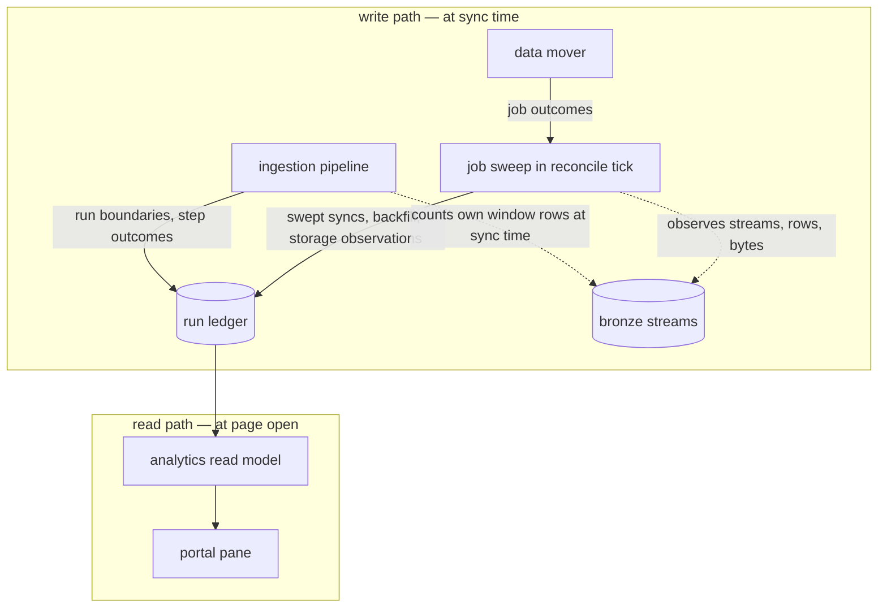
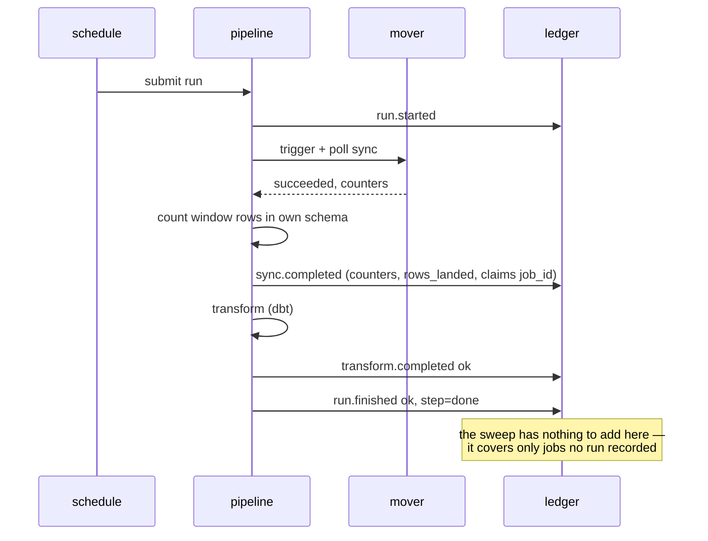
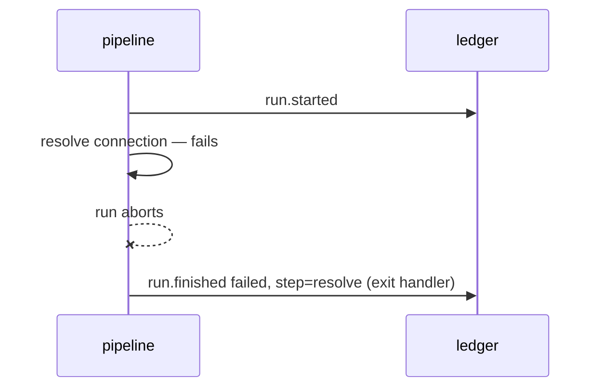
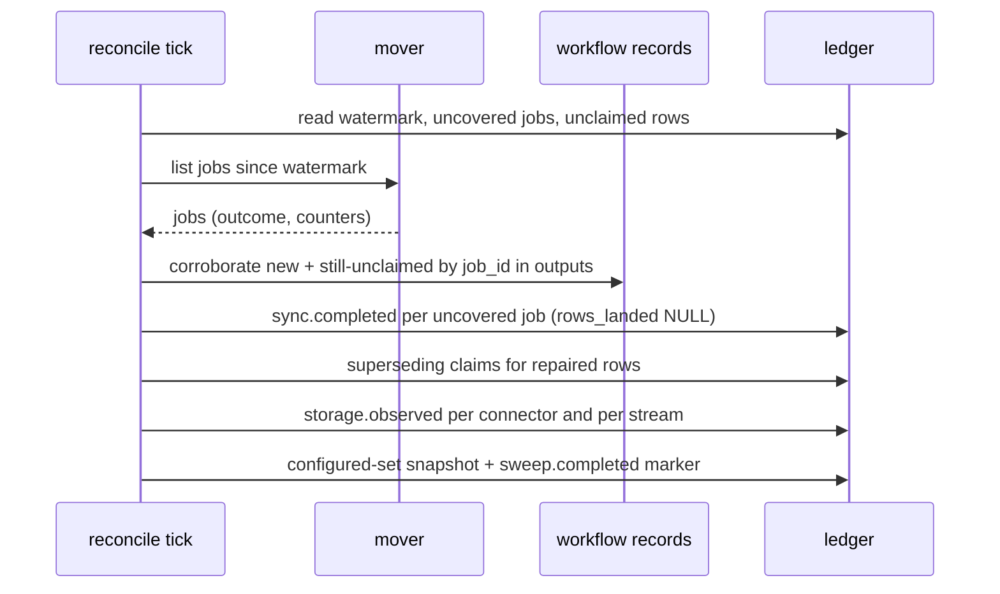
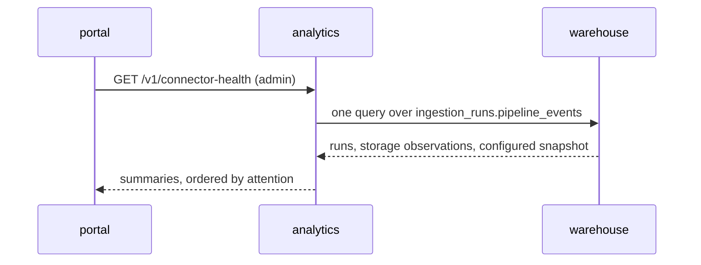

# Technical Design — Connector Health

<!-- toc -->

- [1. Architecture Overview](#1-architecture-overview)
  - [1.1 Architectural Vision](#11-architectural-vision)
  - [1.2 Architecture Drivers](#12-architecture-drivers)
  - [1.3 Architecture Layers](#13-architecture-layers)
- [2. Principles & Constraints](#2-principles--constraints)
  - [2.1 Design Principles](#21-design-principles)
  - [2.2 Constraints](#22-constraints)
- [3. Technical Architecture](#3-technical-architecture)
  - [3.1 Domain Model](#31-domain-model)
  - [3.2 Component Model](#32-component-model)
  - [3.3 API Contracts](#33-api-contracts)
  - [3.4 Internal Dependencies](#34-internal-dependencies)
  - [3.5 External Dependencies](#35-external-dependencies)
  - [3.6 Interactions & Sequences](#36-interactions--sequences)
  - [3.7 Database schemas & tables](#37-database-schemas--tables)
  - [3.8 Deployment Topology](#38-deployment-topology)
- [4. Additional context](#4-additional-context)
  - [4.1 Verification order](#41-verification-order)
  - [4.2 What was deliberately not built](#42-what-was-deliberately-not-built)
  - [4.3 Replacement note](#43-replacement-note)
- [5. Traceability](#5-traceability)

<!-- /toc -->

Realises [PRD.md](PRD.md). Scoped addition to the
[Analytics service design](../../DESIGN.md) on the read side and to the ingestion pipeline's
workflow templates and reconcile loop on the write side. Everything the parent design already
specifies — the admin gate, error taxonomy, OpenAPI registration — applies unchanged; this
document adds one table, two writers, one endpoint, and one portal pane.

## 1. Architecture Overview

### 1.1 Architectural Vision

The design is a seam: a single append-only warehouse table — the **run ledger** — separates
those who know what happened from those who need to know it. Above the seam, two writers
record facts at the moment they are cheap to know: the ingestion pipeline records its own run
boundaries, and the reconcile loop sweeps the data mover's job history for everything the
pipeline did not perform and observes what bronze holds. Below the seam, the analytics service
answers the operator's page from that one table.



The read path issues one query against one table — no external call, and no access to bronze
in any form. Nothing on the write path is allowed to fail the run it records.

### 1.2 Architecture Drivers

#### Functional Drivers

- Every run leaves a terminal record naming the step reached (FR-1) — drives the exit-handler
  design in §3.6.
- Syncs started outside the pipeline are recorded (FR-2) — drives the sweep and its origin
  marking.
- Self-reports are paired with an independent storage measurement (FR-3) — drives
  `rows_landed`, measured by the pipeline at sync time (§3.2, §3.7).
- Never-configured and configured-but-never-ran are distinct (FR-15) — drives the
  configured-set events the sweep writes.
- Transform outcome is its own fact (FR-4) — drives the per-step event model.
- The read path depends on nothing external (FR-14) — drives the seam itself.

#### NFR Allocation

| NFR | Allocated to |
|---|---|
| NFR-1 interactive read | one small-table query; the request path reads neither bronze nor storage metadata |
| NFR-2 recording never breaks ingestion | best-effort writers: ledger insert failures are logged and swallowed (§2.1) |
| NFR-3 idempotent sweep | append-only rows deduplicated at read by job identity (§3.1, §3.7) |
| NFR-4 bounded storage | table TTL; service database excluded from exports (§3.7) |

### 1.3 Architecture Layers

| Layer | Owns | Location |
|---|---|---|
| Workflow templates | recording run boundaries and step outcomes | `charts/insight/templates/ingestion/` |
| Reconcile loop | the sweep: mover job history → ledger | `src/ingestion/reconcile-connectors/` |
| Warehouse | the ledger table and its grants | migration in `src/ingestion/scripts/migrations/` |
| Analytics service | the read model and HTTP surface | `src/backend/services/analytics/` |
| Portal | the Connector health pane replacing Data health | `src/frontend/` |

## 2. Principles & Constraints

### 2.1 Design Principles

#### The seam is a table, not an API

- [ ] `p1` - **ID**: `cpt-insightspec-connhealth-principle-seam-is-a-table`

Writers and readers never meet. The pipeline and the sweep know nothing about the analytics
service; the analytics service knows nothing about the mover or the workflow layer. Either
side can change, fail, or be replaced without the other noticing, and the page stays up when
everything above the seam is down (FR-14).

#### Recording is subordinate to the recorded

- [ ] `p1` - **ID**: `cpt-insightspec-connhealth-principle-recording-subordinate`

A ledger insert failure is logged and swallowed, never propagated: no sync fails, no
reconcile tick aborts, because observability broke (NFR-2). The gap this leaves is repaired
by the next sweep, which re-reads the mover's history.

#### Facts carry provenance, verdicts wait for grounds

- [ ] `p1` - **ID**: `cpt-insightspec-connhealth-principle-facts-with-provenance`

Every row names its writer (`origin`), every counter names its source, and the surface draws
no fresh/stale conclusion while thresholds have no runtime source (FR-9). The freshness
classifier sketched in PR #2713 stays out until that changes.

#### Independent measurement beats self-report

- [ ] `p2` - **ID**: `cpt-insightspec-connhealth-principle-independent-measurement`

The mover's "records moved" is recorded next to the warehouse's own count of rows attributed
to that same sync (FR-3). Agreement is evidence; divergence is a finding; neither number
alone is trusted — and where the attribution cannot be taken, the row says unknown rather
than agreeing by default.

### 2.2 Constraints

#### Instance-wide, operator-gated

- [ ] `p1` - **ID**: `cpt-insightspec-connhealth-constraint-instance-wide`

Bronze schemas are not tenant-partitioned, so the read cannot be tenant-scoped. The handler
gates on the admin role exactly as the identity console does (FR-11).

#### Append-only with read-side resolution

- [ ] `p1` - **ID**: `cpt-insightspec-connhealth-constraint-append-only`

No writer updates or deletes ledger rows. Two writers may record the same sync (the pipeline
at run time, the sweep a tick later); reads resolve duplicates by job identity, preferring
the richer row. This is what makes NFR-3 hold by construction.

#### The reader gets no bronze access of any kind

- [ ] `p2` - **ID**: `cpt-insightspec-connhealth-constraint-metadata-only-grant`

The read-only query-path role gains exactly one thing: SELECT on the ledger database. It
gets no grant on bronze, in data or in metadata — measured on ClickHouse 25.7, `SHOW` on a
bronze pattern does not make those relations visible in `system.parts` (row visibility there
follows actual data access), so "metadata only" is not a reachable permission state. Storage
facts therefore reach the page the same way every other fact does: recorded into the ledger
by a writer that already owns bronze.

#### No compose-stand behaviour beyond degradation

- [ ] `p3` - **ID**: `cpt-insightspec-connhealth-constraint-no-compose`

Compose stands run no mover and no workflow layer, so nothing writes the ledger there. The
page renders its empty-ledger state (FR-13); no compose-specific code path exists beyond the
deployed-stand suite's minimal contract test for the endpoint.

## 3. Technical Architecture

### 3.1 Domain Model

A **ledger event** is one immutable observation about one run or sync:

| Field | Meaning |
|---|---|
| `event` | what is being reported: `run.started`, `sync.completed`, `transform.completed`, `run.finished`, `storage.observed`, `connector.configured`, `sweep.completed` |
| `status` | outcome of the reported thing: `ok`, `failed`, `cancelled`, `running` |
| `origin` | which writer recorded it: `pipeline` or `sweep`. Origin is provenance only — it never classifies how a sync was started |
| `step` | for `run.finished`: the last step reached (`resolve`, `sync`, `transform`, `done`) |
| identity | `run_id` (workflow name) for pipeline rows; `job_id` (mover job) for sync rows — both when known |

A **run** is the set of events sharing a `run_id`; its terminal state is the `run.finished`
row. The pipeline claims the mover job it started by writing its `sync.completed` row
carrying that `job_id`, so job identity joins the two writers' rows.

**Trigger** has three values and is **stored, not re-derived**: the read path sees only the
warehouse, so the corroboration finding must live in the row — the `claim` column.
**claimed** — a pipeline row carries the sync's `job_id` (and `run_id`); **out-of-band** —
the sweep corroborated, by exact job identity against the workflow layer's execution records
(the sync step exposes its mover job id in the workflow's recorded outputs), that no run
started this job — the signature of a manual sync (FR-12), rendered by the portal as "sync
without transform" (UC-3); **unclaimed** — no claim and no usable records (expired,
unreachable, or a record without the job-id output), presented as unknown provenance, never
asserted as manual. Timing overlap between a job and a workflow is never evidence: a manual
sync can run concurrently with a pipeline run, so only job identity claims, and uncertainty
stays `unclaimed`. Rows for one `job_id` resolve by claim precedence (`claimed` >
`out_of_band` > `unclaimed`), newest last, so a late claim written by a later sweep
supersedes an earlier finding. `origin = 'sweep'` alone never classifies anything: the sweep
imports every job, including pipeline-started ones, and a lost best-effort claim is repaired
by a late claim rather than misread.

A **configured-set snapshot** is the batch of `connector.configured` rows one reconcile tick
writes atomically, all sharing the tick's `run_id`, sealed by one `sweep.completed` marker
row written last — **always written, even when the managed set is empty**, so removing the
last connector produces a representable empty snapshot instead of leaving a stale one
authoritative. The configured set is the membership of the newest sealed snapshot: presence
asserts configured; absence asserts no longer configured — no retraction events, no
TTL-shaped lag (FR-15). The marker doubles as the sweep's heartbeat (the page's "swept as
of"). A connector with a storage schema, no membership in the newest sealed snapshot, and no
runs renders as never configured.

A **storage observation** (`storage.observed`) is what bronze held when a sweep tick looked:
one row per connector with stream counts, rows and bytes, and one per stream with its own —
the only route by which storage facts reach the page (§2.2).

A **connector summary** is the read model's unit: the connector's latest terminal event,
latest sync counters, and its newest storage observation, merged by connector name. Bronze schema names map to connector names by stripping the schema
prefix and mapping underscores back to the connector's hyphenated name; the mapping is a pure
function with table-driven tests.

### 3.2 Component Model

#### Run Recorder

- [ ] `p1` - **ID**: `cpt-insightspec-connhealth-component-run-recorder`

##### Why this component exists

FR-1 requires a terminal record even when the run dies before its first step produces
anything — only the workflow layer itself can know that.

##### Responsibility scope

Emits `run.started` at entry; a complete `sync.completed` from the sync-polling step —
mover `job_id`, polled outcome, duration, the moved counters the poll already tracks, and
`rows_landed`, measured right then by one window count over the connector's own streams
(`count()` bounded by the job's window on the extraction-stamp column: one narrow column of
one schema, once per sync, on parts merges have not yet mixed — seconds inside a run that
just spent minutes syncing, and exact, because the window's rows are the newest versions and
cannot have been merged away); `transform.completed` from the transform step; and
`run.finished` from the workflow's exit handler with final status and the step reached. All
rows carry `claim = 'claimed'` where a `job_id` is present. Inserts go over the warehouse
HTTP interface using the same credential wiring the transform step already has.

##### Responsibility boundaries

Owns every measurement taken at sync time; what it misses (out-of-band syncs, lost rows,
pre-ledger history) the sweep covers from the mover's history — without storage measurements.
Does not retry failed inserts beyond one attempt (NFR-2); never blocks or fails the run on
insert failure.

##### Related components (by ID)

`cpt-insightspec-connhealth-component-job-sweep` (fills what this writer misses),
`cpt-insightspec-connhealth-dbtable-pipeline-events`.

#### Job Sweep

- [ ] `p1` - **ID**: `cpt-insightspec-connhealth-component-job-sweep`

##### Why this component exists

Manual syncs bypass the pipeline entirely (FR-2), and a new ledger needs history (FR-6).
Only the mover's job history knows both, and the reconcile loop already holds mover
credentials, warehouse coordinates, and a periodic tick.

##### Responsibility scope

Each reconcile tick:

1. **Cover** mover jobs since a watermark (last swept job start, minus one interval of
   overlap): a job with no `sync.completed` row at all gets one from the mover's history —
   outcome, timestamps, duration, moved counters, `rows_landed = NULL` (the sweep takes no
   storage measurements; only the pipeline can, at sync time). A job already carrying a row
   with counters is not re-collected. This coverage skip is **not** a corroboration skip —
   see step 2.
2. **Corroborate**, by **exact job identity**, two sets each tick: newly covered jobs, and
   every existing row whose resolved claim is still `unclaimed` and whose window remains
   inside the workflow-record retention horizon — a temporarily unreachable record store
   therefore delays a claim, never freezes it. The workflow record's outputs carry the mover
   job id its sync step triggered: a record naming this `job_id` claims it retroactively
   (the sweep writes a superseding row with that `run_id`, `claim = 'claimed'`); records
   retained and none naming it ⇒ `claim = 'out_of_band'`; records expired, unreachable, or
   missing the output ⇒ the row stays `unclaimed`, retried while the horizon allows and
   final after it. Timing overlap never claims: a manual sync may run while a pipeline run
   is mid-transform. A lost best-effort pipeline row therefore degrades to a late claim,
   never to a false "manual".
3. **Observe** storage (FR-7, FR-8): one `system.parts` aggregate per tick over the bronze
   schemas, written as `storage.observed` rows — one per connector carrying stream counts,
   rows and bytes, plus one per stream carrying its own. This is a metadata query, no data
   read, and it runs under the ingestion user's existing ownership of bronze. It is the only
   path by which storage facts reach the page (§2.2).
4. **Snapshot** the configured set (FR-15): one atomic insert of `connector.configured`
   rows — every connector the tick currently manages — sealed by a `sweep.completed` marker
   row, written even when the set is empty. The newest sealed snapshot is the configured
   set; a connector absent from it stopped being configured, so removal — including of the
   last connector — is visible within one tick without retraction events.

On first run against an empty ledger the watermark is unset and the sweep ingests the
mover's full retained history (FR-6) under the same rules; backfilled rows carry the mover's
counters and `rows_landed = NULL` — a measurement no longer takable is recorded as unknown,
never reconstructed. Implements
`cpt-insightspec-connhealth-contract-mover-history`.

##### Responsibility boundaries

Consumes the mover's public job listing, the workflow layer's execution records (for
corroboration, while retained), and `system.parts` metadata — all under access the reconcile
loop already holds. Reads no bronze row data; any richer per-job mover detail is optional
enrichment that may vanish without breaking the sweep. Never mutates mover state. Sweep failure logs and ends
the step; the reconcile tick's connector work is unaffected (NFR-2).

##### Related components (by ID)

`cpt-insightspec-connhealth-component-run-recorder`,
`cpt-insightspec-connhealth-dbtable-pipeline-events`.

#### Health Read Model

- [ ] `p1` - **ID**: `cpt-insightspec-connhealth-component-read-model`

##### Why this component exists

The page needs one merged answer from two relations (ledger, storage metadata) with
duplicate resolution and name mapping — domain logic that belongs in one tested module, not
in a handler.

##### Responsibility scope

One warehouse query per request, over the ledger alone: latest-run resolution (arg-max per
connector; duplicate rows for one `job_id` resolve by claim precedence then recency, counters
from the row that carries them, run linkage from whichever row carries `run_id`), newest
`storage.observed` rows per connector and per stream, and the newest sealed configured-set
snapshot. Pure functions merge them into connector summaries, read
each sync's trigger from its resolved `claim` (§3.1 — stored by the writers; the read path
never consults anything outside the warehouse), resolve the quiet states (broken / empty /
configured-never-ran / never-configured) from runs plus the newest sealed configured-set
snapshot, order rows by attention (FR-10), and mark unknowns explicitly (FR-9). Serves
history slices for the expansion (FR-8, UC-1).

##### Responsibility boundaries

Holds no bronze access at all; never calls the mover; never classifies freshness. A missing
ledger table (migration not yet applied) or an empty one degrades to the configured-set list
with `history_available = false` and unknown storage figures (FR-13).

##### Related components (by ID)

`cpt-insightspec-connhealth-dbtable-pipeline-events`,
`cpt-insightspec-connhealth-component-health-pane`.

#### Connector Health Pane

- [ ] `p2` - **ID**: `cpt-insightspec-connhealth-component-health-pane`

##### Why this component exists

The Manage zone's Data health pane misinforms (PRD §1.2) and is replaced, not repaired.

##### Responsibility scope

Renders summary rows with state chips (word + colour, readable without colour), expansion
with per-stream facts and recent runs, and the degraded empty-ledger state. State chips are
derived client-side from served facts by documented precedence; the server ships no verdict
enum.

##### Responsibility boundaries

Requests exactly the read surface below; computes nothing the server could contradict; keeps
the admin gate behaviour of sibling admin panes (refusal state, no flash of content).

##### Related components (by ID)

`cpt-insightspec-connhealth-component-read-model`.

### 3.3 API Contracts

Realises `cpt-insightspec-connhealth-interface-read-surface`. One operator-gated resource on
the analytics service, registered in OpenAPI like every sibling route, refusing non-admins
with the standard problem shape:

```
GET /v1/connector-health
```

```json
{
  "as_of": "2026-01-15T09:00:00Z",
  "history_available": true,
  "connectors": [
    {
      "connector": "example-tool",
      "last_run": {
        "origin": "pipeline",
        "status": "failed",
        "step": "resolve",
        "started_at": "2026-01-15T04:00:00Z",
        "duration_ms": 42000
      },
      "configured": true,
      "last_sync": {
        "origin": "sweep",
        "trigger": "out_of_band",
        "status": "ok",
        "started_at": "2026-01-14T04:00:00Z",
        "duration_ms": 310000,
        "records_moved": 12400,
        "rows_landed": null
      },
      "storage": {
        "observed_at": "2026-01-15T08:55:00Z",
        "streams": 12,
        "streams_with_data": 8,
        "physical_rows": 4200000,
        "bytes_on_disk": 314572800
      },
      "streams": [
        { "stream": "items", "physical_rows": 3900000, "bytes_on_disk": 285212672 },
        { "stream": "labels", "physical_rows": 0, "bytes_on_disk": 0 }
      ]
    }
  ]
}
```

```
GET /v1/connector-health/{connector}/runs
```

Recent ledger events for one connector, newest first, bounded page size — the expansion's
run-history slice (UC-1, UC-2). Both responses are facts only; `last_run` and `last_sync` are
separate objects because they are separate truths (a swept manual sync updates one and not
the other), and either may be `null` with `history_available` saying why.

The external integration consumed by the sweep is
`cpt-insightspec-connhealth-contract-mover-history` (§3.2 Job Sweep); it never appears on
this surface.

### 3.4 Internal Dependencies

- The analytics service's existing warehouse client, admin-role gate, and OpenAPI
  registration — the endpoint is one more `OperationBuilder` route.
- The portal's Manage-zone navigation: the `data-health` item is replaced by this pane; the
  admin-gate wrapper is reused as-is.
- The deployed-stand suite's endpoint coverage gate: one contract test (admin 200,
  non-admin refusal) accompanies the route.

### 3.5 External Dependencies

#### Data mover job listing

Public listing of jobs with outcome, timestamps, and counters, consumed by the sweep with the
reconcile loop's existing credentials. Unavailable ⇒ the sweep skips a tick; the page serves
last-swept facts (FR-14).

#### Workflow layer exit handling

The workflow layer's execution records serve two purposes. Routinely, the sweep corroborates
unclaimed jobs against them (§3.2), so a lost best-effort claim degrades to a late claim
rather than a false "manual". As fallback, if the exit handler cannot be made to fire —
this repository has no prior use of exit handling with template references, and verifying it
is implementation step one (PRD §13) — the sweep reads run outcomes from the same records,
the only source that sees a run dead before its mover job existed; mover-job inference
cannot. Caveat for both: the records are garbage-collected on a TTL, so each holds only
while the sweep interval stays well inside that TTL; past it, syncs stay unclaimed and runs
unrecorded, both rendered as unknown.

#### Warehouse

Stores everything this design adds; grants in §3.7. No new deployment.

### 3.6 Interactions & Sequences

#### Scheduled run, recorded end to end

- [ ] `p2` - **ID**: `cpt-insightspec-connhealth-seq-scheduled-run`



#### Failure before the sync starts

- [ ] `p1` - **ID**: `cpt-insightspec-connhealth-seq-pre-sync-failure`



The exit handler fires on abnormal termination and names the step, so the page can say
"failed before sync, resolving the connection" (UC-1) instead of showing nothing.

#### Sweep tick

- [ ] `p1` - **ID**: `cpt-insightspec-connhealth-seq-sweep-tick`



First tick against an empty ledger: no watermark ⇒ full retained history is ingested (FR-6).
Coverage dedup and claim-precedence resolution make re-runs harmless (NFR-3), and the
unclaimed set is revisited every tick while the record horizon allows, so a claim delayed by
an outage lands late instead of never.

#### Page read

- [ ] `p2` - **ID**: `cpt-insightspec-connhealth-seq-page-read`



One query over one small table; no external call and no bronze access (FR-14, NFR-1).

### 3.7 Database schemas & tables

#### `ingestion_runs.pipeline_events`

- [ ] `p1` - **ID**: `cpt-insightspec-connhealth-dbtable-pipeline-events`

Its own database, for the same reason the product-usage events have one: `presentation` is
swept by exports and customer extracts, which must never carry service rows.

| Column | Type | Notes |
|---|---|---|
| `event_id` | `UUID DEFAULT generateUUIDv4()` | |
| `ts` | `DateTime64(3, 'UTC') DEFAULT now64(3)` | insert time |
| `run_id` | `String` | workflow name; empty on swept rows with no matching run |
| `job_id` | `String` | mover job id; empty on pipeline boundary rows |
| `connector` | `LowCardinality(String)` | hyphenated connector name |
| `tenant_id` | `String` | |
| `source_id` | `String` | |
| `event` | `LowCardinality(String)` | `run.started` \| `sync.completed` \| `transform.completed` \| `run.finished` \| `storage.observed` \| `connector.configured` \| `sweep.completed` |
| `status` | `LowCardinality(String)` | `ok` \| `failed` \| `cancelled` \| `running` |
| `origin` | `LowCardinality(String)` | `pipeline` \| `sweep` |
| `claim` | `LowCardinality(String)` | `claimed` \| `out_of_band` \| `unclaimed`; empty on non-sync rows. The stored corroboration finding — the read path cannot re-derive it (§3.1) |
| `step` | `LowCardinality(String)` | last step reached; empty unless `run.finished` |
| `started_at` | `DateTime64(3, 'UTC')` | when the reported thing started |
| `duration_ms` | `UInt64` | |
| `records_moved` | `UInt64` | mover-reported |
| `bytes_moved` | `UInt64` | mover-reported |
| `rows_landed` | `Nullable(UInt64)` | storage rows whose extraction stamp falls inside this sync's window, measured by the pipeline at sync time; NULL on swept rows — the window has passed |
| `stream` | `LowCardinality(String)` | the observed stream; empty on connector-level and non-storage rows |
| `streams` | `UInt16` | connector-level `storage.observed` only |
| `streams_with_data` | `UInt16` | connector-level `storage.observed` only |
| `rows_total` | `Nullable(UInt64)` | physical rows present when observed; `storage.observed` only |
| `bytes_on_disk` | `UInt64` | size when observed; `storage.observed` only |
| `message` | `String` | brief failure reason; empty on success |

`ENGINE = MergeTree`, `PARTITION BY toYYYYMM(ts)`, `ORDER BY (connector, ts, event_id)`,
`TTL toDateTime(ts) + INTERVAL 6 MONTH` (FR-5; length is an open PRD decision — 6 months is
the working default).

Append-only: read-side resolution picks, per job identity, the winning claim by precedence
(`claimed` > `out_of_band` > `unclaimed`), newest row within a precedence class; counters and
`rows_landed` come from the row that carries them (the pipeline's, when it exists; the
sweep's coverage row otherwise), and run linkage from whichever winning-claim row carries
`run_id`. Duplicate recording of the same sync — both writers, or an overlapping sweep —
therefore changes nothing the page reports (NFR-3).

**`rows_landed` vs `rows_total`**: `rows_landed` is one sync's own delivery, measured once by
the pipeline; `rows_total` is what the schema held when a sweep tick last looked. The first
answers "did this sync deliver", the second "how much is there now".

**`rows_landed` semantics**: measured once, by the pipeline, immediately after its sync —
a window `count()` on the extraction-stamp column of the connector's own streams. At that
moment the count is exact: the window's rows are the newest versions, so no merge can have
collapsed them yet, and the sync that wrote them has just finished. Swept rows —
out-of-band, backfill, pipeline-lost — carry `NULL`: the measurement window has passed and
is not reconstructed (FR-3 reports the pairing as unknown there). Divergence is the alarm,
agreement is the evidence.

**Why not an index, projection, or later attribution**: bronze sorts by its dedup key, not
by time, so after merges a minmax skipping index on the stamp column degenerates —
granule bands widen to the table's whole range and the window query converges on a full
column read; a time-ordered projection on a deduplicating engine carries its own
restrictions; and materializing either over existing data is exactly the unbounded
historical mutation this design forbids. Measuring at sync time needs none of that: one
narrow column of one schema, once per sync, in the background of a run that just spent far
longer syncing.

#### Grants

- [ ] `p1` - **ID**: `cpt-insightspec-connhealth-dbtable-grants`

Numbered migration, alongside the table DDL:

| Grantee | Grant | Why |
|---|---|---|
| pipeline / sweep warehouse user | `INSERT ON ingestion_runs.pipeline_events` | the two writers (already the ingestion user; no new principal). Its bronze window counts and `system.parts` observations need no new grant — it owns bronze end to end |
| read-only query-path role | `SELECT ON ingestion_runs.*` | the read model's only query |

That is the whole grant surface. No bronze grant is issued to the reader, in data or in
metadata — measured on ClickHouse 25.7, neither `SHOW` on a `bronze_*` pattern nor a
`bronze_*` wildcard `SELECT` makes existing bronze relations visible in `system.parts` for a
role lacking real access, so the storage-observation route in §3.2 is not a preference but
the only workable one.

### 3.8 Deployment Topology

No new services, images, or schedules.

| Change | Where |
|---|---|
| exit handler + `run.started` / `run.finished` / `transform.completed` writes | `charts/insight/templates/ingestion/ingestion-pipeline.yaml`, `dbt-run.yaml` |
| sweep step + watermark + storage observations | `src/ingestion/reconcile-connectors/` (new lib + python helper, existing tick) |
| table + grants migration | `src/ingestion/scripts/migrations/` |
| endpoint | analytics service (domain module + api module + OpenAPI) |
| pane replacement | portal Manage zone |
| contract test | deployed-stand suite |

Rollout order matters once: the migration ships before or with the writers (writers tolerate
a missing table by NFR-2 either way), and the endpoint tolerates an empty or missing table
from day one (FR-13), so partial rollout degrades to today's behaviour, never to an error.

## 4. Additional context

### 4.1 Verification order

The one unproven mechanism is the workflow layer's exit handling under template references
(PRD §11, §13). Implementation starts with a spike proving `run.finished` lands on a run
killed at each step — including before the sync exists. If it cannot be made to fire, the
workflow-record sweep fallback in §3.5 replaces FR-1's pipeline writer without changing the
table or the read surface; mover-job inference is not an acceptable fallback because a
pre-sync failure leaves no job.

### 4.2 What was deliberately not built

- **Freshness verdicts** — the classifier from the PR #2713 sketch stays out until declared
  thresholds have a runtime source; the ledger's own history gives the operator cadence
  context without the product asserting one (UC-2).
- **Mover reads on the request path** — rejected: it couples page availability to the mover,
  costs orders of magnitude more latency than warehouse reads, and its richer detail is
  available to the sweep in the background instead.
- **Any bronze access for the reader** — not a preference: measured on ClickHouse 25.7 the
  reader cannot be given metadata visibility without data access, so storage facts are
  recorded by the sweep instead. Per-stream timestamp or entity aggregates could later join
  the same observation rows without touching the seam.
- **Expected-connector detection** — deferred to
  [#744](https://github.com/constructorfabric/insight/issues/744); needs cluster
  configuration this design deliberately does not read.

### 4.3 Replacement note

The portal's Data health pane and its metric-catalogue counters are removed with the pane
swap; the metric-catalogue table itself (a different pane) is untouched. Nothing else reads
the removed counters.

## 5. Traceability

| PRD requirement | Realised by |
|---|---|
| FR-1 | `cpt-insightspec-connhealth-component-run-recorder`, `cpt-insightspec-connhealth-seq-pre-sync-failure` |
| FR-2 | `cpt-insightspec-connhealth-component-job-sweep`, `cpt-insightspec-connhealth-seq-sweep-tick`, job-identity claiming in §3.1 |
| FR-3 | `rows_landed` measured at sync time in `cpt-insightspec-connhealth-component-run-recorder`, `cpt-insightspec-connhealth-principle-independent-measurement` |
| FR-4 | `transform.completed` events, §3.1 |
| FR-5 | TTL in §3.7 |
| FR-6 | first-tick backfill in `cpt-insightspec-connhealth-seq-sweep-tick` |
| FR-7, FR-8 | `storage.observed` rows from `cpt-insightspec-connhealth-component-job-sweep`, `cpt-insightspec-connhealth-component-read-model`, §3.3 |
| FR-9 | `cpt-insightspec-connhealth-principle-facts-with-provenance` |
| FR-10 | attention ordering in `cpt-insightspec-connhealth-component-read-model` |
| FR-11 | `cpt-insightspec-connhealth-constraint-instance-wide` |
| FR-12 | stored `claim` column (§3.7), claiming `sync.completed` row in `cpt-insightspec-connhealth-component-run-recorder`, exact-identity corroboration in `cpt-insightspec-connhealth-component-job-sweep` |
| FR-15 | configured-set snapshots in `cpt-insightspec-connhealth-component-job-sweep` |
| FR-13 | degraded mode in `cpt-insightspec-connhealth-component-read-model`, §3.8 rollout |
| FR-14 | `cpt-insightspec-connhealth-principle-seam-is-a-table`, `cpt-insightspec-connhealth-seq-page-read` |
| NFR-1 | `cpt-insightspec-connhealth-seq-page-read` |
| NFR-2 | `cpt-insightspec-connhealth-principle-recording-subordinate` |
| NFR-3 | `cpt-insightspec-connhealth-constraint-append-only`, read-side resolution in §3.7 |
| NFR-4 | TTL and service database isolation in §3.7 |
