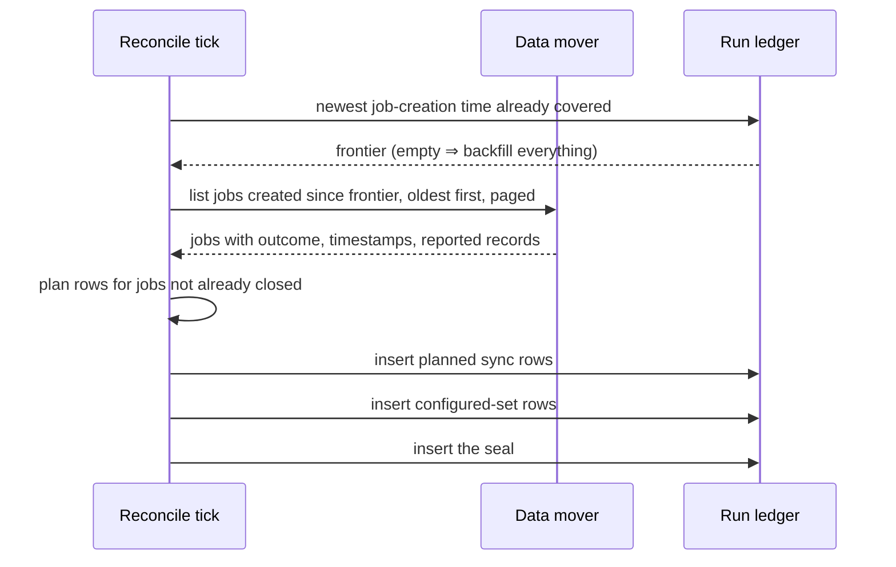
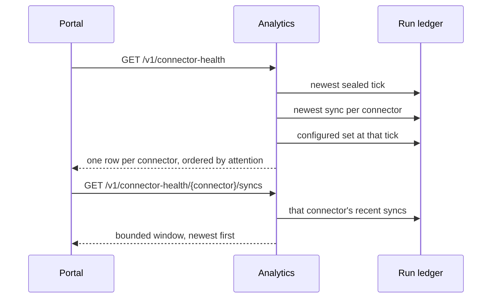

# DESIGN — Connector Health


<!-- toc -->

- [1. Architecture Overview](#1-architecture-overview)
  - [1.1 Architectural Vision](#11-architectural-vision)
  - [1.2 Architecture Drivers](#12-architecture-drivers)
  - [1.3 Architecture Layers](#13-architecture-layers)
- [2. Principles & Constraints](#2-principles--constraints)
  - [2.1 Design Principles](#21-design-principles)
  - [2.2 Constraints](#22-constraints)
- [3. Technical Architecture](#3-technical-architecture)
  - [3.1 Domain Model](#31-domain-model)
  - [3.2 Component Model](#32-component-model)
  - [3.3 API Contracts](#33-api-contracts)
  - [3.4 Internal Dependencies](#34-internal-dependencies)
  - [3.5 External Dependencies](#35-external-dependencies)
  - [3.6 Interactions & Sequences](#36-interactions--sequences)
  - [3.7 Database schemas & tables](#37-database-schemas--tables)
  - [3.8 Deployment Topology](#38-deployment-topology)
- [4. Additional context](#4-additional-context)
  - [4.1 What was deliberately not built](#41-what-was-deliberately-not-built)

<!-- /toc -->

Realises [PRD.md](PRD.md). Scoped addition to the
[Analytics service design](../../DESIGN.md) on the read side and to the reconcile loop on the
write side. Everything the parent design already specifies — the admin gate, error taxonomy,
OpenAPI registration — applies unchanged; this document adds one table, one writer, two
endpoints, and one portal pane.

## 1. Architecture Overview

### 1.1 Architectural Vision

The page must answer from facts that were recorded when they were true, not gathered when the
operator asks. Two routes were rejected for that reason.

**Reading the mover on the request path** couples the page's availability to the mover's, and
its listing is orders of magnitude slower than a warehouse read. An operator opening the page
during an incident is exactly when the mover is least likely to answer.

**Reading storage metadata on the request path** cannot be done by a reader that holds no
data access: row visibility in the warehouse's parts metadata follows real access, so a
metadata-only grant is not a reachable permission state. Widening the read-only query-path
role to see bronze is not acceptable for a page that reports on it.

What remains is a ledger: the reconcile loop reads the mover's job history on its own cadence
and records what it found. The request path then touches one relation and nothing else, and
the page stays up when everything above it is down.

The ledger buys a second thing the mover cannot: **history that outlives its source.** Delete
a connection in the mover and its job history goes with it; the ledger keeps six months.

### 1.2 Architecture Drivers

#### Functional Drivers

- Every sync in the mover's history is recorded, whatever started it (FR-1) — drives the
  sweep and its job coverage.
- History is bounded and survives the mover (FR-2) — drives retention and the decision to
  copy rather than proxy.
- The configured set is recorded (FR-4) — drives the sealed per-tick snapshot.
- Facts, not verdicts (FR-7) — drives a wire shape that ships observations and no state enum.
- The read path depends on nothing external (FR-11) — drives the single-relation read.

#### NFR Allocation

- **NFR-1 interactive read** — one relation, bounded reads, no measurement while the operator
  waits.
- **NFR-2 recording never breaks reconciliation** — every sweep path returns success to its
  caller; the tick around it cannot abort because observability broke.
- **NFR-3 idempotent sweep** — coverage is keyed on the mover's own job identity, so
  re-reading the same history adds nothing.
- **NFR-4 bounded storage** — its own database, outside anything customer-facing, with a TTL.

### 1.3 Architecture Layers

| Layer | This change adds |
|---|---|
| Ingestion control | the sweep inside the reconcile tick |
| Warehouse | `ingestion_runs.pipeline_events` and one grant |
| Analytics service | a domain read module and two admin routes |
| Portal | the Connector health pane, replacing Data health |

## 2. Principles & Constraints

### 2.1 Design Principles

#### The seam is a table, not an API

- [ ] `p1` - **ID**: `cpt-insightspec-connhealth-principle-seam-is-a-table`

The writer and the reader never meet. The reconcile loop knows nothing about the analytics
service; the analytics service knows nothing about the mover. Either side can change, fail,
or be replaced without the other noticing, and the page answers from the table while
everything above the seam is down (FR-11).

#### Recording is subordinate to the recorded

- [ ] `p1` - **ID**: `cpt-insightspec-connhealth-principle-recording-subordinate`

A sweep failure is logged and swallowed, never propagated: no reconcile tick aborts because
observability broke (NFR-2). The cost of that choice is that a tick can leave a gap. The next
tick repairs it, because the mover's history is still there to re-read — which is the reason
the sweep reads a source it does not own rather than recording as it goes.

#### The page reports the mover's account as the mover's account

- [ ] `p1` - **ID**: `cpt-insightspec-connhealth-principle-account-not-verdict`

Every fact on this page comes from one source that reports on itself. Nothing corroborates
it, so nothing on the page may read as corroborated: a successful sync is shown as a
successful sync, and the record count is labelled as reported. The page never says a
connector is delivering, because it does not know (FR-7).

#### Absence is representable

- [ ] `p1` - **ID**: `cpt-insightspec-connhealth-principle-absence-representable`

Every column whose value can genuinely be missing is nullable, so "nobody measured this" and
"this was zero" are different values in the table rather than a distinction reconstructed at
read time. A job the mover has not started has no start time and no duration; storing the
epoch or a zero there would make the page state something nobody recorded.

### 2.2 Constraints

#### Instance-wide, operator-gated

- [ ] `p1` - **ID**: `cpt-insightspec-connhealth-constraint-instance-wide`

Bronze schemas are not tenant-partitioned, so the surface cannot be scoped by tenant. It is
gated on the operator role and reports the whole install (FR-9). The refusal names the
surface the caller was refused, so an operator who followed a link knows what to ask for.

#### Append-only, no updates

- [ ] `p1` - **ID**: `cpt-insightspec-connhealth-constraint-append-only`

No writer updates or deletes ledger rows. A job seen mid-flight and later seen finished
yields two rows; reads take the newest per job identity. This is what makes NFR-3 hold by
construction — a repeated sweep can only add rows that resolve to the same answer.

#### The reader holds no bronze access

- [ ] `p1` - **ID**: `cpt-insightspec-connhealth-constraint-no-bronze-grant`

The read-only query-path role gains exactly one thing: `SELECT` on the ledger database. It is
not a read-only role in general — other databases are create/insert-only for it, which that
role's own test pins — but on the ledger it reads and nothing more, and a static test over
the migration fails the moment that changes.

#### No compose-stand behaviour beyond degradation

- [ ] `p2` - **ID**: `cpt-insightspec-connhealth-constraint-no-compose`

Compose stands run no mover, so nothing records and the ledger stays empty. The surface is
required only to degrade honestly there (FR-10). Stand tests that need recorded syncs carry
the ingestion capability and skip with a reason rather than passing over an empty list.

## 3. Technical Architecture

### 3.1 Domain Model

One table holds three kinds of row, told apart by `event`.

| Event | Written when | Carries |
|---|---|---|
| `sync.completed` | the sweep sees a job in the mover's history | job identity, connector, outcome, timestamps, duration, reported records |
| `connector.configured` | each tick, one row per managed connector | connector, tick identity |
| `sweep.completed` | each tick, last | tick identity — the marker that seals the snapshot |

**Resolution.** The summary takes, per connector, the newest `sync.completed` by the mover's
job creation time; the configured set is the membership of the newest *sealed* tick. Sealing
matters: without keying on the marker, a snapshot still being written would read as the whole
set, and a connector removed a moment ago would come back for one tick.

**Status vocabulary.** `ok`, `failed`, `cancelled`, `running`, `unknown`. The mover's own
words are mapped onto this closed set at the boundary; a word outside the mover's documented
vocabulary is stored as `unknown` rather than passed through, so nothing downstream holds a
value it cannot read. `unknown` is not a failure and not a reason to sort a connector as
quiet — the page shows it as a state it cannot read.

**Two timestamps, kept apart.** `started_at` is when the mover says the sync began, and is
absent for a job it has not started. `job_created_at` is when the job was created, which is
the field the mover's listing is ordered and filtered by — and therefore the axis the sweep's
own frontier moves along. Substituting one for the other would report a start that never
happened and still leave the cursor on the wrong axis.

### 3.2 Component Model

#### Job Sweep

- [ ] `p1` - **ID**: `cpt-insightspec-connhealth-component-job-sweep`

##### Why this component exists

The mover is the only account of what synced, its history is bounded, and it disappears with
a deleted connection. Something has to copy that account somewhere durable, on a cadence, and
the reconcile loop already authenticates to the mover and ticks.

##### Responsibility scope

Each tick: resolve the frontier from the ledger, page the mover's job listing forward from
it, map each job's connection to a connector, plan one row per job the ledger does not
already hold with a terminal outcome, plan the configured-set snapshot, write the rows, then
write the seal.

The planning is a pure function over values — the shell gathers, the planner decides, and the
planner is what the tests exercise. Its rules are the change's densest logic: which jobs to
cover, which recorded rows already close a job, which jobs cannot be placed in time at all.

##### Responsibility boundaries

Records; never reads back for the page. Cannot abort the reconcile tick around it: every path
returns success to its caller, and a failure to read any input means the tick records nothing
rather than sealing a partial picture.

##### Related components (by ID)

- Writes the table read by `cpt-insightspec-connhealth-component-read-model`.

#### Health Read Model

- [ ] `p1` - **ID**: `cpt-insightspec-connhealth-component-read-model`

##### Why this component exists

The page needs one merged answer from several statements over the ledger — newest sync per
connector, the sealed configured set, a connector's recent syncs — which is domain logic that
belongs in one tested module, not in a handler.

##### Responsibility scope

A handful of reads per request, all over the ledger alone. Pure functions merge them into
connector summaries, resolve the quiet states from the configured set, order rows by
attention (FR-8), and mark unknowns explicitly (FR-7). Serves the bounded sync history for
the expansion (FR-6).

##### Responsibility boundaries

Holds no bronze access; never calls the mover; never classifies freshness; ships no verdict
enum — the attention order is used for sorting and is not serialised. A missing ledger table
leaves nothing to serve: the endpoint answers an empty list rather than erroring (FR-10).

##### Related components (by ID)

- Serves `cpt-insightspec-connhealth-component-health-pane`.

#### Connector Health Pane

- [ ] `p2` - **ID**: `cpt-insightspec-connhealth-component-health-pane`

##### Why this component exists

The Manage zone needs one place that answers "is ingestion working", replacing a pane that
answered a different question.

##### Responsibility scope

One row per connector with the fields of FR-5; a row expands to that connector's recent
syncs. Decides the displayed state from the served facts in one documented function, so the
precedence lives in one place rather than scattered across cells. Every state carries words
as well as a tone, so colour is never the only signal.

##### Responsibility boundaries

Renders; computes no cadence and asserts no freshness. Where a served value is absent it
prints unknown rather than a zero.

##### Related components (by ID)

- Reads `cpt-insightspec-connhealth-component-read-model`.

### 3.3 API Contracts

Realises `cpt-insightspec-connhealth-interface-read-surface`, and consumes
`cpt-insightspec-connhealth-contract-mover-history` on the write side.

Two admin routes on the analytics service, registered like every other route in the parent
design.

`GET /v1/connector-health` — the whole install:

```json
{
  "as_of": "2026-01-15T09:12:00Z",
  "checked_at": "2026-01-15T09:06:00Z",
  "history_available": true,
  "connectors": [
    {
      "connector": "example-tracker",
      "configured": true,
      "last_sync": {
        "job_id": "8412",
        "status": "ok",
        "started_at": "2026-01-15T09:00:00Z",
        "duration_ms": 142000,
        "records_reported": 12400
      }
    }
  ]
}
```

`GET /v1/connector-health/{connector}/syncs` — one connector's recent syncs, newest first,
bounded:

```json
{
  "connector": "example-tracker",
  "syncs": [
    {
      "job_id": "8412",
      "status": "ok",
      "started_at": "2026-01-15T09:00:00Z",
      "duration_ms": 142000,
      "records_reported": 12400
    }
  ]
}
```

Shape rules that the generated contract enforces:

- **Nullable fields are required and nullable**, never optional. The service always emits the
  key; a client written to the contract must handle `null` rather than a missing key.
- `last_sync` is null for a configured connector that has never synced.
- `checked_at` is the newest sealed tick's own stamp, never the response's clock — serving
  the reader's clock there would read as "just now" however long ago the controller last ran.
- `history_available` is false when nothing has been recorded at all, so the page can say so
  instead of implying health.

### 3.4 Internal Dependencies

- The analytics service's existing warehouse client, admin-role gate, and OpenAPI
  registration — the summary and the per-connector history are two more routes.
- The portal's Manage-zone navigation: the `data-health` item is replaced by this pane; the
  admin-gate wrapper is reused as-is.
- The reconcile loop's existing mover authentication and tick scheduling.
- The deployed-stand suite's endpoint coverage gate: contract tests accompany the routes, and
  the ones needing recorded syncs carry the ingestion capability rather than passing over an
  empty list.

### 3.5 External Dependencies

#### Data mover job listing

The sweep consumes the mover's stable public job listing: per job, its identity, connection,
outcome, creation and start timestamps, duration, and reported record count. Richer per-job
detail exists but is not contract-stable across mover upgrades, so nothing here depends on
it. Unavailable ⇒ the sweep records nothing this tick and the page serves the last recorded
facts.

#### Warehouse

Holds the ledger. Unavailable ⇒ the sweep skips the tick and the read surface fails like any
other warehouse-backed read.

### 3.6 Interactions & Sequences

#### Sweep tick

- [ ] `p1` - **ID**: `cpt-insightspec-connhealth-seq-sweep-tick`



The frontier moves along job creation time because that is what the listing is ordered and
filtered by. Reading oldest-first makes a truncated read resumable: what is cut is newer than
everything collected, so the next tick continues at the edge rather than leaving a gap behind
the cursor. The seal is written last, so a snapshot read never names a tick whose rows are
still arriving.

#### Page read

- [ ] `p2` - **ID**: `cpt-insightspec-connhealth-seq-page-read`



The sealed tick is resolved once and bound into the snapshot reads. Resolving it per statement
would let a sweep landing between two of them answer with the newer configured set beside the
older facts — a state that never existed on any tick.

### 3.7 Database schemas & tables

#### `ingestion_runs.pipeline_events`

- [ ] `p1` - **ID**: `cpt-insightspec-connhealth-dbtable-pipeline-events`

Its own database, deliberately: the presentation database is swept by metric exports and
customer extracts, which must never carry service rows.

| Column | Type | Notes |
|---|---|---|
| `event_id` | `UUID DEFAULT generateUUIDv4()` | makes the sort key unique; nothing reads it |
| `ts` | `DateTime64(3, 'UTC') DEFAULT now64(3)` | insert time |
| `tick_id` | `String` | the sweep tick that wrote the row; what a sealed snapshot is keyed on |
| `job_id` | `String` | the mover's job identity; empty on snapshot rows |
| `connector` | `LowCardinality(String)` | hyphenated connector name |
| `event` | `LowCardinality(String)` | `sync.completed` \| `connector.configured` \| `sweep.completed` |
| `status` | `LowCardinality(String)` | `ok` \| `failed` \| `cancelled` \| `running` \| `unknown` — the closed set |
| `started_at` | `Nullable(DateTime64(3, 'UTC'))` | when the mover says the sync began; NULL for a job it has not started |
| `job_created_at` | `Nullable(DateTime64(3, 'UTC'))` | when the job was created — the axis the frontier moves along |
| `duration_ms` | `Nullable(UInt64)` | elapsed time as reported; NULL where the mover reported none, which a zero could not express |
| `records_reported` | `Nullable(UInt64)` | the mover's own count; NULL where it reported none |

`ENGINE = MergeTree`, `PARTITION BY toYYYYMM(ts)`, `ORDER BY (connector, ts, event_id)`,
`TTL toDateTime(ts) + INTERVAL 6 MONTH`.

The migration is idempotent and re-runs on every deploy: this channel keeps no ledger of
applied files, so every statement in it is written to be safe to repeat.

#### Grants

- [ ] `p1` - **ID**: `cpt-insightspec-connhealth-dbtable-grants`

| Role | Grant | Why |
|---|---|---|
| read-only query-path role | `SELECT ON ingestion_runs.*` | everything the read surface needs |

The writer takes no grant here: the reconcile loop authenticates as the ingestion user, which
owns the database already. The query-path role must not be given anything that writes, and a
static test over the migration asserts exactly that.

### 3.8 Deployment Topology

| Change | Where it lands |
|---|---|
| ledger table and grant | ClickHouse migration, applied by the post-upgrade hook |
| sweep | the reconcile loop's existing image and CronWorkflow |
| horizon-free configuration | none — the sweep needs no new chart value |
| two routes | analytics service |
| pane | portal bundle |

Nothing here adds a deployable unit. The sweep runs inside a controller that already exists,
and the read surface is two more routes on a service that already serves the portal.

## 4. Additional context

### 4.1 What was deliberately not built

- **Verifying that a sync's data reached storage.** It needs a measurement taken at sync
  time, inside the ingestion pipeline, against a window that has passed by the time a sweep
  runs. That puts recording code on the critical ingestion path, where a recorder appended
  after the work it records becomes the only task its DAG's phase is read from — and one
  succeeding after a failure would mask that failure. The capability is worth having; it is
  not worth carrying that hazard for a first iteration.
- **Transform outcome.** Same reason: only the pipeline knows it.
- **How a sync was started.** The mover's listing does not say, and inferring it means
  correlating against the workflow layer's own records — a second uncertain source, with a
  trust horizon of its own, to answer a question the page cannot act on without the transform
  outcome anyway.
- **Per-stream volume.** Reading it means either granting the reader bronze access, which the
  constraint above forbids, or recording it per tick, which grows the table with streams
  rather than with syncs.
- **Freshness verdicts** — the declared thresholds have no runtime source. The page shows
  when the last sync started and a bounded window of recent ones, which lets an operator
  judge cadence without the product asserting one.
