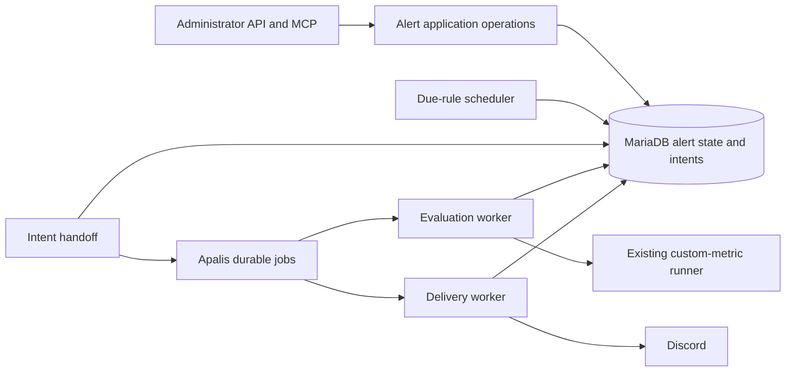

# Technical Design — Insight v3 Metric Alerts

**Approved:** Apalis, Insight v3 custom metrics, administrator API/MCP, one numeric result per alert, and Discord only.

**Proposed flow:** Save a due check → run the existing metric → record a qualifying breach → send its notification through a separate job. Save each step so interrupted work can resume.

**Still open:** PRD decisions D1–D8, the Apalis release and MariaDB compatibility. This is a design proposal, not an implementation.

**Version 0.2:** Plain-language editing; no design changes.

<!-- toc -->

- [1. Architecture Overview](#1-architecture-overview)
  - [1.1 Architectural Vision](#11-architectural-vision)
  - [1.2 Architecture Drivers](#12-architecture-drivers)
  - [1.3 Architecture Layers](#13-architecture-layers)
- [2. Principles & Constraints](#2-principles--constraints)
  - [2.1 Design Principles](#21-design-principles)
  - [2.2 Constraints](#22-constraints)
- [3. Technical Architecture](#3-technical-architecture)
  - [3.1 Domain Model](#31-domain-model)
  - [3.2 Component Model](#32-component-model)
  - [3.3 API Contracts](#33-api-contracts)
  - [3.4 Internal Dependencies](#34-internal-dependencies)
  - [3.5 External Dependencies](#35-external-dependencies)
  - [3.6 Interactions & Sequences](#36-interactions--sequences)
  - [3.7 Database Schemas & Tables](#37-database-schemas--tables)
  - [3.8 Deployment Topology](#38-deployment-topology)
- [4. Additional Context](#4-additional-context)
  - [Compatibility Findings](#compatibility-findings)
  - [Verification and Observability](#verification-and-observability)
  - [Open Decisions and Resumption](#open-decisions-and-resumption)
- [5. Traceability](#5-traceability)

<!-- /toc -->

- [ ] `p1` - **ID**: `cpt-insightspec-v3-alerts-design-core`


## 1. Architecture Overview

### 1.1 Architectural Vision

Keep rules, evaluation state and delivery outcomes in `insight-v3-core`. Reuse its metric runner and administrator checks. Apalis executes jobs; alert records determine when a check is due and whether a notification already exists.

Save work before submitting it to Apalis. Jobs may run again after interruption, so workers use stable evaluation and notification IDs to avoid repeating state changes. Discord retries are bounded, may duplicate messages and do not guarantee delivery. No general workflow service or second metric evaluator is introduced.

### 1.2 Architecture Drivers

The parent [separate-service ADR](../ADR/0001-separate-service.md) still applies. Apalis is approved for alert jobs; the parent Gears-first principle still governs other capabilities and service integration.

#### Functional Drivers

| Requirement | Design Response |
|-------------|-----------------|
| `cpt-insightspec-v3-alerts-fr-manage` | Shared rule application operations behind existing API and MCP authorization |
| `cpt-insightspec-v3-alerts-fr-authorize` | Existing administrator guards, scoped worker credentials and non-secret destination references |
| `cpt-insightspec-v3-alerts-fr-evaluate` | Existing metric compiler/runner with a typed scalar boundary |
| `cpt-insightspec-v3-alerts-fr-schedule` | Durable due state and retryable job handoff |
| `cpt-insightspec-v3-alerts-fr-episodes` | Serialized, revision-fenced episode transition |
| `cpt-insightspec-v3-alerts-fr-deliver` | Persisted notification intent and independent delivery jobs |
| `cpt-insightspec-v3-alerts-fr-inspect` | Separate evaluation and delivery histories with safe diagnostics |

#### NFR Allocation

| NFR ID | Allocated To | Design Response | Verification Approach |
|--------|--------------|-----------------|-----------------------|
| `cpt-insightspec-v3-alerts-nfr-durability` | State store and workers | Transactional intents, unique business identities, fenced commits | Crash-boundary and concurrent-worker integration evidence |
| `cpt-insightspec-v3-alerts-nfr-timeliness` | Scheduler and worker pools | Bounded work, separate scheduling/evaluation/delivery measurements | Synthetic approved workload; targets await D7 |
| `cpt-insightspec-v3-alerts-nfr-confidentiality` | Administration and Discord boundary | Secret references, redaction, minimal payloads | API/MCP and log contract checks |
| `cpt-insightspec-v3-nfr-efficiency` | Entire addition | Bounded concurrency and retained history | Compare synthetic resource use against parent baseline |
| `cpt-insightspec-v3-nfr-reliability` | Service lifecycle | Worker shutdown/recovery independent of request handling | Existing service availability evidence plus interruption checks |
| `cpt-insightspec-v3-nfr-performance` | Metric execution pools | Alert admission does not starve interactive work | Parent dashboard latency measurements under alert load |
| `cpt-insightspec-v3-nfr-security` | Dependencies and artifact pipeline | Existing scans include chosen Apalis backend | No critical findings in required scans |
| `cpt-insightspec-v3-nfr-versatility` | Rule administration | Data-defined rules | Create another supported rule without code changes |

Engineering verifies these requirements, including the parent targets. Alert capacity and delivery-time targets remain unapproved; parent targets are unchanged.

### 1.3 Architecture Layers

- [ ] `p1` - **ID**: `cpt-insightspec-v3-alerts-tech-stack`



| Layer | Responsibility | Technology |
|-------|----------------|------------|
| Interface | Administrator operations and safe result presentation | Existing Rust REST and MCP integration |
| Application/domain | Rule lifecycle, scalar comparison, episode transitions, delivery identity | Typed Rust operations in Insight v3 |
| Infrastructure | Durable state, queue, metric execution, outbound messages | MariaDB, Apalis, existing ClickHouse client and HTTP client |

## 2. Principles & Constraints

### 2.1 Design Principles

#### Reuse Metric Meaning

- [ ] `p1` - **ID**: `cpt-insightspec-v3-alerts-principle-metric-parity`

Alerts use the same saved-definition compiler and runner as on-demand metrics. Check frequency does not change metric filters or its data window.

#### Separate Facts from Transport

- [ ] `p1` - **ID**: `cpt-insightspec-v3-alerts-principle-durable-intent`

Record the evaluation result and required notification separately from queue submission and Discord acceptance. Retrying delivery must not rerun the metric or create another episode.

### 2.2 Constraints

#### Approved Job Library

- [ ] `p1` - **ID**: `cpt-insightspec-v3-alerts-constraint-apalis`

Use Apalis. Its release and MariaDB configuration remain open: MySQL support alone does not prove MariaDB compatibility. Section 4 lists the blockers. This proposal adds no PostgreSQL instance or Temporal service.

#### Scope and Credentials

- [ ] `p1` - **ID**: `cpt-insightspec-v3-alerts-constraint-boundary`

Only Insight v3 custom metrics and Discord are in scope. API/MCP operations retain their current administrator authorization. Destination secrets never become metric definitions, job payloads, ordinary read responses or tool output.

## 3. Technical Architecture

### 3.1 Domain Model

Proposed Rust types belong in the service's alert logic. Alert schemas do not exist yet; define and approve their contracts before implementation.

| Entity | Identity and purpose | Invariant |
|--------|----------------------|-----------|
| Rule | Stable rule identity plus configuration revision | One metric, scalar selection, condition, schedule and destination |
| Evaluation | Rule revision plus logical schedule occurrence | One accepted result per occurrence; records evaluated metric identity |
| Episode | Rule revision plus episode identity | Notification qualification is independent of delivery outcome |
| Notification | Episode plus destination identity | One logical intent for the same qualifying event and destination |
| Destination | Stable non-secret reference | Credential access restricted to delivery infrastructure |
| Handoff intent | Work kind plus evaluation or notification identity | Repeated publication has the same business identity |

Keep rule/evaluation and episode/notification references valid throughout retention. An unknown result must not clear the last valid episode state or imply recovery. Numeric types, operators, edit resets and deletion behavior remain open in PRD D4–D8.

### 3.2 Component Model

Three terms describe recovery:

- **Handoff:** submit saved work to Apalis, then mark it submitted.
- **Lease:** time-limited ownership of work; another worker can recover it after expiry.
- **Fence:** a version or ownership check that rejects writes from an outdated worker.

#### Alert Application

- [ ] `p1` - **ID**: `cpt-insightspec-v3-alerts-component-application`

##### Why this component exists

API and MCP need identical rule behavior.

##### Responsibility scope

Typed validation, lifecycle operations, optimistic concurrency and redacted reads.

##### Responsibility boundaries

No ClickHouse query or Discord request inside configuration transactions; transport authentication remains in existing adapters.

##### Related components (by ID)

`cpt-insightspec-v3-alerts-component-state` stores configuration and outcomes.

#### Durable State and Handoff

- [ ] `p1` - **ID**: `cpt-insightspec-v3-alerts-component-state`

##### Why this component exists

Saving alert state and submitting a queue job may succeed or fail separately.

##### Responsibility scope

Use short MariaDB transactions to claim due work and save it for queue submission. Advance the next due time in the same transaction. Save each evaluation result, episode change and required notification together. Enforce unique work IDs and worker ownership.

##### Responsibility boundaries

Release database locks before metric queries or HTTP requests. Queue submission may repeat after a crash; workers recognize the same work ID. Apalis remains the job queue.

##### Related components (by ID)

Supplies work to `cpt-insightspec-v3-alerts-component-evaluation` and `cpt-insightspec-v3-alerts-component-delivery` through Apalis.

#### Evaluation Worker

- [ ] `p1` - **ID**: `cpt-insightspec-v3-alerts-component-evaluation`

##### Why this component exists

Metric execution must not occupy administration requests.

##### Responsibility scope

Load the intended rule and metric snapshot, run the shared compiler/runner, and check the numeric result. Save it only if worker ownership and the configuration revision still match.

##### Responsibility boundaries

Does not send messages. Expired or replaced workers cannot save stale results. Keep existing metric execution limits; D6 decides when an episode resets.

##### Related components (by ID)

Commits through `cpt-insightspec-v3-alerts-component-state`; notification intent becomes delivery work.

#### Delivery Worker

- [ ] `p1` - **ID**: `cpt-insightspec-v3-alerts-component-delivery`

##### Why this component exists

Provider failures must not cause metric re-evaluation.

##### Responsibility scope

Claim a saved notification, load its destination secret, build a size-limited summary and send it. Save the outcome and whether it can be retried.

##### Responsibility boundaries

Never rerun the metric or retry indefinitely. Distinguish rate limits and uncertain outcomes from permanent rejection. Exactly-once delivery is not guaranteed. Retry duration and administrator replay need approval.

##### Related components (by ID)

Reads and updates `cpt-insightspec-v3-alerts-component-state`.

### 3.3 API Contracts

Administration follows `cpt-insightspec-v3-alerts-interface-administration`; delivery follows `cpt-insightspec-v3-alerts-contract-discord`. Use existing REST/OpenAPI and MCP conventions. Routes, tool names and error formats need approval before the API schema is written.

| Operations | Request information | Response information | Permission |
|------------|---------------------|----------------------|------------|
| Create/update rule | Metric, scalar selection, condition, schedule, destination; expected revision for update | Rule identity, revision and validation result | Administrator |
| Enable/disable rule | Rule identity and expected revision | Configuration state | Administrator |
| List/get rules and outcomes | Rule identity or bounded pagination | Redacted configuration; evaluation and delivery outcomes separately | Administrator |
| List permitted destinations | Bounded pagination | Identity and safe display metadata | Administrator |

D6 and D8 decide whether the API includes credential provisioning, test sends, replay or rule removal. Errors distinguish invalid configuration, missing references, conflicting edits and execution failures. Keep existing identity/session handling; add no login, SSO or MFA mechanism.

### 3.4 Internal Dependencies

| Dependency | Interface Used | Purpose |
|------------|----------------|---------|
| [Custom surfaces](../../../../../src/backend/services/insight-v3-core/src/custom.rs) | Saved metric loading and `run_metric` execution flow | Semantic parity; share a snapshot-based execution seam if needed |
| [Metric query](../../../../../src/backend/services/insight-v3-core/src/metric_query.rs) | Compiler and runner | Existing 30-second fetch timeout, 5 MiB result bound and maximum 10,000 result rows |
| [API authorization](../../../../../src/backend/services/insight-v3-core/src/api/mod.rs) | Administrator identity check | REST authority |
| [MCP authorization](../../../../../src/backend/services/insight-v3-core/src/mcp/auth.rs) | Validated token and administrator role check | MCP authority |
| [Definition storage](../../../../../src/backend/services/insight-v3-core/src/definitions/sql/001_definitions.sql) | Saved metric body by name | Existing definitions contain update time, not an immutable revision |

Execute the exact metric definition recorded for the evaluation. Checking timestamps before and after a query is insufficient. D6 must choose a metric revision or immutable snapshot/fingerprint and define how edits update it atomically. Share the compiler/runner operation in-process; no service HTTP call or legacy analytics dependency is needed.

### 3.5 External Dependencies

| Dependency | Proposed integration | Boundary |
|------------|----------------------|----------|
| Apalis | Durable evaluation and delivery queues | Version/backend adoption gates in section 4 |
| MariaDB | Domain transactions and chosen queue backend | Exact server/backend combination must pass migrations and contention checks |
| ClickHouse | Existing custom-metric runner | Existing read-only query restrictions and result limits retained |
| Discord | Direct webhook through existing HTTP client, pending D3 | External acceptance is not transactional with MariaDB |

For the proposed direct webhook:

- Use [Execute Webhook](https://docs.discord.com/developers/resources/webhook) with `wait=true`, save its message ID and disable automatic mentions.
- Restrict hosts and webhook paths, require HTTPS and reject redirects. Do not accept arbitrary URLs.
- Approve forum/thread support separately; Discord requires extra thread information.
- Follow [rate-limit responses](https://docs.discord.com/developers/topics/rate-limits), including `retry_after`. Bound retries and request duration.
- Treat a timeout after possible acceptance as uncertain; retrying may duplicate the message.

Credential provisioning is unresolved in D8. Proposed secret references keep credentials outside domain data and expose them only to delivery infrastructure. Any alternative encrypted storage needs key ownership, rotation and deletion approval. Metric summaries may contain sensitive information: administrator authority does not establish permission to export arbitrary rows or approve channel membership.

### 3.6 Interactions & Sequences

#### Scheduled Evaluation and Delivery

**ID**: `cpt-insightspec-v3-alerts-seq-evaluate-deliver`

**Use cases**: `cpt-insightspec-v3-alerts-usecase-monitor`
**Actors**: `cpt-insightspec-v3-alerts-actor-admin`, `cpt-insightspec-v3-alerts-actor-discord`

```mermaid
sequenceDiagram
    participant S as Scheduler
    participant DB as Domain state
    participant H as Handoff
    participant Q as Apalis
    participant E as Evaluation worker
    participant M as Metric runner
    participant D as Delivery worker
    participant X as Discord
    S->>DB: Claim due rule; persist evaluation intent
    H->>DB: Read unpublished intents
    H->>Q: Publish business identity
    Q->>E: Execute evaluation
    E->>M: Run captured definition
    M-->>E: Bounded result or failure
    E->>DB: Fenced result and notification-intent commit
    H->>Q: Publish notification identity
    Q->>D: Execute delivery
    D->>DB: Claim current notification
    D->>X: Send bounded summary
    X-->>D: Acceptance, rejection or uncertain outcome
    D->>DB: Record outcome and retry eligibility
```

Proposed recovery rules:

- Mark handoff complete only after queue submission. A crash may repeat submission, so workers check saved work before acting.
- Allow another worker to recover an expired lease; reject writes from the original worker.
- Allow at most one active logical evaluation per rule across scheduled checks. Also reject results older than the latest accepted check, so late completion cannot overwrite it or its episode.
- Accept only one episode change from repeated attempts of the same check.

D2 decides how missed checks combine; D6 decides whether edits cancel pending notifications.

Discord may accept a message before the worker can save its receipt. A delivery lease prevents normal concurrent sends, but cannot cancel an HTTP request already completing after ownership expires. Retries may therefore duplicate messages. Permanent rejection and exhausted retries remain visible as final outcomes; replay permissions and expiry rules need approval.

### 3.7 Database Schemas & Tables

- [ ] `p1` - **ID**: `cpt-insightspec-v3-alerts-db-state`

These are proposed records, not final table names or migrations. Apalis owns its queue schema; Insight owns alert state. Do not retain full metric result sets.

| Relation | Key and relationships | Stored information and access pattern |
|----------|-----------------------|---------------------------------------|
| Rules | Rule identity; reference to metric and destination | Revision, enabled status, condition, schedule, next due; index enabled due work |
| Evaluations | Unique rule revision and schedule occurrence | Definition identity, ownership fence, timestamps, scalar/result classification; index rule history |
| Episodes | Rule revision and episode identity | Last accepted valid condition and qualifying event identity |
| Notifications | Unique episode and destination | Immutable minimal message facts, outcome, attempts, provider receipt, next attempt; index due delivery |
| Handoff intents | Unique work kind and business identity | Publication state and retry eligibility; index pending publication |
| Destinations | Stable destination identity | Non-secret metadata and approved secret reference |

Save the evaluation, episode change and notification together; queue submission is separate.

- Keep references and duplicate-detection records valid for the approved retry/replay lifetime.
- Proposed migrations add compatible structures and keep queue payloads version-compatible. Do not remove data while older workers can still consume retained work.
- Back up and restore alert state and queues consistently. Restore may replay messages already accepted by Discord.

D7 sets retention and recovery objectives.

### 3.8 Deployment Topology

- [ ] `p1` - **ID**: `cpt-insightspec-v3-alerts-topology-workers`

Proposed: run the scheduler and bounded workers inside Insight v3, using its database and lifecycle. Separate worker processes need approval if measurements show isolation is necessary. Replicas coordinate through database claims and ownership checks. An in-memory timer only wakes the scheduler; due work stays in the database.

Proposed lifecycle:

- **Startup:** check database readiness and backend compatibility before accepting work.
- **Shutdown:** stop accepting work and allow bounded time to finish; keep unfinished work recoverable.
- **Rollout:** start with workers disabled, apply compatible migrations, then validate synthetic rules before enabling scheduling.
- **Rollback:** stop scheduling and delivery without deleting pending state. Older binaries must not consume unsupported payload versions.

Enablement settings and limits still need approval.

Size work from rule count, check intervals, query duration and notifications plus retries. Before release, use synthetic measurements to set concurrency, queue/pool limits, scan batch size, retry duration and history storage. No infrastructure sizing or spare capacity is assumed.

## 4. Additional Context

### Compatibility Findings

The [Apalis](https://crates.io/crates/apalis) and [Apalis SQL](https://crates.io/crates/apalis-sql) stable line inspected is 0.7.4; standalone MySQL backend releases are prerelease. This is evidence, not a version selection.

In [the 0.7.4 MySQL source](https://github.com/geofmureithi/apalis/blob/v0.7.4/packages/apalis-sql/src/mysql.rs), enqueue executes against its own pool, so sharing a SeaORM transaction is not established. Job selection includes failed jobs while the claim update targets pending jobs; concurrent failed-job retry requires a regression check before adoption. The application handoff proposal addresses transaction separation, not backend claim defects.

The [backend migration](https://github.com/geofmureithi/apalis/blob/v0.7.4/packages/apalis-sql/migrations/mysql/20220530084123_jobs_workers.sql) uses `utf8mb4_0900_ai_ci`, whose compatibility support was added in [MariaDB 11.4.5](https://mariadb.com/docs/release-notes/community-server/11.4/11.4.5). SKIP LOCKED support alone therefore does not establish migration compatibility. Test the exact intended MariaDB release, collation and storage engine. Selecting another Apalis release, adapting a migration or changing the database version each requires approval.

### Verification and Observability

Proposed verification:

- Pure tests for numeric comparisons and episode transitions.
- Real MariaDB tests for migrations, work claims, crashes and stale-worker rejection.
- Metric parity checks through the existing runner.
- API/MCP permission and redaction checks.
- Controlled Discord acceptance, rate-limit and uncertain-outcome tests.
- Synthetic load comparisons against parent quality targets.

This draft does not authorize broad builds or test runs.

Expose scheduling delay, execution duration/failure, pending handoff age, delivery attempts/age, terminal failures and worker health through the existing telemetry integration. Correlate rule, evaluation and notification IDs without logging secrets, SQL results or message bodies. Missing worker progress and exhausted delivery are operator signals; their thresholds follow D7. Audit records identify actor, operation, configuration revision and outcome; retention and privileged diagnostic access follow D8.

API documentation explains scalar selection, cadence versus metric time scope, unknown outcomes and retry uncertainty. An operator runbook covers stopping workers, inspecting stuck work, credential rotation and controlled replay. Existing authentication and release mechanisms remain in force.

### Open Decisions and Resumption

| Decision | Recommended proposal | Alternative awaiting approval |
|----------|----------------------|-------------------------------|
| D3: delivery integration | Direct Discord webhooks through the existing HTTP client | Apprise-managed delivery |
| D8: credential storage | Operator-provisioned secret references resolved only by delivery infrastructure | Administrator-managed encrypted credentials, with explicit key ownership and rotation |

**INCOMPLETE:** Approve PRD D1–D8, prove Apalis/MariaDB compatibility, and review API and storage contracts before implementation. The product owner approves behavior; engineering verifies compatibility and capacity; security reviews credentials and external data sharing.

Use the current [PRD decision register](./PRD.md#11-assumptions) and update this proposal after approval. Backend workarounds, worker placement and schema/versioning choices also need approval before implementation. No extra transport abstraction, general scheduler or workflow engine is authorized.

## 5. Traceability

- **Local PRD**: [Metric Alerts](./PRD.md).
- **Parent PRD**: [Insight v3](../PRD.md), specifically `cpt-insightspec-v3-fr-create-alerts` and the inherited quality requirements.
- **Parent DESIGN**: [Insight v3](../DESIGN.md).
- **Applicable ADR**: [Separate service](../ADR/0001-separate-service.md).
- **Feature contracts and implementation**: Not authored; dependent on the open decisions above.
