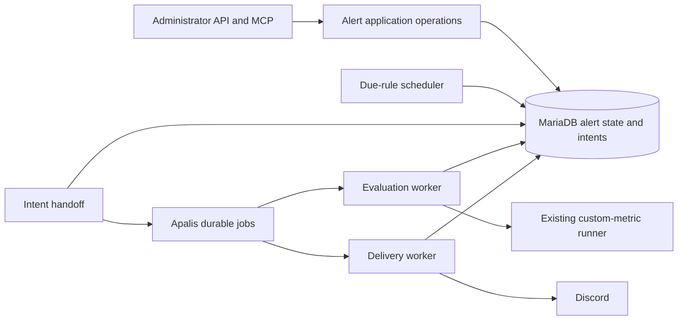

# Technical Design — Insight v3 Metric Alerts

<!-- toc -->

- [1. Architecture Overview](#1-architecture-overview)
  - [1.1 Architectural Vision](#11-architectural-vision)
  - [1.2 Architecture Drivers](#12-architecture-drivers)
  - [1.3 Architecture Layers](#13-architecture-layers)
- [2. Principles & Constraints](#2-principles--constraints)
  - [2.1 Design Principles](#21-design-principles)
  - [2.2 Constraints](#22-constraints)
- [3. Technical Architecture](#3-technical-architecture)
  - [3.1 Domain Model](#31-domain-model)
  - [3.2 Component Model](#32-component-model)
  - [3.3 API Contracts](#33-api-contracts)
  - [3.4 Internal Dependencies](#34-internal-dependencies)
  - [3.5 External Dependencies](#35-external-dependencies)
  - [3.6 Interactions & Sequences](#36-interactions--sequences)
  - [3.7 Database Schemas & Tables](#37-database-schemas--tables)
  - [3.8 Deployment Topology](#38-deployment-topology)
- [4. Additional Context](#4-additional-context)
  - [Compatibility Findings](#compatibility-findings)
  - [Verification and Observability](#verification-and-observability)
  - [Open Decisions and Resumption](#open-decisions-and-resumption)
- [5. Traceability](#5-traceability)

<!-- /toc -->

- [ ] `p1` - **ID**: `cpt-insightspec-v3-alerts-design-core`

**Approval status:** Apalis, Insight v3 custom metrics, administrator API/MCP, scalar alerts and Discord-only delivery are confirmed. The architecture below is a proposed baseline; PRD decisions D1–D8 and compatibility findings remain unresolved. Version 0.1 introduces this design; no implementation is claimed.
## 1. Architecture Overview

### 1.1 Architectural Vision

Keep the alert domain inside `insight-v3-core`: saved rules, evaluation state and notification outcomes. Reuse the custom-metric execution path and existing administration guards. Apalis handles durable job execution; application-owned state defines when a rule is due and whether a logical notification already exists.

Proposed transaction boundaries preserve scheduling and notification intent before handing work to Apalis. Queue redelivery is expected; business identities and fenced state transitions prevent duplicate logical effects. Bounded Discord retries may duplicate messages after ambiguous HTTP outcomes; successful delivery is not guaranteed. The design does not introduce a general workflow service or a second metric evaluator.

### 1.2 Architecture Drivers

The parent [separate-service ADR](../ADR/0001-separate-service.md) remains applicable. Apalis is an explicitly approved constraint for alerts. The parent Gears-first principle continues to apply to other capabilities and service integration.

#### Functional Drivers

| Requirement | Design Response |
|-------------|-----------------|
| `cpt-insightspec-v3-alerts-fr-manage` | Shared rule application operations behind existing API and MCP authorization |
| `cpt-insightspec-v3-alerts-fr-authorize` | Existing administrator guards, scoped worker credentials and non-secret destination references |
| `cpt-insightspec-v3-alerts-fr-evaluate` | Existing metric compiler/runner with a typed scalar boundary |
| `cpt-insightspec-v3-alerts-fr-schedule` | Durable due state and retryable job handoff |
| `cpt-insightspec-v3-alerts-fr-episodes` | Serialized, revision-fenced episode transition |
| `cpt-insightspec-v3-alerts-fr-deliver` | Persisted notification intent and independent delivery jobs |
| `cpt-insightspec-v3-alerts-fr-inspect` | Separate evaluation and delivery histories with safe diagnostics |

#### NFR Allocation

| NFR ID | Allocated To | Design Response | Verification Approach |
|--------|--------------|-----------------|-----------------------|
| `cpt-insightspec-v3-alerts-nfr-durability` | State store and workers | Transactional intents, unique business identities, fenced commits | Crash-boundary and concurrent-worker integration evidence |
| `cpt-insightspec-v3-alerts-nfr-timeliness` | Scheduler and worker pools | Bounded work, separate scheduling/evaluation/delivery measurements | Synthetic approved workload; targets await D7 |
| `cpt-insightspec-v3-alerts-nfr-confidentiality` | Administration and Discord boundary | Secret references, redaction, minimal payloads | API/MCP and log contract checks |
| `cpt-insightspec-v3-nfr-efficiency` | Entire addition | Bounded concurrency and retained history | Compare synthetic resource use against parent baseline |
| `cpt-insightspec-v3-nfr-reliability` | Service lifecycle | Worker shutdown/recovery independent of request handling | Existing service availability evidence plus interruption checks |
| `cpt-insightspec-v3-nfr-performance` | Metric execution pools | Alert admission does not starve interactive work | Parent dashboard latency measurements under alert load |
| `cpt-insightspec-v3-nfr-security` | Dependencies and artifact pipeline | Existing scans include chosen Apalis backend | No critical findings in required scans |
| `cpt-insightspec-v3-nfr-versatility` | Rule administration | Data-defined rules | Create another supported rule without code changes |

Engineering owns the feature evidence and full parent-obligation assessment. No local capacity allocation, alert-delivery SLA or reduced parent target is approved.

### 1.3 Architecture Layers

- [ ] `p1` - **ID**: `cpt-insightspec-v3-alerts-tech-stack`



| Layer | Responsibility | Technology |
|-------|----------------|------------|
| Interface | Administrator operations and safe result presentation | Existing Rust REST and MCP integration |
| Application/domain | Rule lifecycle, scalar comparison, episode transitions, delivery identity | Typed Rust operations in Insight v3 |
| Infrastructure | Durable state, queue, metric execution, outbound messages | MariaDB, Apalis, existing ClickHouse client and HTTP client |

## 2. Principles & Constraints

### 2.1 Design Principles

#### Reuse Metric Meaning

- [ ] `p1` - **ID**: `cpt-insightspec-v3-alerts-principle-metric-parity`

The alert evaluator shares the saved-definition compiler and runner used by on-demand metrics. A scheduling interval does not rewrite metric filters or manufacture a historical time window.

#### Separate Facts from Transport

- [ ] `p1` - **ID**: `cpt-insightspec-v3-alerts-principle-durable-intent`

Evaluation state and notification intent are domain facts. Queue receipt and Discord acceptance are transport outcomes. Retry transport without recalculating the metric or creating a new episode.

### 2.2 Constraints

#### Approved Job Library

- [ ] `p1` - **ID**: `cpt-insightspec-v3-alerts-constraint-apalis`

Use Apalis; exact release and MariaDB backend configuration are not selected. MySQL support does not prove compatibility with the intended MariaDB version. Section 4 records concrete adoption blockers. No additional PostgreSQL instance or Temporal service is part of this proposal.

#### Scope and Credentials

- [ ] `p1` - **ID**: `cpt-insightspec-v3-alerts-constraint-boundary`

Only Insight v3 custom metrics and Discord are in scope. API/MCP operations retain their current administrator authorization. Destination secrets never become metric definitions, job payloads, ordinary read responses or tool output.

## 3. Technical Architecture

### 3.1 Domain Model

Proposed Rust domain types belong with the service's alert application logic. Machine-readable alert schemas do not yet exist; the approved feature contract will define them before implementation.

| Entity | Identity and purpose | Invariant |
|--------|----------------------|-----------|
| Rule | Stable rule identity plus configuration revision | One metric, scalar selection, condition, schedule and destination |
| Evaluation | Rule revision plus logical schedule occurrence | One accepted result per occurrence; records evaluated metric identity |
| Episode | Rule revision plus episode identity | Notification qualification is independent of delivery outcome |
| Notification | Episode plus destination identity | One logical intent for the same qualifying event and destination |
| Destination | Stable non-secret reference | Credential access restricted to delivery infrastructure |
| Handoff intent | Work kind plus evaluation or notification identity | Repeated publication has the same business identity |

Rule-to-evaluation and episode-to-notification references remain valid for the approved retention period. Numeric types, comparison operators, revision reset and deletion semantics are unresolved in PRD D4–D8. Unknown evaluation is separate from the latest valid episode state; it must not imply recovery.

### 3.2 Component Model

#### Alert Application

- [ ] `p1` - **ID**: `cpt-insightspec-v3-alerts-component-application`

##### Why this component exists

API and MCP need identical rule behavior.

##### Responsibility scope

Typed validation, lifecycle operations, optimistic concurrency and redacted reads.

##### Responsibility boundaries

No ClickHouse query or Discord request inside configuration transactions; transport authentication remains in existing adapters.

##### Related components (by ID)

`cpt-insightspec-v3-alerts-component-state` stores configuration and outcomes.

#### Durable State and Handoff

- [ ] `p1` - **ID**: `cpt-insightspec-v3-alerts-component-state`

##### Why this component exists

Domain commits and queue writes cannot be assumed atomic.

##### Responsibility scope

MariaDB transactions, uniqueness, due-work claims, leases/fences and retryable intent publication. Short transactions create an evaluation intent while advancing durable due state; result commits update episode state and create notification intent atomically.

##### Responsibility boundaries

No database lock spans metric evaluation or external HTTP. Handoff may publish twice after a crash; consumers deduplicate by business identity. The store is not a new general queue implementation.

##### Related components (by ID)

Supplies work to `cpt-insightspec-v3-alerts-component-evaluation` and `cpt-insightspec-v3-alerts-component-delivery` through Apalis.

#### Evaluation Worker

- [ ] `p1` - **ID**: `cpt-insightspec-v3-alerts-component-evaluation`

##### Why this component exists

Metric execution must not occupy administration requests.

##### Responsibility scope

Load the intended rule and metric snapshot, execute through shared compiler/runner, validate the scalar, then commit under a current ownership fence and configuration revision.

##### Responsibility boundaries

Does not send messages. Expired or replaced workers cannot commit a stale result. Existing metric execution bounds remain intact; episode reset behavior requires D6.

##### Related components (by ID)

Commits through `cpt-insightspec-v3-alerts-component-state`; notification intent becomes delivery work.

#### Delivery Worker

- [ ] `p1` - **ID**: `cpt-insightspec-v3-alerts-component-delivery`

##### Why this component exists

Provider failures must not cause metric re-evaluation.

##### Responsibility scope

Claim persisted notification, resolve the destination secret, render a bounded summary, request delivery, persist the classified outcome and retry eligibility.

##### Responsibility boundaries

No metric execution; no unbounded retries or hidden claim of exactly-once delivery. Rate limits and uncertain outcomes are distinct from permanent rejection. Retry horizon and administrator replay policy require approval.

##### Related components (by ID)

Reads and updates `cpt-insightspec-v3-alerts-component-state`.

### 3.3 API Contracts

The public capability is `cpt-insightspec-v3-alerts-interface-administration`; external delivery follows `cpt-insightspec-v3-alerts-contract-discord`. The proposed service contract uses the existing REST/OpenAPI and MCP conventions. Exact route names, tool names and error shapes remain for contract approval; no complete API schema is introduced here.

| Operations | Request information | Response information | Permission |
|------------|---------------------|----------------------|------------|
| Create/update rule | Metric, scalar selection, condition, schedule, destination; expected revision for update | Rule identity, revision and validation result | Administrator |
| Enable/disable rule | Rule identity and expected revision | Configuration state | Administrator |
| List/get rules and outcomes | Rule identity or bounded pagination | Redacted configuration; evaluation and delivery outcomes separately | Administrator |
| List permitted destinations | Bounded pagination | Identity and safe display metadata | Administrator |

Destination credential provisioning, test sends, history replay and rule removal are not implicitly added to the first API; D6 and D8 decide their inclusion. Domain errors distinguish invalid configuration, missing references and concurrent modification from execution failures. Existing identity/session mechanisms remain authoritative; this module adds no new login, SSO or MFA mechanism.

### 3.4 Internal Dependencies

| Dependency | Interface Used | Purpose |
|------------|----------------|---------|
| [Custom surfaces](../../../../../src/backend/services/insight-v3-core/src/custom.rs) | Saved metric loading and `run_metric` execution flow | Semantic parity; share a snapshot-based execution seam if needed |
| [Metric query](../../../../../src/backend/services/insight-v3-core/src/metric_query.rs) | Compiler and runner | Existing 30-second fetch timeout, 5 MiB result bound and maximum 10,000 result rows |
| [API authorization](../../../../../src/backend/services/insight-v3-core/src/api/mod.rs) | Administrator identity check | REST authority |
| [MCP authorization](../../../../../src/backend/services/insight-v3-core/src/mcp/auth.rs) | Validated token and administrator role check | MCP authority |
| [Definition storage](../../../../../src/backend/services/insight-v3-core/src/definitions/sql/001_definitions.sql) | Saved metric body by name | Existing definitions contain update time, not an immutable revision |

The worker must execute the same definition it records. A read-before/read-after timestamp alone is not a complete revision fence. D6 must settle an explicit metric revision or immutable definition snapshot/fingerprint and its atomic update contract. Reuse compiler/runner internals behind a shared operation rather than calling the service over HTTP. No legacy analytics dependency is needed.

### 3.5 External Dependencies

| Dependency | Proposed integration | Boundary |
|------------|----------------------|----------|
| Apalis | Durable evaluation and delivery queues | Version/backend adoption gates in section 4 |
| MariaDB | Domain transactions and chosen queue backend | Exact server/backend combination must pass migrations and contention checks |
| ClickHouse | Existing custom-metric runner | Existing read-only query restrictions and result limits retained |
| Discord | Direct webhook through existing HTTP client, pending D3 | External acceptance is not transactional with MariaDB |

For the direct-webhook proposal, use [Execute Webhook](https://docs.discord.com/developers/resources/webhook) with `wait=true`, retain the returned message identifier, and disable automatic mentions. Restrict destination hosts and webhook paths, require HTTPS and reject redirects; never accept an arbitrary outbound URL. Forum/thread support needs a separate scope choice because Discord requires additional thread information. Follow provider [rate-limit responses](https://docs.discord.com/developers/topics/rate-limits), including `retry_after`, with bounded retry and request deadlines. A timeout after acceptance remains uncertain and may duplicate on retry.

Credential provisioning is unresolved in D8. Proposed secret references keep credentials outside domain data and expose them only to delivery infrastructure. Any alternative encrypted storage needs key ownership, rotation and deletion approval. Metric summaries may contain sensitive information: administrator authority does not establish permission to export arbitrary rows or approve channel membership.

### 3.6 Interactions & Sequences

#### Scheduled Evaluation and Delivery

**ID**: `cpt-insightspec-v3-alerts-seq-evaluate-deliver`

**Use cases**: `cpt-insightspec-v3-alerts-usecase-monitor`
**Actors**: `cpt-insightspec-v3-alerts-actor-admin`, `cpt-insightspec-v3-alerts-actor-discord`

```mermaid
sequenceDiagram
    participant S as Scheduler
    participant DB as Domain state
    participant H as Handoff
    participant Q as Apalis
    participant E as Evaluation worker
    participant M as Metric runner
    participant D as Delivery worker
    participant X as Discord
    S->>DB: Claim due rule; persist evaluation intent
    H->>DB: Read unpublished intents
    H->>Q: Publish business identity
    Q->>E: Execute evaluation
    E->>M: Run captured definition
    M-->>E: Bounded result or failure
    E->>DB: Fenced result and notification-intent commit
    H->>Q: Publish notification identity
    Q->>D: Execute delivery
    D->>DB: Claim current notification
    D->>X: Send bounded summary
    X-->>D: Acceptance, rejection or uncertain outcome
    D->>DB: Record outcome and retry eligibility
```

Handoff acknowledgment occurs after queue publication; interruption can replay publication. Workers check the business record before side effects. Evaluation lease expiry permits recovery but fences the original worker's commit. Proposed per-rule serialization permits at most one in-flight logical evaluation across schedule occurrences. A monotonic occurrence fence rejects an older result after a newer accepted occurrence, so late completion cannot overwrite the latest result or episode. Two evaluation attempts for one occurrence cannot both advance the episode. Whether missed intervals coalesce, and whether edits cancel existing delivery intent, depends on D2 and D6.

Discord acceptance followed by interruption before local acknowledgment cannot be made atomic. A delivery lease prevents ordinary concurrent sends, but cannot recall an HTTP request still completing after lease loss. Record this limitation explicitly and avoid automatic unlimited retries. Permanent rejection and exhausted retries become visible terminal outcomes; replay authorization and expiry behavior require approval.

### 3.7 Database Schemas & Tables

- [ ] `p1` - **ID**: `cpt-insightspec-v3-alerts-db-state`

The following are logical relations, not migration definitions or final table names. Apalis owns its queue schema; the application owns alert facts. No full metric result set is retained.

| Relation | Key and relationships | Stored information and access pattern |
|----------|-----------------------|---------------------------------------|
| Rules | Rule identity; reference to metric and destination | Revision, enabled status, condition, schedule, next due; index enabled due work |
| Evaluations | Unique rule revision and schedule occurrence | Definition identity, ownership fence, timestamps, scalar/result classification; index rule history |
| Episodes | Rule revision and episode identity | Last accepted valid condition and qualifying event identity |
| Notifications | Unique episode and destination | Immutable minimal message facts, outcome, attempts, provider receipt, next attempt; index due delivery |
| Handoff intents | Unique work kind and business identity | Publication state and retry eligibility; index pending publication |
| Destinations | Stable destination identity | Non-secret metadata and approved secret reference |

The result transaction commits evaluation, episode change and notification intent together. The queue-publication transaction is separate. Retention must preserve references and deduplication records for at least the approved retry/replay lifetime. Additive migrations and version-compatible queue payloads are proposed; destructive cleanup waits until older workers cannot consume retained work. Backup/restore must include domain and queue stores consistently; restoration may replay externally accepted messages. D7 owns retention and recovery objectives.

### 3.8 Deployment Topology

- [ ] `p1` - **ID**: `cpt-insightspec-v3-alerts-topology-workers`

Proposed starting topology: bounded scheduler and worker tasks in the Insight v3 runtime, sharing the existing database infrastructure and service lifecycle. Dedicated worker processes are an alternative requiring approval if isolation measurements demand them. Multiple replicas require database claims and fences; an in-memory timer is only a wake-up mechanism.

Startup verifies database readiness and selected backend compatibility before enabling work. Shutdown stops admission and drains bounded work; unfinished work remains recoverable. Rollout begins with workers disabled, applies compatible migrations and validates synthetic rules before enabling scheduling. Rollback stops scheduling and delivery without deleting pending state; an older binary must not consume an unsupported payload version. Exact enablement/configuration and limits remain unapproved.

Capacity is bounded by enabled rules divided by their intervals, metric execution duration, and qualifying notifications plus retries. Synthetic measurements must establish concurrency, queue/pool limits, scan batch size, retry horizon and history storage before release. No infrastructure sizing or resource headroom is claimed here.

## 4. Additional Context

### Compatibility Findings

The [Apalis](https://crates.io/crates/apalis) and [Apalis SQL](https://crates.io/crates/apalis-sql) stable line inspected is 0.7.4; standalone MySQL backend releases are prerelease. This is evidence, not a version selection.

In [the 0.7.4 MySQL source](https://github.com/geofmureithi/apalis/blob/v0.7.4/packages/apalis-sql/src/mysql.rs), enqueue executes against its own pool, so sharing a SeaORM transaction is not established. Job selection includes failed jobs while the claim update targets pending jobs; concurrent failed-job retry requires a regression check before adoption. The application handoff proposal addresses transaction separation, not backend claim defects.

The [backend migration](https://github.com/geofmureithi/apalis/blob/v0.7.4/packages/apalis-sql/migrations/mysql/20220530084123_jobs_workers.sql) uses `utf8mb4_0900_ai_ci`, whose compatibility support was added in [MariaDB 11.4.5](https://mariadb.com/docs/release-notes/community-server/11.4/11.4.5). SKIP LOCKED support alone therefore does not establish migration compatibility. Test the exact intended MariaDB release, collation and storage engine. Selecting another Apalis release, adapting a migration or changing the database version each requires approval.

### Verification and Observability

Proposed evidence: pure numeric/episode-transition checks; real MariaDB migration, claim, crash and fencing tests; execution-parity checks through the existing runner; API/MCP authorization and redaction checks; controlled Discord acceptance/rate-limit/uncertain-outcome tests; and a synthetic load comparison for inherited quality targets. No broad build or test run is implied by this draft.

Expose scheduling delay, execution duration/failure, pending handoff age, delivery attempts/age, terminal failures and worker health through the existing telemetry integration. Correlate rule, evaluation and notification IDs without logging secrets, SQL results or message bodies. Missing worker progress and exhausted delivery are operator signals; their thresholds follow D7. Audit records identify actor, operation, configuration revision and outcome; retention and privileged diagnostic access follow D8.

API documentation explains scalar selection, cadence versus metric time scope, unknown outcomes and retry uncertainty. An operator runbook covers stopping workers, inspecting stuck work, credential rotation and controlled replay. Existing authentication and release mechanisms remain in force.

### Open Decisions and Resumption

| Decision | Recommended proposal | Alternative awaiting approval |
|----------|----------------------|-------------------------------|
| D3: delivery integration | Direct Discord webhooks through the existing HTTP client | Apprise-managed delivery |
| D8: credential storage | Operator-provisioned secret references resolved only by delivery infrastructure | Administrator-managed encrypted credentials, with explicit key ownership and rotation |

**INCOMPLETE:** PRD D1–D8 need approval, the Apalis release/backend needs compatibility evidence, and exact API/persistence contracts need review. These gaps block implementation readiness, not review of this draft. The product owner approves behavior; engineering verifies backend and capacity; security reviews credential and external-data handling.

Resume from the [PRD decision register](./PRD.md#11-assumptions), confirm it has not changed, then reconcile the proposed design with the approved answers. Any backend workaround, runtime topology or new schema/versioning choice must be presented before implementation. No additional transport abstraction, general scheduler product or workflow engine is authorized.

## 5. Traceability

- **Local PRD**: [Metric Alerts](./PRD.md).
- **Parent PRD**: [Insight v3](../PRD.md), specifically `cpt-insightspec-v3-fr-create-alerts` and the inherited quality requirements.
- **Parent DESIGN**: [Insight v3](../DESIGN.md).
- **Applicable ADR**: [Separate service](../ADR/0001-separate-service.md).
- **Feature contracts and implementation**: Not authored; dependent on the open decisions above.
