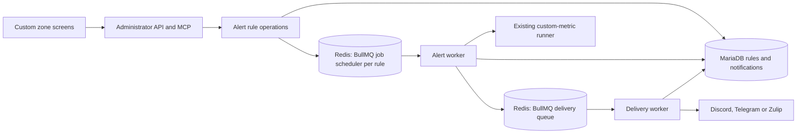

# Technical Design — Insight v3 Metric Alerts

**Approved:** Insight v3 custom metrics, administrator API and MCP, one numeric result per alert, per-rule interval checks, one current check after downtime, first-breach notifications without reminders or recovery messages, provider-neutral delivery, and BullMQ on the deployment's Redis as the job library ([ADR-0009](../ADR/0009-bullmq-schedules-alert-checks.md)).

**Flow:** an enabled rule is one repeating job; each run loads the rule, runs the stored metric as an on-demand run would, reads one number, records the outcome on the rule and, on the first breach, writes the notification it owes and queues it. A second queue hands each owed notification to its provider and records what the provider said.

**Version 0.6:** Add the portal screens: four routes in the Custom zone over the administrator API, with no behaviour of their own. Version 0.5 added delivery: a second queue, one adapter per provider, and the send outcome on the notification. Version 0.4 replaced the Apalis proposal with BullMQ and collapsed the state model to rules and notifications.

<!-- toc -->

- [1. Architecture Overview](#1-architecture-overview)
  - [1.1 Architectural Vision](#11-architectural-vision)
  - [1.2 Architecture Drivers](#12-architecture-drivers)
  - [1.3 Architecture Layers](#13-architecture-layers)
- [2. Principles & Constraints](#2-principles--constraints)
  - [2.1 Design Principles](#21-design-principles)
  - [2.2 Constraints](#22-constraints)
- [3. Technical Architecture](#3-technical-architecture)
  - [3.1 Domain Model](#31-domain-model)
  - [3.2 Component Model](#32-component-model)
  - [3.3 API Contracts](#33-api-contracts)
  - [3.4 Internal Dependencies](#34-internal-dependencies)
  - [3.5 External Dependencies](#35-external-dependencies)
  - [3.6 Interactions & Sequences](#36-interactions--sequences)
  - [3.7 Database Schemas & Tables](#37-database-schemas--tables)
  - [3.8 Deployment Topology](#38-deployment-topology)
- [4. Additional Context](#4-additional-context)
  - [Compatibility Findings](#compatibility-findings)
  - [Verification and Observability](#verification-and-observability)
  - [Resolved Decisions](#resolved-decisions)
- [5. Traceability](#5-traceability)

<!-- /toc -->

- [ ] `p1` - **ID**: `cpt-insightspec-v3-alerts-design-core`

## 1. Architecture Overview

### 1.1 Architectural Vision

Keep rules, what their checks found, and the notifications they owe in `insight-v3-core`'s MariaDB. Reuse its metric runner and administrator checks. BullMQ, on the Redis every deployment already runs, decides when a check runs, on which worker, and what happens when that worker dies. Redis holds nothing that cannot be rebuilt from the rules: at startup the schedule is made to say what the rules say.

A check carries the revision of the rule it was scheduled for, and the store records it only at that revision. A rule that was edited, disabled or removed while a check was in flight discards that check's result.

### 1.2 Architecture Drivers

The parent [separate-service ADR](../ADR/0001-separate-service.md) still applies. [ADR-0009](../ADR/0009-bullmq-schedules-alert-checks.md) records why BullMQ, and what was measured of the alternatives.

#### Functional Drivers

| Requirement | Design Response |
|-------------|-----------------|
| `cpt-insightspec-v3-alerts-fr-manage` | One set of rule operations behind the existing API and MCP authorization; every write bumps a revision, and an update names the revision it replaces |
| `cpt-insightspec-v3-alerts-fr-authorize` | Existing administrator guards; workers hold no user session and read only the rule |
| `cpt-insightspec-v3-alerts-fr-evaluate` | The existing metric run, unbucketed, read through a typed scalar boundary that accepts exactly one row and one column |
| `cpt-insightspec-v3-alerts-fr-schedule` | One BullMQ job scheduler per enabled rule, repeating every rule interval; a missed iteration is skipped, not queued |
| `cpt-insightspec-v3-alerts-fr-episodes` | The last valid finding on the rule row; a breach owes a notification only when the last valid finding was not a breach |
| `cpt-insightspec-v3-alerts-fr-deliver` | A notification row written in the same transaction as the check that owes it, then one delivery job keyed by the notification; unconfirmed sends fail the job so BullMQ retries with backoff, rejections and exhausted attempts are final |
| `cpt-insightspec-v3-alerts-fr-inspect` | The latest check on the rule; notifications listed per rule with status, attempts, last error and provider receipt |

#### NFR Allocation

| NFR ID | Allocated To | Design Response | Verification Approach |
|--------|--------------|-----------------|-----------------------|
| `cpt-insightspec-v3-alerts-nfr-durability` | Store and schedule | Check and notification in one transaction, revision fence, startup reconcile, BullMQ locks and stalled recovery | Live tests against MariaDB and Redis in CI |
| `cpt-insightspec-v3-alerts-nfr-timeliness` | Worker | Bounded concurrency; a check that outlives its lock on a dead worker is taken over; scheduling and check duration logged with the rule | Log fields per check; targets await synthetic load |
| `cpt-insightspec-v3-alerts-nfr-confidentiality` | Configuration, API and adapters | Destinations and their credentials in configuration as secrets, rules reference a name, reads answer name and provider only; credentials and the Redis URL are redacted from debug output; a provider's words are stored, never the request | Handler, configuration and adapter tests |
| `cpt-insightspec-v3-nfr-efficiency` | Worker | Bounded concurrency; notifications kept per rule capped | Compare synthetic resource use against the parent baseline |
| `cpt-insightspec-v3-nfr-reliability` | Service lifecycle | Worker stops on the gear's cancellation token; unfinished checks are recovered by the next worker | Existing service availability evidence plus the live tests |
| `cpt-insightspec-v3-nfr-performance` | Metric execution | Checks share the metric runner's timeouts and result bounds | Parent dashboard latency measurements under alert load |
| `cpt-insightspec-v3-nfr-security` | Dependencies | BullMQ is scanned like any dependency | No critical findings in required scans |
| `cpt-insightspec-v3-nfr-versatility` | Rule administration | Data-defined rules | Create another rule without code changes |

### 1.3 Architecture Layers

- [ ] `p1` - **ID**: `cpt-insightspec-v3-alerts-layers`



| Layer | Responsibility | Technology |
|-------|----------------|------------|
| Interface | Administrator operations and safe result presentation | Existing Rust REST and MCP integration; the portal's Custom zone screens over the REST routes |
| Application/domain | Rule lifecycle, scalar comparison, breach transition | Typed Rust operations in Insight v3 |
| Infrastructure | Durable state, schedule, metric execution, outbound messages | MariaDB, BullMQ on Redis, existing ClickHouse client, HTTP client per provider |

## 2. Principles & Constraints

### 2.1 Design Principles

#### Reuse Metric Meaning

- [ ] `p1` - **ID**: `cpt-insightspec-v3-alerts-principle-metric-parity`

Alerts use the same stored-definition compiler and runner as on-demand metrics, over the window the rule names and never bucketed. Check frequency does not change the metric's filters or its data window.

#### Facts Before Transport

- [ ] `p1` - **ID**: `cpt-insightspec-v3-alerts-principle-durable-intent`

What a check found and the notification it owes are written to MariaDB together. Redis carries only when the next check runs. Anything in Redis can be rebuilt from the rules; nothing in MariaDB depends on Redis.

### 2.2 Constraints

#### Approved Job Library

- [ ] `p1` - **ID**: `cpt-insightspec-v3-alerts-constraint-bullmq`

BullMQ through its official Rust port, on the deployment's Redis. Redis must persist: the schedule lives there, and a Redis that loses its data stops every check until the next reconcile rebuilds the schedule from the rules. The crate pins its own dependencies exactly, so the workspace inherits those versions ([ADR-0009](../ADR/0009-bullmq-schedules-alert-checks.md)).

#### Scope and Credentials

- [ ] `p1` - **ID**: `cpt-insightspec-v3-alerts-constraint-boundary`

Only Insight v3 custom metrics are checked. Rules do not depend on a specific provider. API and MCP keep their current administrator authorization. Destinations and their credentials are provisioned by the operator in configuration; a rule references one by name, a read answers the name and the provider, and only a provider adapter ever holds a credential. A credential travels in a request address or header, so a destination address must be `https` (loopback excepted, for a stand's mock).

## 3. Technical Architecture

### 3.1 Domain Model

| Entity | Identity | Invariant |
|--------|----------|-----------|
| Rule | A generated id, the handle every operation takes; a name people read, not unique; a revision bumped by every configuration write | One metric, one result column, one condition, one interval, one destination; the latest check's finding lives on the row |
| Check | Rule id plus revision, carried by the job | Recorded only while the rule is enabled at that revision |
| Notification | Its own id; references the rule and the revision that owed it | Carries the value, condition and time the check saw; a later edit to the rule rewrites nothing it says. Status is pending, cancelled, sent or failed; a send is recorded only while pending |
| Destination | A name in configuration | Names a provider and holds its credentials; the domain sees the name and provider |

A valid check is exactly one row and one named column holding a finite number comparable with the threshold. Anything else is unknown, with a reason: no rows, many rows, column missing, null, non-numeric, incomparable, metric missing, compile failed, run failed, timeout. An unknown check records itself on the rule and leaves the last valid finding as it was.

A notification is owed when a valid check finds the condition met and the last valid finding was not a breach. It is owed again only after a valid check has seen the condition clear.

A send ends one of three ways: the provider confirmed it and gave it an identity, the receipt; the provider rejected it and will keep rejecting it; or the outcome is unknown — a timeout, a rate limit, a server error, an answer not understood. Unknown is retried until the attempts run out; the message may therefore land twice. Rejection is final at once.

### 3.2 Component Model

#### Alert Rules

- [ ] `p1` - **ID**: `cpt-insightspec-v3-alerts-component-rules`

##### Why this component exists

API and MCP need identical rule behaviour.

##### Responsibility scope

Typed validation against the installation's bounds and destinations; create, replace at an expected revision, enable, disable, delete; list rules and their notifications. Every write lands in the store first and on the schedule second; the store's answer is the write's answer, and a schedule write that fails is logged and left to reconciling.

##### Responsibility boundaries

No metric query inside a write. The store decides revisions; the schedule is told the result.

##### Related components (by ID)

`cpt-insightspec-v3-alerts-component-store`, `cpt-insightspec-v3-alerts-component-schedule`.

#### Store

- [ ] `p1` - **ID**: `cpt-insightspec-v3-alerts-component-store`

##### Why this component exists

Rules and notifications must survive anything Redis does not.

##### Responsibility scope

Rules with their latest check; notifications with their status. A configuration write bumps the revision and forgets the checks made under the old one. Recording a check is one transaction: the rule's latest finding, and the notification it owes if any, land together or not at all. Disabling withdraws pending notifications; deleting removes the rule and everything recorded for it.

##### Responsibility boundaries

A check is recorded only for the revision it names and only while the rule is enabled; any other check is stale and discarded. A create inserts without reading first, so two creates of different names never wait on each other.

##### Related components (by ID)

`cpt-insightspec-v3-alerts-component-rules`, `cpt-insightspec-v3-alerts-component-worker`.

#### Schedule

- [ ] `p1` - **ID**: `cpt-insightspec-v3-alerts-component-schedule`

##### Why this component exists

Checks run when nobody is asking.

##### Responsibility scope

One BullMQ job scheduler per enabled rule, keyed by the rule id, repeating every rule interval, carrying the rule id and revision. Upsert replaces; remove withdraws. At startup, and every five minutes after, every enabled rule is upserted at its revision and every scheduler with no enabled rule is removed, so a rule write that reached the store but not the schedule is put right without a restart.

##### Responsibility boundaries

BullMQ owns locks, lock renewal, stalled-job recovery and iteration spacing: the next iteration is scheduled when the current one finishes, so a slow check never overlaps itself and a restart does not replay the iterations it missed.

##### Related components (by ID)

`cpt-insightspec-v3-alerts-component-worker`.

#### Worker

- [ ] `p1` - **ID**: `cpt-insightspec-v3-alerts-component-worker`

##### Why this component exists

Metric execution must not occupy administration requests.

##### Responsibility scope

Takes a check off the queue; loads the rule; stops if it is gone, disabled or at another revision; runs the metric; classifies the number; records the outcome through the store.

##### Responsibility boundaries

A metric that does not answer is a finding about the rule, recorded as unknown, not a failed job. Only a store that does not answer fails the job. Concurrency and the per-check lock come from configuration.

##### Related components (by ID)

`cpt-insightspec-v3-alerts-component-store`, `cpt-insightspec-v3-alerts-component-delivery`.

#### Delivery

- [ ] `p1` - **ID**: `cpt-insightspec-v3-alerts-component-delivery`

##### Why this component exists

Provider failures must not touch the check or the rule.

##### Responsibility scope

One BullMQ queue, one job per notification keyed by its id, with the configured attempts and a doubling backoff. The delivery worker loads the notification, stops if it is not pending, builds the one-line message, sends it through the destination's adapter, and records the outcome: sent with the receipt, pending with the error when a retry follows, failed when the provider rejected it or the attempts are spent. At startup, and every five minutes after, every pending notification is queued again; the job id makes that idempotent.

##### Responsibility boundaries

Never reruns the metric. A destination removed from configuration rejects the send. Adapters: Discord posts to the webhook with `wait=true` and no mentions, and reads the created message id; Telegram calls `sendMessage` and reads `result.message_id`; Zulip posts to a stream topic with basic authentication and reads `id`. Each treats 429 and 5xx as unknown, other 4xx as rejection, and a body it does not understand as unknown.

##### Related components (by ID)

`cpt-insightspec-v3-alerts-component-store`.

### 3.3 API Contracts

- [ ] `p1` - **ID**: `cpt-insightspec-v3-alerts-interface-rest`

Administration follows `cpt-insightspec-v3-alerts-interface-administration`. The REST contract is the service's OpenAPI document; the MCP tools mirror it.

| Operation | Request | Response | Permission |
|-----------|---------|----------|------------|
| `POST /v1/alerts` | Name, metric, column, operator, threshold, optional range, interval, destination, enabled | The rule with its id, revision and state | Administrator |
| `PUT /v1/alerts/{id}` | The whole rule again, with `expected_revision` | The rule at its next revision | Administrator |
| `GET /v1/alerts/{id}` | — | The rule with its revision and latest check | Administrator |
| `GET /v1/alerts` | Optional search over name and metric, and page | One page of id, name, metric and enabled, and a total | Administrator |
| `DELETE /v1/alerts/{id}` | — | No content | Administrator |
| `POST /v1/alerts/{id}/enable`, `/disable` | `expected_revision` | The rule | Administrator |
| `GET /v1/alerts/{id}/notifications` | Page | Notifications, newest first, with status, attempts, last error and provider receipt | Administrator |
| `GET /v1/alert-destinations` | — | Names and providers | Administrator |

Refusals distinguish an invalid rule, a missing metric or alert, a revision conflict, the rule limit, and an installation with alerts off. An id that is malformed names no alert and answers the same as one that is absent. No login, SSO or MFA mechanism is added.

#### Portal Screens

- [ ] `p1` - **ID**: `cpt-insightspec-v3-alerts-interface-portal`

The portal reaches the same routes from four pages under the Custom zone's catalogue, behind its administrator gate. The pages hold no rule logic: validation mirrors the API's bounds so a refusal is rare, and when one arrives it lands on the field it names.

| Page | Route | Reads | Writes |
|------|-------|-------|--------|
| List | `/portal/custom/alerts` | `GET /v1/alerts`, searched and paged | enable and disable, after reading the rule for its revision |
| New | `/portal/custom/alerts/new` | metrics catalogue, the picked metric's definition for its columns, `GET /v1/alert-destinations`, one metric run for the current value | `POST /v1/alerts` |
| Alert | `/portal/custom/alerts/{id}` | `GET /v1/alerts/{id}`, `GET /v1/alerts/{id}/notifications` | enable, disable, delete |
| Edit | `/portal/custom/alerts/{id}/edit` | the rule, read after the page mounts, then what New reads | `PUT /v1/alerts/{id}` with `expected_revision` |

A save or toggle that lost a race keeps the input and offers the latest version instead of overwriting it. The list carries no check status because the list route carries none; the latest check is on the alert's page.

### 3.4 Internal Dependencies

| Dependency | Interface Used | Purpose |
|------------|----------------|---------|
| [Metric runs](../../../../../src/backend/services/insight-v3-core/src/domain/metric_run.rs) | The stored-metric run over a window request | The same execution an on-demand run has |
| [Metric query](../../../../../src/backend/services/insight-v3-core/src/domain/query/metric_query.rs) | Compiler and runner | Existing fetch timeout and result bound |
| [API authorization](../../../../../src/backend/services/insight-v3-core/src/api/mod.rs) | Administrator identity check | REST authority |
| [MCP authorization](../../../../../src/backend/services/insight-v3-core/src/mcp/auth.rs) | Validated token and administrator role | MCP authority |
| [Definition storage](../../../../../src/backend/services/insight-v3-core/src/store/definitions/sql/001_definitions.sql) | Stored metric body by name | A rule names a metric that exists; a check runs the metric as stored at check time |

A metric edit takes effect at the next check without resetting the rule; only a rule edit resets what its checks found. Definitions carry no revision, and versioning them is a feature of its own.

### 3.5 External Dependencies

| Dependency | Integration | Boundary |
|------------|-------------|----------|
| BullMQ | The `bullmq-official` crate; one queue, one scheduler per rule | Redis 6.2 or later; persistence required |
| MariaDB | Two tables in the service's existing database and migration ledger | Existing SeaORM connection |
| ClickHouse | Existing custom-metric runner | Existing read-only restrictions and result limits |
| Discord | Incoming webhook, `POST {webhook_url}?wait=true` | Rate limits answered as 429; the webhook's channel membership is Discord's |
| Telegram | Bot API `sendMessage` | The bot must be a member of the chat; rate limits answered as 429 |
| Zulip | `POST /api/v1/messages` with bot credentials | The bot must be subscribed to the stream |

### 3.6 Interactions & Sequences

#### Scheduled Check

**ID**: `cpt-insightspec-v3-alerts-seq-check`

**Use cases**: `cpt-insightspec-v3-alerts-usecase-monitor`
**Actors**: `cpt-insightspec-v3-alerts-actor-admin`

```mermaid
sequenceDiagram
    participant A as Administrator
    participant R as Alert rules
    participant DB as MariaDB
    participant Q as BullMQ (Redis)
    participant W as Worker
    participant M as Metric runner
    A->>R: Put rule
    R->>DB: Insert or replace at expected revision
    R->>Q: Upsert scheduler rule:{id} every interval, data {id, revision}
    Q->>W: Check {id, revision}
    W->>DB: Load rule
    W->>M: Run metric, unbucketed
    M-->>W: Rows or failure
    W->>DB: Record outcome at revision; insert notification if owed
    W->>Q: Queue delivery keyed by notification id
    Q->>Q: Schedule the next iteration
    participant S as Delivery worker
    participant P as Provider
    Q->>S: Send {notification id}
    S->>DB: Load notification, skip unless pending
    S->>P: One message
    P-->>S: Receipt, rejection or nothing usable
    S->>DB: Record sent, pending with error, or failed
```

Recovery rules:

- A worker that dies mid-check leaves a job BullMQ marks stalled; another worker takes it after the lock lapses. The check and the notification it owes commit in one transaction: if the first attempt committed, the retry finds the breach recorded and owes nothing more; if it did not, the retry is the first check.
- A check for a replaced or disabled revision is discarded.
- After downtime, the scheduler runs the next iteration once; the iterations missed are skipped.
- At startup and every five minutes, the schedule is reconciled from the rules: enabled rules are upserted at their revision, schedulers without a rule are removed. A reconcile that fails is logged; the service starts and the next one tries again.

### 3.7 Database Schemas & Tables

- [ ] `p1` - **ID**: `cpt-insightspec-v3-alerts-db-state`

Both tables live in the service's existing MariaDB database and migration ledger. Column lists are in the migration script.

#### Table: alert rules

Rule id, name, metric, column, operator, threshold as text so an integer stays exact, optional range, interval, destination, enabled, revision, and the latest check: when, outcome, reason, value, the last valid finding, when the current breach began.

#### Table: alert notifications

Notification id, rule id and revision, the rule name, metric, column, condition and value the check saw, when it was evaluated, the destination, status (`pending`, `cancelled`, `sent`, `failed`), attempts, the last error in the provider's words, and the provider receipt. Indexed by rule and time; the newest N per rule are kept, and a pending notification is never dropped.

BullMQ owns its keys in Redis under its own prefix. A finished check is kept there for inspection only up to a fixed count per outcome; a finished delivery job is removed at once, so that queuing a notification again after reconciling is never swallowed by the job it had before.

### 3.8 Deployment Topology

- [ ] `p1` - **ID**: `cpt-insightspec-v3-alerts-topology-workers`

The worker runs inside every `insight-v3-core` replica, started after the state is built and stopped on the gear's cancellation token. Replicas coordinate through BullMQ's locks; a check runs on one of them. Alerts are off unless the configuration names a Redis; with them off, the routes answer that the installation has none.

Configuration: `alerts.enabled`, `alerts.redis_url`, `alerts.destinations.<name>` with `provider` and its fields (Discord `webhook_url`; Telegram `bot_token`, `chat_id`; Zulip `site_url`, `bot_email`, `api_key`, `stream`, `topic`), and the bounds `min_interval_secs`, `max_interval_secs`, `max_rules`, `evaluation_concurrency`, `evaluation_lock_secs`, `notifications_kept_per_rule`, `delivery_attempts`, `delivery_backoff_secs`, `delivery_timeout_secs`, `delivery_concurrency`.

In the Helm chart, `insightV3Core.alerts.enabled` and `insightV3Core.alerts.redis` turn alerts on and point them at Redis; the pod assembles the Redis URL from the host and the password Secret, so the password stays in the one Secret it is sealed in. Destinations come either from `insightV3Core.alerts.destinations` in values, rendered into the config Secret when the chart generates credentials, or from a Secret the operator seals and names in `insightV3Core.alerts.existingSecret`, which is how a gitops environment supplies them.

## 4. Additional Context

### Compatibility Findings

The alternatives were run, not read, against a local MariaDB and Redis before BullMQ was chosen; [ADR-0009](../ADR/0009-bullmq-schedules-alert-checks.md) records what each did. Two facts shaped the outcome: a MySQL-backed job library needs a second SQL driver beside SeaORM's, and no Apalis release recovers correctly from a worker dying mid-job.

### Verification and Observability

- Pure tests for number comparison, scalar classification, the breach transition and draft validation.
- Live MariaDB tests for revisions, conflicts, one notification per breach, stale checks, withdrawal on disable and the kept count.
- Live Redis tests for one scheduler per rule, for a worker taking a scheduled check through the metric runner to a recorded and queued notification, and for delivery: sent once with a receipt, retried after an unconfirmed answer, failed after the last attempt.
- Adapter tests against a local server playing each provider: acceptance, rate limit, rejection, server error, an answer not understood, and no answer in time.
- Handler tests for every route's authorization, validation and revision handling; an MCP tool-list test.
- Component and story tests for the portal screens: draft validation and the current-value preview, the conflict flow, list and notification paging, the switch's optimistic state, and phone-width layout.

Every check logs the rule, revision, outcome, reason, whether a notification was owed, and its duration. Every send logs the notification, attempt, and receipt or reason. Redis persistence, worker health and failed notifications are operator signals.

### Resolved Decisions

| Decision | Outcome |
|----------|---------|
| Job library | BullMQ on Redis ([ADR-0009](../ADR/0009-bullmq-schedules-alert-checks.md)) |
| D3 first providers | Discord, Telegram and Zulip, one adapter each behind one provider interface |
| D4 numbers | Exactly one row and one column; `>`, `>=`, `<`, `<=`; integers exact, floats as `f64`, mixed only where exact |
| D5 unknown | Keeps the last valid finding; records time and reason; no freshness condition |
| D6 edits | Revision per write, `expected_revision` on update; edit or enable resets the finding; disable withdraws pending notifications; delete removes everything |
| D7 limits | Interval 60 s to 7 d, 200 rules, concurrency 4, check lock 60 s, 200 notifications kept per rule, 5 delivery attempts from 30 s doubling, 10 s provider call, 4 concurrent sends; all configurable |
| D8 destinations | Operator-provisioned names with a provider and its credentials in configuration; one-line message; per-administrator destinations later behind the same interface |
| Evaluation history | Latest check on the rule only; history is the notifications |
| Metric snapshot | None; a metric edit applies at the next check |

## 5. Traceability

- **Local PRD**: [Metric Alerts](./PRD.md).
- **Parent PRD**: [Insight v3](../PRD.md), specifically `cpt-insightspec-v3-fr-create-alerts` and the inherited quality requirements.
- **Parent DESIGN**: [Insight v3](../DESIGN.md).
- **Applicable ADRs**: [Separate service](../ADR/0001-separate-service.md), [BullMQ schedules the alert checks](../ADR/0009-bullmq-schedules-alert-checks.md).
- **Implementation**: `src/backend/services/insight-v3-core/src/domain/alerts`, `store/alerts.rs`, `store/alert_schedule.rs`, `store/providers`, `api/alerts.rs`, `mcp/alerts.rs`; portal screens in `src/frontend/src/components/alerts`, `src/frontend/src/lib/alerts`, `src/frontend/src/queries/alerts.ts` and the `portal.custom.alerts.*` routes.
