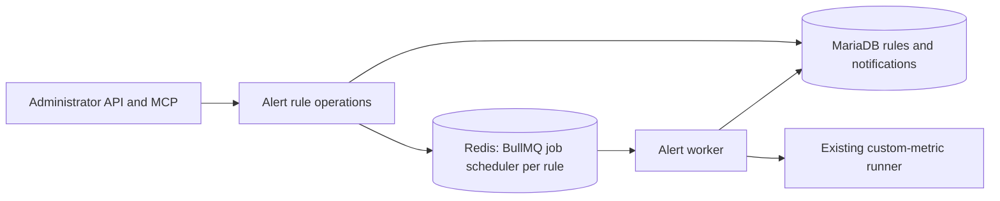

# Technical Design — Insight v3 Metric Alerts

**Approved:** Insight v3 custom metrics, administrator API and MCP, one numeric result per alert, per-rule interval checks, one current check after downtime, first-breach notifications without reminders or recovery messages, provider-neutral delivery, and BullMQ on the deployment's Redis as the job library ([ADR-0009](../ADR/0009-bullmq-schedules-alert-checks.md)).

**Flow:** an enabled rule is one repeating job; each run loads the rule, runs the stored metric as an on-demand run would, reads one number, records the outcome on the rule and, on the first breach, writes the notification it owes. Delivering that notification is a later release.

**Version 0.4:** Replace the Apalis proposal with BullMQ, collapse the state model to rules and notifications, and record the resolved decisions.

<!-- toc -->

- [1. Architecture Overview](#1-architecture-overview)
  - [1.1 Architectural Vision](#11-architectural-vision)
  - [1.2 Architecture Drivers](#12-architecture-drivers)
  - [1.3 Architecture Layers](#13-architecture-layers)
- [2. Principles & Constraints](#2-principles--constraints)
  - [2.1 Design Principles](#21-design-principles)
  - [2.2 Constraints](#22-constraints)
- [3. Technical Architecture](#3-technical-architecture)
  - [3.1 Domain Model](#31-domain-model)
  - [3.2 Component Model](#32-component-model)
  - [3.3 API Contracts](#33-api-contracts)
  - [3.4 Internal Dependencies](#34-internal-dependencies)
  - [3.5 External Dependencies](#35-external-dependencies)
  - [3.6 Interactions & Sequences](#36-interactions--sequences)
  - [3.7 Database Schemas & Tables](#37-database-schemas--tables)
  - [3.8 Deployment Topology](#38-deployment-topology)
- [4. Additional Context](#4-additional-context)
  - [Compatibility Findings](#compatibility-findings)
  - [Verification and Observability](#verification-and-observability)
  - [Resolved Decisions](#resolved-decisions)
- [5. Traceability](#5-traceability)

<!-- /toc -->

- [ ] `p1` - **ID**: `cpt-insightspec-v3-alerts-design-core`

## 1. Architecture Overview

### 1.1 Architectural Vision

Keep rules, what their checks found, and the notifications they owe in `insight-v3-core`'s MariaDB. Reuse its metric runner and administrator checks. BullMQ, on the Redis every deployment already runs, decides when a check runs, on which worker, and what happens when that worker dies. Redis holds nothing that cannot be rebuilt from the rules: at startup the schedule is made to say what the rules say.

A check carries the revision of the rule it was scheduled for, and the store records it only at that revision. A rule that was edited, disabled or removed while a check was in flight discards that check's result.

### 1.2 Architecture Drivers

The parent [separate-service ADR](../ADR/0001-separate-service.md) still applies. [ADR-0009](../ADR/0009-bullmq-schedules-alert-checks.md) records why BullMQ, and what was measured of the alternatives.

#### Functional Drivers

| Requirement | Design Response |
|-------------|-----------------|
| `cpt-insightspec-v3-alerts-fr-manage` | One set of rule operations behind the existing API and MCP authorization; every write bumps a revision, and an update names the revision it replaces |
| `cpt-insightspec-v3-alerts-fr-authorize` | Existing administrator guards; workers hold no user session and read only the rule |
| `cpt-insightspec-v3-alerts-fr-evaluate` | The existing metric run, unbucketed, read through a typed scalar boundary that accepts exactly one row and one column |
| `cpt-insightspec-v3-alerts-fr-schedule` | One BullMQ job scheduler per enabled rule, repeating every rule interval; a missed iteration is skipped, not queued |
| `cpt-insightspec-v3-alerts-fr-episodes` | The last valid finding on the rule row; a breach owes a notification only when the last valid finding was not a breach |
| `cpt-insightspec-v3-alerts-fr-deliver` | A notification row written in the same transaction as the check that owes it; delivery reads that row, in a later release |
| `cpt-insightspec-v3-alerts-fr-inspect` | The latest check on the rule; notifications listed per rule with their status |

#### NFR Allocation

| NFR ID | Allocated To | Design Response | Verification Approach |
|--------|--------------|-----------------|-----------------------|
| `cpt-insightspec-v3-alerts-nfr-durability` | Store and schedule | Check and notification in one transaction, revision fence, startup reconcile, BullMQ locks and stalled recovery | Live tests against MariaDB and Redis in CI |
| `cpt-insightspec-v3-alerts-nfr-timeliness` | Worker | Bounded concurrency and a per-check lock; scheduling and check duration logged with the rule | Log fields per check; targets await synthetic load |
| `cpt-insightspec-v3-alerts-nfr-confidentiality` | Configuration and API | Destinations named in configuration, rules reference a name, reads answer name and provider only; the Redis URL is redacted from debug output | Handler and configuration tests |
| `cpt-insightspec-v3-nfr-efficiency` | Worker | Bounded concurrency; notifications kept per rule capped | Compare synthetic resource use against the parent baseline |
| `cpt-insightspec-v3-nfr-reliability` | Service lifecycle | Worker stops on the gear's cancellation token; unfinished checks are recovered by the next worker | Existing service availability evidence plus the live tests |
| `cpt-insightspec-v3-nfr-performance` | Metric execution | Checks share the metric runner's timeouts and result bounds | Parent dashboard latency measurements under alert load |
| `cpt-insightspec-v3-nfr-security` | Dependencies | The vendored BullMQ copy is scanned like any dependency | No critical findings in required scans |
| `cpt-insightspec-v3-nfr-versatility` | Rule administration | Data-defined rules | Create another rule without code changes |

### 1.3 Architecture Layers

- [ ] `p1` - **ID**: `cpt-insightspec-v3-alerts-layers`



| Layer | Responsibility | Technology |
|-------|----------------|------------|
| Interface | Administrator operations and safe result presentation | Existing Rust REST and MCP integration |
| Application/domain | Rule lifecycle, scalar comparison, breach transition | Typed Rust operations in Insight v3 |
| Infrastructure | Durable state, schedule, metric execution | MariaDB, BullMQ on Redis, existing ClickHouse client |

## 2. Principles & Constraints

### 2.1 Design Principles

#### Reuse Metric Meaning

- [ ] `p1` - **ID**: `cpt-insightspec-v3-alerts-principle-metric-parity`

Alerts use the same stored-definition compiler and runner as on-demand metrics, over the window the rule names and never bucketed. Check frequency does not change the metric's filters or its data window.

#### Facts Before Transport

- [ ] `p1` - **ID**: `cpt-insightspec-v3-alerts-principle-durable-intent`

What a check found and the notification it owes are written to MariaDB together. Redis carries only when the next check runs. Anything in Redis can be rebuilt from the rules; nothing in MariaDB depends on Redis.

### 2.2 Constraints

#### Approved Job Library

- [ ] `p1` - **ID**: `cpt-insightspec-v3-alerts-constraint-bullmq`

BullMQ through its official Rust port, on the deployment's Redis. Redis must persist: the schedule lives there, and a Redis that loses its data stops every check until the next startup reconciles the schedule from the rules. The published crate is carried as a vendored copy with relaxed version requirements ([ADR-0009](../ADR/0009-bullmq-schedules-alert-checks.md)).

#### Scope and Credentials

- [ ] `p1` - **ID**: `cpt-insightspec-v3-alerts-constraint-boundary`

Only Insight v3 custom metrics are checked. Rules do not depend on a specific provider. API and MCP keep their current administrator authorization. Destinations are provisioned by the operator in configuration; a rule references one by name, and a read answers the name and the provider, never a credential.

## 3. Technical Architecture

### 3.1 Domain Model

| Entity | Identity | Invariant |
|--------|----------|-----------|
| Rule | Stable id and a unique name; a revision bumped by every configuration write | One metric, one result column, one condition, one interval, one destination; the latest check's finding lives on the row |
| Check | Rule id plus revision, carried by the job | Recorded only while the rule is enabled at that revision |
| Notification | Its own id; references the rule and the revision that owed it | Carries the value, condition and time the check saw; a later edit to the rule rewrites nothing it says |
| Destination | A name in configuration | Names a provider; credentials are not part of the domain |

A valid check is exactly one row and one named column holding a finite number comparable with the threshold. Anything else is unknown, with a reason: no rows, many rows, column missing, null, non-numeric, incomparable, metric missing, compile failed, run failed, timeout. An unknown check records itself on the rule and leaves the last valid finding as it was.

A notification is owed when a valid check finds the condition met and the last valid finding was not a breach. It is owed again only after a valid check has seen the condition clear.

### 3.2 Component Model

#### Alert Rules

- [ ] `p1` - **ID**: `cpt-insightspec-v3-alerts-component-rules`

##### Why this component exists

API and MCP need identical rule behaviour.

##### Responsibility scope

Typed validation against the installation's bounds and destinations; create, replace at an expected revision, enable, disable, delete; list rules and their notifications. Every write lands in the store first and on the schedule second.

##### Responsibility boundaries

No metric query inside a write. The store decides revisions; the schedule is told the result.

##### Related components (by ID)

`cpt-insightspec-v3-alerts-component-store`, `cpt-insightspec-v3-alerts-component-schedule`.

#### Store

- [ ] `p1` - **ID**: `cpt-insightspec-v3-alerts-component-store`

##### Why this component exists

Rules and notifications must survive anything Redis does not.

##### Responsibility scope

Rules with their latest check; notifications with their status. A configuration write bumps the revision and forgets the checks made under the old one. Recording a check is one transaction: the rule's latest finding, and the notification it owes if any, land together or not at all. Disabling withdraws pending notifications; deleting removes the rule and everything recorded for it.

##### Responsibility boundaries

A check is recorded only for the revision it names and only while the rule is enabled; any other check is stale and discarded. A create inserts without reading first, so two creates of different names never wait on each other.

##### Related components (by ID)

`cpt-insightspec-v3-alerts-component-rules`, `cpt-insightspec-v3-alerts-component-worker`.

#### Schedule

- [ ] `p1` - **ID**: `cpt-insightspec-v3-alerts-component-schedule`

##### Why this component exists

Checks run when nobody is asking.

##### Responsibility scope

One BullMQ job scheduler per enabled rule, keyed by the rule id, repeating every rule interval, carrying the rule id and revision. Upsert replaces; remove withdraws. At startup, every enabled rule is upserted at its revision and every scheduler with no enabled rule is removed.

##### Responsibility boundaries

BullMQ owns locks, lock renewal, stalled-job recovery and iteration spacing: the next iteration is scheduled when the current one finishes, so a slow check never overlaps itself and a restart does not replay the iterations it missed.

##### Related components (by ID)

`cpt-insightspec-v3-alerts-component-worker`.

#### Worker

- [ ] `p1` - **ID**: `cpt-insightspec-v3-alerts-component-worker`

##### Why this component exists

Metric execution must not occupy administration requests.

##### Responsibility scope

Takes a check off the queue; loads the rule; stops if it is gone, disabled or at another revision; runs the metric; classifies the number; records the outcome through the store.

##### Responsibility boundaries

A metric that does not answer is a finding about the rule, recorded as unknown, not a failed job. Only a store that does not answer fails the job. Concurrency and the per-check lock come from configuration.

##### Related components (by ID)

`cpt-insightspec-v3-alerts-component-store`.

### 3.3 API Contracts

- [ ] `p1` - **ID**: `cpt-insightspec-v3-alerts-interface-rest`

Administration follows `cpt-insightspec-v3-alerts-interface-administration`. The REST contract is the service's OpenAPI document; the MCP tools mirror it.

| Operation | Request | Response | Permission |
|-----------|---------|----------|------------|
| `PUT /v1/alerts/{name}` | Metric, column, operator, threshold, optional range, interval, destination, enabled; `expected_revision` to replace | The rule with its revision and state | Administrator |
| `GET /v1/alerts/{name}` | — | The rule with its revision and latest check | Administrator |
| `GET /v1/alerts` | Optional search and page | One page of names and a total | Administrator |
| `DELETE /v1/alerts/{name}` | — | No content | Administrator |
| `POST /v1/alerts/{name}/enable`, `/disable` | `expected_revision` | The rule | Administrator |
| `GET /v1/alerts/{name}/notifications` | Page | Notifications, newest first, with status | Administrator |
| `GET /v1/alert-destinations` | — | Names and providers | Administrator |

Refusals distinguish an invalid rule, a missing metric or alert, a name already taken, a revision conflict, the rule limit, and an installation with alerts off. No login, SSO or MFA mechanism is added.

### 3.4 Internal Dependencies

| Dependency | Interface Used | Purpose |
|------------|----------------|---------|
| [Metric runs](../../../../../src/backend/services/insight-v3-core/src/domain/metric_run.rs) | The stored-metric run over a window request | The same execution an on-demand run has |
| [Metric query](../../../../../src/backend/services/insight-v3-core/src/domain/query/metric_query.rs) | Compiler and runner | Existing fetch timeout and result bound |
| [API authorization](../../../../../src/backend/services/insight-v3-core/src/api/mod.rs) | Administrator identity check | REST authority |
| [MCP authorization](../../../../../src/backend/services/insight-v3-core/src/mcp/auth.rs) | Validated token and administrator role | MCP authority |
| [Definition storage](../../../../../src/backend/services/insight-v3-core/src/store/definitions/sql/001_definitions.sql) | Stored metric body by name | A rule names a metric that exists; a check runs the metric as stored at check time |

A metric edit takes effect at the next check without resetting the rule; only a rule edit resets what its checks found. Definitions carry no revision, and versioning them is a feature of its own.

### 3.5 External Dependencies

| Dependency | Integration | Boundary |
|------------|-------------|----------|
| BullMQ | Vendored `bullmq-official` crate; one queue, one scheduler per rule | Redis 6.2 or later; persistence required |
| MariaDB | Two tables in the service's existing database and migration ledger | Existing SeaORM connection |
| ClickHouse | Existing custom-metric runner | Existing read-only restrictions and result limits |
| Notification providers | Not integrated in this release | Destinations are named and typed in configuration; delivery arrives with the providers |

### 3.6 Interactions & Sequences

#### Scheduled Check

**ID**: `cpt-insightspec-v3-alerts-seq-check`

**Use cases**: `cpt-insightspec-v3-alerts-usecase-monitor`
**Actors**: `cpt-insightspec-v3-alerts-actor-admin`

```mermaid
sequenceDiagram
    participant A as Administrator
    participant R as Alert rules
    participant DB as MariaDB
    participant Q as BullMQ (Redis)
    participant W as Worker
    participant M as Metric runner
    A->>R: Put rule
    R->>DB: Insert or replace at expected revision
    R->>Q: Upsert scheduler rule:{id} every interval, data {id, revision}
    Q->>W: Check {id, revision}
    W->>DB: Load rule
    W->>M: Run metric, unbucketed
    M-->>W: Rows or failure
    W->>DB: Record outcome at revision; insert notification if owed
    Q->>Q: Schedule the next iteration
```

Recovery rules:

- A worker that dies mid-check leaves a job BullMQ marks stalled; another worker takes it after the lock lapses. The store accepts a repeated check for the same revision, and a breach already recorded owes nothing more.
- A check for a replaced or disabled revision is discarded.
- After downtime, the scheduler runs the next iteration once; the iterations missed are skipped.
- At startup, the schedule is reconciled from the rules: enabled rules are upserted at their revision, schedulers without a rule are removed.

### 3.7 Database Schemas & Tables

- [ ] `p1` - **ID**: `cpt-insightspec-v3-alerts-db-state`

Both tables live in the service's existing MariaDB database and migration ledger. Column lists are in the migration script.

#### Table: alert rules

Rule id, unique name, metric, column, operator, threshold as text so an integer stays exact, optional range, interval, destination, enabled, revision, and the latest check: when, outcome, reason, value, the last valid finding, when the current breach began.

#### Table: alert notifications

Notification id, rule id and revision, the rule name, metric, column, condition and value the check saw, when it was evaluated, the destination, status (`pending` or `cancelled` in this release), attempts, last error and provider receipt for delivery. Indexed by rule and time; the newest N per rule are kept.

BullMQ owns its keys in Redis under its own prefix.

### 3.8 Deployment Topology

- [ ] `p1` - **ID**: `cpt-insightspec-v3-alerts-topology-workers`

The worker runs inside every `insight-v3-core` replica, started after the state is built and stopped on the gear's cancellation token. Replicas coordinate through BullMQ's locks; a check runs on one of them. Alerts are off unless the configuration names a Redis; with them off, the routes answer that the installation has none.

Configuration: `alerts.enabled`, `alerts.redis_url`, `alerts.destinations.<name>.provider`, and the bounds `min_interval_secs`, `max_interval_secs`, `max_rules`, `evaluation_concurrency`, `evaluation_timeout_secs`, `notifications_kept_per_rule`.

## 4. Additional Context

### Compatibility Findings

The alternatives were run, not read, against a local MariaDB and Redis before BullMQ was chosen; [ADR-0009](../ADR/0009-bullmq-schedules-alert-checks.md) records what each did. Two facts shaped the outcome: a MySQL-backed job library needs a second SQL driver beside SeaORM's, and no Apalis release recovers correctly from a worker dying mid-job.

### Verification and Observability

- Pure tests for number comparison, scalar classification, the breach transition and draft validation.
- Live MariaDB tests for revisions, conflicts, one notification per breach, stale checks, withdrawal on disable and the kept count.
- Live Redis tests for one scheduler per rule and for a worker taking a scheduled check through the metric runner to a recorded notification.
- Handler tests for every route's authorization, validation and revision handling; an MCP tool-list test.

Every check logs the rule, revision, outcome, reason, whether a notification was owed, and its duration. Redis persistence and worker health are operator signals.

### Resolved Decisions

| Decision | Outcome |
|----------|---------|
| Job library | BullMQ on Redis ([ADR-0009](../ADR/0009-bullmq-schedules-alert-checks.md)) |
| D3 first providers | None in this release: the notification is owed and visible; delivery and providers follow |
| D4 numbers | Exactly one row and one column; `>`, `>=`, `<`, `<=`; integers exact, floats as `f64`, mixed only where exact |
| D5 unknown | Keeps the last valid finding; records time and reason; no freshness condition |
| D6 edits | Revision per write, `expected_revision` on update; edit or enable resets the finding; disable withdraws pending notifications; delete removes everything |
| D7 limits | Interval 60 s to 7 d, 200 rules, concurrency 4, check lock 60 s, 200 notifications kept per rule; all configurable |
| D8 destinations | Operator-provisioned names with a provider in configuration; per-administrator destinations later behind the same interface |
| Evaluation history | Latest check on the rule only; history is the notifications |
| Metric snapshot | None; a metric edit applies at the next check |

## 5. Traceability

- **Local PRD**: [Metric Alerts](./PRD.md).
- **Parent PRD**: [Insight v3](../PRD.md), specifically `cpt-insightspec-v3-fr-create-alerts` and the inherited quality requirements.
- **Parent DESIGN**: [Insight v3](../DESIGN.md).
- **Applicable ADRs**: [Separate service](../ADR/0001-separate-service.md), [BullMQ schedules the alert checks](../ADR/0009-bullmq-schedules-alert-checks.md).
- **Implementation**: `src/backend/services/insight-v3-core/src/domain/alerts`, `store/alerts.rs`, `store/alert_schedule.rs`, `api/alerts.rs`, `mcp/alerts.rs`.
