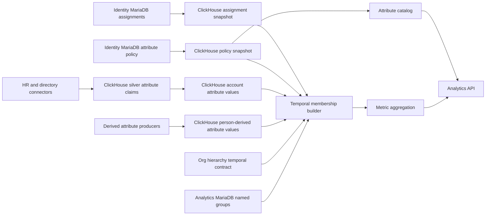
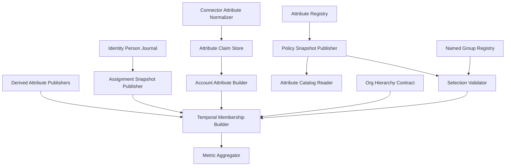
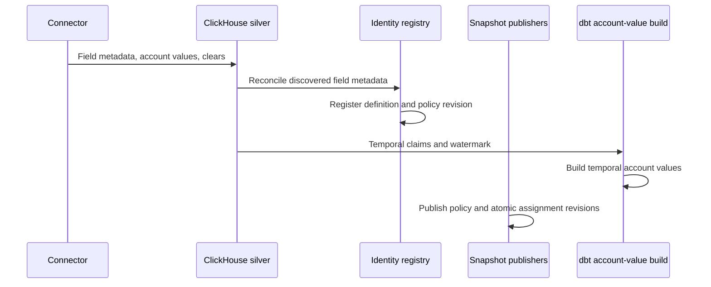
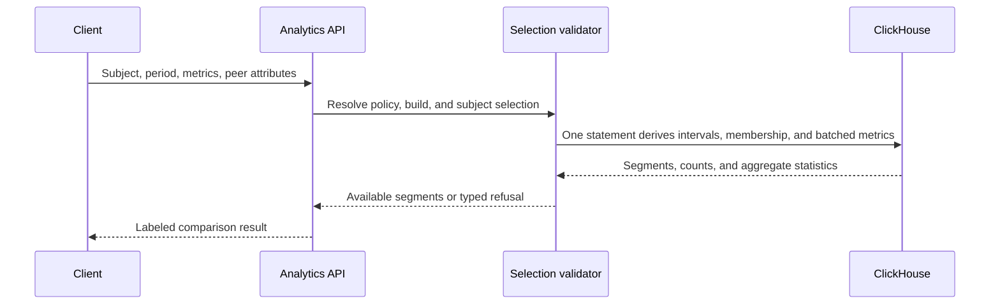
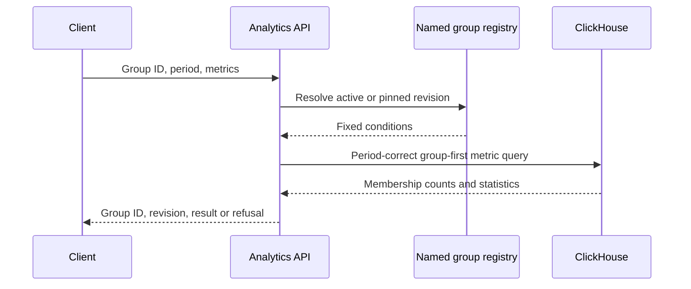

# Technical Design — Person Attributes and Cohorting

<!-- toc -->

- [Changelog](#changelog)
- [1. Architecture Overview](#1-architecture-overview)
  - [1.1 Architectural Vision](#11-architectural-vision)
  - [1.2 Architecture Drivers](#12-architecture-drivers)
  - [1.3 Architecture Layers](#13-architecture-layers)
- [2. Principles & Constraints](#2-principles--constraints)
  - [2.1 Design Principles](#21-design-principles)
  - [2.2 Constraints](#22-constraints)
- [3. Technical Architecture](#3-technical-architecture)
  - [3.1 Domain Model](#31-domain-model)
  - [3.2 Component Model](#32-component-model)
  - [3.3 API Contracts](#33-api-contracts)
  - [3.4 Internal Dependencies](#34-internal-dependencies)
  - [3.5 External Dependencies](#35-external-dependencies)
  - [3.6 Interactions & Sequences](#36-interactions--sequences)
  - [3.7 Database Schemas & Tables](#37-database-schemas--tables)
  - [3.8 Deployment Topology](#38-deployment-topology)
- [4. Additional Context](#4-additional-context)
  - [4.1 Identity Integration and Transition](#41-identity-integration-and-transition)
  - [4.2 Temporal Semantics](#42-temporal-semantics)
  - [4.3 Group Condition Semantics](#43-group-condition-semantics)
  - [4.4 Availability and Refusal Model](#44-availability-and-refusal-model)
  - [4.5 Security and Privacy](#45-security-and-privacy)
  - [4.6 Performance, Capacity, and Cost](#46-performance-capacity-and-cost)
  - [4.7 Reliability and Operations](#47-reliability-and-operations)
  - [4.8 Maintainability and Verification Strategy](#48-maintainability-and-verification-strategy)
  - [4.9 Scope Boundaries and Known Limitations](#49-scope-boundaries-and-known-limitations)
  - [4.10 Applicability Notes](#410-applicability-notes)
  - [4.11 Epic Acceptance Traceability](#411-epic-acceptance-traceability)

<!-- /toc -->

- [ ] `p1` - **ID**: `cpt-person-attributes-design-cohorting`
## Changelog

- **v1.0**: Initial design for connector-discovered person attributes, temporal history, grouping, people-like comparison, and fixed named groups.

## 1. Architecture Overview

### 1.1 Architectural Vision

The subsystem makes identity attributes usable by analytics without turning Identity into an analytical datastore. Connector-provided attribute claims and their history remain source-account-scoped in ClickHouse, where ingestion already lands source data. Person-scoped derived producers publish temporal values against canonical person IDs. Both forms normalize into one person-grain membership relation before metrics are aggregated. Identity MariaDB owns the tenant-curated attribute definition and comparison policy. A versioned policy snapshot and the current source-account-to-person assignment snapshot are published into ClickHouse.

A cohort is evaluated at query time as `GROUP BY` over one or more governed attributes. The runtime first finds matching canonical people for the requested period, then aggregates their metrics. It does not materialize every possible attribute combination. A people-like comparison derives conditions from the selected person's values. A named group stores fixed, immutable condition revisions so thresholds and other consumers can refer to a stable definition.

The initial release preserves source meaning. It does not create manual attributes, manual person values, canonical job families, or value aliases. `Python Developer` and `Backend Developer` remain distinct values. A named group can intentionally include both exact values without claiming they are globally equivalent.

The requirements source is [GitHub issue #2028](https://github.com/constructorfabric/insight/issues/2028). No repository PRD exists for this epic.

#### Decisions at a glance

| Decision | Meaning |
|----------|---------|
| Store analytical facts in ClickHouse | Connector history stays keyed by source account; derived history is keyed by canonical person. |
| Keep governance in Identity | Tenant labels, lifecycle, sensitivity, and comparison policy are transactional, audited configuration. |
| Resolve accounts at query time | The current corrective assignment maps retained connector facts to people without rewriting history. |
| Build groups at query time | Conditions produce one deduplicated person set before metrics are aggregated; combinations are never materialized. |
| Preserve business history | Attribute values are effective-dated even though account assignment is current and corrective. |
| Enforce safe answers on the server | The query compiler owns policy checks, `min_peer_n`, statistics, counts, and typed refusals. |
| Keep stored groups stable | Named groups pin exact conditions; current policy still controls whether those conditions may be used. |

#### Worked example

Ivan selects `job_title` and `office` for January–June. His stable values are `Backend Developer` and `Belgrade`, so the server builds that two-condition group for the period, resolves source accounts to people, and deduplicates Ivan and every peer. Fourteen linked people match, three additional source accounts match but are unresolved, and eleven linked people have metric data.

The response includes Ivan's value, the server median and quartiles over those eleven contributors, `group_n = 14`, `measured_n = 11`, and `unresolved_source_account_n = 3`. Ivan is included once. If `min_peer_n` is 5, the answer is available. If only three people contributed, the same request returns `group_below_minimum` with no aggregate.

If Ivan changed office in April, one request returns stable January–March and April–June segments rather than silently using his current office for the whole period. A named group instead keeps its fixed conditions while membership changes with people's effective-dated attributes.

### 1.2 Architecture Drivers

**ADRs**:

- `cpt-person-attributes-adr-attribute-data-ownership`
- `cpt-person-attributes-adr-identity-and-time-semantics`

#### Functional Drivers

| Requirement | Design response |
|-------------|-----------------|
| Discover and govern attributes | Normalize connector claims; register stable definitions and audited policy. |
| Group and compare by several attributes | Build period-correct person membership from request conditions, then aggregate once on the server. |
| Support derived attributes | Accept person-scoped derived values through the same policy and membership path. |
| Keep stored consumers stable | Store immutable named-group conditions and prefer immutable source value IDs. |
| Explain unavailable answers | Return explicit counts and typed refusals. |

#### NFR Allocation

| NFR ID | NFR Summary | Allocated To | Design Response | Verification Approach |
|--------|-------------|--------------|-----------------|----------------------|
| Correctness | Temporal and identity correctness | Assignment projection, account values, membership builder | Account assignment is corrective and joined at query time; attribute facts remain effective-dated and account-scoped. | Boundary, reassignment, clear, and query-time resolution scenarios. |
| Isolation | Tenant isolation | All storage and query contracts | Every record carries `insight_tenant_id`; predicate enforcement follows the existing analytics flag until tenant alignment is enabled. | Disabled-mode compatibility and enabled-mode cross-tenant checks. |
| Privacy | Prevent unsafe aggregate disclosure | Policy snapshot, validator, metric aggregator | Comparison eligibility and `min_peer_n` are server-enforced for comparisons and grouped partitions; member identities are never returned. | Policy-bypass, small-partition, and intersected-group scenarios. |
| Performance | Bound analytical cost | ClickHouse projections, request limits, group-first query | Values are ordered for subject and value lookup; membership is built once per request and reused by batched metrics. | Representative warehouse benchmarks and query-plan review. |
| Reliability | Stable request semantics | Revisioned policy and atomic assignment snapshots | Each request pins policy and assignment revisions while account facts retain their own ingestion watermark. | Concurrent-publication and stale-input scenarios. |
| Observability | Explain freshness and coverage | Assignment publisher and result diagnostics | Policy revision, assignment revision, attribute watermark, unresolved accounts, and refusal reason are exposed or logged. | Operational dashboard and structured-log review. |

### 1.3 Architecture Layers

- [ ] `p1` - **ID**: `cpt-person-attributes-tech-layered-cohorting`

| Layer | Responsibility | Technology |
|-------|----------------|------------|
| Source ingestion | Extract field metadata, values, stable source-account identity, and changes | Airbyte, connector normalization, dbt staging/silver |
| Identity governance | Own curated definitions, policy versions, audit, and current person assignment | Identity service, MariaDB |
| Analytical transformation | Publish assignments and policy; build temporal account values and consume the org-hierarchy temporal contract | dbt, ClickHouse |
| Analytics application | Expose catalog, validate selections, resolve named groups, compile membership, aggregate metrics | Analytics service, Rust |
| Configuration | Store stable named groups and immutable revisions | Analytics service, MariaDB |

## 2. Principles & Constraints

### 2.1 Design Principles

#### Keep analytical facts near analytical queries

- [ ] `p1` - **ID**: `cpt-person-attributes-principle-analytical-facts-in-clickhouse`

Keep connector facts, temporal values, and analytical projections in ClickHouse; Identity remains authoritative for editable policy and assignment.

#### Preserve source truth

- [ ] `p1` - **ID**: `cpt-person-attributes-principle-source-truth`

Preserve source field, account, raw value, optional immutable value ID, label, observation time, and clear/delete state.

#### Measure the actual request

- [ ] `p1` - **ID**: `cpt-person-attributes-principle-request-scoped-measurement`

Calculate availability, cardinality, and counts for the actual request; catalog-wide statistics never authorize or refuse it.

#### Resolve accounts before grouping

- [ ] `p1` - **ID**: `cpt-person-attributes-principle-source-account-resolution`

Resolve stable source accounts through current assignment; never fall back to email when a native account ID exists.

#### Group first, aggregate second

- [ ] `p1` - **ID**: `cpt-person-attributes-principle-group-first`

Build and deduplicate person membership before joining metric observations; never materialize attribute combinations.

#### Make temporal ambiguity visible

- [ ] `p1` - **ID**: `cpt-person-attributes-principle-temporal-segmentation`

Split people-like results when selected subject values change; refuse above 32 segments rather than blending values.

#### Absence is not zero

- [ ] `p1` - **ID**: `cpt-person-attributes-principle-typed-absence`

Return typed refusals and distinct counts; never turn absence into zero.

The storage and request-measurement principles are decided by ADR-0001. Account resolution and temporal segmentation are decided by ADR-0002.

### 2.2 Constraints

#### Connector-discovered attributes only

- [ ] `p1` - **ID**: `cpt-person-attributes-constraint-discovered-only`

V1 governs connector-discovered attributes and named groups; it has no manual definitions, per-person edits, bulk imports, aliases, or canonical taxonomy.

#### Exact source values

- [ ] `p1` - **ID**: `cpt-person-attributes-constraint-exact-values`

Compare immutable source value IDs when available, otherwise exact values. A condition may list several exact values, but the system never infers equivalence.

#### Source fields remain separate

- [ ] `p1` - **ID**: `cpt-person-attributes-constraint-source-scoped-definitions`

Keep fields from different source instances separate. Identical labels remain source-qualified, such as `Job title — BambooHR`.

#### Connector configuration is the ingestion boundary

- [ ] `p1` - **ID**: `cpt-person-attributes-constraint-connector-scope`

Connector configuration decides which fields are collected. Published fields may group; comparison still requires curated permission.

#### History starts at retained evidence

- [ ] `p1` - **ID**: `cpt-person-attributes-constraint-history-horizon`

Truncate requests to retained reliable history and return requested and covered periods; refuse only when no interval remains.

#### Rename safety requires stable source IDs

- [ ] `p1` - **ID**: `cpt-person-attributes-constraint-stable-value-identity`

Rename safety requires an immutable source value ID. The current label-only Bamboo department projection cannot satisfy this epic AC.

#### Account assignment is corrective

- [ ] `p1` - **ID**: `cpt-person-attributes-constraint-corrective-assignment`

The latest account-to-person decision applies to all retained claims. Reused native IDs require a future effective-dated assignment design.

#### Tenant enforcement follows platform readiness

- [ ] `p1` - **ID**: `cpt-person-attributes-constraint-tenant-enforcement-flag`

Carry `insight_tenant_id` everywhere, but enforce predicates only with the existing platform flag; V1 does not claim isolation while it is disabled.

#### Manager hierarchy has one authority

- [ ] `p1` - **ID**: `cpt-person-attributes-constraint-manager-authority`

Use separate manager and subtree keys based on person IDs. Subtree membership comes from #1605/#1873, not a second closure built here.

ADR-0002 owns the corrective-assignment constraint.

## 3. Technical Architecture

### 3.1 Domain Model

**Technology**: Rust domain types, MariaDB entities, ClickHouse relations, OpenAPI-generated client types.

**Location**: New types will be placed in the owning Identity, analytics, and dbt modules; this design defines their shared semantics.

**Core Entities**:

| Entity | Description |
|--------|-------------|
| Attribute Definition | Stable tenant and source-scoped identity for a discovered field, with declared value mode, current label, and lifecycle. |
| Attribute Policy Revision | Immutable curated state for presentation, optional sensitivity class, grouping/comparison eligibility, source authority, and retirement. |
| Attribute Claim | Effective-dated source assertion for one source account, field, and value. |
| Person Assignment | Current resolution of one stable source account to a canonical person, or an unresolved/excluded state. |
| Account Attribute Value | Effective-dated, query-oriented source-account fact that remains independent of canonical person assignment. |
| Derived Person Attribute Value | Effective-dated assertion emitted by a derived producer directly against a canonical person. |
| Group Condition | Attribute plus operator and one or more exact value identities. |
| Named Group Revision | Immutable, tenant-owned condition set behind a stable group ID. |
| Comparison Selection | Tagged request variant: people-like or named group. |
| Comparison Result | Required tagged variant: `available_full`, `available_partial`, or `refused`. |
| Revision | Identifier for one immutable policy, assignment, group, or derived-output publication. |
| Watermark | Latest source or metric input included in an analytical build. |

Attribute labels resolve in this order:

1. Tenant label override.
2. Source-provided field label.
3. Product label for a known connector field.
4. Deterministic humanization of the source key.

For example, `customFunctionalTeam` becomes `Custom Functional Team` only when no better label exists. The catalog also returns the source display name so identical fallback labels remain distinguishable.

Relationships:

- One attribute definition has many immutable policy revisions and source claims.
- One source-account assignment can resolve many historical account attribute values at query time.
- One claim produces zero or one account-scoped analytical value without copying `person_id`.
- One derived assertion produces a person-scoped analytical value without inventing a synthetic source account.
- Account-scoped and person-scoped values converge only in the transient person-grain membership relation.
- One named group has many immutable revisions; each revision has one condition set.
- A people-like selection creates transient conditions and is never stored as a named group.

Principal invariants:

- All identifiers and relationships carry a tenant.
- Attribute intervals for the same claim identity do not overlap.
- Assignment state is typed; reason strings do not drive behavior.
- A source clear closes the active interval and is not treated as a missing ingestion row.
- A declared single-valued attribute has at most one effective value per source account and definition at an instant; the runtime detects conflicting values after several accounts resolve to one person.
- Named-group revisions are immutable after creation.
- Metric aggregation consumes one row per canonical person in membership.

### 3.2 Component Model

#### Connector Attribute Normalizer

- [ ] `p1` - **ID**: `cpt-person-attributes-component-normalizer`

##### Why this component exists

Connectors expose incompatible field and snapshot shapes.

##### Responsibility scope

Normalizes connector metadata and observations into claims containing source identity, value identity and label, effective time, sync identity, completeness, and clear/delete semantics. Only absence from a successful complete snapshot closes a previous value.

##### Responsibility boundaries

Preserves source meaning; it does not resolve people, create manual values, or set policy.

##### Related components (by ID)

`cpt-person-attributes-component-claim-store`, `cpt-person-attributes-component-registry`.

#### Attribute Claim Store

- [ ] `p1` - **ID**: `cpt-person-attributes-component-claim-store`

##### Why this component exists

Historical source evidence must survive later identity corrections.

##### Responsibility scope

Maintains the ClickHouse silver history of field discovery, value assertions, and clears keyed by stable source account and source field. It exposes claim and source watermarks to the account attribute projection and request diagnostics.

##### Responsibility boundaries

Immutable source evidence, not admin policy or a public query model.

##### Related components (by ID)

`cpt-person-attributes-component-normalizer`, `cpt-person-attributes-component-account-value-builder`.

#### Attribute Registry

- [ ] `p1` - **ID**: `cpt-person-attributes-component-registry`

##### Why this component exists

Discovered fields need stable, tenant-governed meaning.

##### Responsibility scope

Owns stable definitions, labels, lifecycle, sensitivity, grouping/comparison policy, manager-source authority, immutable revisions, and audit in Identity MariaDB. Reconciliation registers discovered fields without connector dual writes. Unknown fields may group but cannot compare until enabled.

##### Responsibility boundaries

Governs fields; it does not store values, merge fields, calculate coverage, or answer metrics.

##### Related components (by ID)

`cpt-person-attributes-component-policy-publisher`, `cpt-person-attributes-component-catalog-reader`.

#### Policy Snapshot Publisher

- [ ] `p1` - **ID**: `cpt-person-attributes-component-policy-publisher`

##### Why this component exists

Analytics must enforce policy without calling Identity per request.

##### Responsibility scope

Publishes complete immutable policy revisions from Identity MariaDB to ClickHouse so analytics can enforce them without a request-time Identity call. Activation records the source revision, row count, and checksum.

##### Responsibility boundaries

Cannot activate a partial revision, edit policy, or publish person values.

##### Related components (by ID)

`cpt-person-attributes-component-registry`, `cpt-person-attributes-component-catalog-reader`, `cpt-person-attributes-component-selection-validator`.

#### Assignment Snapshot Publisher

- [ ] `p1` - **ID**: `cpt-person-attributes-component-assignment-publisher`

##### Why this component exists

Connector facts identify accounts while metrics identify people.

##### Responsibility scope

Builds the current ClickHouse assignment snapshot from the latest `value_type = 'id'` records in `identity.identity_persons`. The typed state starts with linked or unresolved and can later add quarantined or excluded. Identity corrections refresh this small projection independently of attribute builds.

##### Responsibility boundaries

Publishes current corrective assignment; it does not use email for stable accounts or invent assignment history.

##### Related components (by ID)

`cpt-person-attributes-component-membership-builder`.

#### Account Attribute Builder

- [ ] `p1` - **ID**: `cpt-person-attributes-component-account-value-builder`

##### Why this component exists

Queries need one temporal shape across connector-specific claims.

##### Responsibility scope

Builds effective-dated `account_attribute_values` from connector claims. It retains optional immutable value IDs, exact labels, source provenance, history horizon, and ingestion watermark. It does not copy canonical `person_id`; identity corrections therefore require no attribute rebuild.

##### Responsibility boundaries

Does not resolve people, infer equivalent values, set policy, or aggregate metrics.

##### Related components (by ID)

`cpt-person-attributes-component-claim-store`, `cpt-person-attributes-component-membership-builder`.

#### Derived Attribute Publisher Contract

- [ ] `p1` - **ID**: `cpt-person-attributes-component-derived-publisher`

##### Why this component exists

Post-resolution derivations have a person, not a native source account.

##### Responsibility scope

Defines temporal person-scoped values for producers that run after identity resolution: tenant, person, attribute, value, interval, producer, derivation revision, and input watermark. They use the same registry, policy, membership, and aggregation path as connector attributes.

##### Responsibility boundaries

This epic defines the contract, not the future producers. Derived values never use synthetic source accounts.

##### Related components (by ID)

`cpt-person-attributes-component-registry`, `cpt-person-attributes-component-membership-builder`.

#### Attribute Catalog Reader

- [ ] `p1` - **ID**: `cpt-person-attributes-component-catalog-reader`

##### Why this component exists

Clients need governed attribute choices and labels.

##### Responsibility scope

Reads the current policy revision from ClickHouse and returns stable ID, key, resolved label, source, declared value mode, sensitivity class when set, grouping/comparison eligibility, and lifecycle. A separate bounded value-search operation calculates exact IDs/labels and safe counts on demand for group authoring without inflating metric definitions.

##### Responsibility boundaries

Does not persist population statistics or expose unbounded raw values or identities.

##### Related components (by ID)

`cpt-person-attributes-component-policy-publisher`, `cpt-person-attributes-component-selection-validator`.

#### Named Group Registry

- [ ] `p1` - **ID**: `cpt-person-attributes-component-named-group-registry`

##### Why this component exists

Stored consumers need a stable population definition.

##### Responsibility scope

Stores stable tenant group IDs and immutable revisions in Analytics MariaDB. A revision freezes its label, normalized conditions, exact attribute/value references, and definition revision. Current policy and caller authorization still apply to pinned revisions.

##### Responsibility boundaries

Editing creates a revision; the registry never stores members or metric results.

##### Related components (by ID)

`cpt-person-attributes-component-selection-validator`, `cpt-person-attributes-component-membership-builder`.

#### Selection Validator

- [ ] `p1` - **ID**: `cpt-person-attributes-component-selection-validator`

##### Why this component exists

Expected refusal states must be consistent before SQL compilation.

##### Responsibility scope

Pins the current analytical inputs and validates:

- Tenant ownership and caller authorization.
- Current lifecycle, grouping/comparison policy, and sensitivity.
- Declared value mode and runtime multi-value conflicts.
- Condition and request limits.
- Named-group revision and exact references.
- History coverage and hierarchy health.

Pinned groups retain their definition, not obsolete permission. Client labels, flags, counts, member lists, and SQL are never trusted.

##### Responsibility boundaries

Validates trusted server state; it never accepts client claims about policy, membership, or counts.

##### Related components (by ID)

`cpt-person-attributes-component-catalog-reader`, `cpt-person-attributes-component-membership-builder`.

#### Temporal Membership Builder

- [ ] `p1` - **ID**: `cpt-person-attributes-component-membership-builder`

##### Why this component exists

All consumers need the same person-grain, period-correct membership.

##### Responsibility scope

Resolves account values through current assignment, unions derived person values, applies the condition rules, intersects authorization, and deduplicates people. People-like conditions follow stable subject intervals; named-group conditions remain fixed. The subject is included once. Unresolved accounts contribute only to `unresolved_source_account_n`.

##### Responsibility boundaries

Produces membership; it does not reveal members, alter values, or aggregate metrics.

##### Related components (by ID)

`cpt-person-attributes-component-selection-validator`, `cpt-person-attributes-component-metric-aggregator`.

#### Metric Aggregator

- [ ] `p1` - **ID**: `cpt-person-attributes-component-metric-aggregator`

##### Why this component exists

Every consumer must use one statistics implementation and minimum.

##### Responsibility scope

Extends the existing query compiler to calculate count, median, quartiles, minimum, and maximum once on the server. `group_n` counts matching linked people; `measured_n` counts contributors. Every comparison and grouped partition below `min_peer_n` contributors is suppressed.

##### Responsibility boundaries

Returns aggregates and counts, never member identities or inputs for browser-side recomputation.

##### Related components (by ID)

`cpt-person-attributes-component-membership-builder`, `cpt-person-attributes-component-catalog-reader`.

### 3.3 API Contracts

- [ ] `p1` - **ID**: `cpt-person-attributes-interface-analytics-api`

- **Contracts**: Attribute catalog, metric comparison, admin attribute policy, and named groups.
- **Technology**: REST/OpenAPI with generated TypeScript clients.
- **Location**: Existing Identity and analytics OpenAPI modules.

**Endpoints Overview**:

| Method | Path | Description | Stability |
|--------|------|-------------|-----------|
| `GET` | `/v1/metric-definitions` | Add the active allowed-attribute catalog to the response already read by clients. | Additive |
| `POST` | `/v1/metric-results` | Add tagged grouping/comparison selections and typed comparison results. | Additive |
| `GET/PUT` | Existing Identity admin configuration surface | Read and revise discovered attribute policy. Exact route follows the #1682 admin console contract. | New operation |
| `GET` | `/v1/person-attributes/{attribute_id}/values` | Search and page exact value IDs/labels for authorized grouping and named-group authoring, optionally bounded by period. | New |
| `GET/POST/PUT` | Analytics named-group configuration surface | Manage stable named groups and immutable revisions. | New operation |

`POST /v1/metric-results` adds two independent concepts:

- `group_by`: zero or more person-attribute IDs controlling result partitioning. People missing a selected value are excluded from partitions and counted in `missing_attribute_n`. Multi-valued attributes may emit the same person into several value groups; each group deduplicates that person, and the response sets `partitions_overlap = true` so consumers do not sum non-additive counts. Partitions below `min_peer_n` contributors are suppressed.
- `comparison`: either `people_like` with subject person ID and one or more attribute IDs, or `named_group` with stable group ID and optional pinned revision.

Grouping is distinct from metric-dimension `filters`. `group_by` and `comparison` are mutually exclusive in V1. Grouped responses identify values and labels, periods, people, contributors, missing attributes, and overlapping partitions. The legacy `cohort_key` remains behind a migration adapter.

Every result is one required variant:

- `available_full`: the covered period equals the requested period.
- `available_partial`: reliable history covers only part of the request; both periods are required and the client must present the limitation.
- `refused`: no aggregate is returned and a typed reason is required.

Available variants include `group_n`, `measured_n`, `unresolved_source_account_n`, `requested_period`, `covered_period`, and period segment when applicable. The unresolved count is always present, including when zero, and its unit is explicitly accounts rather than people. Policy revision, assignment revision, attribute watermark, and metric identity watermark are logged against the request trace and may appear in optional diagnostics; they are not required top-level client fields.

A refusal echoes normalized conditions and safe counts when available. The caller therefore gets a cause and can offer to remove a condition.

| Refusal | Trigger |
|---------|---------|
| `group_below_minimum` | Fewer than `min_peer_n` contributors. |
| `sensitive_attribute` | Current sensitivity policy forbids comparison. |
| `comparison_not_allowed` | Current attribute policy forbids comparison. |
| `multi_value_comparison_unsupported` | A selected comparison attribute is or behaves as multi-valued. |
| `history_incomplete` | No reliable part of the requested period remains. |
| `too_many_segments` | Subject history exceeds the request complexity limit. |
| `unsupported_combination` | V1 receives `group_by` and `comparison` together. |
| `no_subject_value` | The subject has no effective selected value. |
| `no_data` | No metric observations exist for the covered period. |
| `hierarchy_unavailable` | Required authoritative hierarchy is unhealthy or absent. |
| `policy_unavailable` | No complete policy revision can be pinned. |
| `identity_resolution_unavailable` | No complete assignment snapshot can be pinned. |

Value search is separate because metric definitions cannot contain unbounded value lists. It applies tenant and caller visibility, exposes only grouping-enabled attributes, and suppresses counts below the disclosure minimum.

The API never reports unresolved source accounts as exact unlinked people. One human may own several unresolved accounts, and an unresolved account may not represent a human.

### 3.4 Internal Dependencies

| Dependency Module | Interface Used | Purpose |
|-------------------|----------------|---------|
| Connector ingestion | Normalized attribute claim contract | Discover source fields and temporal values. |
| Identity service | Definitions, policy revisions, audit, current person journal | Govern use and resolve source accounts. |
| persons-sync | `identity.identity_persons` atomic snapshot | Publish the current account assignment journal to ClickHouse. |
| dbt ingestion | Silver/gold models | Build temporal account attribute values. |
| Derived producers (#1455/#1617 and metric derivations) | Person-scoped derived-value contract | Publish temporal values after canonical identity resolution. |
| Org hierarchy (#1605/#1873) | Authoritative temporal direct-manager and subtree membership | Supply manager semantics without a second hierarchy implementation. |
| Analytics metric catalog | Existing metric-definition response | Publish the client-readable attribute list. |
| Analytics metric results | Existing request validator and query compiler | Build groups and calculate statistics. |
| API gateway | Existing security context | Authenticate, authorize, and provide tenant context. |

Dependency rules:

- MariaDB owners publish immutable snapshots; analytics does not query Identity MariaDB on the read path.
- ClickHouse claims are never written back into Identity as a second fact history.
- Both attribute and metric identity resolution produce the same canonical person ID.
- Security context and the tenant-enforcement mode propagate through validation and compilation.
- Cross-domain communication uses explicit persisted or API contracts, not internal Rust types.

### 3.5 External Dependencies

#### HR and directory systems

Supported systems must provide a stable source-account identifier and field metadata. Immutable field and value identifiers are used when present. Snapshot-only sources are supported with bounded history precision. A source that cannot represent a clear or delete cannot provide reliable end dates.

#### MariaDB and ClickHouse

Identity MariaDB provides transactional definitions, policy versions, and audit. Analytics MariaDB provides named-group identity and immutable revisions. ClickHouse stores source claims, published assignments and policy, temporal account values, person-scoped derived values, and metric observations. The org-hierarchy domain owns its temporal closure.

#### Non-applicable dependencies

No new vendor service, message broker, CDN, or deployable database is introduced. Optional caches are revision-keyed and non-authoritative.

### 3.6 Interactions & Sequences

#### Discover and publish attributes

**ID**: `cpt-person-attributes-seq-discover-publish`

Policy, assignment, and attribute facts publish independently. A definition without values returns `no_data`; values without an enabled definition are not selectable.

#### Compare a person with people like them

**ID**: `cpt-person-attributes-seq-people-like`

If selected subject values change, the validator returns separate stable segments. Each segment can have a different peer population, but subject history, segment derivation, membership, and aggregation are compiled into one parameterized ClickHouse statement.

#### Evaluate a named group

**ID**: `cpt-person-attributes-seq-named-group`

Two clients using the same named-group revision, period, and analytical snapshot receive the same definition and result. Conditions stay fixed while membership follows temporal attributes.

### 3.7 Database Schemas & Tables

- [ ] `p1` - **ID**: `cpt-person-attributes-db-storage`

| Store | Relation | Grain | Purpose |
|-------|----------|-------|---------|
| Identity MariaDB | `person_attribute_definitions` | Tenant and stable attribute ID | Source identity, current presentation, lifecycle. |
| Identity MariaDB | `person_attribute_policy_revisions` | Attribute and immutable revision | Presentation, sensitivity, source authority, grouping/comparison policy, and retirement history. |
| Identity MariaDB | `person_attribute_policy_audit` | Policy mutation | Actor-attributed governance history. |
| Analytics MariaDB | `named_groups` | Tenant and group ID | Stable named-group identity. |
| Analytics MariaDB | `named_group_revisions` | Group and immutable revision | Fixed normalized condition set. |
| ClickHouse silver | `person_attribute_claims` | Source account, field, value, interval | Source fact history including clears and provenance. |
| ClickHouse identity | `person_account_assignments_current` | Stable source-account key | Current canonical person assignment and resolution state. |
| ClickHouse policy | `person_attribute_policy_snapshot` | Attribute and policy revision | Immutable analytical policy projection. |
| ClickHouse gold | `account_attribute_values` | Source account, attribute, value, interval | Query-oriented temporal values without canonical person ownership. |
| ClickHouse gold | `person_derived_attribute_values` | Canonical person, attribute, value, interval | Query-oriented values emitted after identity resolution. |

The logical claim and account-value key contains tenant, source type, source instance, source account, source field identity, value identity, and validity interval. Derived values instead contain tenant, canonical person ID, producer, attribute, value identity, derivation revision, and validity interval. Both retain `value_id` and `value_label`; conditions prefer the ID. Connector claim and account-value relations do not store canonical `person_id`.

`account_attribute_values` supports two read patterns:

- Account history ordered by tenant, source, source account, attribute, and validity.
- Group candidates ordered or projected by tenant, attribute, value, validity, and source account.

There is no persisted `person_attribute_stats` relation in V1. Catalog-level fill rate, distinct-value count, and largest-group size are not required for grouping or comparison correctness. Value discovery calculates exact values and disclosure-safe counts for the requested attribute and period. Metric requests calculate `group_n`, `measured_n`, `unresolved_source_account_n`, and observed multi-value conflicts from the actual query population.

Policy and assignment snapshots publish complete revisions independently of account-value ingestion. A request pins the current policy revision, atomic assignment revision, and attribute watermark before compilation. Because canonical ownership is joined in the request, reassignment becomes visible after the assignment snapshot refresh and does not wait for dbt. Derived person values retain their producer revision and are recomputed by their owning producer when its canonical-person inputs change.

### 3.8 Deployment Topology

- [ ] `p1` - **ID**: `cpt-person-attributes-topology-existing-services`

No new deployable service is required. Connector workers and dbt jobs extend existing ingestion. Identity extends its existing admin and snapshot responsibilities. Analytics extends its metric-definition and metric-results handlers. MariaDB and ClickHouse remain inside their current replication, backup, encryption, and secret-management boundaries.

The read path is Analytics API to Analytics MariaDB for a named-group revision when needed, then one ClickHouse query for membership and metrics. It has no request-time connector or Identity service call. Stateless analytics replicas may cache catalogs and named-group revisions by tenant and immutable revision.

## 4. Additional Context

### 4.1 Identity Integration and Transition

The existing `identity.identity_persons` ClickHouse snapshot contains the full person journal copied from Identity MariaDB. The current identity-resolution code already derives known account bindings from the latest `value_type = 'id'` observation per tenant, source type, source instance, and source account ID. #2028 formalizes that shape as the `PersonAssignment` projection.

Identity's existing job title, department, division, and manager fields remain operational person-profile data during migration; they are not a second analytical fallback once the new attribute is enabled. Connector claims and their temporal projections become authoritative for cohort membership. Before each attribute cuts over, the rollout compares current values and coverage against `class_people`. The legacy `cohort_key = 'org_unit'` adapter continues to read `class_people` until department parity is accepted, then resolves through the new attribute path. A tenant cannot mix both membership sources in one request, and retirement of the legacy path follows parity monitoring rather than an inferred date.

The separate WIP identity redesign can later become the assignment producer without changing claims, account values, or analytics requests. Its human decisions remain corrective: rebinding an account changes the current assignment projection, and every subsequent query resolves all retained account history to the corrected person. The projection contract, not the current resolver implementation, is the dependency boundary.

Email resolution remains valid for metric observations that contain only email, such as current Git commit models. Those observations and stable source-account claims resolve independently to the same canonical person ID. Email-resolved metric facts retain their own identity watermark, while account attributes use the current assignment revision. Unresolved or not-yet-refreshed metric aliases reduce `measured_n`; they do not reduce the attribute-derived `group_n`.

### 4.2 Temporal Semantics

Attribute intervals are half-open: `[valid_from, valid_to)`. An explicit clear or replacement closes the old interval. Snapshot absence closes an interval only when the connector marks the sync successful and complete; partial, failed, or completeness-unknown runs do not imply a clear.

People-like comparison first intersects the requested period with the common reliable history horizon, then intersects that covered period with the subject's selected attribute histories. A shorter covered period returns `available_partial`, never an ordinary available result. The response then contains maximal intervals in which all selected values are stable. For example, a person who changes from Frontend to Backend midway through 2025 receives a Frontend peer result for the first interval and a Backend result for the second. No overlap returns `history_incomplete`; exceeding the segment cap returns `too_many_segments`.

A named-group revision is fixed, but membership is temporal. Metric observations contribute only while the person satisfies the fixed conditions. The result reports unique matching linked people and metric contributors for the requested period; it does not substitute current headcount.

### 4.3 Group Condition Semantics

Conditions are combined with AND. Several values inside one condition are combined with OR.

Example:

- `office IN (Singapore)`
- AND `job_title IN (Backend Developer, Python Developer)`

This deliberately forms one fixed group without creating value aliases. A people-like request does not broaden values this way; it uses the subject's exact selected value or value ID.

Multi-valued attributes may participate in grouping with set-membership semantics and person-grain deduplication. They cannot drive peer comparison until a weighting/counting rule is approved because one person could otherwise contribute to several peer populations.

### 4.4 Availability and Refusal Model

Selection availability is the intersection of:

- Active curated policy.
- Declared value mode and runtime-observed cardinality for the requested operation.
- History coverage for the requested period.
- Healthy hierarchy when a manager-subtree attribute is selected.

The runtime distinguishes:

- `group_n`: canonical linked people satisfying the conditions.
- `measured_n`: those people contributing data to the requested metric.
- `missing_attribute_n`: authorized linked people excluded from `group_by` because at least one selected attribute has no effective value.
- `unresolved_source_account_n`: source accounts matching the request conditions but having no usable assignment; always returned, including zero.
- `unlinked_people`: deliberately not reported as exact because unresolved accounts are not known distinct humans.

For people-like comparisons, `group_n` and `measured_n` include the subject when the subject contributes to the metric, matching the epic's worked example. `min_peer_n` applies to every comparison and grouped partition's `measured_n`, because statistics over fewer contributing observations remain unsafe even when the attribute group itself is large.

### 4.5 Security and Privacy

The existing gateway, tenant context, subject visibility, and metric authorization remain authoritative. Cohort membership is not an authorization mechanism. The query builder enforces comparison policy and minimum contributor count; hiding an option in the UI is insufficient.

Responses never contain peer member identities. Attribute IDs, value IDs, group IDs, and revisions are resolved server-side within tenant scope. Source values are bound query parameters, not SQL identifiers. Logs exclude raw attribute values and record policy denials, cross-tenant identifier attempts, repeated small-group probes, projection unavailability, and hierarchy failures.

The initial connector scope is the data-minimization boundary. #2028 does not add a pending-classification workflow that withholds discovered values. Policy may record an audited sensitivity class independently of grouping/comparison flags so a denied comparison can return `sensitive_attribute` rather than a generic policy denial. Unclassified discovery does not block publication.

The epic requires sensitive attributes to remain available for grouping while forbidding them as a peer-comparison basis. V1 follows that rule but applies the disclosure minimum to every grouped partition, including non-sensitive attributes. Suppressing small partitions deliberately tightens the epic's statement that grouping is free because a one-person grouped median has the same disclosure problem as a one-person peer median. This requires epic-owner sign-off. It still does not prevent a permitted grouped metric view from being interpreted as a comparison between large sensitive partitions. Default-denying sensitive grouping would contradict the current acceptance criteria, so stronger protection requires an explicit product and privacy decision rather than a silent implementation change.

Minimum population suppresses direct small-group disclosure but does not eliminate set-difference inference across several allowed queries. This is an accepted V1 k-anonymity limitation. Existing authorization, tenant isolation, query-rate controls, and repeated-probe monitoring reduce exposure; stronger privacy budgets or query-history-aware denial require a separate design.

### 4.6 Performance, Capacity, and Cost

Storage grows with source claims and effective account-value intervals, not with combinations of attributes. The value-oriented ClickHouse ordering/projection adds storage but avoids scanning unrelated attributes and values during membership lookup.

Membership is built once and reused for batched metrics. The existing request limits remain authoritative. Cohorting adds bounded condition and selected-value counts configured with the query compiler. Exact launch limits and latency targets require representative warehouse benchmarks; the design does not claim the epic's sub-second target without evidence.

No new paid service or infrastructure tier is required. Material costs are ClickHouse storage for claims and projections and CPU for temporal interval joins.

### 4.7 Reliability and Operations

Publication is transactional within each MariaDB owner and eventual across stores. The query-consistency contract is defined in §3.7. Assignment corrections do not mutate or rebuild attribute facts.

Operational signals include:

- Current policy revision, assignment revision, and attribute watermark by tenant.
- Claim, identity, and policy publication lag.
- Unresolved-account changes in actual requests.
- Failed policy, assignment, or account-value publication.
- Typed refusal rates, scanned rows, execution time, segment count, and response size.
- Hierarchy cycles, ambiguity, and stale closure.

Rollback restores the previous complete policy or assignment snapshot and previous named-group revision where applicable. Account values rebuild deterministically from retained claims, but assignment correction never requires that rebuild. Existing database recovery and service rollout controls apply.

### 4.8 Maintainability and Verification Strategy

Selection Validator, Temporal Membership Builder, and Metric Aggregator are responsibilities inside the existing analytics validator and query compiler, not new services. Connector and derived values use different subject keys but converge before conditions or metrics are evaluated.

| Verification area | Required cases |
|-------------------|----------------|
| Source history | Explicit clear, complete and partial snapshot absence, duplicate snapshots, non-overlapping intervals. |
| Identity | Reassignment without value rebuild, unresolved-account counts, subject included once. |
| Attribute forms | Account-scoped connector value, person-scoped derived value, exact value, label fallback, missing value, multi-value overlap. |
| Policy | Current policy over pinned groups, sensitive denial, declared and observed multi-value denial. |
| Time | Full and partial coverage variants, no-overlap refusal, subject change, segment limit, named-group temporal membership. |
| Privacy | Small people-like group, small named group, small grouped partition, combined-condition minimum. |
| Compatibility | Legacy `org_unit` parity and cutover, every consumer using the same server statistics. |
| Dependencies | Healthy and unavailable hierarchy, independent publication revisions, both tenant-enforcement modes. |

### 4.9 Scope Boundaries and Known Limitations

The initial release excludes:

- Manual/custom attribute definitions and person values.
- Value aliases, canonical job families, fuzzy matching, and automated clustering.
- Peer comparison for multi-valued attributes.
- Implementation of future derived producers such as expected function, behavioral role, or metric-derived levels.
- A separate public attribute-catalog endpoint.
- Persisted catalog-level fill rate, distinct-value count, and largest-group statistics; V1 computes only values and counts needed by value discovery or the actual metric request.
- Materialized attribute-combination cohorts.
- A new authorization model or portal implementation.

Known data limitations:

- Historical accuracy begins at retained source evidence.
- Exact unlinked-person counts are impossible from unresolved accounts.
- The rename-safety acceptance criterion is unmet for label-only sources, including the current Bamboo department projection, until ingestion provides immutable source value IDs.
- Corrective account assignment assumes native IDs are not reused across people.
- `manager_subtree` depends on authoritative temporal hierarchy closure from #1605/#1873.
- Sensitive grouping remains allowed by the epic and can expose differences between disclosure-safe partitions even though sensitive peer comparison is refused.
- Multi-tenant enforcement is not delivered while `metric_catalog.enforce_tenant_scope` remains false; tenant plumbing is present so the existing flag can govern the transition.

Unavailable capabilities return typed states. They are not replaced by current values, label hashes, guessed people, zeros, or silent best effort.

### 4.10 Applicability Notes

Infrastructure as code is not applicable because the design adds no deployable unit or infrastructure resource. Frontend layout, offline behavior, and progressive enhancement are not applicable because #2028 is a DB/API epic. A new authentication or consent system is not applicable because existing platform controls and tenant governance remain authoritative.

### 4.11 Epic Acceptance Traceability

| Issue #2028 acceptance criterion | Status | Design coverage or explicit gap |
|-----------------------------------|--------|---------------------------------|
| Pick one or several comparison attributes | Met | Catalog IDs feed the `people_like` selection on `POST /v1/metric-results`. |
| Show the person's value, group median, and group size | Met at DB/API boundary | Metric aggregation returns the subject metric, server-computed aggregate, `group_n`, and `measured_n`; portal rendering remains #221. |
| Describe the group in words | Met at DB/API boundary | Results return resolved attribute and exact value labels for every condition. |
| Newly ingested attributes appear without frontend changes | Met | Field reconciliation registers definitions and `/v1/metric-definitions` carries the active catalog. |
| Explain a group below the minimum and allow widening | Met at DB/API boundary | `group_below_minimum` returns the safe count and normalized conditions; the client can remove a condition. |
| Sensitive attributes group but refuse peer comparison | Met with accepted risk | Group partitions enforce disclosure minimum; comparison policy is enforced in the query compiler. Cross-partition interpretation remains the documented privacy ambiguity. |
| Explain missing attribute values | Met | Grouping returns `missing_attribute_n`; comparisons distinguish missing subject values and incomplete coverage. |
| Explain unlinked coverage | Met with corrected unit | Every result returns `unresolved_source_account_n`. Exact unlinked-person count is impossible before resolution and is not fabricated. |
| Keep people-like and named-group semantics distinct | Met | Tagged request variants and immutable named-group revisions have separate response identity. |
| Use period-correct grouping | Met | Effective-dated values, covered periods, and stable subject segments prevent current-membership substitution. |
| Never turn unavailable data into zero | Met | Available results and typed refusals are distinct response variants. |
| Make person attributes available in analytics | Met | Account-scoped connector values and person-scoped derived values converge in ClickHouse membership. |
| Serve the attribute list through an existing API | Met | The catalog extends `/v1/metric-definitions`; no separate catalog endpoint is introduced. |
| Group every attribute and name comparison refusals | Deliberate safety divergence | `group_by` accepts governed attributes, but partitions below `min_peer_n` are suppressed to prevent personal metrics being returned as group statistics. The epic says grouping is free; this tightening needs owner sign-off. |
| Support several simultaneous conditions | Met | Conditions use AND, selected exact values within a condition use OR, and the minimum applies to the combined population. |
| Keep manager and manager-subtree deterministic | Dependency-bound | Stable manager person IDs are used; subtree membership depends on the authoritative #1605/#1873 temporal hierarchy. |
| Keep all statistics and minimum enforcement server-side | Met | The existing analytics query compiler owns aggregation and the single `min_peer_n`; the browser receives results only. |
| Use derived attributes without downstream special cases | Met by contract | Person-scoped derived values and resolved account values share policy, conditions, membership, refusals, and aggregation. Producer implementations remain in their own epics. |
| Return the same median to every consumer | Met | Portal, diagnosis, rules, and outcome consumers call the same server-side aggregation path. |
| Preserve stored references across a department rename | Partially impossible | Works with immutable source value IDs. It cannot be guaranteed for the current label-only Bamboo department projection. |
| Resolve stored membership for its own period | Met | Named-group revisions fix conditions while temporal values determine membership for the covered period. |
| Avoid materialized attribute combinations | Met | Membership is built at query time in one ClickHouse statement. |
| Provide observed catalog statistics in gold | Deliberate simplification | No `person_attribute_stats` is persisted. Discovery and metric requests compute current values, cardinality, coverage, group sizes, and disclosure eligibility for their actual period and assignment. |

Related decisions and designs:

- [ADR-0001: Keep account attribute facts in ClickHouse](./ADR/0001-attribute-data-ownership-v1.md)
- [ADR-0002: Separate corrective identity from temporal attributes](./ADR/0002-identity-and-time-semantics-v1.md)
- [Metrics design](../../metrics/specs/DESIGN.md)
- [Identity resolution design](../../identity-resolution/specs/DESIGN.md)
- [Org-chart design](../../org-chart/specs/DESIGN.md)
- [Ingestion data-flow design](../../ingestion-data-flow/specs/DESIGN.md)
- [Analytics API design](../../../components/backend/analytics/DESIGN.md)
