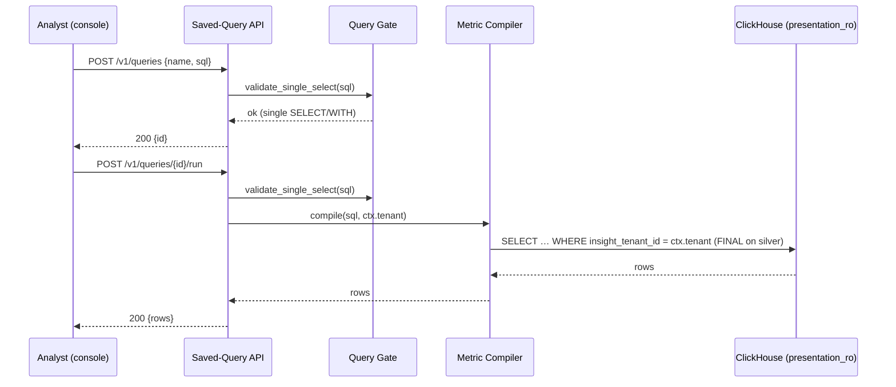
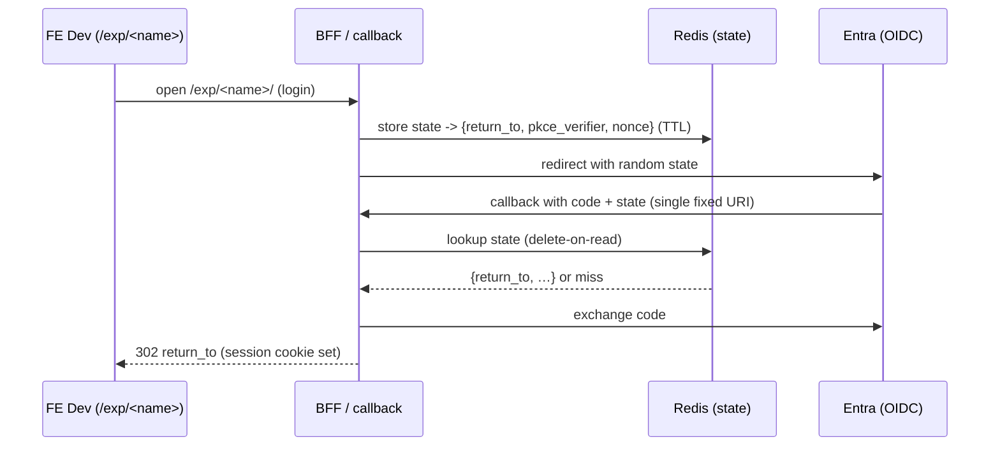

# Technical Design — Presentation Layer


<!-- toc -->

- [1. Architecture Overview](#1-architecture-overview)
  - [1.1 Architectural Vision](#11-architectural-vision)
  - [1.2 Architecture Drivers](#12-architecture-drivers)
  - [1.3 Architecture Layers](#13-architecture-layers)
- [2. Principles & Constraints](#2-principles--constraints)
  - [2.1 Design Principles](#21-design-principles)
  - [2.2 Constraints](#22-constraints)
- [3. Technical Architecture](#3-technical-architecture)
  - [3.1 Domain Model](#31-domain-model)
  - [3.2 Component Model](#32-component-model)
  - [3.3 API Contracts](#33-api-contracts)
  - [3.4 Internal Dependencies](#34-internal-dependencies)
  - [3.5 External Dependencies](#35-external-dependencies)
  - [3.6 Interactions & Sequences](#36-interactions--sequences)
  - [3.7 Database Schemas & Tables](#37-database-schemas--tables)
- [4. Additional context](#4-additional-context)
  - [4.1 Implementation Plan](#41-implementation-plan)
  - [4.2 Promotion Ladder (FE)](#42-promotion-ladder-fe)
  - [4.3 Open Decisions](#43-open-decisions)
  - [4.4 Phase B and Out of Scope](#44-phase-b-and-out-of-scope)
  - [4.5 Legacy Gold Relocation (#1979-#1981)](#45-legacy-gold-relocation-1979-1981)
- [5. Traceability](#5-traceability)

<!-- /toc -->

- [ ] `p3` - **ID**: `cpt-presentation-design-presentation`

## 1. Architecture Overview

### 1.1 Architectural Vision

Insight is split into two layers along an explicit contract. The Engineering layer owns silver facts (`class_*`, `fct_*`, `mtr_*`) and identity artifacts (`person.*`, `identity.*`); it is read-only to presentation and evolves additively. The Presentation layer owns gold, the query API, and the FE; it reads the contract and writes only its own `presentation` namespace.

Phase A ships the boundary and its three guarantees only — no metric semantics move. The source is safe by construction (a read-only role plus a single-SELECT gate), the contract is stable (additive-only changes), and every read is tenant-scoped (a server-injected predicate). The design reuses the current analytics service (Rust) rather than introducing a new one.

Gold posture is relabel, not migrate: legacy gold stays read-only in the `insight` database where dbt builds it today, read through the read-only role as contract output; only new gold is authored in `presentation`. Physical relocation of legacy gold is a later, optional cleanup, not a Phase-A blocker.

### 1.2 Architecture Drivers

Requirements that significantly influence architecture decisions.

#### Functional Drivers

| Requirement | Design Response |
|-------------|------------------|
| `cpt-presentation-fr-single-select-gate` | `validate_single_select` in `query_gate.rs`, wired through `parse_query_ref` — the one chokepoint metric SQL crosses on write and run |
| `cpt-presentation-fr-read-only-role` | Dedicated `presentation_ro` ClickHouse role: `SELECT` on the contract, `CREATE`/`INSERT` only in `presentation`, no `DROP`/`ALTER`/`TRUNCATE` |
| `cpt-presentation-fr-namespace` | New empty `presentation` database for new gold, saved-query results, and scratch; legacy gold left read-only in `insight` |
| `cpt-presentation-fr-saved-query-crud` | The saved query (`presentation.queries` logically; the `saved_queries` table physically) is a SeaORM entity in the analytics **service database (MariaDB)**, like metric definitions; CRUD mutates that metadata, not ClickHouse. Only `/run` reaches ClickHouse — it reuses the existing read path and executes the stored SQL as `presentation_ro`, so no write grant on the contract is ever needed. Shipped (#1965) |
| `cpt-presentation-fr-query-params` | Named parameters, `tenant` always injected from context (not client SQL), `period` supported |
| `cpt-presentation-fr-tenant-filter` | Literal leading `tenant_id = <ctx.tenant>` injected in one place — the compiler's shared `WHERE` (and the peer-cohort CTE reads) — replacing the no-op. `tenant_id` is the column the gold observation and cohort contract exposes (silver's `insight_tenant_id`, aliased to `tenant_id` in gold); filtering on it sidesteps the #1596 name drift, which affects other tables, not this read surface. Shipped for the structured `metric_results` read path (#1967). The legacy per-metric `query_ref` path (`execute_metric_query`) remains unscoped and is explicitly outside this guarantee until protected — see the component boundaries below. |
| `cpt-presentation-fr-contract-surface-doc` | Contract surface documented as the read boundary in [CONTRACT-SURFACE.md](./CONTRACT-SURFACE.md): the `class_*`/`fct_*`/`mtr_*`/`dim_*` silver families and `person.*`/`identity.*` objects, with the additive-only rules and the granted `insight` legacy gold. Shipped (#1968) |
| `cpt-presentation-fr-contract-version-stamp` | Engineering stamps `silver.contract_version` (single-row constant view, ledgerless CH migration); analytics pins `PINNED_CONTRACT_VERSION` and verifies the stamp in a periodic post-boot sweep, logging a mismatch or missing stamp without gating boot. Shipped (#1969) |
| `cpt-presentation-fr-query-console` | Single stable FE app on the saved-query API: author, list, run, render table / auto-chart. Shipped (#1970) |
| `cpt-presentation-fr-preview-envs` | Path-based `/exp/<name>` on one host, one shared read-only backend, FE-only variation. Per-experiment bundle (`Deployment` + `Service` + one prefix-strip `Ingress`) shipped as the `insight-preview` chart at `deploy/preview/`, applied by hand (#1971). Experiments are a capability gated off on production by default (`cpt-presentation-constraint-experiments-off-prod`, #1973). Shipped |
| `cpt-presentation-fr-preview-auth` | Single fixed callback with a Redis-backed opaque `state` return path (already stashing `state -> { return_to, pkce_verifier, nonce }`, delete-on-read), extended so `return_to` is validated at store time against a configurable `/exp/` prefix. Shipped (#1972) |
| `cpt-presentation-fr-metric-registry` | Single declarative `registry.yaml` (a `sources` list and a `metrics` list) embedded at build time and reconciled into the service DB at boot; replaces the code-literal seed with no change to reconcile semantics; invariants pinned by tests that parse the same registry. Shipped (#1974) |
| `cpt-presentation-fr-metric-passports` | `passport.rs` renders a source/formula/notes passport per metric from the embedded registry; the offline `analytics passports` subcommand emits the document, committed as `passports.md` next to `registry.yaml`. A Rust drift test compares the render against the committed file and fails on divergence, so a metric change without a passport regeneration breaks the build. Shipped (#1975) |
| `cpt-presentation-fr-custom-metrics-api` | `/v1/metrics*` REST surface: CRUD over `origin = 'custom'` metrics plus export/import, tenant-scoped from the session `SecurityContext`; builtins are read-only through it. Custom SQL (`source_kind = 'custom_observation_sql'`) passes the single-SELECT gate and must emit the observation contract; the compiler wraps it as `FROM (<sql>)` and it runs as `presentation_ro`. Export is keyed on `metric_key` with no tenant/timestamps; import re-homes the tenant and idempotently skips an existing `metric_key`. Custom rows survive builtin reconcile (`disable_missing` is scoped to `origin = 'builtin' AND tenant_id IS NULL`) |

#### NFR Allocation

| NFR ID | NFR Summary | Allocated To | Design Response | Verification Approach |
|--------|-------------|--------------|-----------------|----------------------|
| `cpt-presentation-nfr-source-immutability` | No presentation write reaches engineering-owned data | Single-SELECT gate + `presentation_ro` role | Two independent barriers: syntactic gate rejects non-`SELECT`; role grants forbid write/DDL on the contract | Adversarial SQL suite; verify no write/alter/drop on contract objects |
| `cpt-presentation-nfr-tenant-isolation` | No cross-tenant rows returned from the structured `metric_results` reads | Compiler shared `WHERE` | Server-injected literal tenant predicate the client SQL cannot widen; sourced from `SecurityContext`, not the request body | Compiler unit tests assert the predicate and its bound value lead every observation and cohort read (#1967); cross-tenant e2e (#1359) returns zero rows. Not yet met for the legacy `execute_metric_query` path, which stays outside the guarantee until protected. |

### 1.3 Architecture Layers

- [ ] `p3` - **ID**: `cpt-presentation-tech-layers`

```text
┌─────────────────────────────────────────────────────────────────┐
│                      PRESENTATION LAYER                          │
│                                                                  │
│   FE                    ANALYTICS SERVICE (Rust)                 │
│   ──                    ────────────────────────                 │
│  ┌──────────────┐      ┌───────────────────────────┐            │
│  │ query console│─────▶│ saved-query API (/v1/…)    │            │
│  │ preview /exp │      │  single-SELECT gate        │            │
│  └──────────────┘      │  tenant-filter injection   │            │
│                        │  run as presentation_ro    │            │
│                        └─────────────┬─────────────┘            │
│                                      │                           │
├──────────────────────────────────── │ ──────────────────────────┤
│                CONTRACT (read-only)  ▼      presentation (write)  │
│  ┌───────────────────────────┐   ┌───────────────────────────┐  │
│  │ silver class_*/fct_*/mtr_*│   │ new gold / query results  │  │
│  │ identity person.*/identity│   │ scratch (presentation DB) │  │
│  │ legacy gold in `insight`  │   └───────────────────────────┘  │
│  └───────────────────────────┘                                  │
└─────────────────────────────────────────────────────────────────┘
   ▲ produced by Engineering / ingestion layer (additive, versioned)
   Saved-query metadata (`presentation.queries`) lives in the analytics
   service DB (MariaDB), not the ClickHouse `presentation` namespace; only
   `/run` reaches ClickHouse.
```

| Layer | Responsibility | Technology |
|-------|---------------|------------|
| Presentation (FE) | Query console and preview environments | FE app (path-based `/exp/<name>`) |
| Application | Saved-query API, single-SELECT gate, tenant-filter injection | Rust (analytics service) |
| Domain | Query-ref parsing, metric compiler shared `WHERE` | Rust (`domain::query_gate`, `metric_results`) |
| Infrastructure | Contract (read-only) and `presentation` (write) storage | ClickHouse; Redis for preview auth state |

## 2. Principles & Constraints

### 2.1 Design Principles

#### Read-Only by Construction

- [ ] `p2` - **ID**: `cpt-presentation-principle-read-only-by-construction`

The source is safe because two independent barriers make presentation-side writes to the contract impossible, not merely discouraged. First, the public query path accepts exactly one `SELECT`/`WITH` and rejects everything else before it reaches ClickHouse. Second, reads execute as `presentation_ro`, which has no write/DDL grant on the contract. Worst case for a broken or LLM-generated query is damage to `presentation` scratch, never the source.

#### Additive-Only Contract

- [ ] `p2` - **ID**: `cpt-presentation-principle-additive-contract`

Contract changes are additive — new tables and columns — never rewrites. Existing views keep working across contract evolution. The read surface and the additive-only rules are enumerated in [CONTRACT-SURFACE.md](./CONTRACT-SURFACE.md) (#1968). A contract version stamp lets presentation detect the surface it was built against.

#### Server-Side Tenant Scoping

- [ ] `p2` - **ID**: `cpt-presentation-principle-server-side-tenant`

Every contract read carries a tenant predicate injected server-side from request context, in one shared place. The value never comes from client SQL, so client SQL cannot widen the scope. The mechanism is swappable in that one place when the isolation benchmark decides subtree scoping.

#### Relabel, Not Migrate

- [ ] `p2` - **ID**: `cpt-presentation-principle-relabel-not-migrate`

No gold is physically moved in Phase A. Legacy gold stays in `insight`, read as contract output through the read-only role. Only new gold is authored in `presentation`. The default form is a plain `VIEW` (compute-on-read); promote to a refreshable MV or scheduled `INSERT…SELECT` in `presentation` only when freshness needs decoupling.

### 2.2 Constraints

#### Reuse the Analytics Service

- [ ] `p2` - **ID**: `cpt-presentation-constraint-reuse-service`

Phase A reuses the current analytics service. The single-SELECT gate, tenant-filter injection, and saved-query API are added to it; no new service is introduced.

#### FINAL on Silver ReplacingMergeTree

- [ ] `p2` - **ID**: `cpt-presentation-constraint-final-reads`

Silver facts are `ReplacingMergeTree`. Reads of silver keep the `FINAL` modifier to see the deduplicated state.

#### No Orchestrator in the Platform

- [ ] `p2` - **ID**: `cpt-presentation-constraint-no-orchestrator`

There is no Argo/GitOps in the platform. Preview provisioning is manual `kubectl apply` / `helm upgrade` of a per-experiment bundle. Any future automation is a CI job, best sequenced after the planned nginx-to-Envoy move.

#### Single Preview Host

- [ ] `p2` - **ID**: `cpt-presentation-constraint-single-host`

One host serves all preview experiments, giving one Entra redirect URI (Entra has no reliable wildcard redirect). Addressing is path-based (`/exp/<name>`) with a same-origin session cookie and zero per-experiment Entra change.

#### Experiments Off on Production by Default

- [ ] `p2` - **ID**: `cpt-presentation-constraint-experiments-off-prod`

Experimental frontends (`/exp/<name>`) are a capability, off by default, so a production stand cannot host them against customer data (PRD R1.4). The authenticator takes `experiments_enabled` (default `false`); a login return into the reserved `/exp/` subtree is honored only when it is `true`, otherwise the return falls back to `default_return_to` and the attempt is audit-logged. A production stand leaves it `false`; dev/demo preview hosts set `true` and serve experiments over that stand's own data (no synthetic requirement). This is the environment-level gate; a per-user RBAC capability supersedes it later, as the same surface becomes the analyst query builder. The gate lives on the authenticator (gitops); the `deploy/preview/` FE chart carries no auth env. The sanctioned saved-query console/CRUD is a separate, prod-safe surface and is not gated by this flag.

#### No tenant_id on New Gold Outside the Coordinated Retrofit

- [ ] `p2` - **ID**: `cpt-presentation-constraint-tenant-id-retrofit`

New gold does not add `insight_tenant_id` outside the coordinated engineering retrofit (#1829). Where new presentation gold does carry the column, `insight_tenant_id` is first in `ORDER BY`.

## 3. Technical Architecture

### 3.1 Domain Model

**Technology**: Rust (analytics service), ClickHouse

**Location**: [src/backend/services/analytics/](../../../../src/backend/services/analytics/)

**Core Entities**:

| Entity | Description | Location |
|--------|-------------|--------|
| `presentation.queries` (`saved_queries` table) | Saved query: a single `SELECT`/`WITH` over the contract, tenant-scoped | Analytics service DB (MariaDB), like the metric CRUD entities |
| Query gate | `validate_single_select` — the syntactic read-only barrier | [query_gate.rs](../../../../src/backend/services/analytics/src/domain/query_gate.rs) |
| Metric compiler | Builds contract SQL; owns the shared `WHERE` where the tenant filter is injected | [metric_results/](../../../../src/backend/services/analytics/src/domain/metric_results/) |

**Relationships**:
- `presentation.queries.sql` → contract objects (silver, identity, legacy gold in `insight`): read-only `SELECT` validated by the gate.
- `presentation.queries.insight_tenant_id` → the tenant that owns the row; scopes all CRUD. It is also the source for the tenant predicate the run path will inject once #1967 replaces the compiler no-op.

### 3.2 Component Model

```text
┌───────────────────────────────────────────────────────────┐
│                  Analytics Service (Rust)                  │
│                                                           │
│  ┌───────────────┐     ┌────────────────────────────┐    │
│  │ Saved-Query   │────▶│ Query Gate (query_gate.rs) │    │
│  │ API (handlers)│     │ validate_single_select     │    │
│  └──────┬────────┘     └────────────────────────────┘    │
│         │                                                  │
│         ▼                                                  │
│  ┌────────────────────────────┐                           │
│  │ Metric Compiler            │  injects tenant WHERE     │
│  │ (metric_results/)          │  runs as presentation_ro  │
│  └────────────────────────────┘                           │
└───────────────────────────────────────────────────────────┘
        │ read-only SELECT (contract)   │ write (presentation)
        ▼                               ▼
   silver / identity / insight     presentation.*
```

#### Query Gate

- [x] `p2` - **ID**: `cpt-presentation-component-query-gate`

##### Why this component exists

Makes the public query path incapable of anything but a single read, so a broken or LLM-generated query cannot damage the source. Shipped (#1962).

##### Responsibility scope

- `domain::query_gate::validate_single_select`: a single-pass syntactic gate that skips string literals, quoted identifiers, and comments, then requires a lone statement beginning with `SELECT`/`WITH`.
- Rejects empty input, multiple statements, and anything not beginning with `SELECT`/`WITH` (so DDL/DML never starts).
- Invoked through `parse_query_ref`, the one chokepoint metric SQL crosses on both write (create/update) and run; the saved-query API calls the same function.

##### Responsibility boundaries

- Does NOT enforce grants — that is the `presentation_ro` role.
- Does NOT inject the tenant predicate — that is the metric compiler.

##### Related components (by ID)

- `cpt-presentation-component-saved-query-api` — calls the gate on write and run
- `cpt-presentation-component-metric-compiler` — receives the validated single SELECT

---

#### Read-Only Role

- [x] `p2` - **ID**: `cpt-presentation-component-read-only-role`

##### Why this component exists

The second, independent barrier behind the query gate: once analytics connects as the role, even a read that slips past the gate executes under grants that make writing, altering, or dropping the source impossible. Read-only enforced by construction, not convention. The role is **provisioned** by #1963; #1964 adds the grant-less `presentation` user that carries it and points analytics at that user, so the barrier is now active.

##### Responsibility scope

- `presentation_ro` ClickHouse role: `SELECT` on the contract (silver, identity/person, legacy gold in `insight`); `SELECT`/`INSERT`/`CREATE` only in `presentation`; no `DROP`/`ALTER`/`TRUNCATE` anywhere.
- Grant-less `presentation` user (#1964): every privilege comes from `presentation_ro` (a role only *adds* privileges, so activating it on a user with direct grants would not restrict anything). This is the user analytics connects as.
- Defined as idempotent DDL in [presentation-role.sql](../../../../src/ingestion/scripts/bootstrap-db/presentation-role.sql) (role) plus [provision-presentation-access.sh](../../../../src/ingestion/scripts/bootstrap-db/provision-presentation-access.sh) (the user, which needs a password); provisioned by [apply-ch-migrations.sh](../../../../src/ingestion/scripts/apply-ch-migrations.sh) (the clickhouse-migrate hook, which bootstrap also runs), guarded so a ClickHouse admin without access-management — or a run without the user password — is skipped with a warning rather than aborting.

##### Responsibility boundaries

- Does NOT parse SQL — that is the query gate.
- Does NOT gate the switch behind a flag: analytics always connects as the `presentation` user, whose password is a required credential (like the admin one). The user is provisioned before analytics needs it — by the clickhouse-migrate Hook (gitops/chart) or the ClickHouse init scripts (compose) — so the deploy-side switch must land together with a release that carries that provisioning.

##### Related components (by ID)

- `cpt-presentation-component-query-gate` — the first barrier; the role is the second
- `cpt-presentation-component-saved-query-api` — runs as this role

---

#### Saved-Query API

- [x] `p2` - **ID**: `cpt-presentation-component-saved-query-api`

##### Why this component exists

Plain CRUD over stored queries so a new analytics slice needs no engineering change and no re-ingest. The one new surface Phase A adds ("Data Analytics"). CRUD + run shipped (#1965); named parameters (`tenant`/`period`) shipped (#1966).

##### Responsibility scope

- CRUD over `presentation.queries` (the `saved_queries` service-DB table), tenant-scoped from the session `SecurityContext`. Handlers mirror the metric CRUD in `api::handlers`; delete is a hard delete.
- Validate SQL via the query gate (`validate_single_select`) on create, update, **and** run — the run-side re-validation keeps a stored SQL from reaching ClickHouse as anything but a single read.
- Run: execute the stored single-SELECT read-only as `presentation_ro` and return untyped JSON rows (`JSONEachRow`, same shape as the existing metric query path).
- Bind named parameters on run (#1966): `{tenant}` is always bound from the session `SecurityContext` (never client-settable); `{period}` is bound when supplied on the run request body. Values are passed as ClickHouse server-side parameters (`Query::param` → `param_<name>`), so a value can never change query structure; the gate already tolerates `{name:Type}` placeholders. A query that references a parameter left unbound (e.g. `{period}` with no period supplied) fails as a 400, not a 5xx.

##### Responsibility boundaries

- Does NOT carry metric metadata, thresholds, or passports — those are Phase B.
- Does NOT bypass the gate.
- Does NOT string-interpolate parameter values — binding is server-side only.
- Does NOT yet inject the tenant-row filter (#1967) — the run path binds the `{tenant}` *value* but does not yet add an `insight_tenant_id = {tenant}` predicate to queries that omit it; that cross-cutting concern lands in its own sub-issue.

##### Related components (by ID)

- `cpt-presentation-component-query-gate` — validates SQL on write and run
- `cpt-presentation-component-metric-compiler` — reuses the run path

---

#### Custom-Metrics API

- [x] `p2` - **ID**: `cpt-presentation-component-custom-metrics-api`

##### Why this component exists

Lets an analyst author, manage, and share a metric (`origin = 'custom'`) without an engineering change or re-ingest, over the `/v1/metrics*` surface. The detailed metric contract is governed by the metrics DESIGN ([../../metrics/specs/DESIGN.md](../../metrics/specs/DESIGN.md)).

##### Responsibility scope

- CRUD over custom metrics, tenant-scoped from the session `SecurityContext`; handlers mirror the saved-query and metric-definition CRUD in `api::handlers`. Create sets `origin = 'custom'`; delete is a hard delete.
- Custom SQL source (`source_kind = 'custom_observation_sql'`) is validated by the query gate (`validate_single_select`) on write and before execution, and must emit the observation contract (`tenant_id, source_key, entity_type, entity_id, metric_date, measure_key, observed_at, value, subject_key, dimensions`). The compiler wraps it as the observation `FROM (<sql>)` and executes it as `presentation_ro`, so a custom metric reads the contract but never writes it.
- Export (`GET /v1/metrics/export`): serialize the tenant's custom metric graphs (definition plus its source/measure/dimension/input rows) into a portable form keyed on `metric_key`, carrying no `tenant_id` or timestamps.
- Import (`POST /v1/metrics/import`): re-home each graph's tenant to the session, idempotently skipping any `metric_key` that already exists; returns `{ imported, skipped }`.

##### Responsibility boundaries

- Does NOT mutate builtins — `origin = 'builtin'` metrics are read-only through this API; only the registry reconciler writes them.
- Does NOT bypass the gate, and does NOT string-interpolate the custom SQL.
- Does NOT change the reconciler: custom rows fall outside its `disable_missing` predicate (`origin = 'builtin' AND tenant_id IS NULL`), so a reconcile pass never disables or deletes them.

##### Related components (by ID)

- `cpt-presentation-component-query-gate` — validates custom SQL on write and run
- `cpt-presentation-component-metric-compiler` — wraps the custom SQL as the observation relation and injects the tenant filter
- `cpt-presentation-component-metric-registry` — owns the builtin seed this surface never mutates

---

#### Metric Compiler (Tenant Filter)

- [x] `p2` - **ID**: `cpt-presentation-component-metric-compiler`

##### Why this component exists

Builds contract SQL and owns the single shared `WHERE` where the tenant predicate is injected, replacing the no-op left from the single-tenant MVP.

##### Responsibility scope

- Inject a leading literal `tenant_id = <ctx.tenant>` on every read the compiler emits, sourced from the request's `SecurityContext` (carried on `ValidatedMetricResultsRequest`). `tenant_id` is the column the gold observation and cohort contract exposes; the value is the raw tenant UUID, the same representation the metric lineage stamps (no sipHash — that is identity-only). The predicate covers every observation read (`metric_where` / `shared_observation_where`) and both peer-cohort CTE reads.
- Keep `FINAL` on silver `ReplacingMergeTree` reads.
- Put `insight_tenant_id` first in `ORDER BY` for any new presentation gold that carries it.

##### Responsibility boundaries

- Does NOT read the tenant value from client SQL.
- Does NOT implement subtree/hierarchy scoping in Phase A (deferred to the benchmark).
- Does NOT cover the legacy per-metric `query_ref` path (`execute_metric_query`, `/v1/metrics/{id}/query` and `/v1/metrics/queries`). That path runs arbitrary DB-stored `FROM` shapes (subqueries, bare bronze tables) where a flat `tenant_id = ?` cannot be injected safely, so it stays unscoped and outside the isolation guarantee until it is restricted to tenant-safe sources or given per-query enforcement. It predates this component; #1967 does not widen its exposure.

##### Related components (by ID)

- `cpt-presentation-component-saved-query-api` — drives the run path
- `cpt-presentation-component-query-gate` — precedes compilation

---

#### Contract Version Stamp

- [x] `p3` - **ID**: `cpt-presentation-component-contract-version`

##### Why this component exists

Additive-only evolution is only checkable against a named surface *version*. The stamp makes the deployed contract surface machine-detectable, so a presentation build knows whether the surface it was built against is the one it is running on. Shipped (#1969).

##### Responsibility scope

- Engineering side: `silver.contract_version`, a single-row constant view (`version UInt32`), created by the ledgerless ClickHouse migration `20260731000000_contract-version-stamp.sql` (`CREATE OR REPLACE VIEW`, re-applied on every deploy). Part of the contract surface; readable by `presentation_ro` via the existing `silver.*` grant. Bumped in place per [CONTRACT-SURFACE.md](./CONTRACT-SURFACE.md) §5.
- Presentation side: the analytics service pins `PINNED_CONTRACT_VERSION` (`domain/contract_version.rs`) and verifies the stamp in a periodic post-boot sweep (same cadence rationale as the metric-definition validator: the stamp is created by the migrate hook after the service boots, and a later in-place bump must surface without a restart). State transitions are logged — match at info, a mismatch at error, a missing/unreadable stamp at warn — and the probe never gates readiness (a ClickHouse outage at boot must not delay boot).

##### Responsibility boundaries

- Does NOT enforce compatibility — additive-only evolution (the principle above) is what keeps an older pin working on a newer surface; the stamp only makes drift visible.
- Does NOT version individual tables or columns — one version for the whole surface, bumped per the CONTRACT-SURFACE.md §5 procedure.

##### Related components (by ID)

- `cpt-presentation-component-read-only-role` — grants the read the probe uses
- `cpt-presentation-component-metric-compiler` — the main consumer of the surface the version names

---

#### Query Console

- [x] `p2` - **ID**: `cpt-presentation-component-query-console`

##### Why this component exists

Makes the saved-query API tangible: a single stable FE app (not a per-branch stand) where an analyst authors a query, picks one from their saved list, runs it, and reads the result. This is tiers 1-2 of the promotion ladder — author and eyeball, no deploy — and query-management v0. Shipped (#1970).

##### Responsibility scope

- One authenticated route in the existing FE app (the stable console; preview environments below are a separate tier-3 surface). Reached only through the existing auth shell, so it inherits the session `SecurityContext` and its tenant; the console never sends a tenant.
- Reachable by direct URL only — no sidebar/nav entry — in Phase A. There is no role to gate it on yet (RBAC is deferred to the permissions service, `DD-AUTH-07`, so every human session carries only the default `user` role); surfacing it in the nav and restricting it to the right roles waits for that service.
- Consumes **only** the saved-query API (`/v1/queries` CRUD + `/v1/queries/{id}/run`): list saved queries, author (name + SQL, optional description), save to get an id, select a saved query, and run it. Editing and deleting an existing query round out CRUD parity with the API.
- Render the run result two ways from the untyped `{ rows }` payload: always a table (columns inferred from the row keys), plus an auto-chart when the row shape is chartable (one categorical/label column + at least one numeric column), otherwise table-only. Chart-type selection is heuristic, not authored.
- Surface the API's typed errors as-is — a gate rejection (invalid SQL) and a missing-named-parameter `400` are shown to the author, not swallowed.

##### Responsibility boundaries

- Does NOT talk to ClickHouse or any contract object directly — every read is a `/run` through the service, so the gate, the `presentation_ro` role, and the tenant scoping all still apply.
- Does NOT set or widen the tenant — `{tenant}` is server-injected; the console cannot pass one.
- Does NOT pin a query as a dashboard card (tier-2 "promote") or build bespoke widgets (tier-3) — those are later ladder rungs; this component is author-and-run only.

##### Related components (by ID)

- `cpt-presentation-component-saved-query-api` — the only backend surface the console calls
- `cpt-presentation-component-preview-router` — the tier-3 counterpart to this tier-1/2 console

---

#### Preview Environment Router

- [x] `p2` - **ID**: `cpt-presentation-component-preview-router`

##### Why this component exists

Serves many experimental FE builds under one host against one shared read-only backend, gated so the capability is off on production and can never touch customer data there.

##### Responsibility scope

- Path-based addressing `preview.insight…/exp/<name>/`: one host, one Entra redirect URI, same-origin session cookie. FE built with a relative asset base and a runtime router basepath so one image serves under any prefix; `/api/...` stays the shared absolute path.
- Auth return path (shipped #1972): the authenticator's login-initiation already writes Redis `state → { return_to, pkce_verifier, nonce }` with a short TTL; Entra echoes the random `state` to the single fixed callback; the authenticator looks it up (miss/expired ⇒ reject; delete-on-read), exchanges the code, sets the cookie, and `302`s to `return_to`. #1972 adds the store-time `/exp/` prefix check: `sanitize_return_to` takes a configurable `return_to_prefix` (authenticator config) — empty keeps the permissive main-app posture; a preview-host deployment sets `/exp/` so a login can only return to an `/exp/<name>` path (same-origin already enforced by the site-relative check; `..`-traversal rejected), otherwise the configured default. The FE preview chart (`deploy/preview/`) still carries no auth env; the prefix is set on the preview-host authenticator deployment (gitops), which owns the single fixed Entra redirect URI.
- Deployment: one route object per experiment applied by hand (`Deployment` + `Service` + one routing object with prefix-strip rewrite). The controller merges same-host route objects, so `apply` adds a path and `delete` removes it; no central config is rewritten. Portable by intent (Gateway API `HTTPRoute` after the Envoy move), but nginx-specific today: the route uses `pathType: ImplementationSpecific` with `nginx.ingress.kubernetes.io/{use-regex,rewrite-target}`. Shipped (#1971) as the `insight-preview` Helm chart at `deploy/preview/`: each experiment is one release named `preview-<name>`, the `Ingress` prefix-strips `/exp/<name>` (`rewrite-target: /$2`), and the experiment slug is validated as a DNS-1123 label of at most 55 characters at template time. Render-contract tests plus a `.github/workflows/preview-helm.yml` lane guard it. The auth return path above shipped (#1972).
- Experiments-off-on-prod gate (shipped #1973): experiments are a capability, off by default, enforced at the authenticator's `/exp/` return path rather than the FE chart. The authenticator's `experiments_enabled` (default `false`) makes `login` honor a return into the reserved `/exp/` subtree only when `true`; otherwise it falls back to `default_return_to` and audit-logs `experiment_return_ignored`. A production stand leaves it `false`, so an experimental frontend cannot obtain a session there; dev/demo preview hosts set `true` and run over that stand's own data (`cpt-presentation-constraint-experiments-off-prod`). Enforced by `is_preview_return` + the `experiments_enabled` check in `login` (unit-tested), and set on the authenticator deployment behind the preview host (gitops). A future per-user RBAC capability replaces this single env-level check.

##### Responsibility boundaries

- Does NOT vary the backend per experiment — only the FE varies.
- Does NOT provision automatically — no orchestrator; manual `kubectl`/`helm`.

##### Related components (by ID)

- `cpt-presentation-component-saved-query-api` — the shared backend the FE calls

---

#### Metric Registry

- [x] `p3` - **ID**: `cpt-presentation-component-metric-registry`

##### Why this component exists

Collapses the metric-definition seed into one declarative artifact so a metric can be added or changed without editing Rust, and so Phase B (semantic compiler, passports) has a single source of truth to build on. Shipped (#1974). The detailed metric contract is governed by the metrics DESIGN (`docs/domain/metrics/specs/DESIGN.md`).

##### Responsibility scope

- `registry.yaml` (`domain/metric_definitions/`): one `sources` list and one `metrics` list, embedded at build time (`include_str!`) and deserialized once into the seed types in `builtin.rs`, exposed as `builtin_sources()` / `builtin_metrics()`.
- The startup reconciler converges the registry into the service DB (`metric_definitions` and its source/measure/dimension/input tables) idempotently: additive upserts plus disable-missing for builtins dropped from the registry; tenant-owned rows untouched. Unchanged from the prior code-literal seed except its source.
- Registry invariants (key shape and uniqueness, input/measure references, computation field combinations, presentation-complete formats carry no unit) are pinned by tests that parse the same embedded registry, so a malformed or drifted registry fails the build.

##### Responsibility boundaries

- Does NOT define or drive the legacy `metric_catalog`/`metric_threshold` subsystem — that orphaned, frozen path is untouched; its retirement is tracked separately.
- Does NOT add the semantic raw-to-derived compiler — that is a later Phase B sub-issue (#1976). Metric passports and their drift test ship on top of this registry (#1975); see the Metric Passports component below.
- Does NOT change reconcile semantics or the metric-result runtime.

##### Related components (by ID)

- `cpt-presentation-component-metric-compiler` — consumes the reconciled definitions
- `cpt-presentation-component-metric-passports` — renders the human-readable passport from the same registry

---

#### Metric Passports

- [x] `p3` - **ID**: `cpt-presentation-component-metric-passports`

##### Why this component exists

Gives every metric a reviewable, plain-language derivation record — source, formula, notes — that cannot silently drift from the code that computes it, laying a stable, human-facing surface the Phase B semantic compiler and the FE metric rework build on. Shipped (#1975).

##### Responsibility scope

- `passport.rs` (`domain/metric_definitions/`): `render_passports()` folds `builtin_sources()` / `builtin_metrics()` into one Markdown document, one section per metric in registry order — source relation, the measures it reads, a rendered formula (sum/median/distinct-count/scaled ratio plus any affine-clamp transform), the display shape, and the authored notes.
- The offline `analytics passports` subcommand emits the document (no database, no config, mirroring `analytics openapi`); it is committed as `passports.md` next to `registry.yaml`.
- A Rust drift test (`metric_definitions::passport`) re-renders from the embedded registry and asserts byte-equality with the committed `passports.md`, failing the standard backend test job when the two disagree. Regenerate: `(cd src/backend && cargo run -p analytics -- passports) > …/passports.md`.

##### Responsibility boundaries

- Does NOT add a new runtime endpoint or change the metric-result path — passports are a build-time, developer-facing artifact.
- Does NOT author notes independently — it renders the registry's existing labels, computations, and explanations, so the passport stays a projection of the single source of truth rather than a second one.

##### Related components (by ID)

- `cpt-presentation-component-metric-registry` — the single source of truth the passport is rendered from

---

### 3.3 API Contracts

- [x] `p2` - **ID**: `cpt-presentation-interface-saved-query-endpoints`

- **Implements**: `cpt-presentation-interface-saved-query-api` (PRD §7.1 Public API Surface)
- **Contracts**: `cpt-presentation-contract-read-only-consumption`
- **Technology**: REST / HTTP JSON
- **Base path**: `/v1/queries`

Entity `presentation.queries`: `{ id, insight_tenant_id, name, description, sql, created_at, updated_at }`. `sql` is a single `SELECT`/`WITH` over the contract, validated by the gate on write and on run.

**Endpoints Overview**:

| Method | Path | Description | Stability |
|--------|------|-------------|-----------|
| `GET` | `/v1/queries` | List saved queries (tenant-scoped) | unstable |
| `POST` | `/v1/queries` | Create (validates SQL via the gate) | unstable |
| `GET` | `/v1/queries/{id}` | Fetch one | unstable |
| `PUT` | `/v1/queries/{id}` | Update (re-validates SQL) | unstable |
| `DELETE` | `/v1/queries/{id}` | Delete | unstable |
| `POST` | `/v1/queries/{id}/run` | Execute read-only as `presentation_ro`, return rows; optional body `{ "period": "<value>" }` binds `{period}`; `{tenant}` always bound from context (tenant-row *filter* deferred to #1967 — the run path binds the tenant value but adds no `insight_tenant_id` predicate yet) | unstable |

`run` executes as `presentation_ro` and returns untyped JSON rows, the same shape as the existing metric query path. The request body is optional; named parameters (`tenant`/`period`, #1966) are bound as ClickHouse server-side parameters. No metric metadata, thresholds, or passports in Phase A.

---

- [x] `p2` - **ID**: `cpt-presentation-interface-custom-metrics-endpoints`

- **Implements**: `cpt-presentation-interface-custom-metrics-api` (PRD §7.1 Public API Surface)
- **Contracts**: `cpt-presentation-contract-read-only-consumption`
- **Technology**: REST / HTTP JSON
- **Base path**: `/v1/metrics`

A custom metric is a `metric_definitions` row with `origin = 'custom'`, tenant-scoped, whose observation source is custom SQL (`source_kind = 'custom_observation_sql'`) over the contract. The custom SQL is validated by the single-SELECT gate on write and before execution and must emit the observation contract (`tenant_id, source_key, entity_type, entity_id, metric_date, measure_key, observed_at, value, subject_key, dimensions`). Builtin metrics (`origin = 'builtin'`) are read-only through this surface.

**Endpoints Overview**:

| Method | Path | Description | Stability |
|--------|------|-------------|-----------|
| `POST` | `/v1/metrics` | Create a custom metric (`origin = 'custom'`, tenant-scoped); validates custom SQL via the gate | unstable |
| `GET` | `/v1/metrics` | List the tenant's custom metrics | unstable |
| `GET` | `/v1/metrics/{metric_key}` | Fetch one custom metric | unstable |
| `PUT` | `/v1/metrics/{metric_key}` | Update a custom metric (re-validates custom SQL) | unstable |
| `DELETE` | `/v1/metrics/{metric_key}` | Delete a custom metric (hard delete) | unstable |
| `GET` | `/v1/metrics/export` | Export the tenant's custom metric graphs — portable, keyed on `metric_key`, no `tenant_id` or timestamps | unstable |
| `POST` | `/v1/metrics/import` | Import custom metric graphs; re-homes the tenant to the session; idempotently skips an existing `metric_key`; returns `{ imported, skipped }` | unstable |

Invariants: builtins are read-only through this API; custom SQL is single-SELECT gated (which also rejects external/remote table functions), must emit the observation contract, must be tenant-neutral and row-preserving (it exposes each source row's real `tenant_id` and never fabricates or cross-tenant-aggregates it — the outer predicate filters emitted rows, not the tables read, so authorship is trusted the same way the saved-query console is), and executes as `presentation_ro`; export/import identity is `metric_key` (not the tenant-scoped row id), so a graph re-homes cleanly on import. Import is bounded: at most 500 graphs per request; the batch is validated and gated up front and applied in one transaction, so a single invalid graph rejects the whole request with `400` and writes nothing, while a well-formed graph whose `metric_key` already exists for the tenant is skipped — the success body is `{ imported, skipped }`. The saved-query console (`/v1/queries*`) is a separate surface and is unchanged.

### 3.4 Internal Dependencies

| Dependency Module | Interface Used | Purpose |
|-------------------|----------------|----------|
| Metric compiler (`metric_results/`) | In-process call | Build contract SQL and inject the tenant `WHERE`; reused by `/run` |
| Query gate (`query_gate.rs`) | In-process call via `parse_query_ref` | Validate single SELECT on write and run |

**Dependency Rules**:
- The gate and the tenant filter are always on the run path; neither is bypassable.
- Presentation writes only to `presentation`; contract objects are read-only.

### 3.5 External Dependencies

#### ClickHouse

| Aspect | Value |
|--------|-------|
| Contract | Read-only: silver (`class_*`, `fct_*`, `mtr_*`, `dim_*`), identity (`person.*`, `identity.*`), legacy gold in `insight`. Full surface + additive-only rules: [CONTRACT-SURFACE.md](./CONTRACT-SURFACE.md) |
| Contract version | `silver.contract_version` single-row view; analytics pins `PINNED_CONTRACT_VERSION` and verifies it in a periodic post-boot sweep (#1969) |
| Presentation namespace | New `presentation` DB: `SELECT` + `CREATE`/`INSERT` for new gold, results, scratch |
| Access | Executed as the grant-less `presentation` user, whose only privileges come via the `presentation_ro` role (SELECT on contract; CREATE/INSERT only in `presentation`) |
| Read semantics | `FINAL` on silver `ReplacingMergeTree` reads |
| Bootstrap | `presentation` DB always created (`clickhouse.initDatabases` + the core-DB block of `apply-ch-migrations.sh`); role + grant-less user via `provision-presentation-access.sh` — the user only when its password is supplied (guarded). Role DDL in `presentation-role.sql` |

#### Redis

| Aspect | Value |
|--------|-------|
| Purpose | Backs the opaque `state → { return_to, pkce_verifier, nonce }` return path for preview auth |
| Semantics | Short TTL; delete-on-read; `return_to` validated at store time |

#### Entra (OIDC)

| Aspect | Value |
|--------|-------|
| Purpose | Identity provider for the single preview host |
| Constraint | One redirect URI (no reliable wildcard redirect); single fixed callback |

### 3.6 Interactions & Sequences

#### Author and Run a Saved Query

**ID**: `cpt-presentation-seq-author-run-query`

**Use cases**: `cpt-presentation-usecase-author-run-query`

**Actors**: `cpt-presentation-actor-analyst`, `cpt-presentation-actor-analytics-svc`



**Description**: The gate validates on write and run; the compiler injects the tenant predicate; the query executes read-only as `presentation_ro`.

#### Preview Environment Login Return Path

**ID**: `cpt-presentation-seq-preview-auth`

**Use cases**: `cpt-presentation-usecase-preview-widget`

**Actors**: `cpt-presentation-actor-fe-dev`, `cpt-presentation-actor-analytics-svc`



**Description**: `return_to` is caller-supplied on `/auth/login`; it is sanitized and validated at store time (same-origin, `/exp/` prefix) before it enters the Redis login state, and never forwarded through the callback — only the opaque `state` rides the callback URL. A `state` miss or expiry is rejected.

### 3.7 Database Schemas & Tables

- [x] `p3` - **ID**: `cpt-presentation-db-schemas`

Only one new entity is added in Phase A. It lives in the analytics **service database (MariaDB)** alongside the metric CRUD entities — not in the ClickHouse `presentation` namespace — because CRUD is metadata management, not a contract read. Contract objects and the `presentation` ClickHouse namespace are unchanged by CRUD; only `/run` reaches ClickHouse.

#### Table: `saved_queries` (`presentation.queries`)

**ID**: `cpt-presentation-dbtable-queries`

Saved query authored by an analyst: a single `SELECT`/`WITH` over the contract, tenant-scoped. Created by migration `m20260730_000001_saved_queries` (#1965).

| Column | Type | Description |
|--------|------|-------------|
| `id` | UUID | PK — saved-query identifier |
| `insight_tenant_id` | UUID | Tenant scope |
| `name` | String | Display name |
| `description` | String | Free-text description |
| `sql` | String | A single `SELECT`/`WITH` over the contract, validated by the gate |
| `created_at` | DateTime | Row creation time |
| `updated_at` | DateTime | Last modification time |

**PK**: `id`

**Additional info**: Lives in the analytics service DB (MariaDB), written by the service's own SeaORM connection — not the `presentation_ro` ClickHouse role, which is only the identity for `/run` reads. All CRUD reads/writes are tenant-scoped by `insight_tenant_id`.

## 4. Additional context

### 4.1 Implementation Plan

Ordered by quick win; each step ships value or safety on its own, and no step depends on physically moving gold.

1. **Single-SELECT gate** (safety, done, #1962) — `validate_single_select`, applied on write and run via `parse_query_ref`. Shipped with no DB or infra change.
2. **`presentation_ro` role + empty `presentation` DB** (safety, done, #1963/#1964) — role + grant-less `presentation` user in CH bootstrap (`bootstrap-db/provision-presentation-access.sh`); empty DB via `clickhouse.initDatabases` + `apply-ch-migrations.sh`; analytics connects as the `presentation` user (existing `clickhouse_user`/`clickhouse_password` config → `gear.rs` `with_auth`), its password a required credential provisioned before analytics needs it.
3. **Saved-query CRUD** (value) — CRUD + run shipped (#1965): the `saved_queries` service-DB entity plus migration, handlers and routes per section 3.3, reusing the existing `JSONEachRow` read path for `/run`. Named parameters (#1966) extend the run path next.
4. **Tenant filter** (correctness, #1967) — replace the no-op with the injected predicate in the compiler's shared `WHERE`; `insight_tenant_id` first in `ORDER BY` for new gold; cover with an e2e metric test (`src/ingestion/tests/e2e`). Coordinated with engineering #1829.
5. **Contract surface + version stamp** (stability, done, #1968/#1969) — the surface and additive-only rules named in CONTRACT-SURFACE.md; `silver.contract_version` stamped by migration and pinned/verified by analytics in a periodic sweep.
6. **Query console** (value, FE, #1970) — thin stable app on the saved-query API: auth shell, author, list, run, render table / auto-chart. Tier-2 "promote to card" can follow.
7. **Preview environments** (infra, FE, #1971-#1973) — path-based `/exp/<name>` on a shared read-only backend; Redis-`state` return path; experiments gated off on production by default; one route object per experiment; manual `kubectl`/`helm`.

Deferred: relocate legacy gold from `insight` to `presentation` (#1979-#1981); CI-driven preview provisioning (after the nginx-to-Envoy move).

### 4.2 Promotion Ladder (FE)

How a good result becomes a dashboard:

1. **Console** — author, run, eyeball. Self-serve, no deploy.
2. **Promote** — pin a query id as a generic dashboard card (choose chart type). Config, no deploy.
3. **Bespoke** — build a real widget over the FE, then PR it into the real FE repo; validated on a preview environment (tier 3).

Tiers 1-2 need no deploy — the unit of change is a query row. Tier 3 is the primary authoring loop and is what preview environments serve. Correctness judgment is the human's; metric passports (Phase B) harden it later.

### 4.3 Open Decisions

1. **Tenant isolation mechanism** — API-injected `WHERE` (Phase A default) vs row policy vs schema-per-tenant, plus the subtree mechanism (`ancestor_ids` array vs HIERARCHICAL dict). Decided by the isolation benchmark (`RLS_RESEARCH.md`). Phase A ships flat inject; the mechanism is swappable in one place.
2. **CI-automated preview provisioning** — whether/when a CI job automates provisioning (best after the nginx-to-Envoy move), and whether tier-3 experiments live on branches of the real FE repo or a prototype repo.
3. **Read-only on v1** — confirm the presentation layer is strictly read-only for v1 (write-back out of scope).

### 4.4 Phase B and Out of Scope

The declarative metric registry (`cpt-presentation-component-metric-registry`, #1974) lands as the first Phase B step: one YAML is the source of truth for the sanctioned metric-definition seed. The former "FE thresholds" collapse is already done — the FE renders from the `metric_definitions` catalog API and live peer percentiles, holding no per-metric thresholds.

Metric passports plus their drift test (`cpt-presentation-component-metric-passports`, #1975) land as the next Phase B step on top of the registry: a source/formula/notes document rendered from the same YAML and pinned by a drift test. Still out of scope: the semantic raw-to-derived compiler (#1976); FE metric rework (#1977-#1978). Also deferred: retirement of the orphaned, frozen legacy `metric_catalog`/`metric_threshold` subsystem — no live consumer reads it, so it is left untouched and its removal is tracked separately rather than perpetuated in the new registry.

### 4.5 Legacy Gold Relocation (#1979-#1981)

The `relabel, not migrate` principle leaves legacy gold physically in the
`insight` database, read as contract output through the read-only role. The
physical move of that gold into the `presentation` namespace is the deferred
cleanup that completes the split so the contract database holds only the
engineering contract. It is intentionally staged, not a single big-bang, because
the coupling is deep and spread across historical artifacts.

**What "legacy gold in `insight`" actually is** — two distinct populations:

1. **dbt serving tables** — `*_metric_observations`, `*_metric_evidence`, the
   task lifecycle intermediates (`task_issue_state`, `task_status_spans`,
   `task_worklog_flow`), `metric_entity_cohorts_current`, and
   `identity_resolution_coverage`. Built by dbt (`src/ingestion/gold/`), all
   routed to a single database name (the `gold_database` dbt var, read by the
   `metric_serving_table` macro and the per-model configs). Read by the
   analytics service through one read-side database constant
   (`GOLD_DATABASE` in `metric_definitions/definition.rs`).
2. **Serving views** — the family of derived views (`*_bullet_rows`, `*_kpis`,
   `ic_*`, `crm_*`, `exec_summary`, `people`, `team_member`, and peers) plus two
   materialized views, created not by dbt but by the ledgerless ClickHouse
   migrations (`src/ingestion/scripts/migrations/`) and the analytics service's
   own ClickHouse migrations. These read the serving tables and silver, and are
   themselves read by the legacy per-metric `query_ref` path
   (`execute_metric_query`) that predates the tenant-filter guarantee.

**Why it is staged.** A correct move must repoint every writer, every reader,
and every dependent object together, across: the dbt gold configs; ~50 views
spread over historical migrations that must not be rewritten in place (a move
adds new migrations that recreate the views under `presentation` and drop the
`insight` copies); the committed DDL snapshot
(`scripts/connectors-ddl/insight.sql`) plus its regeneration (`dump-ddl.sh`
database loop) and the drift gate (`.github/workflows/connectors-ddl.yml`); the
`presentation_ro` grant (gold is already reachable — `presentation` carries
`SELECT`/`INSERT`/`CREATE` — so no new grant is needed, but the `SELECT ON
insight.*` line retires once nothing gold remains there); the e2e harness
(`migration_applier.py`, `conftest.py`, the `people` template, the analytics
config in `analytics.py`); and this document plus
[CONTRACT-SURFACE.md](./CONTRACT-SURFACE.md) §2.4, where gold graduates from a
row in the read-only contract to a presentation-owned namespace. It must not
disturb the tenant-column posture (the observation/cohort contract exposes
`tenant_id`; the coordinated retrofit is #1829, #1596/#1550) — the move changes
only the database qualifier, never a column.

**Staged plan (ordered by safety; each step is independently reviewable):**

1. **Single flip point per layer (this slice, #1979).** Collapse the
   gold-database name to one lever on each side without moving any data: the
   `gold_database` dbt var (writer) and the `GOLD_DATABASE` constant (reader),
   both still resolving to `insight`. This makes the eventual cutover of the
   serving tables an atomic change of two defaults rather than a scattered edit,
   and is behavior-preserving (verified by the existing analytics tests and dbt
   parse). Done.
2. **Cut over the serving tables.** Flip both defaults to `presentation`, rebuild
   the dbt gold, regenerate the DDL snapshot (a new `presentation.sql`; the moved
   tables leave `insight.sql`), and update the e2e applier. The serving tables
   are full-refresh materializations, so a redeploy rebuilds them in place; no
   row-level data copy is required on a clean apply.
3. **Cut over the serving views.** Add migrations that recreate the view family
   (and the two materialized views) under `presentation`, repoint their `FROM`
   references and every dependent view, then drop the `insight` copies. Retire
   the legacy `query_ref` readers of these views as part of, or before, this step
   (their retirement is already tracked with the frozen catalog subsystem).
4. **Close the contract.** Once nothing gold remains in `insight`, drop the
   `SELECT ON insight.*` grant, remove the `insight` row from the contract in
   CONTRACT-SURFACE.md §2.4, and drop the (now empty) `insight` database from
   bootstrap. `insight` ceases to be a contract database.

Steps 2-4 are the deferred bulk (#1979 cutover, #1980-#1981 sequencing) and are
not executed here; step 1 lands as the safe, enabling first slice.

## 5. Traceability

- **PRD**: [PRD.md](./PRD.md)
- **ADRs**: none for this domain in Phase A.
- **Features**: to be created from later sub-issues (#1962-#1973).
