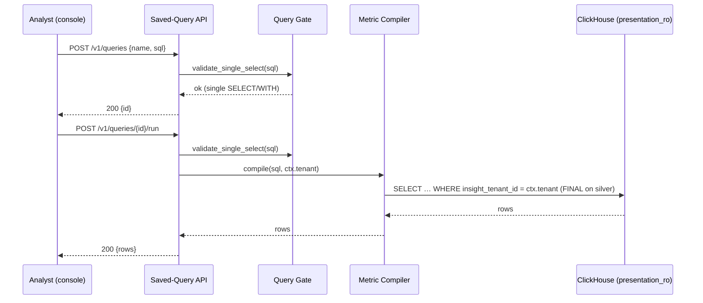
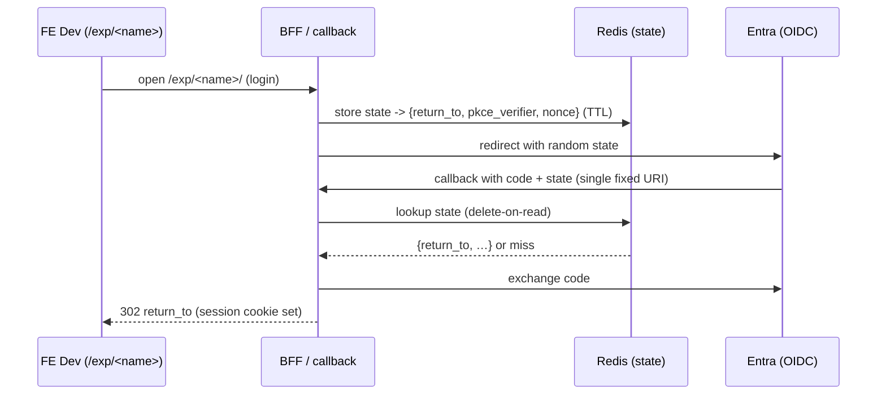

# Technical Design — Presentation Layer


<!-- toc -->

- [1. Architecture Overview](#1-architecture-overview)
  - [1.1 Architectural Vision](#11-architectural-vision)
  - [1.2 Architecture Drivers](#12-architecture-drivers)
  - [1.3 Architecture Layers](#13-architecture-layers)
- [2. Principles & Constraints](#2-principles--constraints)
  - [2.1 Design Principles](#21-design-principles)
  - [2.2 Constraints](#22-constraints)
- [3. Technical Architecture](#3-technical-architecture)
  - [3.1 Domain Model](#31-domain-model)
  - [3.2 Component Model](#32-component-model)
  - [3.3 API Contracts](#33-api-contracts)
  - [3.4 Internal Dependencies](#34-internal-dependencies)
  - [3.5 External Dependencies](#35-external-dependencies)
  - [3.6 Interactions & Sequences](#36-interactions--sequences)
  - [3.7 Database Schemas & Tables](#37-database-schemas--tables)
- [4. Additional context](#4-additional-context)
  - [4.1 Implementation Plan](#41-implementation-plan)
  - [4.2 Promotion Ladder (FE)](#42-promotion-ladder-fe)
  - [4.3 Open Decisions](#43-open-decisions)
  - [4.4 Out of Scope (Phase B)](#44-out-of-scope-phase-b)
- [5. Traceability](#5-traceability)

<!-- /toc -->

- [ ] `p3` - **ID**: `cpt-presentation-design-presentation`

## 1. Architecture Overview

### 1.1 Architectural Vision

Insight is split into two layers along an explicit contract. The Engineering layer owns silver facts (`class_*`, `fct_*`, `mtr_*`) and identity artifacts (`person.*`, `identity.*`); it is read-only to presentation and evolves additively. The Presentation layer owns gold, the query API, and the FE; it reads the contract and writes only its own `presentation` namespace.

Phase A ships the boundary and its three guarantees only — no metric semantics move. The source is safe by construction (a read-only role plus a single-SELECT gate), the contract is stable (additive-only changes), and every read is tenant-scoped (a server-injected predicate). The design reuses the current analytics service (Rust) rather than introducing a new one.

Gold posture is relabel, not migrate: legacy gold stays read-only in the `insight` database where dbt builds it today, read through the read-only role as contract output; only new gold is authored in `presentation`. Physical relocation of legacy gold is a later, optional cleanup, not a Phase-A blocker.

### 1.2 Architecture Drivers

Requirements that significantly influence architecture decisions.

#### Functional Drivers

| Requirement | Design Response |
|-------------|------------------|
| `cpt-presentation-fr-single-select-gate` | `validate_single_select` in `query_gate.rs`, wired through `parse_query_ref` — the one chokepoint metric SQL crosses on write and run |
| `cpt-presentation-fr-read-only-role` | Dedicated `presentation_ro` ClickHouse role: `SELECT` on the contract, `CREATE`/`INSERT` only in `presentation`, no `DROP`/`ALTER`/`TRUNCATE` |
| `cpt-presentation-fr-namespace` | New empty `presentation` database for new gold, saved-query results, and scratch; legacy gold left read-only in `insight` |
| `cpt-presentation-fr-saved-query-crud` | `presentation.queries` is a SeaORM entity in the service database (like metric definitions); CRUD mutates that metadata, not ClickHouse. Only `/run` reaches ClickHouse — it reuses the existing read path and executes the stored SQL as `presentation_ro`, so no write grant on the contract is ever needed |
| `cpt-presentation-fr-query-params` | Named parameters, `tenant` always injected from context (not client SQL), `period` supported |
| `cpt-presentation-fr-tenant-filter` | Literal `insight_tenant_id = <ctx.tenant>` injected in one place — the compiler's shared `WHERE` — replacing the no-op |
| `cpt-presentation-fr-contract-surface-doc` | Contract surface documented as the read boundary (silver and identity objects) |
| `cpt-presentation-fr-contract-version-stamp` | Contract version stamp so presentation detects the surface it was built against |
| `cpt-presentation-fr-query-console` | Single stable FE app on the saved-query API: author, list, run, render table / auto-chart |
| `cpt-presentation-fr-preview-envs` | Path-based `/exp/<name>` on one host, one shared read-only synthetic backend, FE-only variation |
| `cpt-presentation-fr-preview-auth` | Single fixed callback with a Redis-backed opaque `state` return path, validated at store time |

#### NFR Allocation

| NFR ID | NFR Summary | Allocated To | Design Response | Verification Approach |
|--------|-------------|--------------|-----------------|----------------------|
| `cpt-presentation-nfr-source-immutability` | No presentation write reaches engineering-owned data | Single-SELECT gate + `presentation_ro` role | Two independent barriers: syntactic gate rejects non-`SELECT`; role grants forbid write/DDL on the contract | Adversarial SQL suite; verify no write/alter/drop on contract objects |
| `cpt-presentation-nfr-tenant-isolation` | No cross-tenant rows returned | Compiler shared `WHERE` | Server-injected literal tenant predicate the client SQL cannot widen | Cross-tenant isolation test returns zero rows |

### 1.3 Architecture Layers

- [ ] `p3` - **ID**: `cpt-presentation-tech-layers`

```text
┌─────────────────────────────────────────────────────────────────┐
│                      PRESENTATION LAYER                          │
│                                                                  │
│   FE                    ANALYTICS SERVICE (Rust)                 │
│   ──                    ────────────────────────                 │
│  ┌──────────────┐      ┌───────────────────────────┐            │
│  │ query console│─────▶│ saved-query API (/v1/…)    │            │
│  │ preview /exp │      │  single-SELECT gate        │            │
│  └──────────────┘      │  tenant-filter injection   │            │
│                        │  run as presentation_ro    │            │
│                        └─────────────┬─────────────┘            │
│                                      │                           │
├──────────────────────────────────── │ ──────────────────────────┤
│                CONTRACT (read-only)  ▼      presentation (write)  │
│  ┌───────────────────────────┐   ┌───────────────────────────┐  │
│  │ silver class_*/fct_*/mtr_*│   │ presentation.queries      │  │
│  │ identity person.*/identity│   │ new gold, results, scratch│  │
│  │ legacy gold in `insight`  │   └───────────────────────────┘  │
│  └───────────────────────────┘                                  │
└─────────────────────────────────────────────────────────────────┘
   ▲ produced by Engineering / ingestion layer (additive, versioned)
```

| Layer | Responsibility | Technology |
|-------|---------------|------------|
| Presentation (FE) | Query console and preview environments | FE app (path-based `/exp/<name>`) |
| Application | Saved-query API, single-SELECT gate, tenant-filter injection | Rust (analytics service) |
| Domain | Query-ref parsing, metric compiler shared `WHERE` | Rust (`domain::query_gate`, `metric_results`) |
| Infrastructure | Contract (read-only) and `presentation` (write) storage | ClickHouse; Redis for preview auth state |

## 2. Principles & Constraints

### 2.1 Design Principles

#### Read-Only by Construction

- [ ] `p2` - **ID**: `cpt-presentation-principle-read-only-by-construction`

The source is safe because two independent barriers make presentation-side writes to the contract impossible, not merely discouraged. First, the public query path accepts exactly one `SELECT`/`WITH` and rejects everything else before it reaches ClickHouse. Second, reads execute as `presentation_ro`, which has no write/DDL grant on the contract. Worst case for a broken or LLM-generated query is damage to `presentation` scratch, never the source.

#### Additive-Only Contract

- [ ] `p2` - **ID**: `cpt-presentation-principle-additive-contract`

Contract changes are additive — new tables and columns — never rewrites. Existing views keep working across contract evolution. A contract version stamp lets presentation detect the surface it was built against.

#### Server-Side Tenant Scoping

- [ ] `p2` - **ID**: `cpt-presentation-principle-server-side-tenant`

Every contract read carries a tenant predicate injected server-side from request context, in one shared place. The value never comes from client SQL, so client SQL cannot widen the scope. The mechanism is swappable in that one place when the isolation benchmark decides subtree scoping.

#### Relabel, Not Migrate

- [ ] `p2` - **ID**: `cpt-presentation-principle-relabel-not-migrate`

No gold is physically moved in Phase A. Legacy gold stays in `insight`, read as contract output through the read-only role. Only new gold is authored in `presentation`. The default form is a plain `VIEW` (compute-on-read); promote to a refreshable MV or scheduled `INSERT…SELECT` in `presentation` only when freshness needs decoupling.

### 2.2 Constraints

#### Reuse the Analytics Service

- [ ] `p2` - **ID**: `cpt-presentation-constraint-reuse-service`

Phase A reuses the current analytics service. The single-SELECT gate, tenant-filter injection, and saved-query API are added to it; no new service is introduced.

#### FINAL on Silver ReplacingMergeTree

- [ ] `p2` - **ID**: `cpt-presentation-constraint-final-reads`

Silver facts are `ReplacingMergeTree`. Reads of silver keep the `FINAL` modifier to see the deduplicated state.

#### No Orchestrator in the Platform

- [ ] `p2` - **ID**: `cpt-presentation-constraint-no-orchestrator`

There is no Argo/GitOps in the platform. Preview provisioning is manual `kubectl apply` / `helm upgrade` of a per-experiment bundle. Any future automation is a CI job, best sequenced after the planned nginx-to-Envoy move.

#### Single Preview Host

- [ ] `p2` - **ID**: `cpt-presentation-constraint-single-host`

One host serves all preview experiments, giving one Entra redirect URI (Entra has no reliable wildcard redirect). Addressing is path-based (`/exp/<name>`) with a same-origin session cookie and zero per-experiment Entra change.

#### No tenant_id on New Gold Outside the Coordinated Retrofit

- [ ] `p2` - **ID**: `cpt-presentation-constraint-tenant-id-retrofit`

New gold does not add `insight_tenant_id` outside the coordinated engineering retrofit (#1829). Where new presentation gold does carry the column, `insight_tenant_id` is first in `ORDER BY`.

## 3. Technical Architecture

### 3.1 Domain Model

**Technology**: Rust (analytics service), ClickHouse

**Location**: [src/backend/services/analytics/](../../../../src/backend/services/analytics/)

**Core Entities**:

| Entity | Description | Location |
|--------|-------------|--------|
| `presentation.queries` | Saved query: a single `SELECT`/`WITH` over the contract, tenant-scoped | ClickHouse `presentation` DB |
| Query gate | `validate_single_select` — the syntactic read-only barrier | [query_gate.rs](../../../../src/backend/services/analytics/src/domain/query_gate.rs) |
| Metric compiler | Builds contract SQL; owns the shared `WHERE` where the tenant filter is injected | [metric_results/](../../../../src/backend/services/analytics/src/domain/metric_results/) |

**Relationships**:
- `presentation.queries.sql` → contract objects (silver, identity, legacy gold in `insight`): read-only `SELECT` validated by the gate.
- `presentation.queries.insight_tenant_id` → the tenant predicate injected on run.

### 3.2 Component Model

```text
┌───────────────────────────────────────────────────────────┐
│                  Analytics Service (Rust)                  │
│                                                           │
│  ┌───────────────┐     ┌────────────────────────────┐    │
│  │ Saved-Query   │────▶│ Query Gate (query_gate.rs) │    │
│  │ API (handlers)│     │ validate_single_select     │    │
│  └──────┬────────┘     └────────────────────────────┘    │
│         │                                                  │
│         ▼                                                  │
│  ┌────────────────────────────┐                           │
│  │ Metric Compiler            │  injects tenant WHERE     │
│  │ (metric_results/)          │  runs as presentation_ro  │
│  └────────────────────────────┘                           │
└───────────────────────────────────────────────────────────┘
        │ read-only SELECT (contract)   │ write (presentation)
        ▼                               ▼
   silver / identity / insight     presentation.*
```

#### Query Gate

- [x] `p2` - **ID**: `cpt-presentation-component-query-gate`

##### Why this component exists

Makes the public query path incapable of anything but a single read, so a broken or LLM-generated query cannot damage the source. Shipped (#1962).

##### Responsibility scope

- `domain::query_gate::validate_single_select`: a single-pass syntactic gate that skips string literals, quoted identifiers, and comments, then requires a lone statement beginning with `SELECT`/`WITH`.
- Rejects empty input, multiple statements, and anything not beginning with `SELECT`/`WITH` (so DDL/DML never starts).
- Invoked through `parse_query_ref`, the one chokepoint metric SQL crosses on both write (create/update) and run; the saved-query API calls the same function.

##### Responsibility boundaries

- Does NOT enforce grants — that is the `presentation_ro` role.
- Does NOT inject the tenant predicate — that is the metric compiler.

##### Related components (by ID)

- `cpt-presentation-component-saved-query-api` — calls the gate on write and run
- `cpt-presentation-component-metric-compiler` — receives the validated single SELECT

---

#### Read-Only Role

- [x] `p2` - **ID**: `cpt-presentation-component-read-only-role`

##### Why this component exists

The second, independent barrier behind the query gate: once analytics connects as the role, even a read that slips past the gate executes under grants that make writing, altering, or dropping the source impossible. Read-only enforced by construction, not convention. The role is **provisioned** by #1963; #1964 adds the grant-less `presentation` user that carries it and points analytics at that user, so the barrier is now active.

##### Responsibility scope

- `presentation_ro` ClickHouse role: `SELECT` on the contract (silver, identity/person, legacy gold in `insight`); `SELECT`/`INSERT`/`CREATE` only in `presentation`; no `DROP`/`ALTER`/`TRUNCATE` anywhere.
- Grant-less `presentation` user (#1964): every privilege comes from `presentation_ro` (a role only *adds* privileges, so activating it on a user with direct grants would not restrict anything). This is the user analytics connects as.
- Defined as idempotent DDL in [presentation-role.sql](../../../../src/ingestion/scripts/bootstrap-db/presentation-role.sql) (role) plus [provision-presentation-access.sh](../../../../src/ingestion/scripts/bootstrap-db/provision-presentation-access.sh) (the user, which needs a password); provisioned by [apply-ch-migrations.sh](../../../../src/ingestion/scripts/apply-ch-migrations.sh) (the clickhouse-migrate hook, which bootstrap also runs), guarded so a ClickHouse admin without access-management — or a run without the user password — is skipped with a warning rather than aborting.

##### Responsibility boundaries

- Does NOT parse SQL — that is the query gate.
- Does NOT gate the switch behind a flag: analytics always connects as the `presentation` user, whose password is a required credential (like the admin one). The user is provisioned before analytics needs it — by the clickhouse-migrate Hook (gitops/chart) or the ClickHouse init scripts (compose) — so the deploy-side switch must land together with a release that carries that provisioning.

##### Related components (by ID)

- `cpt-presentation-component-query-gate` — the first barrier; the role is the second
- `cpt-presentation-component-saved-query-api` — runs as this role

---

#### Saved-Query API

- [ ] `p2` - **ID**: `cpt-presentation-component-saved-query-api`

##### Why this component exists

Plain CRUD over stored queries so a new analytics slice needs no engineering change and no re-ingest. The one new surface Phase A adds ("Data Analytics").

##### Responsibility scope

- CRUD over `presentation.queries`, tenant-scoped.
- Validate SQL via the query gate on create and update.
- Run: inject the tenant filter, execute read-only as `presentation_ro`, return untyped JSON rows (same shape as the existing metric query path).
- Named parameters: `tenant` always injected from context, `period` supported.

##### Responsibility boundaries

- Does NOT carry metric metadata, thresholds, or passports — those are Phase B.
- Does NOT bypass the gate or the tenant filter.

##### Related components (by ID)

- `cpt-presentation-component-query-gate` — validates SQL on write and run
- `cpt-presentation-component-metric-compiler` — reuses the run path

---

#### Metric Compiler (Tenant Filter)

- [ ] `p2` - **ID**: `cpt-presentation-component-metric-compiler`

##### Why this component exists

Builds contract SQL and owns the single shared `WHERE` where the tenant predicate is injected, replacing the no-op left from the single-tenant MVP.

##### Responsibility scope

- Inject a literal `insight_tenant_id = <ctx.tenant>` on every contract read, sourced from request context.
- Keep `FINAL` on silver `ReplacingMergeTree` reads.
- Put `insight_tenant_id` first in `ORDER BY` for any new presentation gold that carries it.

##### Responsibility boundaries

- Does NOT read the tenant value from client SQL.
- Does NOT implement subtree/hierarchy scoping in Phase A (deferred to the benchmark).

##### Related components (by ID)

- `cpt-presentation-component-saved-query-api` — drives the run path
- `cpt-presentation-component-query-gate` — precedes compilation

---

#### Preview Environment Router

- [ ] `p2` - **ID**: `cpt-presentation-component-preview-router`

##### Why this component exists

Serves many experimental FE builds under one host against one shared read-only synthetic backend, so FE developers get a tier-3 authoring loop that cannot touch customer data.

##### Responsibility scope

- Path-based addressing `preview.insight…/exp/<name>/`: one host, one Entra redirect URI, same-origin session cookie. FE built with a relative asset base and a runtime router basepath so one image serves under any prefix; `/api/...` stays the shared absolute path.
- Auth return path: login-initiation writes Redis `state → { return_to, pkce_verifier, nonce }` with a short TTL; Entra echoes the random `state` to the single fixed callback; the BFF looks it up (miss/expired ⇒ reject; delete-on-read), exchanges the code, sets the cookie, and `302`s to `return_to`. `return_to` is validated at store time (same-origin, `/exp/` allowlist).
- Deployment: one route object per experiment applied by hand (`Deployment` + `Service` + one routing object with prefix-strip rewrite). The controller merges same-host route objects, so `apply` adds a path and `delete` removes it; no central config is rewritten. Controller-agnostic — nginx `Ingress` today, Gateway API `HTTPRoute` after the Envoy move.

##### Responsibility boundaries

- Does NOT vary the backend per experiment — only the FE varies.
- Does NOT provision automatically — no orchestrator; manual `kubectl`/`helm`.

##### Related components (by ID)

- `cpt-presentation-component-saved-query-api` — the shared backend the FE calls

---

### 3.3 API Contracts

- [ ] `p2` - **ID**: `cpt-presentation-interface-saved-query-endpoints`

- **Contracts**: `cpt-presentation-contract-read-only-consumption`
- **Technology**: REST / HTTP JSON
- **Base path**: `/v1/queries`

Entity `presentation.queries`: `{ id, insight_tenant_id, name, description, sql, created_at, updated_at }`. `sql` is a single `SELECT`/`WITH` over the contract, validated by the gate on write and on run.

**Endpoints Overview**:

| Method | Path | Description | Stability |
|--------|------|-------------|-----------|
| `GET` | `/v1/queries` | List saved queries (tenant-scoped) | unstable |
| `POST` | `/v1/queries` | Create (validates SQL via the gate) | unstable |
| `GET` | `/v1/queries/{id}` | Fetch one | unstable |
| `PUT` | `/v1/queries/{id}` | Update (re-validates SQL) | unstable |
| `DELETE` | `/v1/queries/{id}` | Delete | unstable |
| `POST` | `/v1/queries/{id}/run` | Execute read-only, inject tenant filter, return rows | unstable |

`run` executes as `presentation_ro` and returns untyped JSON rows, the same shape as the existing metric query path. No metric metadata, thresholds, or passports in Phase A.

### 3.4 Internal Dependencies

| Dependency Module | Interface Used | Purpose |
|-------------------|----------------|----------|
| Metric compiler (`metric_results/`) | In-process call | Build contract SQL and inject the tenant `WHERE`; reused by `/run` |
| Query gate (`query_gate.rs`) | In-process call via `parse_query_ref` | Validate single SELECT on write and run |

**Dependency Rules**:
- The gate and the tenant filter are always on the run path; neither is bypassable.
- Presentation writes only to `presentation`; contract objects are read-only.

### 3.5 External Dependencies

#### ClickHouse

| Aspect | Value |
|--------|-------|
| Contract | Read-only: silver (`class_*`, `fct_*`, `mtr_*`), identity (`person.*`, `identity.*`), legacy gold in `insight` |
| Presentation namespace | New `presentation` DB: `SELECT` + `CREATE`/`INSERT` for new gold, results, scratch |
| Access | Executed as the grant-less `presentation` user, whose only privileges come via the `presentation_ro` role (SELECT on contract; CREATE/INSERT only in `presentation`) |
| Read semantics | `FINAL` on silver `ReplacingMergeTree` reads |
| Bootstrap | `presentation` DB always created (`clickhouse.initDatabases` + the core-DB block of `apply-ch-migrations.sh`); role + grant-less user via `provision-presentation-access.sh` — the user only when its password is supplied (guarded). Role DDL in `presentation-role.sql` |

#### Redis

| Aspect | Value |
|--------|-------|
| Purpose | Backs the opaque `state → { return_to, pkce_verifier, nonce }` return path for preview auth |
| Semantics | Short TTL; delete-on-read; `return_to` validated at store time |

#### Entra (OIDC)

| Aspect | Value |
|--------|-------|
| Purpose | Identity provider for the single preview host |
| Constraint | One redirect URI (no reliable wildcard redirect); single fixed callback |

### 3.6 Interactions & Sequences

#### Author and Run a Saved Query

**ID**: `cpt-presentation-seq-author-run-query`

**Use cases**: `cpt-presentation-usecase-author-run-query`

**Actors**: `cpt-presentation-actor-analyst`, `cpt-presentation-actor-analytics-svc`



**Description**: The gate validates on write and run; the compiler injects the tenant predicate; the query executes read-only as `presentation_ro`.

#### Preview Environment Login Return Path

**ID**: `cpt-presentation-seq-preview-auth`

**Use cases**: `cpt-presentation-usecase-preview-widget`

**Actors**: `cpt-presentation-actor-fe-dev`, `cpt-presentation-actor-analytics-svc`



**Description**: Nothing tamperable rides in the URL; `return_to` is validated at store time (same-origin, `/exp/` allowlist); a `state` miss or expiry is rejected.

### 3.7 Database Schemas & Tables

- [ ] `p3` - **ID**: `cpt-presentation-db-schemas`

Only one new entity is added in Phase A. It lives in the `presentation` namespace; contract objects are unchanged (read-only).

#### Table: `presentation.queries`

**ID**: `cpt-presentation-dbtable-queries`

Saved query authored by an analyst: a single `SELECT`/`WITH` over the contract, tenant-scoped.

| Column | Type | Description |
|--------|------|-------------|
| `id` | UUID | PK — saved-query identifier |
| `insight_tenant_id` | UUID | Tenant scope |
| `name` | String | Display name |
| `description` | String | Free-text description |
| `sql` | String | A single `SELECT`/`WITH` over the contract, validated by the gate |
| `created_at` | DateTime | Row creation time |
| `updated_at` | DateTime | Last modification time |

**PK**: `id`

**Additional info**: Lives in the `presentation` namespace; written via the `presentation_ro` role's `CREATE`/`INSERT` grant. Reads and runs are tenant-scoped by `insight_tenant_id`.

## 4. Additional context

### 4.1 Implementation Plan

Ordered by quick win; each step ships value or safety on its own, and no step depends on physically moving gold.

1. **Single-SELECT gate** (safety, done, #1962) — `validate_single_select`, applied on write and run via `parse_query_ref`. Shipped with no DB or infra change.
2. **`presentation_ro` role + empty `presentation` DB** (safety, done, #1963/#1964) — role + grant-less `presentation` user in CH bootstrap (`bootstrap-db/provision-presentation-access.sh`); empty DB via `clickhouse.initDatabases` + `apply-ch-migrations.sh`; analytics connects as the `presentation` user (existing `clickhouse_user`/`clickhouse_password` config → `gear.rs` `with_auth`), its password a required credential provisioned before analytics needs it.
3. **Saved-query CRUD** (value, #1965/#1966) — new entity plus migration for `presentation.queries`; handlers and routes per section 3.3; reuse the existing run path for `/run`.
4. **Tenant filter** (correctness, #1967) — replace the no-op with the injected predicate in the compiler's shared `WHERE`; `insight_tenant_id` first in `ORDER BY` for new gold; cover with an e2e metric test (`src/ingestion/tests/e2e`). Coordinated with engineering #1829.
5. **Query console** (value, FE, #1970) — thin stable app on the saved-query API: auth shell, author, list, run, render table / auto-chart. Tier-2 "promote to card" can follow.
6. **Preview environments** (infra, FE, #1971-#1973) — path-based `/exp/<name>` on a shared read-only synthetic backend; Redis-`state` return path; one route object per experiment; manual `kubectl`/`helm`.

Deferred: relocate legacy gold from `insight` to `presentation` (#1979-#1981); CI-driven preview provisioning (after the nginx-to-Envoy move).

### 4.2 Promotion Ladder (FE)

How a good result becomes a dashboard:

1. **Console** — author, run, eyeball. Self-serve, no deploy.
2. **Promote** — pin a query id as a generic dashboard card (choose chart type). Config, no deploy.
3. **Bespoke** — build a real widget over the FE, then PR it into the real FE repo; validated on a preview environment (tier 3).

Tiers 1-2 need no deploy — the unit of change is a query row. Tier 3 is the primary authoring loop and is what preview environments serve. Correctness judgment is the human's; metric passports (Phase B) harden it later.

### 4.3 Open Decisions

1. **Tenant isolation mechanism** — API-injected `WHERE` (Phase A default) vs row policy vs schema-per-tenant, plus the subtree mechanism (`ancestor_ids` array vs HIERARCHICAL dict). Decided by the isolation benchmark (`RLS_RESEARCH.md`). Phase A ships flat inject; the mechanism is swappable in one place.
2. **CI-automated preview provisioning** — whether/when a CI job automates provisioning (best after the nginx-to-Envoy move), and whether tier-3 experiments live on branches of the real FE repo or a prototype repo.
3. **Read-only on v1** — confirm the presentation layer is strictly read-only for v1 (write-back out of scope).

### 4.4 Out of Scope (Phase B)

Declarative metric registry (collapse `builtin.rs` + MariaDB `metrics` + FE thresholds into one YAML catalog with passports and a drift test); semantic raw-to-derived compiler; FE metric rework (catalog-driven thresholds, honest NULL-to-ComingSoon). Named here so Phase A does not encode choices that block them.

## 5. Traceability

- **PRD**: [PRD.md](./PRD.md)
- **ADRs**: none for this domain in Phase A.
- **Features**: to be created from later sub-issues (#1962-#1973).
