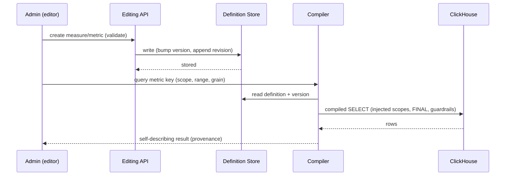
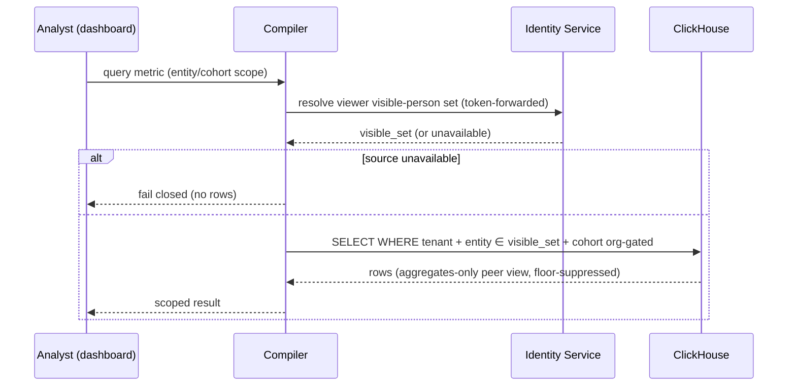

# Technical Design — Semantic Layer

<!-- toc -->

- [1. Architecture Overview](#1-architecture-overview)
  - [1.1 Architectural Vision](#11-architectural-vision)
  - [1.2 Architecture Drivers](#12-architecture-drivers)
  - [1.3 Architecture Layers](#13-architecture-layers)
- [2. Principles & Constraints](#2-principles--constraints)
  - [2.1 Design Principles](#21-design-principles)
  - [2.2 Constraints](#22-constraints)
- [3. Technical Architecture](#3-technical-architecture)
  - [3.1 Domain Model](#31-domain-model)
  - [3.2 Component Model](#32-component-model)
  - [3.3 API Contracts](#33-api-contracts)
  - [3.4 Internal Dependencies](#34-internal-dependencies)
  - [3.5 External Dependencies](#35-external-dependencies)
  - [3.6 Interactions & Sequences](#36-interactions--sequences)
  - [3.7 Database Schemas & Tables](#37-database-schemas--tables)
- [4. Additional context](#4-additional-context)
- [5. Traceability](#5-traceability)

<!-- /toc -->

- [ ] `p3` - **ID**: `cpt-semantic-layer-design-semantic-layer`

## 1. Architecture Overview

### 1.1 Architectural Vision

The semantic layer is a single system through which every analytical value is defined, validated, computed, and served. Definitions — datasets, measures, metrics, charts, dashboards — are data. A single compiler turns a definition plus a request into warehouse SQL; storage, caching, and materialization are private implementation details behind the definition contract. Semantics are owned and executed by the server, and the frontend is a renderer of definitions.

The domain model is a strict ladder: a product-owned dataset publishes a typed field catalog; a measure is a declarative aggregation of one dataset; a metric composes measures; charts and dashboards are pure presentation. Datasets carry the entire correctness burden of ingestion (deduplication, mutability, late data) so nothing above them re-solves it. The one place free-form SQL exists is the gated custom-dataset layer, which reads only dedup-safe catalog views and is wrapped from outside with tenancy and resource guardrails — a dataset-sized blast radius, never the measure engine.

Capability is a projection of code and definitions, never of stored derived rows, so an empty tenant has full authoring capability. Every query the compiler emits carries three server-injected scopes the client cannot widen: tenancy, org-scope entity visibility, and cohort isolation. Materialization is a compiler-managed, version-keyed cache of aggregated work — refreshed on a schedule, never on read, always falling back to live compute rather than serving a superseded value. The full rationale is in [REFERENCE.md](./REFERENCE.md); the migration sequence in [IMPLEMENTATION.md](./IMPLEMENTATION.md).

### 1.2 Architecture Drivers

Requirements that significantly influence architecture decisions.

#### Functional Drivers

| Requirement | Design Response |
|-------------|------------------|
| `cpt-semantic-layer-fr-definitions-as-data` | One canonical definition format defined as typed code in the owning service; authored YAML and stored rows are serializations of the same types; the definition store is the single runtime source of truth (`cpt-semantic-layer-component-definition-store`) |
| `cpt-semantic-layer-fr-one-compiler` | A single compiler (`cpt-semantic-layer-component-compiler`): definition + request → warehouse SQL; product and user definitions compile through the same path; a per-family flag selects a second executor only as a bounded cutover state |
| `cpt-semantic-layer-fr-gated-custom-dataset` | The custom-dataset component (`cpt-semantic-layer-component-custom-dataset`): role-gated, default off, references checked against the catalog, execution wrapped with tenancy from outside and resource guardrails, reads dedup-safe catalog views only |
| `cpt-semantic-layer-fr-capability-from-definitions` | Capability derived from the field catalog and stored definitions (`cpt-semantic-layer-component-field-catalog`); distinct dimension values served separately with an explicit unavailable state |
| `cpt-semantic-layer-fr-server-owned-semantics` | The compiler owns all rendering; responses are self-describing with provenance; the discovery API (`cpt-semantic-layer-component-discovery-api`) is the only vocabulary a client renders from |
| `cpt-semantic-layer-fr-query-time-grain` | Grain is a compiler request parameter; bucketing is in the tenant reporting time zone (`cpt-semantic-layer-constraint-reporting-timezone`); windows/cumulative are compiler features |
| `cpt-semantic-layer-fr-tenant-isolation` | The compiler's injected-scopes component (`cpt-semantic-layer-component-injected-scopes`) adds a tenancy predicate to every emitted query, sourced from request context |
| `cpt-semantic-layer-fr-org-scope-visibility` | The injected-scopes component adds an `entity ∈ visible_set` predicate resolved from the identity service, fail-closed if unavailable; the structural-safety-boundary principle governs it |
| `cpt-semantic-layer-fr-scope-isolation` | Cohort membership is an org-gated dataset; the injected-scopes component re-asserts the org boundary per cohort key; peer views are aggregates-only, memberless, floor-suppressed |
| `cpt-semantic-layer-fr-discovery-api` | The discovery API component serves the catalog, editor field catalogs, and paginated distinct values; requests validate against the same catalog |
| `cpt-semantic-layer-fr-materialization-cache` | The materialization cache component (`cpt-semantic-layer-component-materialization-cache`): version-keyed aggregated work, scheduled refresh, read-time fallback to live compute |
| `cpt-semantic-layer-fr-runtime-editing` | The editing API component (`cpt-semantic-layer-component-editing-api`): role-gated CRUD per layer sharing seed-reconciliation validators, version bumps, and appended revisions |

#### NFR Allocation

This table maps non-functional requirements from the PRD to specific design responses.

| NFR ID | NFR Summary | Allocated To | Design Response | Verification Approach |
|--------|-------------|--------------|-----------------|----------------------|
| `cpt-semantic-layer-nfr-source-read-discipline` | Reads never bypass dataset dedup | Compiler + dataset metadata + custom-dataset views | Read discipline inherited from dataset metadata, applied by the compiler; custom SQL reads only dedup-safe catalog views | Adversarial tests: no dedup bypass; validator rejects raw-table references |
| `cpt-semantic-layer-nfr-tenant-isolation` | No cross-tenant rows | Injected-scopes component | Tenancy predicate on every emitted query, from request context, not widenable by definitions | Isolation e2e over every compiled read path returns zero cross-tenant rows |
| `cpt-semantic-layer-nfr-entity-visibility` | No out-of-scope persons | Injected-scopes component + identity service | `entity ∈ visible_set` predicate beside tenancy; fail-closed on unavailable source | Scope tests: zero out-of-scope persons returned/disclosed; unavailable source yields no rows |
| `cpt-semantic-layer-nfr-cohort-scope-isolation` | No cross-boundary cohorts | Cohort dataset + injected-scopes component | Org-gated membership at dataset build; boundary re-asserted per cohort key; memberless, floor-suppressed peer views | Cohort tests: zero cross-boundary members for any key; no peer view below the floor |
| `cpt-semantic-layer-nfr-executor-consistency` | Cutover parity | Compiler + e2e suite | Shadow-compare per family; divergence classes resolved before flip | 100% of existing e2e expectations green against the compiler |
| `cpt-semantic-layer-nfr-query-guardrails` | Every query bounded | Compiler | Row caps, timeout classes, memory bounds on every emitted query and cache rebuild | Every compiled query bounded; a pathological definition fails loudly |

#### ADR Links

- `cpt-semantic-layer-adr-adopt-compiler-over-datasets` — records the decision to adopt one compiler over datasets (definitions-as-data) as the Phase B target, over incremental dual-authoring or an external semantic layer, and the per-family shadow-compare-then-delete cutover that governs it.

### 1.3 Architecture Layers

```text
┌───────────────────────────────────────────────────────────────────┐
│                        SEMANTIC LAYER                               │
│                                                                    │
│   FE (renderer)              ANALYTICS SERVICE (Rust)              │
│   ─────────────              ────────────────────────             │
│  ┌───────────────┐   discovery / query / definitions APIs         │
│  │ dashboards    │──▶┌──────────────────────────────────────────┐ │
│  │ editors       │   │ Definition Store  ──►  Compiler          │ │
│  │ pickers       │   │ Field Catalog          (single executor) │ │
│  └───────────────┘   │ Injected Scopes: tenant / org / cohort   │ │
│                      │ Materialization Cache (version-keyed)     │ │
│                      └──────────────────┬───────────────────────┘ │
│                                         │ compiled SELECT         │
├─────────────────────────────────────── │ ─────────────────────────┤
│                          DATASETS (read-only, dedup-safe views)   │
│  ┌───────────────────────────────┐   ┌──────────────────────────┐ │
│  │ product datasets (silver/gold)│   │ custom datasets (gated)  │ │
│  │ field catalog (generated)     │   │ SQL over catalog views   │ │
│  └───────────────────────────────┘   └──────────────────────────┘ │
└───────────────────────────────────────────────────────────────────┘
   ▲ org-chart visible set resolved from the identity service
   ▲ base facts produced by bronze→silver ingestion (class contracts)
```

- [ ] `p3` - **ID**: `cpt-semantic-layer-tech-layers`

| Layer | Responsibility | Technology |
|-------|---------------|------------|
| Presentation (FE) | Renderer of definitions: dashboards, editors, pickers, error states | FE app driven by discovery/dashboard payloads |
| Application | Discovery, query, and definition APIs; validation; injected scopes | Rust (analytics service) |
| Domain | Definition store, compiler, field catalog, materialization cache | Rust (`domain::definitions`, `domain::compiler`, `domain::catalog`) |
| Infrastructure | Datasets and version-keyed cache; org-chart visibility source | ClickHouse; identity service |

## 2. Principles & Constraints

### 2.1 Design Principles

#### Definitions Are Data

- [ ] `p2` - **ID**: `cpt-semantic-layer-principle-definitions-as-data`

Anything a user may eventually edit is a row in the definition store, never code. Product-shipped and user-created definitions are the same kind of object with different ownership. Truth is base facts plus definitions; any derived value is a cached evaluation of a definition, and caches are invalidated by definition version — they are never the contract.

#### One Executor

- [ ] `p2` - **ID**: `cpt-semantic-layer-principle-one-executor`

A single compiler turns definitions into queries. Two interpreters of one definition format diverge on null handling, time zones, and deduplication, so a second executor exists only as a bounded transitional state during cutover and retires on flip.

#### No Invented Languages

- [ ] `p2` - **ID**: `cpt-semantic-layer-principle-no-invented-languages`

Every layer of the definition format reuses a proven external shape: the MetricFlow semantic-model envelope for the aggregation shape, MBQL / JSON-Logic structured predicate trees for filters, and allowlisted SQL fragments (parsed, AST-restricted) for scalar expressions. The system owns one small composition schema, not an expression language; each corner case (nulls, typing, precedence) has a reference answer in a published spec rather than a design meeting.

#### Semantics Are Server-Owned

- [ ] `p2` - **ID**: `cpt-semantic-layer-principle-server-owned-semantics`

Clients request by key and render what they are given. Meaning — filters, formulas, windows, formatting identity — never lives in a client. Adding or changing a metric, chart, or dashboard is a data change that ships no frontend code; capability comes to the client only through discovery.

#### The Safety Boundary Is Structural

- [ ] `p2` - **ID**: `cpt-semantic-layer-principle-structural-safety-boundary`

Users compose from typed catalogs through closed grammars; free-form SQL exists at exactly one gated layer with dataset-sized blast radius. The same structural discipline governs authorization: tenancy, org-scope entity visibility, and cohort isolation are injected server-side at the single compiler choke point, beside each other, and no definition or client input can widen them. Fail closed when the authorization source is unavailable. Cohort membership is org-gated at the dataset that produces it and re-asserted as an injected scope, so a shared tag cannot route a person across the org boundary.

#### Capability from Code, Not Data

- [ ] `p2` - **ID**: `cpt-semantic-layer-principle-capability-from-code`

What can be asked is a function of shipped connectors and stored definitions; a tenant with zero ingested rows has full authoring capability. Dimension keys come from code and definitions; dimension values come from data through a dedicated distinct-values path with an explicit unavailable state. Capability is never inferred from stored derived rows.

### 2.2 Constraints

#### Editability Boundary

- [ ] `p2` - **ID**: `cpt-semantic-layer-constraint-editability-boundary`

Full composition freedom above the dataset line, none below it: datasets are product-owned (ingestion code); custom datasets are dataset-author-role, default off; the field catalog is nobody's to edit (derived from schemas); measures/metrics are admin-edited; charts/dashboards are admin and optionally end-user edited. Moving this line is an explicit design decision, never an incremental widening.

#### SQL Only at the Dataset Layer

- [ ] `p2` - **ID**: `cpt-semantic-layer-constraint-sql-only-at-dataset-layer`

Free-form SQL produces rows (datasets); structure produces meanings (measures, metrics). The measure layer never accepts SQL: the final aggregation and column roles can never move into SQL because they are what the platform operates on (grain, scope, cache, composition, discovery). SQL at the measure layer would opt out of every platform feature, so it is confined to the gated custom-dataset layer, which only yields a schema.

#### Code-Owned Schema, Defined Once

- [ ] `p2` - **ID**: `cpt-semantic-layer-constraint-code-owned-schema`

The definition format is typed code in the owning service; parser, validators, compiler, and editing APIs consume the same types, and machine-readable schema for external tooling is exported from them, never hand-maintained. Product definitions are validated at build time (an invalid definition fails the build) and structurally validated against the warehouse at startup; tenant definitions get the identical validators at write time. An invalid definition is never written.

#### Reporting Timezone

- [ ] `p2` - **ID**: `cpt-semantic-layer-constraint-reporting-timezone`

Bucketing happens in a single declared per-tenant reporting time zone (a tenant profile setting, default UTC) with no per-request override. A per-request time zone would make the same request mean different things per client, violating server-owned semantics; exploration-style shifting, if ever wanted, is a separate explicit API capability, not a bucketing parameter.

## 3. Technical Architecture

### 3.1 Domain Model

**Technology**: Rust (analytics service typed definitions), ClickHouse (datasets and cache)

**Location**: [src/backend/services/analytics/](../../../../src/backend/services/analytics/)

**Core Entities**:

| Entity | Description | Location |
|--------|-------------|--------|
| Dataset | Product-owned relation with guaranteed dedup/tenant semantics; the correctness boundary | `domain::definitions` (dataset rows) |
| Custom dataset | Gated, role-authored SQL `SELECT` over dedup-safe catalog views, registered as a catalog entry | `domain::definitions` (custom-dataset rows) |
| Field catalog | Typed, role-annotated schema generated from dataset schemas; the authoring palette and validation universe | `domain::catalog` (build-time artifact) |
| Measure | Declarative aggregation of one dataset — filter tree, aggregation kind, event time, entity, dimensions | `domain::definitions` (measure rows) |
| Metric | Composition of measures — computation, transform (affine + clamp), display identity | `domain::definitions` (metric rows) |

**Relationships**:
- Dataset → field catalog: each dataset publishes its typed fields (entity, dimension, measurable, event time). A field absent from the catalog does not exist at any layer above.
- Measure → dataset: a measure aggregates exactly one dataset; its `dimensions` list is its dimension capability, with no separate capability registry.
- Metric → measures: a metric composes one or more measures; its dimension capability is the intersection of its inputs' dimension sets. Cross-dataset metrics compose at the aggregated level (join on entity, time bucket, conformed dimensions), never row-level.
- Chart/dashboard → metric: pure presentation references; `ON DELETE RESTRICT` upward through the chain.

### 3.2 Component Model

```text
┌──────────────────────────────────────────────────────────────┐
│                   Analytics Service (Rust)                    │
│                                                              │
│  ┌───────────────┐   ┌───────────────┐   ┌────────────────┐ │
│  │ Editing API   │──▶│ Definition    │──▶│ Field Catalog  │ │
│  │ Discovery API │   │ Store         │   │ (generated)    │ │
│  └───────────────┘   └───────┬───────┘   └────────┬───────┘ │
│                              │                     │         │
│                              ▼                     ▼         │
│                     ┌──────────────────────────────────────┐ │
│                     │ Compiler (single executor)           │ │
│                     │  + Injected Scopes (tenant/org/cohort)│ │
│                     └───────┬───────────────────┬──────────┘ │
│                             │                    │            │
│                             ▼                    ▼            │
│                   Materialization Cache    datasets /         │
│                   (version-keyed)          custom-dataset views│
└──────────────────────────────────────────────────────────────┘
```

#### Compiler

- [ ] `p2` - **ID**: `cpt-semantic-layer-component-compiler`

##### Why this component exists

The single executor: definition plus request in, warehouse SQL out. One executor removes the drift class that two interpreters of one format would produce (nulls, time zones, deduplication).

##### Responsibility scope

- Catalog resolution and type checking; filter-tree and expression-AST rendering; per-dataset read discipline inherited from dataset metadata; dimension-capability validation.
- The time model: query-time grain bucketing in the tenant reporting time zone; windowed and cumulative modes parameterized at request time.
- Metric composition (all computation types) and the post-aggregation transform stage.
- Delegates every server-injected predicate to the injected-scopes component and bounds every emitted query with resource guardrails.

##### Responsibility boundaries

- Does NOT read scope values from client SQL or definitions — scopes come from request context via the injected-scopes component.
- Does NOT own storage or cache policy — it reads the store and the cache and falls back to live compute.
- Does NOT accept free-form SQL at the measure layer — that is the custom-dataset component.

##### Related components (by ID)

- `cpt-semantic-layer-component-definition-store` — reads definitions from it
- `cpt-semantic-layer-component-injected-scopes` — delegates every server-side predicate to it
- `cpt-semantic-layer-component-materialization-cache` — reads cached work, falls back to live compute

---

#### Definition Store

- [ ] `p2` - **ID**: `cpt-semantic-layer-component-definition-store`

##### Why this component exists

Definitions live in application-owned storage so they can be authored, versioned, audited, and validated uniformly, and so the store is the single runtime source of truth for every consumer.

##### Responsibility scope

- Versioning: semantic changes increment `definition_version` (canonicalize semantic fields, compare, compare-and-set bump); presentation-only changes do not. Versions are strictly monotonic and never reused. Reads are version-keyed so superseded cache entries are logically dead the moment the version bumps.
- Referential integrity (metrics→measures, charts→metrics, dashboards→charts; deletion blocked while referenced or explicit cascade); ownership and tenancy (product definitions tenant-invariant and read-only; tenant definitions namespaced so they cannot shadow product keys); auditability (append-only revisions).
- Fail closed on the control plane only: a missing/unreadable store is a startup error; "no definitions found" never presents as "no capability"; warehouse state is never a startup gate.
- Warehouse-divergence is a state, not a crash: a continuous background probe reconciles declared contracts with the live warehouse and puts affected definitions into a self-healing `unavailable` state (alarmed if persistent).

##### Responsibility boundaries

- Does NOT execute queries — that is the compiler.
- Does NOT probe the warehouse inline on the serving path — serving and discovery read the stored availability state.

##### Related components (by ID)

- `cpt-semantic-layer-component-editing-api` — the write path into the store
- `cpt-semantic-layer-component-compiler` — the primary reader
- `cpt-semantic-layer-component-field-catalog` — validates definitions at write time

---

#### Field Catalog

- [ ] `p2` - **ID**: `cpt-semantic-layer-component-field-catalog`

##### Why this component exists

Every dataset publishes a typed, role-annotated catalog of its fields — the editor's palette, the compiler's validation universe, and the discovery API's vocabulary at once. It is what makes capability a projection of definitions rather than data.

##### Responsibility scope

- Generated from dataset schemas (a Rust build-time generator sharing the backend's definition parsers, sourced from dbt `schema.yml` `meta:` blocks), never hand-maintained. Roles: entity, dimension, measurable, event time.
- Declares conformed dimensions — the same key means the same identity space across datasets — which is what makes cross-measure composition and shared filters meaningful.
- Serves as the validation universe: a field absent from the catalog does not exist at any layer above.

##### Responsibility boundaries

- Does NOT hold dimension values — those come from data via the discovery distinct-values path.
- Does NOT persist as a runtime store row until custom datasets exist — it is a build-time artifact through Phases 1–4, store-backed only once custom datasets are registered.

##### Related components (by ID)

- `cpt-semantic-layer-component-dataset` — generated from dataset schemas
- `cpt-semantic-layer-component-discovery-api` — exposes the catalog vocabulary
- `cpt-semantic-layer-component-measure` — the palette measures compose from

---

#### Dataset

- [ ] `p2` - **ID**: `cpt-semantic-layer-component-dataset`

##### Why this component exists

A queryable relation with guaranteed semantics (deduplicated, tenant-scoped, stable names/types) that carries the entire correctness burden of ingestion, so nothing above it re-solves mutability, late data, or source quirks. Datasets are also the retention boundary — a measure evaluates only as far back as its dataset's history reaches, and that horizon is part of the served contract.

##### Responsibility scope

- Reuse existing bronze→silver ingestion, class contracts, and purpose-built gold relations (state intervals, cohorts) as named datasets; carry read discipline (dedup strategy, FINAL) as dataset metadata the compiler inherits.
- Cohort membership is a dataset with org-gated composition (a person's cohort is drawn from within their org scope; tags refine within the boundary, never across it).
- Expose row-level relations to custom SQL only through dedup-safe catalog views.

##### Responsibility boundaries

- Does NOT aggregate — aggregation is the measure layer.
- Does NOT decide scope at read time — the compiler injects tenancy and org/cohort scopes.

##### Related components (by ID)

- `cpt-semantic-layer-component-field-catalog` — published from dataset schemas
- `cpt-semantic-layer-component-custom-dataset` — the gated authoring counterpart
- `cpt-semantic-layer-component-injected-scopes` — re-asserts cohort org-gating

---

#### Custom Dataset

- [ ] `p2` - **ID**: `cpt-semantic-layer-component-custom-dataset`

##### Why this component exists

The single gated home for everything the measure layer deliberately cannot express — cross-dataset joins, sequence/window logic, nested aggregation, correlated comparisons — with a dataset-sized blast radius: a defective custom dataset breaks itself and its dependents, visibly, never the measure engine or another dataset.

##### Responsibility scope

- Registration: parse the `SELECT`, check references against the catalog, capture the result schema, annotate result columns with catalog roles; the annotated schema becomes an ordinary catalog entry.
- Read surface: dedup-safe catalog views only — raw tables, source payloads, and pipeline intermediates are not referenceable, so read discipline is unbreakable by construction.
- Execution: always wrapped — tenancy applied from outside the statement, resource guardrails bounding it; lineage marks everything built on a custom dataset.
- Lifecycle: role-gated (default off), versioned with revisions, availability cascades to dependents; definitions form a DAG (cycles rejected at registration); deletion blocked while referenced; forking prefills an editor from a displayed body as a stopgap, with divergence surfaced.

##### Responsibility boundaries

- Does NOT guarantee semantic correctness of the SQL — that is the author's; the product guarantees safety and isolation.
- Does NOT bypass tenancy or guardrails — both are applied from outside the statement.

##### Related components (by ID)

- `cpt-semantic-layer-component-dataset` — becomes a peer catalog entry
- `cpt-semantic-layer-component-field-catalog` — references validated against it
- `cpt-semantic-layer-component-measure` — composes on the registered schema

---

#### Measure

- [ ] `p2` - **ID**: `cpt-semantic-layer-component-measure`

##### Why this component exists

The lowest editable layer and the atom every metric is built from: a declarative aggregation of one dataset whose declarations are the SQL's type signature — five fields with no logic in them — keeping the platform feature set (grain, scope, cache, composition, discovery) mechanical.

##### Responsibility scope

- Envelope (MetricFlow shape): aggregation as a closed enum (`count`, `sum`, `avg`, `min`, `max`, `count_distinct`), an expression slot (`value_expr`), an explicit event-time field, an entity field, and a dimension list.
- Filter grammar: MBQL / JSON-Logic structured predicate trees (`all`/`any`/`not` over `{field, op, value}` leaves; closed operator enum; fields resolve in the catalog with a compatible type).
- Capability by declaration: an absent declaration switches a feature off, never rejects the definition; the two things that can never move into SQL are the final aggregation and column roles.

##### Responsibility boundaries

- Does NOT express row-level cross-dataset relations, sequence logic, or correlated comparisons — those go to a dataset below the line.
- Does NOT accept free-form SQL — only allowlisted scalar-expression fragments (parsed, AST-restricted).

##### Related components (by ID)

- `cpt-semantic-layer-component-field-catalog` — the palette it composes from
- `cpt-semantic-layer-component-metric` — composes measures into served values
- `cpt-semantic-layer-component-compiler` — renders the measure to SQL

---

#### Metric

- [ ] `p2` - **ID**: `cpt-semantic-layer-component-metric`

##### Why this component exists

Composes measures into a served value with a display identity, so the served contract is a named, formatted, direction-bearing thing rather than a raw aggregation.

##### Responsibility scope

- Computation over role-typed measure inputs (direct, ratio, derived expression over named inputs); an optional post-aggregation shaping stage (affine transform, clamping); display identity (direction, format, naming).
- Derived dimension capability: the intersection of inputs' dimension sets, with dimension-agnostic inputs (constants, global denominators) as identity elements.
- Cross-dataset composition at the aggregated level: each input aggregates within its dataset; the compiler joins aggregates on entity, time bucket, and conformed dimensions.

##### Responsibility boundaries

- Does NOT re-aggregate row-level across datasets — that need becomes a product or custom dataset.
- Does NOT hold presentation — view, layout, thresholds are chart/dashboard concerns.

##### Related components (by ID)

- `cpt-semantic-layer-component-measure` — its inputs
- `cpt-semantic-layer-component-compiler` — composes and shapes it into SQL

---

#### Materialization Cache

- [ ] `p2` - **ID**: `cpt-semantic-layer-component-materialization-cache`

##### Why this component exists

A compiler-managed cache tier, invisible to the contract, that stores work not answers: one cached representation of each measure's aggregated rows at the finest served grain covers the entire request space by re-aggregation, unlike a request→response cache that pays off only when identical questions repeat.

##### Responsibility scope

- Cached row shape follows the aggregation math: additive → one row per entity × time bucket × dimension tuple; percentile-family → one row per source event; distinct-count → one row per counted subject.
- One shared cache relation for all measures, partitioned by `(measure key, definition version, time bucket)` so invalidation and refresh are atomic partition operations and tenant-created measures never trigger DDL. Custom-dataset materialization gets its own per-version relation (the one place DDL binds to a runtime object, bounded to promotion events).
- Caching is policy, not semantics: an enable/refresh/hot-window/watermark policy separate from the definition; toggling it never bumps the version. Refresh is scheduled (never read-triggered), rebuilds a hot window by partition replacement, and walks the definition DAG topologically.
- Read decision per input measure: policy enabled, cached version equals current definition version, requested range inside coverage watermarks, and availability == available → read cache; otherwise compile live.

##### Responsibility boundaries

- Does NOT serve a superseded definition — a version bump makes prior rows logically dead; after a semantic bump the fallback is live compute or `unavailable`, never the previous table.
- Does NOT gate the read path on a build — no request pays a build or stampedes one.

##### Related components (by ID)

- `cpt-semantic-layer-component-compiler` — the only reader/writer of the cache
- `cpt-semantic-layer-component-definition-store` — supplies the version the cache is keyed by

---

#### Discovery API

- [ ] `p2` - **ID**: `cpt-semantic-layer-component-discovery-api`

##### Why this component exists

The server tells clients what exists so they never hardcode or probe; it is the single vocabulary that keeps requests and served capability from disagreeing.

##### Responsibility scope

- Serve the catalog of metrics and measures visible to the tenant (product ∪ tenant) with computation, format, direction, and allowed dimensions.
- For editors: dataset field catalogs with roles and types, including each dataset's read-only display body (custom datasets from their store row; product datasets as a build-generated artifact of the shipped model SQL, stamped with the build).
- On demand: distinct dimension values from data, paginated, with an explicit unavailable state for unscanned or oversized value sets.
- Validate requests against the same catalog it serves.

##### Responsibility boundaries

- Does NOT execute the shipped body or hold a second source of truth — the display copy is derived at build time, never authored, never executed.
- Does NOT compute values — that is the query path over the compiler.

##### Related components (by ID)

- `cpt-semantic-layer-component-field-catalog` — the vocabulary it exposes
- `cpt-semantic-layer-component-definition-store` — the visible definitions it lists

---

#### Editing API

- [ ] `p2` - **ID**: `cpt-semantic-layer-component-editing-api`

##### Why this component exists

Role-gated runtime CRUD per definition layer so an authorized user changes analytics without a deploy, with the same assurance as seed reconciliation.

##### Responsibility scope

- CRUD per layer (charts/dashboards → metrics → measures → custom datasets), running the same validators as seed reconciliation with precise field-level errors; validate-only dry runs; fork; cache-policy changes.
- One write path: seed reconciliation and the editing API share validators. Semantic writes bump the version and append a revision; deletes are blocked with the referencing keys while referenced.
- This surface is also the agent/MCP tool surface — machine authors get the same endpoints and validation, never a separate path.

##### Responsibility boundaries

- Does NOT let a tenant definition shadow a product key — tenant keys are namespaced.
- Does NOT skip validation for any author, human or machine.

##### Related components (by ID)

- `cpt-semantic-layer-component-definition-store` — the store it writes to
- `cpt-semantic-layer-component-field-catalog` — the validation universe it checks against

---

#### Injected Scopes

- [ ] `p2` - **ID**: `cpt-semantic-layer-component-injected-scopes`

##### Why this component exists

Authorization is structural, not per-endpoint: the compiler injects, on every query, three server-side scopes the client cannot widen, at the single choke point. A new read path cannot forget them because they live where every query is emitted.

##### Responsibility scope

- Tenancy: a tenancy predicate on every emitted query, sourced from request context, not from any definition or client input.
- Org-scope entity visibility: an `entity ∈ visible_set` predicate resolved from the identity service's org chart (self plus related subtree). People outside the set are never returned and their existence is not disclosed; fail closed if the source is unavailable. Definitions stay scope-agnostic; the scope is injected per request exactly like tenancy.
- Cohort isolation: re-assert the org boundary for every cohort key (not only `org_unit`) so a tag-based cohort cannot span org scope; peer/cross-cohort comparison is aggregates-only — distributions with no member ids, suppressed below a minimum distinct-member floor.

##### Responsibility boundaries

- Does NOT resolve the org chart itself — that is the identity service; this component consumes the visible set.
- Does NOT produce cohort membership — that is the cohort dataset; this component re-asserts its org-gating at read time.

##### Related components (by ID)

- `cpt-semantic-layer-component-compiler` — hosts the injection at the single choke point
- `cpt-semantic-layer-component-dataset` — cohort membership dataset it re-asserts over

---

### 3.3 API Contracts

- [ ] `p2` - **ID**: `cpt-semantic-layer-interface-query-endpoints`

- **Implements**: `cpt-semantic-layer-interface-query-api` (PRD §7.1 Public API Surface)
- **Contracts**: `cpt-semantic-layer-contract-visibility-consumption`, `cpt-semantic-layer-contract-warehouse-read`
- **Technology**: REST / HTTP JSON
- **Base path**: `/v1/metric-results`, `/v1/metrics/queries` (stable across cutover)

A query requests a served value by metric key with entity scope, date range, grain, dimensions, filters, and view. Responses are self-describing and carry provenance: definition version, cache-or-computed, data-available-from, and availability state. The request shape is validated against the same catalog discovery serves; the injected scopes (tenant, org, cohort) are applied server-side and are not request fields.

**Endpoints Overview**:

| Method | Path | Description | Stability |
|--------|------|-------------|-----------|
| `POST` | `/v1/metric-results` | Compile and serve one metric result (scope, range, grain, dimensions, filters, view); provenance in the response | stable |
| `POST` | `/v1/metrics/queries` | Batch metric queries in one request (the e2e parity surface) | stable |
| `GET` | `/v1/discovery/metrics` | Catalog of visible metrics/measures with capability | unstable |
| `GET` | `/v1/discovery/datasets` | Editor field catalogs with roles, retention, origin, and display body | unstable |
| `GET` | `/v1/discovery/dimension-values` | Paginated distinct dimension values with an explicit unavailable state | unstable |
| `POST` | `/v1/definitions/{layer}` | Role-gated create/edit per layer (shared validators, version bump, appended revision) | unstable |

The query contract is held stable across the executor cutover; discovery and definition surfaces grow additively. Detailed request/response field specs are feature-level and out of scope for this design.

### 3.4 Internal Dependencies

| Dependency Module | Interface Used | Purpose |
|-------------------|----------------|----------|
| Definition store (`domain::definitions`) | In-process call | Read validated definitions and versions the compiler serves |
| Field catalog (`domain::catalog`) | In-process call | Validate definitions and requests against the typed vocabulary |
| Materialization cache | In-process call | Read cached aggregated work; fall back to live compute on miss/mismatch |

**Dependency Rules**:
- The compiler is the only executor; product and tenant definitions compile through the same path.
- Injected scopes are always applied at the compiler; no read path bypasses them.
- `SecurityContext` is propagated across all in-process calls and is the sole source of scope values.

### 3.5 External Dependencies

#### ClickHouse

| Aspect | Value |
|--------|-------|
| Datasets | Read-only through dedup-safe catalog views; read discipline (FINAL/dedup) inherited from dataset metadata |
| Cache | Compiler-managed version-keyed relation, partitioned by `(measure key, definition version, time bucket)`; custom-dataset materialization gets a per-version relation on promotion |
| Read semantics | Query-time grain bucketed in the tenant reporting time zone; guardrails (row caps, timeout classes, memory) on every emitted query |
| Convergence | A relation lagging its declared contract puts affected definitions into an `unavailable` state; the warehouse is never a startup gate |

**Dependency Rules**:
- Only the compiler and the cache refresh jobs talk to ClickHouse.
- Custom SQL reads only catalog views, never raw tables or intermediates.

#### Identity Service

| Aspect | Value |
|--------|-------|
| Purpose | Authoritative source of org-chart visibility (the viewer's visible-person set) and cohort composition |
| Semantics | Token-forwarded visible-set resolution injected as the entity-visibility scope; fail closed if unavailable |
| Current state | Enforced today at the request boundary via `person_visibility` → `/v1/visible-persons`; moves into the compiler's shared `WHERE` under compiler-first |

**Dependency Rules**:
- Analytics never invents scope; the identity service is authoritative.
- The visible set is injected per request and is never widened by definitions or client input.

### 3.6 Interactions & Sequences

#### Author and Serve a Definition

**ID**: `cpt-semantic-layer-seq-author-and-serve`

**Use cases**: `cpt-semantic-layer-usecase-author-measure-metric`

**Actors**: `cpt-semantic-layer-actor-admin`, `cpt-semantic-layer-actor-compiler-svc`, `cpt-semantic-layer-actor-clickhouse`



**Description**: One write path validates and versions the definition; the compiler reads it and emits SQL at query-time grain with injected scopes. Capability appears in discovery the moment the definition is stored, independent of any ingested rows.

#### Register a Custom Dataset

**ID**: `cpt-semantic-layer-seq-register-custom-dataset`

**Use cases**: `cpt-semantic-layer-usecase-register-custom-dataset`

**Actors**: `cpt-semantic-layer-actor-dataset-author`, `cpt-semantic-layer-actor-compiler-svc`

```mermaid
sequenceDiagram
    participant DA as Dataset Author
    participant Ed as Editing API
    participant Cat as Field Catalog
    participant St as Definition Store

    DA ->> Ed: register SELECT over catalog views + role annotations
    Ed ->> Cat: check references (reject raw tables/intermediates)
    Cat -->> Ed: result schema resolved
    Ed ->> St: store custom dataset (versioned, DAG cycle-checked)
    St -->> Ed: registered as catalog entry
    Ed -->> DA: available; measures may compose on top
```

**Description**: The statement is parsed and validated against the catalog read surface; only dedup-safe views are referenceable. The annotated schema becomes an ordinary catalog entry with lifecycle, availability cascade, and lineage.

#### Visibility-Scoped Read

**ID**: `cpt-semantic-layer-seq-visibility-scoped-read`

**Use cases**: `cpt-semantic-layer-usecase-promote-to-dashboard`

**Actors**: `cpt-semantic-layer-actor-analyst`, `cpt-semantic-layer-actor-compiler-svc`, `cpt-semantic-layer-actor-identity-svc`



**Description**: The compiler injects tenancy, an `entity ∈ visible_set` org-scope predicate, and the cohort org-boundary at the single choke point. An unavailable authorization source fails closed; peer/cross-cohort views are memberless aggregates suppressed below the distinct-member floor.

### 3.7 Database Schemas & Tables

- [ ] `p3` - **ID**: `cpt-semantic-layer-db-schemas`

The store rewrite is additive tables plus seed repopulation, never in-place mutation of the old schema; migration burden is near zero because builtin rows are seed-reconciled from code and any `origin = 'custom'` rows get a one-shot mapping. Tables live in the analytics service database (MySQL via sea-orm, forward-only migrations). Column-level types are implementation detail; the tables and their roles are below.

**Implementation status (#2208, Phase 1 slice 1):** the four definition-core tables below — `datasets`, `measures`, `metrics`, `definition_revisions` — are shipped by migration `m20260805_000001_semantic_definition_core`, physically prefixed `semantic_` so the store coexists with the untouched legacy `metric_*` store until cutover. Their key-shape and aggregation/expression CHECK constraints are registered in the startup CHECK probe. This slice is schema only: no entities, seed reconciliation, or serving change yet (later Phase 1 slices), and `measure_cache` is deferred to Phase 2 materialization.

#### Table: `datasets`

**ID**: `cpt-semantic-layer-dbtable-datasets`

Product and custom dataset registry: the queryable relations measures build on.

| Column | Type | Description |
|--------|------|-------------|
| `key` | String | Stable dataset identifier |
| `database_relation` | String | Warehouse database + relation (or the registered custom SELECT) |
| `read_discipline` | Enum | Dedup strategy the compiler inherits |
| `retention_horizon` | Interval | History depth part of the served contract |
| `origin` | Enum | `product` \| `custom` |

**PK**: `key`

**Additional info**: Custom-dataset rows carry the validated SELECT and its captured, role-annotated schema; availability state is stored on the row and read by serving/discovery.

#### Table: `measures`

**ID**: `cpt-semantic-layer-dbtable-measures`

Declarative aggregation of one dataset — the lowest editable layer.

| Column | Type | Description |
|--------|------|-------------|
| `key` | String | Stable measure identifier |
| `dataset_ref` | String | Dataset the measure aggregates |
| `filter` | JSON | Closed-enum MBQL-style predicate tree |
| `aggregation` | Enum | `count`, `sum`, `avg`, `min`, `max`, `count_distinct` |
| `value_expr` | String | Validated allowlisted SQL fragment (nullable) |
| `event_time` | String | Event-time catalog field |
| `entity` | String | Entity catalog field |
| `dimensions` | JSON | Dimension key → value/label catalog fields |
| `definition_version` | Integer | Monotonic; bumped on semantic change |

**PK**: `key`

**Additional info**: Tenant scoping and `origin` as in the current store; CHECK-style biconditionals between aggregation and expression follow existing migration conventions.

#### Table: `metrics`

**ID**: `cpt-semantic-layer-dbtable-metrics`

Composition of measures into a served value with display identity.

| Column | Type | Description |
|--------|------|-------------|
| `key` | String | Stable metric identifier |
| `computation` | JSON | Computation over role-typed measure inputs |
| `transform` | JSON | Affine transform + clamp |
| `format` | String | Display format |
| `direction` | Enum | Good-direction indicator |
| `entity_type` | String | Entity type |
| `cohort_key` | String | Cohort key (org-gated) |
| `definition_version` | Integer | Monotonic; bumped on semantic change |

**PK**: `key`

**Additional info**: Dimension capability is derived (intersection of inputs), not stored; same tenant scoping/`origin` as measures.

#### Table: `definition_revisions`

**ID**: `cpt-semantic-layer-dbtable-definition-revisions`

Append-only audit written by every mutation path from the store's first day.

| Column | Type | Description |
|--------|------|-------------|
| `id` | UUID | Revision identifier |
| `kind` | Enum | Definition layer (dataset/measure/metric/chart/dashboard) |
| `definition_key` | String | The definition changed |
| `version` | Integer | Version at this revision |
| `actor` | String | Who changed it |
| `body` | JSON | Snapshot of the definition body |
| `created_at` | DateTime | When |

**PK**: `id`

**Additional info**: Runtime editability without audit is not acceptable in a multi-tenant product; this table is written by seed reconciliation and the editing API alike.

#### Table: `measure_cache`

**ID**: `cpt-semantic-layer-dbtable-measure-cache`

The one shared materialization relation (ClickHouse) for all measures — aggregated work, not answers.

| Column | Type | Description |
|--------|------|-------------|
| `measure_key` | String | The cached measure |
| `definition_version` | Integer | Version the row was computed under |
| `time_bucket` | DateTime | Finest served grain bucket |
| `entity` | String | Entity (additive/distinct shapes) |
| `dimension_tuple` | JSON | Dimension tuple |
| `value` | Numeric | Aggregated partial |

**PK**: `(measure_key, definition_version, time_bucket, entity, dimension_tuple)`

**Additional info**: Partitioned by `(measure key, definition version, time bucket)` so invalidation/refresh are atomic partition operations and tenant-created measures never trigger DDL. Every row is stamped with its definition version; a mismatch means recompute or reject, never serve a superseded value. Custom-dataset materialization uses a separate per-version relation created only on promotion.

## 4. Additional context

Full design rationale — principles, expressiveness limits, capability model, time model, alternatives considered, and risks — is in [REFERENCE.md](./REFERENCE.md). The migration sequence and current-code inventory (keep/rewrite/delete, phase plan, decisions) are in [IMPLEMENTATION.md](./IMPLEMENTATION.md): Phase 1 definition core, Phase 2 compiler and cutover, Phase 3 deletion, Phase 4 catalog and discovery, Phase 5 runtime editing. The adoption review is in [FINDINGS.md](./FINDINGS.md).

Open design decisions carried from the adoption review (see FINDINGS.md), pending an author/team ruling:

1. **Percentile capability is under-specified.** The expressiveness class lists percentiles, but the measure aggregation enum omits it. This design adopts the metric-level reading (percentile as a metric computation over event-grain measures, computed at read over event rows — never a percentile-of-percentiles) unless the author decides otherwise.
2. **No serving a superseded custom-dataset table after a version bump.** The previous-table fallback is restricted to refresh failures under the same definition version; after a semantic bump the fallback is live compute or `unavailable`, never a table computed under a superseded definition.
3. **Gate cache reads on availability.** The cache read decision requires `availability == available` in addition to policy, version, and coverage; an `unavailable` definition serves neither cached nor live rows but the stored unavailable error.

The declarative e2e metric suite is the cross-cutting safety rail through the executor swap and deletion; the query contract (`/v1/metric-results`, `/v1/metrics/queries`) is held stable while discovery grows additively.

## 5. Traceability

- **PRD**: [PRD.md](./PRD.md)
- **ADRs**: none yet.
- **Features**: to be created from the Phase 1–5 sub-issues of epic constructorfabric/insight#1803. #1974 shipped Phase 1's first step (metric definitions authored as data — the YAML registry replacing Rust constants), in the transitional observation-relation shape the target rewrites at cutover.
