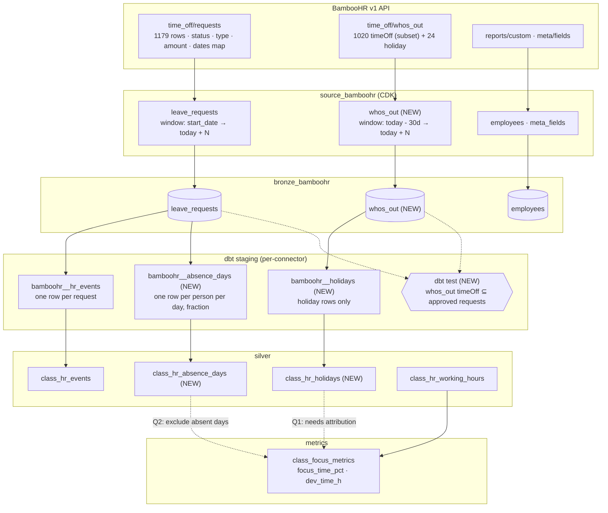

# BambooHR `whos_out` — Implementation Plan

> **Status: DRAFT FOR REVIEW.** Leave comments inline. Options are numbered so you can answer "2 — yes, 4 — no". Nothing is implemented yet.

**Why.** Both leave endpoints returned nothing to the old Virtuozzo token, so Insight carries no absence and no holiday data — and `class_focus_metrics` credits a person on two weeks of annual leave with a full 8-hour focus day, every day of it.

**What changes.** `whos_out` becomes a fourth stream on the existing CDK source, but only its 24 `holiday` rows become a fact (`class_hr_holidays`); the absence facts come from exploding the `dates` map already sitting unread in `bronze_bamboohr.leave_requests`, which turns leave into per-day, metric-ready rows.

**Steps.**
1. Probe what else the new token opens — done when the codes are recorded (Task 0).
2. Extend the leave window past today — done when a test asserts `end = today + 180` (Task 1).
3. Add the `whos_out` stream and bronze table — done when both row types land with type-qualified keys (Task 2).
4. Land the holiday calendar in silver — done when the row count matches the API for the same window (Task 3).
5. Explode leave into per-day absence facts — done when 2026 yields 3492 full and 62 partial days (Task 4).
6. Add the coverage canary — done when the subset test returns zero rows (Task 5).

**`whos_out` timeOff rows are dropped for facts — deliberate.** All 1020 of them duplicate `leave_requests` ids, 61 approved absences are missing from them, and they carry no status, type, or amount. Cheaply reversible: bronze keeps the rows raw, so a later model can pick them up.

**v2 datasets stay out of this change.** Deferred 2026-08-19 (verbal, from user); revisit after the 25 Aug release.

**Absence-aware focus metrics are not in this change.** Task 6 waits on Q2 — it moves a number that is already published.

**Risks.** Permissions can regress silently, which is what Task 5 detects. Holiday rows carry no country or calendar, so they stay unattributed until Q1 is answered. The descriptor bump in Task 2 forces a connector rebuild and reconcile.

**Out of scope.** Employee field coverage, the v2 datasets migration, `employees/changed` deletions, Jira-logged vacations, and **termination date** — still denied to the new token, so it stays a permission ask rather than a modelling problem.

**Verification.** Rerun the probe, then `./run-sync.sh bamboohr <tenant>` and `dbt test --select tag:bamboohr`: holiday rows match the API count for the window, absence days reproduce 3492 full and 62 partial for 2026, and the canary returns zero rows.

**Tech Stack:** Python Airbyte CDK source (`source_bamboohr`), ClickHouse bronze (`bronze_bamboohr.*`, ReplacingMergeTree), dbt staging models tagged `silver:*`, dbt silver classes unioned by tag.

**Spec:** this document. Evidence base: two probe runs against the Virtuozzo instance on 2026-08-19 — old token vs new token — over `meta/fields`, `reports/custom`, `time_off/requests`, and `time_off/whos_out`.

---

## 1. What the evidence says

Probe window `2026-01-01 → 2026-08-19`, new Virtuozzo token, same instance.

| Endpoint | Old token | New token |
|---|---|---|
| `GET time_off/whos_out` | 403 | **200 — 1044 rows** |
| `GET time_off/requests` | 200 `[]` | **200 — 1179 rows** |

Composition of the 1044 `whos_out` rows: **1020 `timeOff` + 24 `holiday`**.

Row shape is thin — six keys, no status, no type, no amount, no policy:

```json
{"id": 18794, "type": "timeOff", "employeeId": 1195, "name": "Marsel Singatullin", "start": "2025-12-15", "end": "2026-01-15"}
{"id": 2255,  "type": "holiday",                     "name": "New Year Day",       "start": "2026-01-01", "end": "2026-01-01"}
```

Three measured facts drive every decision below:

1. **`whos_out` timeOff ids are a subset of `leave_requests` ids — 1020 of 1020 overlap, 0 unique.** Same id space, no new rows. Nothing about a person's absence exists in `whos_out` that is not already in `leave_requests`.
2. **The subset is lossy.** 1081 requests are `approved`, only 1020 appear in `whos_out` — **61 approved absences are missing** (43 Annual Leave, 17 Sick, 1 Unpaid). So `whos_out` is not even a reliable "who is actually out" view.
3. **`leave_requests` is strictly richer.** It carries status (`approved` 1081 / `superceded` 42 / `canceled` 31 / `requested` 16 / `denied` 9), leave type, amount+unit, notes, created — and a `dates` map giving a **per-day fraction**: 3492 full days, 1058 zero days, and 62 partial days (`0.5`, `0.75`, `0.25`, `0.2`, `0.3`, `0.8`). `whos_out` only gives a start/end span, which over-counts weekends and half-days.

**The single thing `whos_out` adds is the holiday calendar** — 24 rows that `time_off/requests` never returns, and one of the four gaps named at the 17 Aug data review (leave, hire date, termination date, holidays).

That gap list is the customer's, and it has been stated the same way twice. On 10 Aug it was *"Missing: termination date, public holidays, FTE, custom fields (teams, products), leave/absence data"*, alongside *"only employee and leave_request tables currently synced; more tables needed"* and an offer to validate against their own environment once data is available. On 17 Aug it narrowed to *"missing: leave_request, hire_date, termination_date, holiday"*, with a BambooHR data-quality dashboard already tracking `leave_request` as the first gap. This plan closes leave and holidays; hire date already arrives; termination date is still denied and stays out of scope.

That holiday list has a problem, visible in the data:

```
2026-01-01 New Year Day        2026-02-28 Día de Andalucia      2026-03-25 Greek Independence Day
2026-03-29 DST start           2026-04-13 Orthodox Easter Monday 2026-05-02 Fiesta de la Comunidad Madrid
2026-06-23 Hogueras            2026-07-31 Festividad de San Ignacio de Loyola
```

Greek, Spanish, regional Spanish, pan-EU — **and "DST start", which is not a holiday at all.** Every row has `employeeId: null` and there is no calendar id, country, or location field. For a 1427-person company across 30+ countries, these 24 rows **cannot be attributed to anyone** as delivered. Treating them as company-wide non-working days would be wrong.

## 2. Recommendation

| # | Item | Verdict |
|---|---|---|
| 1 | Ingest `whos_out` `holiday` rows as a holiday calendar | **Yes** — the only new information, but park it in silver unattributed until Q1 in §6 is answered |
| 2 | Ingest `whos_out` `timeOff` rows as leave events | **No** — duplicate ids, lossy, thinner than what we already store |
| 3 | Use `whos_out` as a permission/coverage canary | **Yes** — cheap dbt test, catches a token silently losing access |
| 4 | Explode `leave_requests.dates` into per-day absence facts | **Yes, and this is the real prize** — already in bronze, nothing reads it |
| 5 | Extend the leave window past `today` | **Yes** — the stream currently ends at today, so all future approved leave is invisible |
| 6 | Subtract absence + holidays from focus metrics | **Blocked on your call** — see Q2 |

Put plainly: the question "do we get `whos_out`?" turns out to be the wrong lever. `whos_out` is worth one small stream for its holidays and a data-quality test. The absence data Insight is missing is already sitting unused in `bronze_bamboohr.leave_requests.dates`, and the metric that needs it (`class_focus_metrics`) currently credits a person on annual leave with a full 8-hour focus day.

## 3. Architecture



Solid edges are this plan. Dotted edges are gated on the open questions in §6.

**New artifacts:**

| Path | Responsibility |
|---|---|
| `src/ingestion/connectors/hr-directory/bamboohr/source_bamboohr/streams/whos_out.py` | `whos_out` stream — raw rows, both types, tenant-stamped |
| `src/ingestion/scripts/connectors-ddl/bamboohr.sql` | `bronze_bamboohr.whos_out` table |
| `.../bamboohr/dbt/bamboohr__absence_days.sql` | per-person-per-day absence fraction from the `dates` map |
| `.../bamboohr/dbt/bamboohr__holidays.sql` | holiday rows → `class_hr_holidays` staging |
| `src/ingestion/silver/hr/class_hr_absence_days.sql` | silver union by tag |
| `src/ingestion/silver/hr/class_hr_holidays.sql` | silver union by tag |
| `src/ingestion/dbt/tests/hr/assert_whos_out_subset_of_requests.sql` | coverage canary |

## 4. Why not the obvious alternatives

**Option A — map `whos_out` timeOff into `class_hr_events` alongside `leave_requests`.** Rejected. `unique_key` is built from the BambooHR request id, which is the same id in both streams, so rows either collide in the ReplacingMergeTree or, if the key is salted per stream, every absence is counted twice. It also silently degrades the record: a `whos_out` row has no status, no leave type, no amount, and no per-day fractions.

**Option B — replace `leave_requests` with `whos_out`.** Rejected on the 61 missing approved requests and on the loss of status/type/amount. `whos_out` reflects what BambooHR shows on a calendar, not what HR approved.

**Option C — skip `whos_out` entirely and take holidays from a dedicated endpoint.** The candidate is **`GET /api/v1/meta/bank-holidays`**, not `time_off/policies`: unauthenticated route checks on 2026-08-19 answered **302** for `meta/bank-holidays` and `meta/time_off/types` on both the virtuozzo and alemira hosts, while `time_off/policies` and `meta/holidays` answered **404** — so the first two are real routes and the latter two do not exist. Whether the token may read them is unprobed, which is Task 0. If `bank-holidays` returns calendars with location attribution it is a *better* holiday source than `whos_out` — which is why the holiday model below is kept thin and isolated.

## 5. Plan

> Each task ends with a green test and a commit. Tasks 1–5 are independent of the open questions; Task 6 is not.

### Task 0 — Probe what else the new token opens (30 min, no code)

- [ ] Run the probe script, which already covers `meta/bank-holidays` and `meta/time_off/types` alongside the four endpoints behind §1's evidence, and record the codes in the topic:

```bash
cd ~/projects/nda/work-office/memory/topics/2026-08-19-bamboohr-token-comparison
python3 bamboo-probe.py vz-holidays        # prompts for token and instance, nothing hits shell history
```

- [ ] Then the endpoints the script does not cover, with the same token:

```bash
export BAMBOO_DOMAIN=virtuozzo BAMBOO_TOKEN=<new>
for p in "meta/time_off/policies" "employees/changed?since=2026-01-01T00:00:00Z" \
         "changed/tables/jobInfo?since=2026-01-01T00:00:00Z"; do
  printf '%-60s %s\n' "$p" "$(curl -sS -o /dev/null -w '%{http_code}' -u "$BAMBOO_TOKEN:x" \
    -H 'Accept: application/json' "https://$BAMBOO_DOMAIN.bamboohr.com/api/v1/$p")"
done
```

`/api/v1_2/datasets` is deliberately not in this list — deferred past this release.

- [ ] If `meta/bank-holidays` returns 200 with country or calendar attribution, answer Q1 from it and revisit Task 3's design before writing it.

### Task 1 — Leave window reaches into the future

**Why:** `leave_requests.read_records` sets `end = today`, so an approved holiday starting tomorrow is not in Insight. "Who is out next week" is unanswerable today, with or without `whos_out`.

**Files:**
- Modify: `source_bamboohr/streams/leave_requests.py:84-87`
- Modify: `source_bamboohr/spec.json` (new optional field)
- Test: `tests/test_streams.py`

- [ ] **Step 1: Write the failing test**

```python
def test_leave_requests_window_extends_into_the_future(self, client):
    stream = LeaveRequestsStream(
        client=client, tenant_id="t1", source_id="s1",
        start_date="2020-01-01", future_window_days=180,
    )
    list(stream.read_records(sync_mode=SyncMode.full_refresh))

    end = date.fromisoformat(client.calls[0].params["end"])
    assert end == date.today() + timedelta(days=180)
```

- [ ] **Step 2: Run it, expect failure**

Run: `pytest src/ingestion/connectors/hr-directory/bamboohr/tests/test_streams.py -k future_window -v`
Expected: `TypeError: unexpected keyword argument 'future_window_days'`

- [ ] **Step 3: Implement**

```python
DEFAULT_FUTURE_WINDOW_DAYS = 180

def __init__(self, client, tenant_id, source_id, start_date, future_window_days=DEFAULT_FUTURE_WINDOW_DAYS):
    ...
    self._future_window_days = future_window_days

# in read_records:
end = (datetime.now(timezone.utc) + timedelta(days=self._future_window_days)).strftime("%Y-%m-%d")
```

Wire `bamboohr_future_window_days` through `source.py:streams()` and declare it in `spec.json` as an optional integer, default 180.

- [ ] **Step 4: Run tests, expect pass.** `pytest src/ingestion/connectors/hr-directory/bamboohr/tests -v`
- [ ] **Step 5: Commit** — `git commit -m "AP-0: pull approved leave that has not started yet"`

### Task 2 — `whos_out` stream

**Files:**
- Create: `source_bamboohr/streams/whos_out.py`
- Modify: `source_bamboohr/source.py` (import + `streams()`)
- Modify: `src/ingestion/scripts/connectors-ddl/bamboohr.sql`
- Modify: `descriptor.yaml` (version `1.3.0` → `1.4.0`)
- Test: `tests/test_streams.py`, `tests/test_source.py:77`

- [ ] **Step 1: Write the failing tests**

```python
class TestWhosOut:
    def test_emits_both_row_types_with_stable_keys(self, client):
        client.responses["time_off/whos_out"] = [
            {"id": 18794, "type": "timeOff", "employeeId": 1195, "name": "M S", "start": "2026-01-05", "end": "2026-01-09"},
            {"id": 2255, "type": "holiday", "name": "New Year Day", "start": "2026-01-01", "end": "2026-01-01"},
        ]
        stream = WhosOutStream(client=client, tenant_id="t1", source_id="s1", start_date="2026-01-01")

        rows = list(stream.read_records(sync_mode=SyncMode.full_refresh))

        assert [r["unique_key"] for r in rows] == ["t1-s1-timeOff-18794", "t1-s1-holiday-2255"]
        assert rows[1]["employeeId"] is None

    def test_skips_rows_without_id(self, client):
        client.responses["time_off/whos_out"] = [{"type": "holiday", "name": "no id"}]
        stream = WhosOutStream(client=client, tenant_id="t1", source_id="s1", start_date="2026-01-01")

        assert list(stream.read_records(sync_mode=SyncMode.full_refresh)) == []
```

And in `test_source.py`: `assert names == ["employees", "leave_requests", "meta_fields", "whos_out"]`.

- [ ] **Step 2: Run, expect `ImportError`.**

- [ ] **Step 3: Implement the stream**

```python
class WhosOutStream(Stream):
    name = "whos_out"
    primary_key = "unique_key"

    def read_records(self, sync_mode, cursor_field=None, stream_slice=None, stream_state=None):
        end = (datetime.now(timezone.utc) + timedelta(days=self._future_window_days)).strftime("%Y-%m-%d")
        rows = self._client.get("time_off/whos_out", params={"start": self._start_date, "end": end})
        if not isinstance(rows, list):
            raise RuntimeError(f"BambooHR whos_out response is not a list: {type(rows).__name__}")

        for row in rows:
            entry_id = row.get("id")
            if entry_id is None or str(entry_id).strip() == "":
                logger.warning("Skipping BambooHR whos_out entry without an id")
                continue

            yield {
                **row,
                "tenant_id": self._tenant_id,
                "source_id": self._source_id,
                "unique_key": f"{self._tenant_id}-{self._source_id}-{row.get('type')}-{entry_id}",
            }
```

The `type`-qualified `unique_key` is load-bearing: holiday ids and timeOff ids are separate BambooHR sequences and **do collide** (`2255` is a valid id in both spaces).

Bronze DDL:

```sql
CREATE TABLE IF NOT EXISTS bronze_bamboohr.whos_out
(
    `_airbyte_raw_id` String,
    `_airbyte_extracted_at` DateTime64(3),
    `_airbyte_meta` String,
    `_airbyte_generation_id` UInt32,
    `id` Nullable(String),
    `type` Nullable(String),
    `name` Nullable(String),
    `start` Nullable(String),
    `end` Nullable(String),
    `employeeId` Nullable(String),
    `source_id` Nullable(String),
    `tenant_id` Nullable(String),
    `unique_key` Nullable(String)
)
ENGINE = ReplacingMergeTree(_airbyte_extracted_at)
ORDER BY unique_key
SETTINGS allow_nullable_key = 1, index_granularity = 8192;
```

Add `- name: whos_out` to `dbt/schema.yml` sources and a `promote_bronze_to_rmt` line in `bamboohr__bronze_promoted.sql`.

- [ ] **Step 4: Run tests, expect pass.**
- [ ] **Step 5: Commit** — `git commit -m "AP-0: add whos_out stream to the BambooHR source"`

### Task 3 — Holiday calendar in silver

**Files:**
- Create: `dbt/bamboohr__holidays.sql`, `src/ingestion/silver/hr/class_hr_holidays.sql`
- Modify: `dbt/schema.yml`, `src/ingestion/silver/hr/schema.yml`, `scripts/connectors-ddl/silver.sql`

- [ ] **Step 1: Staging model**

```sql
{{ config(materialized='view', schema='staging', tags=['bamboohr', 'silver:class_hr_holidays']) }}

SELECT
    w.tenant_id                                        AS insight_tenant_id,
    w.source_id,
    w.unique_key,
    w.name                                             AS holiday_name,
    parseDateTimeBestEffortOrNull(w.start)             AS start_date,
    parseDateTimeBestEffortOrNull(w.end)               AS end_date,
    NULL                                               AS calendar_id,
    NULL                                               AS country,
    'bamboohr'                                         AS source,
    w._airbyte_extracted_at                            AS ingested_at,
    toUnixTimestamp64Milli(w._airbyte_extracted_at)    AS _version
FROM {{ source('bamboohr', 'whos_out') }} w
WHERE w.type = 'holiday'
  AND parseDateTimeBestEffortOrNull(w.start) IS NOT NULL
```

`calendar_id` and `country` are declared and left null on purpose — the endpoint does not carry them, and the column being present makes the gap visible to whoever consumes the table instead of hiding it. They get filled from `meta/time_off/policies` if Task 0 opens it.

- [ ] **Step 2: Silver class** — same `union_by_tag('silver:class_hr_holidays')` shape as `class_hr_events.sql`, plus the matching `silver.class_hr_holidays` DDL.
- [ ] **Step 3: dbt tests** — `not_null` on `insight_tenant_id`, `unique_key`, `start_date`; `unique` on `unique_key`.
- [ ] **Step 4: Run** — `./run-sync.sh bamboohr <tenant>` and confirm the row count matches the API for the same window.
- [ ] **Step 5: Commit** — `git commit -m "AP-0: land BambooHR holidays in silver"`

### Task 4 — Per-day absence facts from `leave_requests.dates`

**Why:** this is the item that makes leave usable by any metric. `dates` is already in bronze and read by nothing.

**Files:**
- Create: `dbt/bamboohr__absence_days.sql`, `src/ingestion/silver/hr/class_hr_absence_days.sql`
- Modify: `dbt/schema.yml`, `src/ingestion/silver/hr/schema.yml`, `scripts/connectors-ddl/silver.sql`

- [ ] **Step 1: Staging model**

```sql
{{ config(materialized='view', schema='staging', tags=['bamboohr', 'silver:class_hr_absence_days']) }}

WITH exploded AS (
    SELECT
        lr.tenant_id,
        lr.source_id,
        lr.employeeId,
        lr.id                                                       AS request_id,
        JSONExtractString(toString(lr.type), 'name')                AS leave_type,
        JSONExtractString(toString(lr.status), 'status')             AS request_status,
        arrayJoin(
            JSONExtractKeysAndValues(toString(lr.dates), 'String')
        )                                                            AS day_entry
    FROM {{ source('bamboohr', 'leave_requests') }} lr
    WHERE lr.employeeId IS NOT NULL
      AND JSONExtractString(toString(lr.status), 'status') = 'approved'
)
SELECT
    x.tenant_id                                                      AS insight_tenant_id,
    x.source_id,
    concat(x.tenant_id, '-', x.source_id, '-', x.request_id, '-', x.day_entry.1) AS unique_key,
    x.employeeId                                                     AS source_person_id,
    lower(e.workEmail)                                               AS email,
    toDate(x.day_entry.1)                                            AS day,
    toFloat64OrZero(x.day_entry.2)                                   AS absence_fraction,
    x.leave_type,
    'bamboohr'                                                       AS source,
    now64()                                                          AS ingested_at,
    toUnixTimestamp64Milli(now64())                                  AS _version
FROM exploded x
LEFT JOIN {{ source('bamboohr', 'employees') }} e
    ON x.employeeId = e.id AND x.tenant_id = e.tenant_id
WHERE toFloat64OrZero(x.day_entry.2) > 0
```

Filtering `> 0` drops the weekend and holiday days BambooHR marks `"0"` inside a leave span — that is why a start/end span from `whos_out` would over-count.

- [ ] **Step 2: Silver class + DDL** — same union-by-tag shape as the other classes.
- [ ] **Step 3: dbt tests** — `unique` on `unique_key`; `accepted_range` 0 < `absence_fraction` ≤ 1; `not_null` on `day` and `source_person_id`.
- [ ] **Step 4: Sanity-check the numbers** — against the probe file, the 2026 window should yield 3492 full days + 62 partial days for approved requests.
- [ ] **Step 5: Commit** — `git commit -m "AP-0: explode BambooHR leave into per-day absence facts"`

### Task 5 — Coverage canary

**Files:** Create `src/ingestion/dbt/tests/hr/assert_whos_out_subset_of_requests.sql`

- [ ] **Step 1: Write the test** — it must return zero rows:

```sql
SELECT w.id, w.tenant_id
FROM {{ source('bamboohr', 'whos_out') }} w
LEFT JOIN {{ source('bamboohr', 'leave_requests') }} lr
    ON toString(w.id) = toString(lr.id) AND w.tenant_id = lr.tenant_id
WHERE w.type = 'timeOff'
  AND lr.id IS NULL
```

A non-empty result means the two endpoints disagree — normally because the key lost a permission on one of them, which is exactly the failure that produced the original empty `leave_requests` table and went unnoticed for weeks.

- [ ] **Step 2: Run `dbt test --select tag:bamboohr`, expect pass.**
- [ ] **Step 3: Commit** — `git commit -m "AP-0: assert whos_out stays a subset of leave requests"`

### Task 6 — Absence-aware focus metrics *(blocked on Q2)*

`class_focus_metrics` currently gives every person `working_hours_per_day` from `class_hr_working_hours` (default 8.0) with no notion of absence, so a person on two weeks of annual leave scores `dev_time_h = 8.0` and `focus_time_pct = 100` on every one of those days. Both `class_hr_absence_days` and `class_hr_holidays` exist to fix this, but the fix changes the meaning of a shipped metric and the choice is yours — see Q2.

## 6. Open questions — please answer inline

1. **Holiday attribution.** 24 holiday rows arrive with no country, no calendar id, no employee link, and include "DST start". Do we (a) land them as-is and leave them unattributed in silver, (b) block on `meta/time_off/policies` from Task 0, or (c) skip holidays until VZ tells us which calendar applies to whom?
2. **Metric semantics.** When a person is absent, should `class_focus_metrics` (a) drop the day entirely, (b) keep the row with `working_hours_per_day` scaled by `1 - absence_fraction`, or (c) keep it unchanged and expose absence as a separate column for consumers to filter? This changes published numbers, so it likely needs Viktor's sign-off, not just ours.
3. **Window size.** Is 180 days forward right for both streams, or should `whos_out` run a narrower window (say `today - 30d → today + 90d`) since it is only a canary plus a holiday feed?
4. **Where this lands.** These changes belong to the current v1 connector. The v2 datasets migration is parked, and the 17 Aug decision was to dump raw JSON into bronze rather than curate columns — do the per-column bronze tables here conflict with that direction, or does raw-JSON-first apply only to `employees`?
5. **Release.** Does any of this go into the 2026-08-25 release, or does it sit behind the connector rewrite in [insight#2416](https://github.com/constructorfabric/insight/issues/2416)?

## 7. Risks

1. **Descriptor version bump forces a connector rebuild and reconcile** — `descriptor.yaml` `images.cdk.image` must be repinned by the main-run build or `reconcile-connectors` will WARN and skip the connector.
2. **Task 4 changes no existing table but adds real volume** — one row per person per absent day; ~4.6k rows for eight months of one tenant, which is small, but a 2020-onward backfill multiplies it by roughly six.
3. **`whos_out` holiday ids collide with timeOff ids.** Handled by the type-qualified `unique_key` in Task 2; drop that and bronze silently loses rows to the ReplacingMergeTree.
4. **Permissions can regress.** Everything here depends on a token whose access came from an account change we do not control. Task 5 is the cheap detector; without it a silent 403 looks like "nobody took leave this month".

## 8. Out of scope

Employee field coverage (898 → 351 keys), the v2 datasets migration, `employees/changed` deletions, and the Jira-logged vacations problem. Each is tracked in its own topic.
