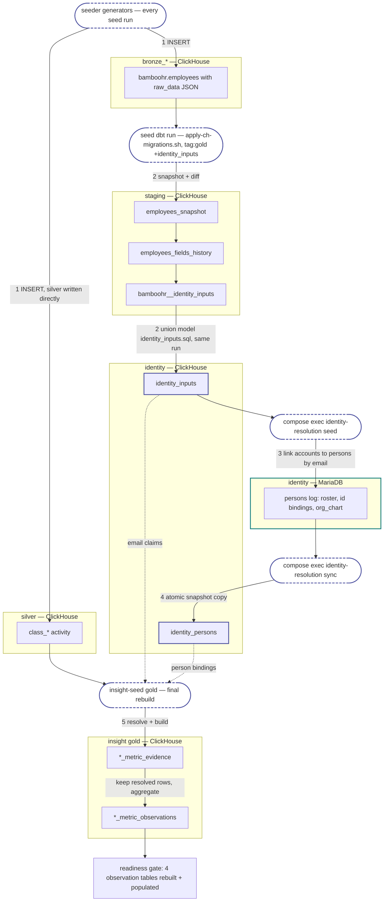

# Insight sample-data seeder

Populates a stand with a 25-person demo organisation (4 teams + CEO) and
per-team activity in ClickHouse silver tables. That roster is the default and
the floor; [a bigger organisation](#a-bigger-organisation) is one variable away. `profiles.py` documents the
roster and the per-team source-type weights; the per-domain generators under
`generators/` document the row shapes they emit. See
[PROFILE.md](PROFILE.md) for what a freshly seeded stand actually contains
— roster, fixtures, populated metrics and capabilities.

It runs against two kinds of stand, from the same sources: the local
docker-compose stack, and a chart-deployed Kubernetes stand. Both run the same
image, `insight-seed`, built from [`Dockerfile`](Dockerfile) — compose builds it
locally, CI publishes it.

This package lives inside `src/ingestion` deliberately: the silver step runs the
ingestion tree's own DDL and gold-build scripts, and being in the same tree means
one image carries both, at one version, with no chance of the seeder and the
migration SQL drifting apart. It is deliberately NOT the toolbox image — that one
runs migrations against real stands, and a demo-data generator has no business
being installed there.

## Run it on compose

The stack must be up first (`./dev-compose.sh up`). Then:

```bash
./dev-compose.sh seed                       # everything
./dev-compose.sh seed identity              # just identity
./dev-compose.sh seed silver                # just silver
```

A successful run writes `manifest.json` describing the stand it just produced
(roster, fixtures, data window, capabilities). It lands in the working
directory — for the compose service that is the bind-mounted seeder directory,
which is where the stand test suite reads it; `SEED_MANIFEST_PATH` names it
explicitly anywhere else.

## What a seed emulates

A seed replays the production data pipeline with the schedulers swapped out:
the generators stand in for the Argo `ingestion-pipeline` workflow's
`airbyte-sync` step, the silver step's dbt invocation stands in for its
`dbt-run` step, and two `docker compose exec` calls stand in for the
identity-resolution `persons-seed`/`persons-sync` CronJobs. Every table and
transformation below is the production one.



The dashed arrows are the resolve join: gold keeps a row only where an email
claim (`identity_inputs`) meets a matching account binding (`identity_persons`),
so skipping steps 3–4 builds gold "successfully" empty. Gold is therefore built
twice per seed — once inside the silver step while the map is still empty, and
again after the sync. On a real stand the same chain is driven by connector
syncs, the two daily identity CronJobs, and scheduled gold rebuilds.

## Run it on a Kubernetes stand

```bash
export KUBECONFIG=<your stand's kubeconfig>
./src/ingestion/tools/seed/seed-stand.sh -n <namespace> --email you@example.com
```

That renders [`seed-job.yaml.tpl`](seed-job.yaml.tpl) into a one-shot Job, applies
it, and follows the logs. Every coordinate comes from the stand itself, so there
is no manifest to hand-edit and no tenant UUID to copy:

| Value | Read from |
|-------|-----------|
| MariaDB + ClickHouse host, port, user | ConfigMap `<release>-platform` |
| database holding the analytics catalogue | ConfigMap `<release>-platform`, `MARIADB_DATABASE` |
| database holding `persons` | Secret `insight-identity-resolution-config`, `…database_url` |
| the stand's tenant | Secret `insight-identity-resolution-config`, `…tenant_default_id` |
| the image to run | `helm get values <release>`, `ingestion.seedImage` |
| passwords | never read — the Job references Secret `insight-db-creds` by key |

Credentials never pass through the script, and the Job runs as the application
MariaDB user rather than root: the umbrella already grants that user everything
the seed writes.

Useful flags — `--dry-run` prints the rendered Job instead of applying it,
`--step identity|silver|analytics` runs one step (identity alone needs no
ClickHouse and finishes in seconds), `--tenant` seeds a tenant of your choosing,
`--days` / `--anchor` pin the activity window, and `--org-headcount` seeds a
[bigger organisation](#a-bigger-organisation). `--help` lists the rest.

Anything the script cannot discover is a hard error naming the flag that supplies
it — it never falls back to a guess.

### Two prerequisites it cannot satisfy for you

1. **A user with `--email` must already exist in the stand's IdP.** The
   authenticator resolves people by the email claim, so the seeded dev-lead
   persona is only reachable by a login that already authenticates. Create the
   user in the realm first, or point `--email` at one that exists.
2. **The stand's ClickHouse schema must exist** before `--step silver`, i.e. the
   chart's `clickhouse-migrate` hook has run at least once. The step re-applies
   the placeholder DDL and rebuilds gold, but it does not stand in for the
   release's own migration path.

### It refuses rather than making a mess

Preflight runs before anything is written and reports every problem at once:

- `TENANT_DEFAULT_ID` missing or not a UUID — rows under the wrong tenant are
  invisible to every login while the run still reports success;
- the named analytics database does not hold `metric_definitions` — the error
  names the database it looked in;
- MariaDB or ClickHouse unreachable, or the ingestion scripts missing;
- the target tenant already holds `persons` rows this seeder did not write
  (every row it writes carries a `reason` starting `"seed.py "`, trailing space
  included). The silver step checks this too — on a stand that has only ever had
  one tenant it is the only signal that can tell somebody's data from nothing;
- any table the silver step clears holds rows for another tenant — that step
  **TRUNCATEs every table it writes**, across all tenants, so those rows would be
  destroyed. This is the one genuinely destructive thing the seeder does, and it
  is why an occupied stand is refused rather than merged into. The surface it
  checks is `generators.base.RESET_TARGETS`, the same list `truncate` itself
  enforces — including two inputs outside the silver database (an
  identity-projection table and a bronze HR table). This check is differential,
  so it finds nothing on a single-tenant stand; that is what the `persons` signal
  above is for. Targets carrying no tenant column at all cannot be attributed to
  anyone; the run logs them by name, and logs how many rows the step is about to
  clear in total, instead of pretending to have judged them.

Either refusal is overridable with `--force`, which is how you say "yes, clear
it" out loud.

The Job carries `backoffLimit: 0`: a failed seed is kept for reading rather than
retried, and because it is a plain Job rather than a chart hook, a failure never
touches the release or triggers a rollback.

## Reproducing a dataset

`SEED_ANCHOR_DATE` fixes the last day carrying activity; `SEED_DAYS` sets the
window length. Pin both to reproduce a dataset exactly:

```bash
SEED_ANCHOR_DATE=2026-06-30 SEED_DAYS=60 ./dev-compose.sh seed
```

Unset (or the literal `today`), the anchor is yesterday UTC, so the developer
loop stays populated as the calendar moves. Whichever applied is recorded in
`manifest.json`, so a stand always reports how to recreate it.

## A bigger organisation

26 people is the committed roster, and it is a *fixture*: CI and the compose
stand suite resolve named personas out of it by uuid, so nothing may renumber
it. `SEED_ORG_HEADCOUNT` seeds a larger organisation without disturbing them —
the committed 26 keep their uuids, emails, names and build order, and the extra
people are appended after them.

```bash
SEED_ORG_HEADCOUNT=250 ./dev-compose.sh seed                     # compose
./src/ingestion/tools/seed/seed-stand.sh -n insight --org-headcount 250
```

| `SEED_ORG_HEADCOUNT` | Result |
|---|---|
| unset, empty, `0`, or `26` | the committed roster, byte for byte |
| `27`..`3000` | exactly that many people |
| `1`..`25` | refused — the roster only grows |
| above `3000`, or not a whole number | refused, naming the ceiling |

The extra people join the four EXISTING teams, round-robin, so the per-team
source weights keep their ratios. Each team gets squads of at most 8 growth ICs
under a squad manager, and the squad managers report to that team's existing
lead; the committed ICs keep reporting to theirs. No new team and no new role is
invented — `TEAM_PROFILES` and three separate role tables are indexed directly,
and an unknown key there fails mid-seed.

Four things to know before pointing it at a stand:

- **The ceiling is 3000, and it is about blast radius.** Every person multiplies
  the per-day rows the generators write, across ten domains and the whole
  window, so a mistyped headcount is the difference between a stand and an
  incident. Raise `config.MAX_ORG_HEADCOUNT` deliberately if a stand needs more,
  and check two bounds when you do: the Job's `limits.memory` (2Gi, fixed in
  `seed-job.yaml.tpl`) and the ~1 MiB ConfigMap the manifest is published to —
  the seeder's tests pin the second, nothing pins the first.
- **There is no shrink.** The silver step truncates what it writes, so activity
  rows do follow the roster down — but `identity.py` only ever inserts, so the
  extra people's `persons`, `org_chart` and login rows in MariaDB survive a
  re-seed at the default. Re-seed a downgraded stand into a fresh database, or
  clear those rows yourself.
- **The realm must be sized with the seed.** Keycloak users come from the
  same roster, but Keycloak imports its realm when its container is created —
  a realm generated without `SEED_ORG_HEADCOUNT` in the environment holds only
  the committed 26 users, and every growth person gets a valid database row
  and no login. Compose handles this (`test-stand up` generates the realm in
  the same environment); a gitops-deployed stand must export the same
  `SEED_ORG_HEADCOUNT` when running the `keycloak-realm` make target, then
  recreate the Keycloak pod.
- **The manifest gets big, and switches transport.** Past ~64 personas the
  compact document outgrows the 16 KiB a CRI log line survives, so the seeder
  emits ordered `SEED_MANIFEST_GZ: <i>/<n> <base64 gzip>` chunks instead of the
  single `SEED_MANIFEST_JSON:` line. Nothing is trimmed. Pipe a Job log through
  [`manifest-from-log.sh`](manifest-from-log.sh) to get one plain sentinel line
  back, whichever form it was:

  ```bash
  kubectl -n <ns> logs job/<job> --tail=-1 \
    | ./src/ingestion/tools/seed/manifest-from-log.sh | cut -d' ' -f2- | jq .
  ```

  A completed `--step all` on a cluster stand also publishes the compact
  document to `configmap/seed-stand-manifest` (key `manifest`), which outlives
  the Job's one-hour TTL — the copy to prefer once the Job is reaped:

  ```bash
  kubectl -n <ns> get configmap seed-stand-manifest \
    -o 'go-template={{index .data "manifest"}}' | jq .
  ```

  You rarely need any of that. `seed-stand.sh --manifest-out <path>` writes the
  run's manifest straight to a file, which is what `deploy-test-stand.yml` and
  `run-stand-suite.yml`'s reseed path use. `run-stand-suite.yml` reads the
  ConfigMap when it is testing a stand it did not just seed, and falls back to
  the Job log only for a stand seeded before that existed.

## [PROFILE.md](PROFILE.md)

[`PROFILE.md`](PROFILE.md) is generated and committed. Regenerate it after any change to the
roster or the manifest builder:

```bash
cd src/ingestion/tools/seed                          # the page lives here
uv run python -m insight_seed.render_profile         # regenerate
uv run python -m insight_seed.render_profile --check # verify (no database needed)
```

## Develop on it

```bash
cd src/ingestion/tools/seed

uv run --extra dev pytest tests                                # tests
uv run --extra dev ruff check .                                # package + tests
uv run --extra dev mypy .
```

`uv` resolves and installs the package into a local `.venv` on first use, so
the tests import `insight_seed` the same way anything else does — no
`sys.path` juggling and no stubbed modules. A hand-made venv works identically
(`python3 -m venv .venv && .venv/bin/pip install -e '.[dev]'`).

The image installs the package too, so every runner invokes a program rather
than a module in a directory: `insight-seed <step>` seeds, and
`insight-seed-realm` generates the compose Keycloak realm from the same roster
(`dev-compose.sh` runs it through `uv run --project`). The extras split what
each caller needs: `silver` adds dbt for the gold build (the image installs it
in its own layer, before the source, so an edit here does not re-resolve it),
`dev` adds ruff, mypy and stubs.

The tests touch no database: they cover the pure half — the environment
contract, the SQL a guard issues, and the messages a refusal carries.

Deps live in `pyproject.toml`: `[project.dependencies]` for runtime,
`[project.optional-dependencies].dev` for the tooling (ruff, mypy, stubs).

## Layout

Code and tests are separate trees, and the artifacts the package produces sit
at the root beside this README — where their readers (the stand suite, the
compose bind mount) name them.

```text
src/ingestion/tools/seed/
├── insight_seed/            the package — everything importable
│   ├── __main__.py          the `insight-seed <step>` entry point
│   ├── config.py            environment contract: required, defaulted, and why
│   ├── preflight.py         refuses a stand that cannot take the seed
│   ├── identity.py          MariaDB: persons, org_chart, person_roles
│   ├── silver.py            ClickHouse: placeholders → generators → gold build
│   ├── analytics.py         the catalogue rows no endpoint can create
│   ├── profiles.py          demo roster + per-team activity weights
│   ├── scale.py             grows the roster past it; opt-in, never imported
│   │                        on the default path
│   ├── manifest.py          builds `manifest.json`, the stand's description
│   ├── golden_metrics.py    the only source for the manifest's golden set
│   ├── profile_md.py        renders `PROFILE.md` from a manifest
│   ├── render_profile.py    regenerates / verifies `PROFILE.md`; no database
│   ├── keycloak_realm.py    the `insight-seed-realm` entry point, same roster
│   └── generators/          one module per activity domain, `base.py` shared
├── tests/                   pytest against the installed package
├── seed-stand.sh            seeds a Kubernetes stand (discover → render → apply)
├── manifest-from-log.sh     recovers a manifest from a Job log, either transport
├── seed-job.yaml.tpl        the Job it renders — and the reference manifest
├── Dockerfile               the `insight-seed` image, for both callers
├── pyproject.toml           package metadata, deps, ruff + mypy config
├── PROFILE.md               GENERATED, committed — do not hand-edit
└── manifest.json            GENERATED per stand at seed time (gitignored)
```

## The image

[`Dockerfile`](Dockerfile) builds from the ingestion tree, not this directory:

```bash
docker build -f src/ingestion/tools/seed/Dockerfile src/ingestion
```

It carries this tree at `/ingestion/tools/seed` together with the DDL and
gold-build scripts the silver step runs and the dbt project they drive, installs
the package, and sets `insight-seed` as the entry point — so the Job's command is
just the step name: no shell, no working directory, no path assumptions. What it
does not carry is the toolbox's operator tooling (node, kubectl, yq); what the
toolbox does not carry is this tree, excluded there by
`../toolbox/Dockerfile.dockerignore`.

CI builds and publishes it as `insight-seed` beside the toolbox
(`.github/workflows/build-images.yml`) and pins the pushed ref into the chart as
`ingestion.seedImage`, which is the ref `seed-stand.sh` discovers.
